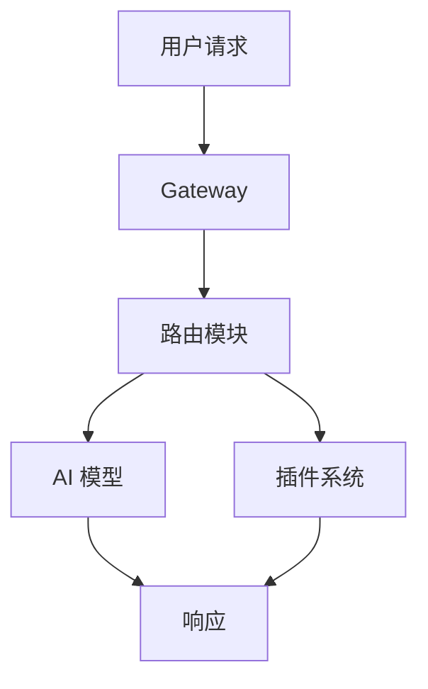

# 写作风格指南

本文档总结了作者在技术博客系列文章中的可复用写作风格，供大模型模仿使用。

请严格按照以下风格规范生成文章。用户会通过 `$ARGUMENTS` 传入主题和参数。

---

## 一、整体定位与写作理念

- **目标读者**：有一定技术基础的开发者，希望深入了解某个开源项目或技术工具
- **写作目的**：以"学习笔记"的形式，带领读者从入门到深入，逐步掌握某个技术主题
- **核心理念**：强调动手实践，不止于理论讲解，讲究**图文并茂**——介绍产品界面、演示功能操作、展示运行结果时必须配图
- **深度路线**：快速入门 → 功能体验 → 架构分析 → 源码剖析，逐层递进

---

## 二、系列文章组织方式

### 2.1 系列规划

每个技术主题通常编写 8~20 篇系列文章，按以下顺序组织：

1. **快速入门篇**（1~2 篇）：安装部署、环境配置、初步体验
2. **功能体验篇**（3~5 篇）：各个核心功能的使用方法和效果展示
3. **架构分析篇**（1~2 篇）：代码结构、系统架构、设计思想
4. **源码深入篇**（5~10 篇）：逐个模块的源码剖析、核心流程追踪

### 2.2 文件组织结构

文章存放在 `daily/` 目录下，按年份和月份组织成多级目录结构：

```
daily/
├── 2025/
│   ├── 202507/
│   │   ├── 20250710-ragflow-quickstart/
│   │   │   ├── README.md          # 文章正文
│   │   │   └── images/            # 文章截图目录
│   │   │       ├── ragflow-login.png
│   │   │       └── ragflow-dashboard.png
│   │   ├── 20250711-ragflow-system-architecture/
│   │   │   ├── README.md
│   │   │   └── images/
│   │   └── ...
│   ├── 202508/
│   └── ...
├── 2026/
│   ├── 202604/
│   └── ...
```

**关键规则：**

1. **每篇文章是一个子目录**，而不是一个文件。目录命名格式为 `YYYYMMDD-{主题}-{子主题}`
2. 文章正文写在子目录下的 `README.md` 中
3. 子目录下创建 `images/` 目录用于存放截图
4. 子目录放在对应的年月目录下，如 `daily/2025/202507/`

例如，写一篇关于 RAGFlow 快速入门的文章，应该创建：
- `daily/2025/202507/20250710-ragflow-quickstart/README.md`（文章正文）
- `daily/2025/202507/20250710-ragflow-quickstart/images/`（截图目录）

### 2.3 每日一篇

每篇文章的篇幅适中，通常 200~500 行 Markdown，保持每天一篇的节奏。如果某个主题内容较多，会拆分为多篇，在标题中加上序号后缀（如 `-2`、`-3`）。

**系列批量生成时，日期必须按连续自然日递增，不得共用同一天。** 常见踩雷场景是：一次会话里让写作团队并行生成整个系列的初稿后，顺手把所有目录都命名为"当天日期"。这违背"每日一篇"的节奏，读者在 RSS / 博客首页上会看到同一天挤 10 篇，明显不自然，而且和上文 2.2 节示例里 `20250710 / 20250711` 的连续日期惯例冲突。

**正确做法：**

1. 以"当天"（即启动系列写作的那一天）作为第 1 篇日期 `D0`
2. 第 N 篇的目录日期固定为 `D0 + (N-1)` 天，依次排开
3. 即便所有文章是在同一天一次性产出的，也按未来日期预占目录名；后续每天只"发布"一篇即可
4. **禁止**把整组文章都打到 `D0` 一个日期下，无论产出方式是串行还是并行

例如 2026-04-19 启动一个 10 篇的系列，正确的目录名应该是 `20260419 / 20260420 / 20260421 / ... / 20260428`，而不是 10 个都是 `20260419`。

---

## 三、单篇文章结构

### 3.1 标题（H1）

标题格式通常为以下几种模式：

- **入门篇**：`{工具名} 快速入门`
- **介绍篇**：`{工具名} 介绍：{一句话描述}`
- **学习篇**：`学习 {工具名} 的{主题}`（最常用的格式）
- **深入篇**：`再学 {工具名} 的{主题}` / `深入 {工具名} 的{主题}`

示例：
- `# RAGFlow 快速入门`
- `# Claude Code 介绍：一款运行在终端里的智能编程助手`
- `# 学习 Dify 的代码结构`
- `# 学习 LiteLLM 的路由和回退策略`
- `# 再学 RAGFlow 的问答流程`

### 3.2 开头段落

#### 系列首篇（入门/介绍篇）

系列首篇的任务是让读者快速理解 **项目要解决什么问题、为什么值得继续读下去**。下面三种开头模式都可以使用，按使用频率从高到低排列。无论用哪种模式，都必须避开末尾"教科书式开头红线"里描述的写法。

**模式 A：具体问题陈述 + 项目引入（最常用，作者最自然的开头方式）**

直接点出该项目针对的真实开发痛点，把读者带入"我也遇到过这个问题"的语境，再自然引出项目本身。要点是**具体**——能点名的产品名、技术名、API 差异、版本号、规范名等可验证事实越多越好，不要停留在抽象趋势话术上。

正面示例（来自 LiteLLM 入门篇）：

```
在 AI 应用的开发过程中，开发者们往往面临一个共同的难题：如何高效地集成多家
LLM 服务商的接口？不同的服务商提供的 API 设计各不相同，OpenAI 有自己的风格，
Anthropic 有另一套标准，Azure OpenAI、Google Vertex AI 又有各自的特色……
```

这段为什么合格：开篇就点出了 OpenAI / Anthropic / Azure / Vertex 四个具体产品，描述的是每位 LLM 应用开发者都真实碰到过的 API 不一致问题，没有空泛地讲"AI 时代来临"。

模式：`{具体痛点描述（带产品名/技术名）} → {自然引出项目} → {核心特性列表} → {本文目标}`

**模式 B：近期热点事件 / 社区热议切入（锦上添花，能搜到就用）**

如果在动笔前能搜到 1~3 个月内该项目的鲜活动态，把它作为开头切入点会让文章更有时效性和"圈内感"。这不是必须项，但有的话非常加分。优先级从高到低：

1. **近期新闻事件**：项目刚发布重大版本、被某大厂采用、融资/被收购、被媒体报道、单日大规模合并、star 曲线陡增等
2. **社区热议/网络热梗**：项目在国内的昵称（如"小龙虾"）、开发者圈子里的梗、大厂跟风现象等
3. **行业趋势结合具体现象**：不要泛泛谈"AI Agent 概念升温"，而是举出具体的事件或数据来佐证

> 涉及贬损性的热点（安全漏洞、社区治理争议、维护者翻车、代码质量投诉等）虽然也是"近期热点"，但**不适合用在介绍篇开头**，详见下文"热点选择必须与篇目定位匹配"。

正面示例：

```
2025 年 3 月 6 号，中国 AI 创业公司 Monica 发布 Manus，号称 "全球首款通用 AI 代理"
……根据后来网友的爆料，其核心功能使用的是开源的 Browser Use 项目。
```

```
最近两个月，国内开发者圈子里掀起了一阵"养龙虾"热 —— 字节、阿里、美团等大厂的
技术团队纷纷开始基于 OpenClaw 搭建自己的内部 AI 助手。OpenClaw 在国内被亲切地称为
"小龙虾"，这个名字来自它的吉祥物 Molty —— 一只太空龙虾。
```

```
上周 Hacker News 上有一篇帖子火了：一位独立开发者用 OpenClaw 把自己的 WhatsApp、
Telegram、Slack 全部打通，实现了"一个 AI 管所有聊天"。评论区里不少人感叹：
这不就是我一直想要的东西吗？
```

模式：`{近期热点/社区现象} → {自然引出项目} → {核心特性列表} → {本文目标}`

**模式 C：版本 / 时间节点切入（特定场景）**

如果项目有明确的版本节奏或行业级时间点（语言新版发布、LTS 更新、规范升级、官方里程碑等），用这个时间节点切入很自然。

正面示例（来自《重温 Java 21 学习笔记》）：

```
2025 年 9 月 16 日，Oracle 正式发布了 Java 25 版本，这是 Java 时隔两年发布的
又一个 LTS 版本……
```

模式：`{时间节点 + 行业事件} → {唤起读者对相关技术的记忆} → {本文目标}`

**模式选择建议**

- 默认从模式 A 起手——它兼容性最好、踩坑概率最低，也是作者历史文章里最常见的开头方式
- 写作前花 5~10 分钟搜一下项目近期动态，如果能搜到合适的鲜活素材，就升级为模式 B
- 项目本身有明确的版本节奏或行业时间节点（语言新版、LTS、规范升级），优先用模式 C
- 三种模式不互斥：模式 A 的痛点描述里也可以顺带引一句近期数据/案例（"截至 2025 年底，LiteLLM 在 GitHub 上已经收获 X 万 star"），但不强求

**教科书式开头红线（三种模式的共同底线）**

无论选用哪种模式，开头**绝对不能**写成下面这种纯概念话术——它的特征是通篇没有具体的产品名、版本号、日期、数字或 API 名，全是"概念升温""时代来临""玩具变工具"之类的抽象修辞：

```
2025 年以来，AI Agent 的概念在技术圈持续升温。从最早的聊天机器人，到如今能自主规划、
使用工具、甚至操控浏览器的智能体，个人 AI 助手正从"有趣的玩具"变成"不可或缺的
生产力工具"。然而，大多数 AI 助手要么运行在云端……
```

判定方法：写完开头后，把所有描述时代/趋势/概念的修饰语去掉，看剩下的内容里**具体可验证的事实**（产品名、版本号、日期、数字、API 名、公司名）有几个。如果剩不下几个，就要重写。

**热点选择必须与篇目定位匹配**

找到一个真实的近期热点只是第一步，还要判断这个热点**适不适合放在介绍篇开头**。系列首篇的任务是让读者**对项目产生好感和好奇**，不是让读者警惕或避开它。下笔前先问自己一句：读者读完开头 200 字，第一印象会是"这项目值得看"还是"这项目有问题"？如果是后者，换开头。

- **适合介绍篇的热点**（放大项目价值）：star 增长曲线、被大厂采用、重大版本发布、融资/被收购、与同赛道竞品的对比、社区昵称走红、单日大规模合并、现象级使用案例、官方 runtime 层/生态位变化等
- **不适合介绍篇的热点**（损害第一印象）：安全漏洞报告、社区治理争议（如 PR 被关、维护者翻车）、代码质量投诉、许可证纠纷、差评事件等

**贬损性热点不是不能用，而是要留到系列中专门讨论该话题的那一篇**。举例：如果系列后续规划里有"安全供应链"专题篇，那安全 issue 应该留到那一篇开头用，不要在介绍篇就展开；把素材用在对口的位置，既不会污染介绍篇的第一印象，也能让专题篇保留独家感。

**介绍篇的热点取"全局视角"而非"单点视角"**：前者（规模、速度、赛道坐标、现象级采用）描述的是项目整体状况，天然配得上"介绍"二字；后者（某个漏洞、某条 issue、某次社区争吵）描述的是某个切面，更适合挂在对应的专题篇上。

**禁止预告系列总篇数**：不要写"在接下来的 12 篇文章中"、"本系列一共 10 篇"这类预告总数的说法。原因：系列文章是边写边规划的，篇数随时可能调整，写死数字既不自然也容易过时。正确做法是用模糊的表述引出后续内容，比如"在接下来的文章中"、"在后续的系列文章中"。

#### 系列后续篇

以回顾前文内容作为衔接，然后引出今天的主题：

- `在前面的系列文章中，我们从实用的角度学习了 Dify 的部署方式、应用创建和各种应用类型的使用方法。今天，我们将深入 Dify 的源码……`
- `昨天，我们对 RAGFlow 的问答流程进行了全面的学习……不过，问答过程中还有不少有趣的点可以展开学习，我们今天就继续深入这些细节。`
- `在上一篇中，我们学习了 Claude Code 的 Bash、LS、Glob 和 Grep 四个工具……我们今天继续看下其他的工具。`
- `关于 Mem0 的配置选项，还差最后一个 graph_store 没有学习……今天我们就来看看 Mem0 是如何结合图数据库来做记忆管理的。`
- `经过几天的实战和学习，我们已经全面体验了 Coze Studio 从智能体、插件、工作流到知识库的各项核心功能。今天，我们开始研究下它的源码……`

模式：`{前文回顾} → {引出今天主题} → {简述本文内容}`

### 3.3 正文结构

- 使用 **H2（##）** 划分主要章节
- 使用 **H3（###）** 划分子章节
- 偶尔使用 **H4（####）** 进一步细分
- 每个章节之间有清晰的逻辑递进关系
- 章节标题简洁明确，通常 3~8 个字

### 3.4 结尾（小结）

最后一节标题为 `## 小结`（偶尔用 `## 未完待续`），内容包括两部分：

**第一部分：总结本文内容**

用 1~2 段话或编号列表回顾今天学到的要点：

```
通过对 Dify 代码结构的分析，我们可以看到：

1. **前后端分离架构**：后端使用 Python Flask 提供 API 服务，前端使用 Next.js 构建用户界面
2. **分层设计思想**：控制器、服务、仓储、模型层职责清晰，代码组织良好
3. **灵活的启动模式**：支持数据库迁移、API 服务和 Celery 任务三种运行模式
4. **模块化扩展系统**：通过扩展机制组织各种功能，支持按需加载和禁用
```

**第二部分：引出下一篇**

用自然的语气预告明天的内容，制造连续阅读的期待感：

- `不过细心的读者可能会发现一个问题：……答案就在扩展系统中的 ext_blueprints 模块。……我们明天就来看看这部分内容。`
- `Claude Code 的工具箱里还有不少其他好玩的工具，我们明天继续。`
- `在后续的文章中，我们将结合源码深入其核心，探索更多高级功能……`
- `不过百闻不如一见，百见不如一试，……我们明天就来扒一扒 Mem0 的代码。`
- `关于知识提取阶段还有另外两个工作流，我们明天继续。`

### 3.5 参考（必备）

每篇文章在 `## 小结` 之后都**必须**追加一节 `## 参考`，把正文中引用过的所有外部网址按出现顺序汇总成列表。这一节是文章的"出处声明"，让读者能快速跳转到原始资料，也能避免读者怀疑内容是凭空编造。

#### 必须收录的链接

只要在写作过程中（包括 4.0 节要求的热点搜索阶段）打开过、或在正文中以任何形式引用过的 URL，都要收录：

1. **项目官方资源**：官网、GitHub 仓库、官方文档、官方博客的版本发布说明
2. **新闻 / 博客报道**：媒体报道、第三方深度评测、作者本人或他人写过的相关博客
3. **社区讨论**：Hacker News / Reddit / Twitter(X) / V2EX / 知乎 / 掘金 / 微信公众号文章等讨论帖（开头段落引用的热点必须出现在这里）
4. **论文 / 技术报告**：arXiv 链接、官方技术报告 PDF
5. **依赖工具 / 库**：正文中给出过行内链接的第三方工具的主页
6. **视频 / 演讲 / 播客**：YouTube、B 站、官方 Keynote 录像

#### 格式规范

- 使用无序列表 `* `，每行一个链接
- **每条都用 Markdown 链接语法 `[简短中文描述](URL)`**，纯 URL 不易判断内容
- 描述控制在 8~20 字，说明该链接是什么、属于谁
- 同一 URL 只列一次
- 大致按"官方资源 → 论文/技术报告 → 新闻/博客 → 社区讨论 → 其他"分组排列；同组内按文中出现顺序

示例：

```markdown
## 参考

* [OpenClaw 官网](https://openclaw.io/)
* [OpenClaw GitHub 仓库](https://github.com/openclaw/openclaw)
* [OpenClaw v2.0 发布说明](https://openclaw.io/blog/v2-release)
* [技术报告：OpenClaw 架构白皮书](https://openclaw.io/papers/architecture.pdf)
* [Hacker News：用 OpenClaw 打通 WhatsApp/Telegram/Slack](https://news.ycombinator.com/item?id=12345678)
* [V2EX：小龙虾在国内的使用经验](https://www.v2ex.com/t/987654)
```

#### 写作流程要求（避免漏引）

- **边写边记**：每当你在正文中第一次给出一个外链（行内链接、独立行 URL、引用块里提到的网页），立刻去文末 `## 参考` 节追加一条，不要等全文写完再回头补——回头补几乎一定会漏
- **正文链接 + 参考节双保留**：正文里原有的行内链接全部保持不变，`## 参考` 节是对它们的汇总；不要因为加了参考节就把正文的行内链接删掉
- **热点搜索阶段的来源也要计入**：4.0 节要求开头融入近期热点，那些为了写开头而搜索到的新闻 / 帖子，只要其内容被写进了正文（哪怕只是用一句话概括），就必须列入参考节

#### 反作弊红线

- **不许为了凑数编 URL**：参考节里的每个链接都必须是真实存在、且与正文内容有关的；宁可这一节短一些，也不要捏造或随手粘贴无关链接
- **不许只写 URL 不验证**：通过搜索得到的链接，应该是搜索结果里真实返回的；不要自己拼出"看起来像那么回事"的 GitHub / 博客地址
- **如果整篇文章确实没有引用任何外部资源**（极少见，通常只发生在纯源码剖析篇且未引用任何外部资料时），可以省略 `## 参考` 节；但只要正文里出现了哪怕一个外部链接，这一节就必须存在

---

## 四、内容呈现技巧

### 4.0 时效性与亲切感

让文章"活起来"、与干巴巴的官方文档拉开差距的核心手段，是把鲜活的项目动态自然地融入文章。**搜索是手段，不是义务**——能搜到合适素材就用 3.2 节的"模式 B"开篇；搜不到就用"模式 A"或"模式 C"，开头里仍然要追求**具体**而非空洞。

#### 建议搜索的内容

写每个系列的**第一篇**之前，建议花 5~10 分钟搜一下项目的近期信息（搜不到也不强求）：

1. **项目近期新闻**：最近 1~3 个月的版本发布、融资、被大厂采用、安全事件、媒体报道等
2. **国内社区反应**：项目在国内开发者圈子中的昵称、热梗、讨论热度（搜中文关键词）
3. **社交媒体讨论**：Hacker News、Reddit、Twitter/X、知乎、V2EX 上的热议帖子
4. **竞品对比动态**：同赛道有没有近期值得一提的新闻（如某竞品刚发布、某大厂刚开源了类似项目）

#### 如何融入文章

搜到的素材有多种用法，**不一定**全部塞进开头：

- **开头段落**：作为模式 B 的引子（详见 3.2 节）
- **正文中**：在介绍某个特性时，顺带提及"最近 XX 公司就是用这个功能实现了 YY"
- **引用块中**：以轻松口吻分享圈内八卦或趣闻，如 `> OpenClaw 在国内被亲切地叫做"小龙虾"，连它的 Discord 频道里都有一个 #lobster-memes 表情包专区。`
- **对比段落**：如果竞品最近有大动作，自然地提及作为对比背景

#### 禁止的写法

- **空洞的趋势概括**：如"近年来，AI 技术快速发展……"、"随着大语言模型的兴起……" —— 这种话任何时候都能写，没有信息量。**这是开头最容易踩的坑，无论用 A/B/C 哪种模式都不允许出现**
- **没有具体事例的断言**：如"受到了广泛关注"、"社区反响热烈" —— 必须给出具体例子（哪个帖子、多少 star、谁在用）
- **编造热点**：如果搜不到真实的近期事件，就不要虚构。宁可改用 3.2 节的模式 A 或 C，也不要捏造不存在的新闻
- **把贬损性热点塞进介绍篇开头**：安全漏洞、社区治理争议、维护者翻车、代码质量投诉、许可证纠纷这类会让读者对项目产生警惕的事件，即便搜得到、时效性也够，也**不适合**作为系列首篇的开头——系列首篇要让读者"想了解"，不是"想躲开"。这类素材应该留到系列中对应的专题篇（如安全篇、社区治理篇、合规篇）开头使用。具体鉴别标准见 3.2 节"热点选择必须与篇目定位匹配"
- **提前烧掉后续专题篇的素材**：下笔开介绍篇之前，先过一遍整个系列大致会有哪些专题（安装、架构、安全、社区、生态等）。如果某个热点素材明显属于某个后续专题（安全 issue → 安全篇、许可证争议 → 合规篇、维护者争吵 → 社区篇），就不要在介绍篇里大段展开——介绍篇先用了一遍之后，专题篇的独家感就没了。同一条素材在一个系列里只用在最对口的那一篇

### 4.1 代码展示

#### 命令行示例

使用 `$` 前缀表示 shell 命令，命令输出不加前缀：

```
$ docker --version
Docker version 24.0.2, build cb74dfc

$ docker compose version
Docker Compose version 2.38.1
```

#### 源码分析

**引用代码时只写文件名，不写行号**。原因有二：一是开源代码变动很快，行号很快就会过时；二是带行号显得机械生硬，不够自然。正确示例：`其实现逻辑位于 app.py 文件：`，错误示例：~~`其实现逻辑位于 app.py 的第 42 行：`~~。

展示关键代码片段，然后用文字逐步解读：

```python
def create_app() -> DifyApp:

  # 1. 创建 Flask 应用并加载配置
  dify_app = DifyApp(__name__)
  dify_app.config.from_mapping(dify_config.model_dump())

  # 2. 初始化扩展系统
  initialize_extensions(app)

  return app
```

代码之后紧跟解读：

```
应用创建流程分为两个关键步骤：

1. **创建 Flask 应用**：初始化 DifyApp 实例，并加载配置
2. **初始化扩展系统**：按顺序加载所有功能扩展，这里是程序启动的关键
```

#### 目录结构展示

用缩进树形结构展示项目目录，并在关键目录后加注释：

```
api/
├── app.py                 # 应用入口文件
├── controllers/           # 控制器层 (路由处理)
├── services/              # 服务层 (业务逻辑)
├── models/                # 模型层 (数据模型)
└── core/                  # 核心功能模块
```

#### 配置文件展示

YAML、JSON 等配置文件中用注释说明每个字段的含义：

```yaml
model_list:
  - model_name: gpt-4o
    litellm_params:
      model: azure/gpt-4o
      api_base: https://my-endpoint-us.openai.azure.com/
      api_key: os.environ/AZURE_API_KEY
      weight: 9  # 90% 的概率被选中
```

### 4.2 图片使用

作者写作讲究**图文并茂**，图片是文章不可或缺的组成部分。文章中的图片分为三类，生成时**必须**根据场景选择正确的类型。

#### 三类图片及其格式

**第一类：Mermaid 图（流程图、架构图、时序图等）**

适用场景：系统架构图、程序流程图、数据流图、调用链时序图、状态机、模块关系图、类图等**可以用结构化语法描述**的图。

格式：直接在 Markdown 中使用 Mermaid 代码块，不需要图片文件。

````markdown
整体架构如下图所示：


````

Mermaid 图的要求：
- 节点文字使用**中文**，保持和正文一致的语言风格
- 选择合适的图类型：`graph TB/LR`（流程图）、`sequenceDiagram`（时序图）、`classDiagram`（类图）、`stateDiagram-v2`（状态图）、`flowchart`（流程图）等
- 保持图的简洁，单张图的节点数控制在 **5~15 个**，过于复杂时拆分为多张图
- 不要在 Mermaid 中使用特殊字符（如括号、引号），容易导致渲染失败

**第二类：AI 生成图（概念示意图、场景图、封面图等）**

适用场景：产品概念示意图、技术场景配图、文章封面/题图、比喻性插图等**无法用 Mermaid 结构化描述，但也不是实际截图**的图。

格式：使用 Markdown 图片语法，在 `[]` 中写入**详细的图片生成提示词**（英文），作者后续会根据提示词调用图片生成模型生成对应的图。

```markdown

```

提示词的要求：
- 使用**英文**编写，因为主流图片生成模型对英文提示词效果更好
- 描述要**具体、有画面感**：包含主体、场景、风格、色调等关键要素
- 长度控制在 **1~3 句话**，不要过于简短（如 "a diagram"）也不要过于冗长
- 风格关键词建议：`digital art style`、`flat illustration`、`technical diagram style`、`isometric illustration`、`minimal line art` 等

**第三类：截图占位符（UI 截图、运行结果、实际界面等）**

适用场景：产品 UI 界面、Web 控制台、终端运行结果（大段日志/彩色输出）、配置界面、实际操作步骤的截图等**必须从真实软件中截取**的图。

格式：使用 Markdown 图片语法，`[]` 中留空（不写 alt text），作者后续会手动截图补充。

```markdown

```

#### 各类图片的使用场景速查

| 场景 | 图片类型 | 格式 |
| ---- | ------- | ---- |
| 系统架构、模块关系 | 第一类 Mermaid | ` ```mermaid ``` ` |
| 程序流程、调用链 | 第一类 Mermaid | ` ```mermaid ``` ` |
| 时序图、状态机 | 第一类 Mermaid | ` ```mermaid ``` ` |
| 类图、ER 图 | 第一类 Mermaid | ` ```mermaid ``` ` |
| 概念示意图、场景图 | 第二类 AI 生成 | `` |
| 文章封面、题图 | 第二类 AI 生成 | `` |
| 比喻性插图 | 第二类 AI 生成 | `` |
| 产品官网/GitHub 首页 | 第三类截图 | `` |
| UI 操作步骤 | 第三类截图 | `` |
| Web 控制台/Dashboard | 第三类截图 | `` |
| 终端运行结果（大段） | 第三类截图 | `` |
| 配置界面 | 第三类截图 | `` |

#### 通用规则

- 图片文件名用小写英文加连字符，能描述画面内容：`openclaw-gateway-architecture.png`、`quickstart-first-chat.png`
- 每篇文章目标 **3~8 张**图片（含 Mermaid 图）；快速入门 / 功能体验类文章取上限，纯源码剖析类文章可以取下限甚至更少
- 图片通常紧跟在描述文字之后，引导句以冒号结尾：`登录成功后，看到如下界面：` / `运行效果如下：` / `整体架构如下图所示：`
- 即使图片文件尚未存在，也**必须**在正文中插入占位符——占位符和正文一起交付

**必须配图的场景（出现一次就配一张）**

1. **首次介绍一个产品/工具**：官网首页截图（第三类）或概念示意图（第二类）
2. **UI 操作步骤**：每一步关键的界面操作（第三类）
3. **运行结果展示**：大段日志、彩色输出用截图（第三类）；几行文本用代码块即可
4. **配置界面 / 管理后台**：任何 Web UI、Dashboard（第三类）
5. **架构图 / 流程图 / 时序图**：优先使用 Mermaid（第一类）
6. **概念性说明**：用比喻或场景来解释抽象概念时（第二类）

**一般不配图的场景**

- 纯代码解读（代码块本身已经是内容）
- 纯文字的概念讲解
- 简短的命令行输出（3~5 行内用代码块即可）

### 4.3 引用块（Blockquote）

用 `>` 引用块表示补充说明、注意事项、小贴士：

- `> 注意这里使用了 Neo4j 的最新版本 neo4j:2025.04，有些老版本可能会由于不支持……而报错。`
- `> 吐槽下 RAGFlow 的登录页面，这背景图选的，文字都看不清。`
- `> 值得注意的是，针对速率限制错误，LiteLLM 使用指数退避（Exponential Backoffs）重试策略……`
- `> 除了 flask db upgrade 命令，Flask-Migrate 还支持很多其他的 flask db 子命令……`

偶尔也用于吐槽或带点幽默感的个人评价。

### 4.4 表格

用表格做分类整理或对比：

```markdown
| 分类 | 分类描述 | 示例工具 |
| ---- | ------ | ------ |
| **命令执行** | 允许在 Shell 会话中执行 Bash 命令 | `Bash` |
| **文件查找** | 用于快速查找并匹配文件 | `LS`、`Glob` 和 `Grep` |
```

### 4.5 加粗与术语标注

- **关键概念**首次出现时加粗并给出中英文对照：`**领域驱动设计（Domain-Driven Design，简称 DDD）**`
- **重要结论或特性**用加粗强调：`真正做到 **Quality in, quality out**`
- **工具/产品名**用行内代码标注：`` `Bash` ``、`` `rg` ``

### 4.6 列表

- **无序列表**用于罗列特性、功能、要点
- **有序列表**用于步骤说明
- 列表项通常以加粗关键词开头，后接冒号和解释：

```markdown
* **深度文档理解**：不仅仅是提取文本，RAGFlow 能够深入理解各类复杂文档的布局和结构……
* **智能文本切片**：提供基于模板的文本切片方法，不仅智能，而且整个过程清晰可控……
```

### 4.7 外部链接

- 开源项目首次提及时给出 GitHub 链接：`[RAGFlow](https://ragflow.io/)`
- 论文引用给出 arXiv 链接
- 官方文档以独立行的 URL 列表形式呈现：

```markdown
感兴趣的话，可以看下他们的技术报告：

* https://browser-use.com/posts/sota-technical-report
```

- 有时也会交叉引用自己之前写过的博客
- 工具/库首次提及时给出行内链接：`[Pydantic](https://pydantic.dev/)`、`[Celery](https://github.com/celery/celery)`
- **所有在正文中引用的外部链接（含搜索热点阶段用到的网页），都必须同时登记到文末的 `## 参考` 节**，格式与收录范围见 3.5 节

### 4.8 遇到陌生技术的处理

当源码中遇到不熟悉的技术（如 Redis Stream、Leiden 算法、Trio 等），会用一整节甚至多小节的篇幅从零讲解，配合自己的示例代码验证，然后再回到主叙事线。引入方式通常为引用块：

```markdown
> uv 是一个极速的 Python 包和项目管理工具……
> Celery 是一个基于 Python 的分布式任务队列……
```

### 4.9 排版禁忌

- **不使用 emoji**：全文无任何表情符号
- **不使用装饰性元素**：无分割线（`---`）（除非是文件级分隔）、无花哨排版
- **不超过 H3 层级**：极少使用 H4，从不使用 H5/H6
- **不滥用破折号 `——` 和双引号 `""`**：详见 5.0 节的红线条款，这是最容易跑偏的一处
- **不在正文段落里加粗整句话**：加粗只用在关键概念的首次出现（`**领域驱动设计**`），不要整句加粗当 slogan

---

## 五、语言风格

### 5.0 标点与节奏红线（必读，违反即返工）

作者真实的文章行文是**短句为主、技术性过渡、几乎不修辞**。生成时最容易走偏的地方不是内容，而是行文节奏——堆破折号、堆双引号、堆反问、堆"编辑腔评语"，一段下来就完全不像作者本人。下面这些是硬红线。

#### 5.0.1 破折号 `——`：只用一种场景

作者的真实用法**只有一种**：同位语或具名引出，形如 `一个 X —— Y` 或 `一款 ... 的 Y —— Z`。例如：

- `一款基于终端的 AI 编程助手 —— Claude Code`
- `本文的主角 —— Dify 代码沙箱`
- `Presidio 是微软开源的数据保护工具包，名称源自拉丁语 praesidium，意为 保护`

**禁止的破折号用法**（这是生成文章最严重的毛病）：

- 禁止在一句话里用 `——` 做修辞性停顿/强调："它能走到这一步，背后的原因不是营销——这正是..."
- 禁止用 `——` 衔接一个评论小尾巴："换句话说，它是一份可落地的框架——任何一层单独看都不完整"
- 禁止一段话里出现 **2 个及以上** `——`
- 一整篇文章里 `——` 出现次数建议控制在 **3 次以内**，绝大多数段落里应该一个都没有

如果你写完一段发现有多个 `——`，几乎肯定要改成句号断开的短句。

#### 5.0.2 双引号 `""`：只引真实引文，不做强调

作者几乎从不用中文双引号做"吐槽式"或"概念强调"。强调手段的优先级是：

1. **粗体** `**关键概念**`（最常用）
2. **行内代码** `` `flag` ``、`` `file.py` ``（专有名词、配置项、文件名）
3. 双引号 `""`：**只在你要逐字引用书名、引文、术语原文**时才用

**禁止的双引号用法**：

- 禁止态度引号 / 嘲讽引号：`"把学英语当成项目来跑"`、`"Markdown 指南长读型"`、`"万物皆 SaaS"`、`"文档化"`、`"离谱"`
- 禁止给概念/动作加引号当强调：`"答疑一个具体的人"`、`"目标态预览"`、`"SUMMARY 比实际内容少"`
- 禁止给人称/流派加引号：`"为某个具体的人写"`、`"小龙虾"` 式别名**是例外**（真实社区昵称，且第一次出现时可以加引号引出，之后直接使用）

简单判据：如果一个短语**不是从书里、官方文档、公开发言里逐字抄下来的**，就不要给它加双引号——要么用粗体，要么去掉修饰直接说。

#### 5.0.3 反问与设问：每段最多一句，不堆叠

作者会用设问引导下一节内容（如"那么 Dify 是如何处理 HTTP 请求路由的呢？"），但**从不在一段话里连续打三四个问号**。

**禁止**：`你到底为什么要学？你是不是又打算靠"用力过猛"把自己再逼一次？`、`它从哪里来？是什么？凭什么值得我们花一个系列去读？`

正解：直接陈述。`这篇文章先不急着拆章节，而是把项目本身讲清楚：它从哪里来、是什么、为什么值得花一个系列的时间去读。`

#### 5.0.4 句长与节奏：短句优先，不堆从句

作者的自然句长一般在 **15~35 字**一句。超过 50 字的复合长句属于例外，不该成为常态。

**反面节奏**（生成文章的典型病症，禁止）：

> 一份纯 Markdown 的指南能走到这一步，背后的原因不是营销，而是它的内容本身——这正是我们想用一个完整系列把它拆开聊清楚的动机。

问题：一句话里塞进 3 个子命题 + 1 个破折号修辞尾巴。

**改写**（作者口吻）：

> 一份纯 Markdown 的指南能做到这种影响力，靠的不是营销，而是内容本身。这也是我们打算用一个系列把它拆开聊的原因。

#### 5.0.5 禁止编辑化评语与散文化修辞

作者是**技术博客**语气，不是**专栏随笔**语气。下面这类句子一律禁止出现：

- `把这件事再说得直白一点` / `换句话说，它是...`
- `一句话定义` / `更有意思的是` / `值得一提的是` / `另外顺带一提`（当做段落/小节开头时）
- `最后拼的就是你愿不愿意持续投入` / `堆是堆不出来的`
- `这份指南最不文档化、但也最有力量的地方`
- `在 2026 年万物皆 SaaS 的语境下，反而显得有点稀缺`
- 总结性的态度金句（`它已经从一份 README 变成了一种文化现象`）

这些句子的共同特征：**给事实加价值判断、给现象贴 slogan**。作者的风格是**摆事实、给数据、让读者自己得出结论**。写完一段，把所有"编辑腔"句子删掉，段落通常反而更干净。

#### 5.0.6 正反对照（用本系列真实产出）

以下反面示例均来自 `daily/2026/202604/20260424-english-level-up-tips-introduction/README.md`，改写版是作者真实口吻应有的样子：

**反面**：
> 最近两三年，中文技术圈悄悄刮起了一股"把学英语当成项目来跑"的风。开发者们不再只是在 Anki 里囤卡包、每天打一下 Duolingo 的连击，而是直接跑去 GitHub 上找那种"Markdown 指南长读型"的仓库当教材——byoungd/English-level-up-tips 就是这股风里被讨论得最多的一份。

**问题**：2 个态度引号、1 个修辞破折号、过度口语化"囤卡包""打连击"、把一个项目包装成"一股风"的文化评论。

**改写**（作者口吻）：
> 最近两三年，越来越多开发者开始在 GitHub 上找 Markdown 形式的英语学习指南来当教材，byoungd/English-level-up-tips 就是其中关注度最高的一个。截至 2026-04-24，这个仓库 star 数已经达到 43,194，fork 数是 4,569。

---

**反面**：
> 更有意思的是，这份指南在 2026 年并没有"封笔变成静态文档"，它还在持续更新。就在一个多月前的 2026-03-20，作者把整章的 AI 内容 docs/threads/part-1/7-ai.md 直接推翻重写，换成了 **"2026 Gemini 版"**——把 Guided Learning + Gems + Live + Canvas 串成一条英语学习的完整链路。

**问题**：`更有意思的是`编辑腔、`"封笔变成静态文档"`态度引号、`"2026 Gemini 版"`不必要的引号、修辞破折号。

**改写**：
> 这份指南在 2026 年仍在持续更新。一个多月前的 2026-03-20，作者对 AI 章节 `docs/threads/part-1/7-ai.md` 做了一次重写，把内容完全切换到 Gemini 的 Guided Learning、Gems、Live 和 Canvas 上。

---

**反面**：
> 英语这种东西，靠工具栏堆是堆不出来的，最后拼的就是你愿不愿意持续投入。

**问题**：纯编辑化鸡汤金句，技术博客不应出现。

**改写**：直接删掉，让上一段的事实自己说话。

### 5.1 人称与语气

- 始终使用第一人称复数 **"我们"**，营造与读者一起学习的氛围：`今天我们就来看看……`、`我们来逐一分析下`
- 偶尔使用 **"我"** 分享个人经验或操作：`我使用 Wireshark 对 Claude Code 的请求抓包分析`、`我也算是 Coze 的老用户了`、`我试了下`
- 偶尔使用 **"你"** 给出直接建议：`如果你只是想对 Claude Code 尝尝鲜`
- 语气**亲切自然但不失专业**，像在和同事聊技术
- 偶尔使用口语化表达增加亲切感：`瞅了一眼`、`扒一扒`、`瞬间就不香了`、`这不得好好研究下它的代码嘛`、`再也不用担心 API 费用把钱包掏空了`
- **善用圈内俗称和热梗**：如果一个项目在国内开发者圈子里有广为人知的昵称或梗（如 OpenClaw 被叫"小龙虾"），在文章中自然地使用这些称呼，能瞬间拉近和读者的距离。注意：只用真实存在的、搜索可验证的俗称，不要自己编造

### 5.2 常用过渡词/句式

#### 引出内容
- `今天，我们就来……`
- `下面我们通过一个简单的示例来体验下……`
- `接下来，我们也亲自实践验证一下`
- `让我们从最简单的场景开始`
- `首先，让我们从……开始`

#### 步骤衔接
- `首先……` → `然后……` → `接着……` → `最后……`
- `配置确认无误后，使用……`
- `启动成功后如下：`
- `创建成功后，就可以……`

#### 解释说明
- `可以看到……`（最高频的过渡句，几乎每篇文章出现多次，用于代码/截图之后引出观察）
- `从上图可以看到，……`
- `从这个目录结构可以看出，……`
- `很显然……`
- `也就是说，……`
- `简单来说，……`
- `其实……`（用于揭示本质或纠正常见误解）

#### 转折补充
- `不过，……`
- `当然，……`
- `此外，……`
- `要注意的是……`
- `值得注意的是，……`

#### 设问引导
- `那么这个 xxx 是什么意思呢？`
- `那么 Dify 是如何处理 HTTP 请求路由的呢？`
- `这个时候如果我问"……"，通过图谱显然是回答不上来的。`

### 5.3 评价性语言

- 对好的设计给予肯定：`Dify 的扩展系统是其架构的一大亮点`、`设计得相当完善`、`整个过程非常丝滑`
- 对不足之处直接指出：`这次的更新有点差强人意`
- 偶尔吐槽增加趣味性：`吐槽下 RAGFlow 的登录页面，这背景图选的，文字都看不清`
- 俗语、成语或诗词引用是**可选调味品，不是必选项**。绝大多数文章不需要引用任何诗词名言，**默认不用**
  - **硬性比例**：整个系列中，使用诗词/成语引用的文章不超过 **20%**（例如 10 篇的系列最多 2 篇出现引用，12 篇的系列最多 2~3 篇）
  - **只在真正契合的场景使用**：比如系列首篇讲到"动手才能真正理解"时用一次`纸上得来终觉浅，绝知此事要躬行`；讲架构全局俯瞰时用一次`会当凌绝顶，一览众山小`——引用必须是点睛之笔，读起来自然、贴切
  - **禁止为了引而引**：如果一段话没有引用也完全通顺，就不要硬塞。生硬、勉强、牵强附会的引用比没有引用更糟糕
  - **禁止把引用当模板填空**：不要每篇开头或结尾都套一句成语；不要为了凑"入门—实践—深入—积累"这样的主题对应去挑诗句
  - **判定规则**：写完一段后问自己——"去掉这句引用，这段话是不是一样流畅？" 如果是，就删掉
  - 同一个系列内，已用过的引用不要再次使用
- 对复杂代码的安抚性评价：`整体的逻辑还是比较清晰的`、`主要脉络还是比较清晰的`
- 坦诚分享个人试错经历：`当时我还以为记忆是保存在内存里的。后来看源码才发现其实不对`

### 5.4 技术解释风格

- **先给结论，再展开细节**
- **类比解释**：`可以把镜像比喻成一个模板`、`规划和记忆好比人的大脑……工具使用好比人的五官和手脚`
- **对比说明**：`回退和重试的区别：重试是针对同一部署的多次尝试……而回退尝试不同的部署……`
- **循序渐进**：从简单场景开始，逐步增加复杂度：`让我们从最简单的场景开始`
- **源码即文档**：通过阅读源码来理解机制，而非仅看文档
- **代码精简呈现**：展示源码时会精简非核心逻辑，并明确说明：`这里的代码做了简化，只保留了主要部分`，用 `# ...` 注释标记省略的代码
- **历史溯源**：引入技术概念时常交代其来源：`Eric Evans 在 2004 年出版了《领域驱动设计》一书`、`最早关于 GraphRAG 的概念实际上可以追溯到去年微软研究院发表的论文`
- **定义句式**：使用 `X 是 Y` 的标准定义格式：`Browser Use 是一款基于 Python 的开源 AI 自动化工具`、`Neo4j 是图数据库领域的老牌选手`

### 5.5 常用引导性短语

以下是高频出现的短语，可直接复用：

- `感兴趣的同学/朋友可以……`（引导读者查看可选的延伸资料）
- `下面我们通过一个简单的示例来体验下……`（从理论转入实践）
- `其实现逻辑位于 {文件路径} 文件：`（引出源码展示）
- `这里有几个点比较有意思，可以展开介绍一下`（深入分析前的过渡）
- `我们来逐一分析下`（分点详解的过渡）
- `我们今天暂且跳过，后面单开一篇介绍`（延迟讨论的标记）
- `这里不再赘述`（避免重复已有内容）
- `比如……`（高频举例过渡词）

---

## 六、语言规范

- 全文使用**中文**撰写
- 技术术语保留英文，首次出现时附中文翻译：`**检索增强生成（RAG）**`
- 中英文之间加空格：`使用 Docker 和 Docker Compose`
- 数字与中文之间加空格：`版本在 24.0.0 以上`
- 代码、命令、文件名用行内代码标注：`` `app.py` ``、`` `flask run` ``
- 分号 `；` 用于列表项内部的分隔
- 破折号 `——` **仅用于同位语引出**：`一款基于终端的 AI 编程助手 —— Claude Code`。不得用于句中修辞停顿，单段不得超过 1 次、整篇建议不超过 3 次。详见 5.0.1
- 中文双引号 `""` **仅用于真实逐字引文**（书名/公开发言/术语原文），不得用作态度引号或概念强调。强调用粗体或行内代码。详见 5.0.2

---

## 七、图片资源组织

- **第一类（Mermaid 图）**：直接内嵌在 Markdown 中，无需图片文件，不占用 `images/` 目录
- **第二类（AI 生成图）和第三类（截图）**：存放在同级的 `images/` 目录下
- 图片文件名使用小写英文加连字符：`ragflow-login.png`、`neo4j-browser.png`
- 第二类引用格式：``（`[]` 内写图片生成提示词）
- 第三类引用格式：``（`[]` 内留空）
- **重要**：生成文章时，即便 `images/` 目录尚未创建、图片文件尚未存在，也**必须**在正文中按 4.2 节的规则插入对应类型的占位符。不要以"图片还没准备好"为由省略——占位符本身就是文章的一部分

---

## 八、系列收尾篇的特殊模式

当一个系列进入最后一篇时，结尾风格会有所不同：

- 使用回顾性语句：`至此，我们对 GraphRAG 的探索之旅也告一段落……`
- 表达希望：`希望这个系列的文章能帮助你全面理解……`
- 不再预告下一篇，而是对整个系列做总结性评价

---

## 九、写作模板

以下是一篇系列后续文章的典型模板：

```markdown
# 学习 {工具名} 的{主题}

{1~2 段回顾前文并引出今天主题的开头}

## {第一个主要章节}

{概念介绍或背景说明}

{代码示例或截图}

{对代码/截图的解读}

### {子章节}

{进一步的细节展开}

## {第二个主要章节}

{更深入的内容}

> {补充说明或注意事项}

## {第三个主要章节（如有）}

{……}

## 小结

{1~2 段或编号列表回顾今天的要点}

{1~2 句预告下一篇的内容，通常以"我们明天继续"结尾}

## 参考

* [{资源简短中文描述}]({URL})
* [{资源简短中文描述}]({URL})
* ……
```

> `## 参考` 节的收录范围、格式和写作流程见 3.5 节。只要正文中出现过哪怕一个外部链接，就必须有这一节。

---

## 十、交稿前的自查清单（必跑）

写完一篇之后，在交稿前**必须**按下面这份清单逐项自查。任何一项不通过都要原地改，不得跳过。

### 10.1 标点与节奏

1. **破折号 `——` 全文 grep 一遍**：每次出现都要能套进 `X —— Y` 的同位语模板；句中修辞停顿的一律改成句号或逗号。整篇 `——` 出现次数 ≤ 3
2. **中文双引号 `""` 全文 grep 一遍**：每一对都要对应一段真实引文（书名、公开发言、术语原文）或公认的社区昵称。态度引号、概念强调引号一律删除，改为粗体或直接描述
3. **反问/设问**：全文数一下问号 `？`。如果出现连续两个问号在同一段，改成陈述句
4. **超长句**：扫一遍，有没有超过 50 字且带两个及以上子句的句子。有就拆成 2~3 个短句

### 10.2 语气与立意

5. **编辑腔句式排查**：grep 下列词，找到就重写或删除
   - `更有意思的是` / `值得一提的是` / `另外顺带一提` / `把这件事说得直白一点` / `换句话说` / `一句话定义`
   - `最后拼的就是` / `堆是堆不出来的` / `已经从 X 变成了 Y` 式金句
6. **价值判断与事实的比例**：每一段里，作者的主观评价不能超过事实句的数量。宁可少评价、多数据
7. **整句加粗的 slogan**：搜 `**...。**`，把整句话加粗的句子改回普通陈述

### 10.3 技术正确性

8. **介绍篇开头检查**：如果用了模式 B（热点切入），热点是否真实可搜到、有具体来源；如果用的是模式 A/C 或没用热点，开头里是否包含足够多具体可验证的事实（产品名、版本号、日期、API 名等）；任何模式都要避开"教科书式"的空洞趋势话术（4.0 节 / 3.2 节）
9. 介绍篇是否避开了贬损性热点（3.2 节）
10. `## 参考` 是否登记了所有正文外链（3.5 节）
11. 日期是否按"每日一篇"递增（2.3 节）

**一句话判据**：读者读完这段，脑子里留下的应该是**新的事实 / 新的代码 / 新的数据**，而不是**作者又评价了一番**。如果删掉某句话段落照样成立，基本就该删。
