# WEEK001 - 在 VirtualBox 上安装 Docker 服务

## 一、安装 VirtualBox 实验环境

### 1. 下载 VirtualBox

进入 [VirtualBox 官方下载页面](https://www.virtualbox.org/wiki/Downloads) 下载即可。

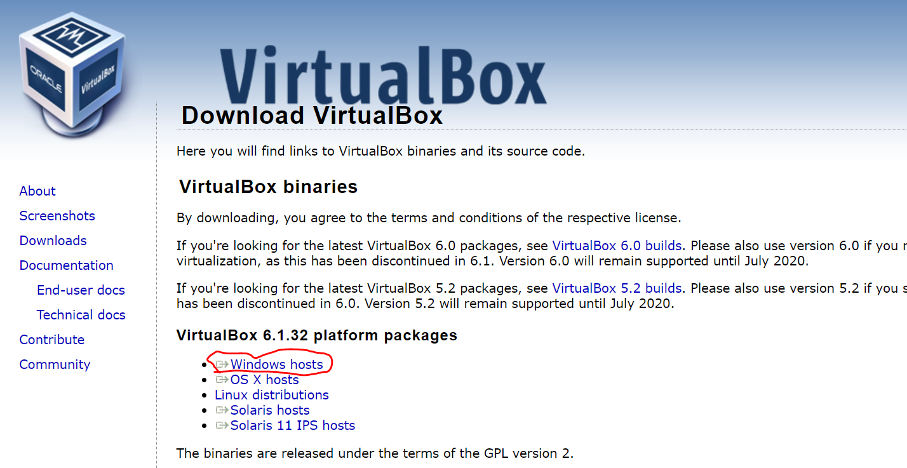

### 2. 双击 exe 文件按步骤安装

安装完成后点击运行，运行截图如下：

### 3. 下载 CentOS ISO

进入 [CentOS 官方下载页面](http://isoredirect.centos.org/centos/7/isos/x86_64/)，选择任意一个 mirror 站点，下载精简版本的 CentOS-7-x86_64-Minimal-2009.iso 文件。

### 4. 在 VirtualBox 上创建一个虚拟机

点击 “新建” 弹出 “新建虚拟电脑” 对话框，依次填写：名称、文件夹、类型、版本、内存大小（1024MB）。

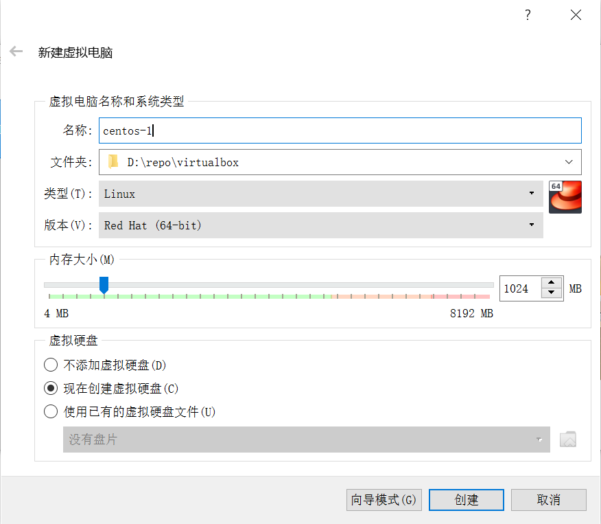

在 “虚拟硬盘” 下选择 “现在创建虚拟硬盘”，点击 “创建” 按钮弹出 “创建虚拟硬盘” 对话框：

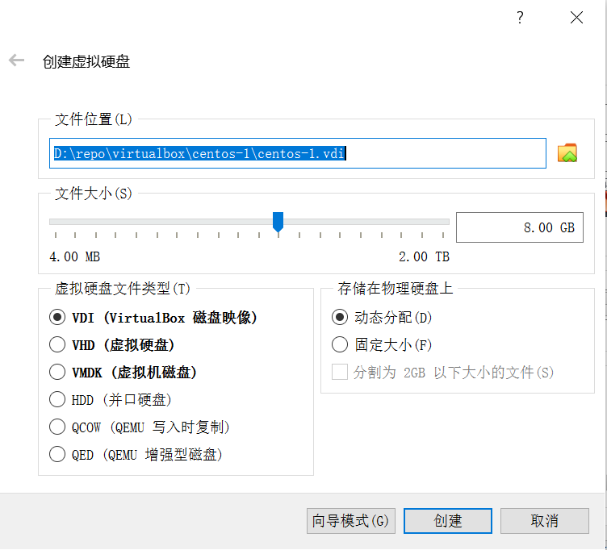

然后选择文件位置、文件大小（8GB）、虚拟硬盘文件类型（VDI）、动态分配，并点击 “创建” 按钮完成虚拟机的创建。

### 5. 在 VirtualBox 上安装 CentOS 操作系统

完成虚拟机的创建后，该虚拟机默认为 “关闭中” 状态，这时的虚拟机还没有安装任何操作系统，是启动不了的。

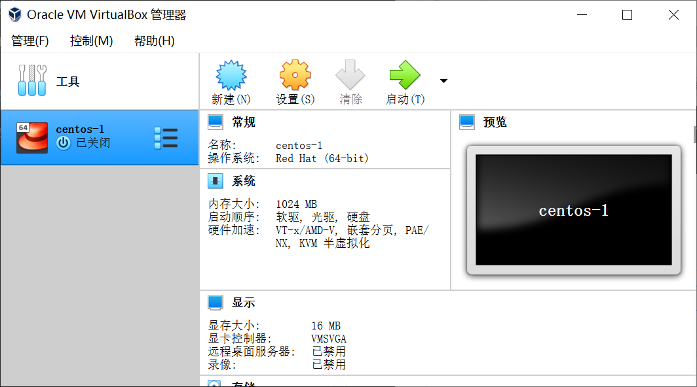

我们点击 “设置” 按钮，在 “设置” 对话框中选择 “存储”，右侧的 “存储介质” 中可以看到 “控制器：IDE” 里显示着 “没有盘片”。我们单击选择 “没有盘片” 这一行，右侧会显示对应的 “分配光驱” 属性：

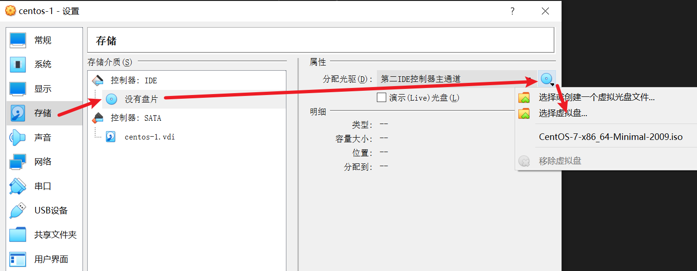

我们在下拉列表中点击 “选择虚拟盘”，并选择我们刚刚下载的 CentOS-7-x86_64-Minimal-2009.iso 文件，并点击 OK 确认。这个时候我们就可以开机了。双击这个虚拟机启动，首次启动会提示你选择启动盘，直接确定即可。进入我们的安装界面：

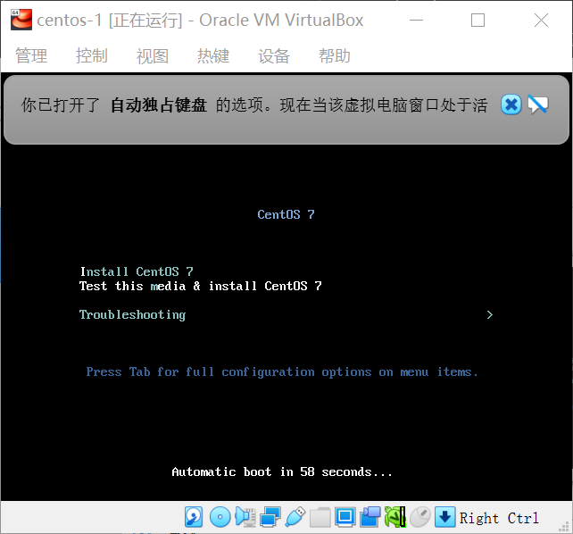

选择 “Install CentOS 7” 并按回车就开始安装 CentOS 操作系统了。首先选择语言：

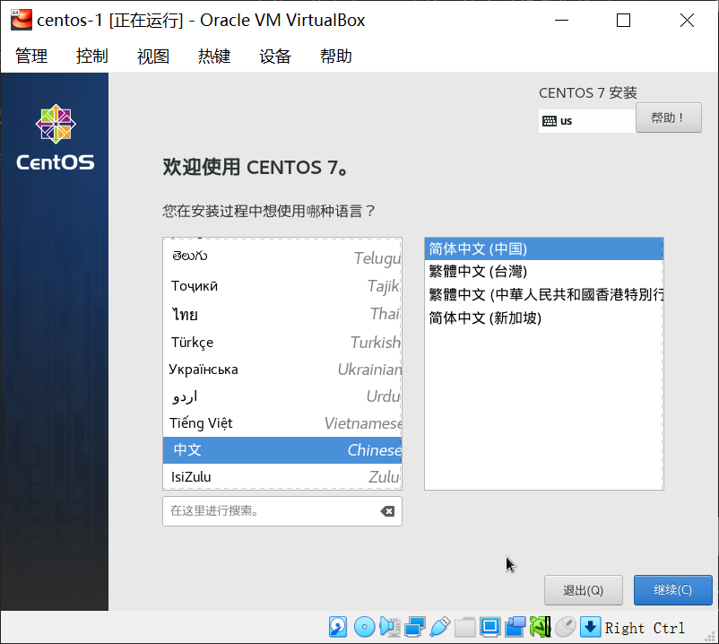

然后选择安装位置：

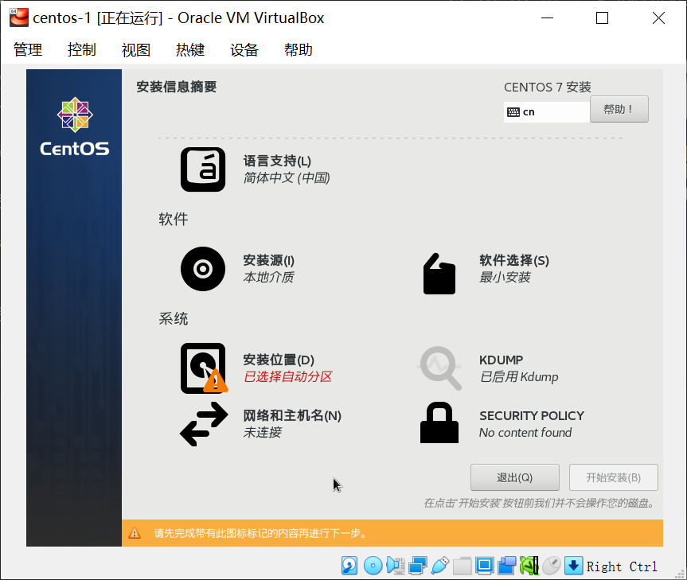

直接 “自动配置分区” 即可：

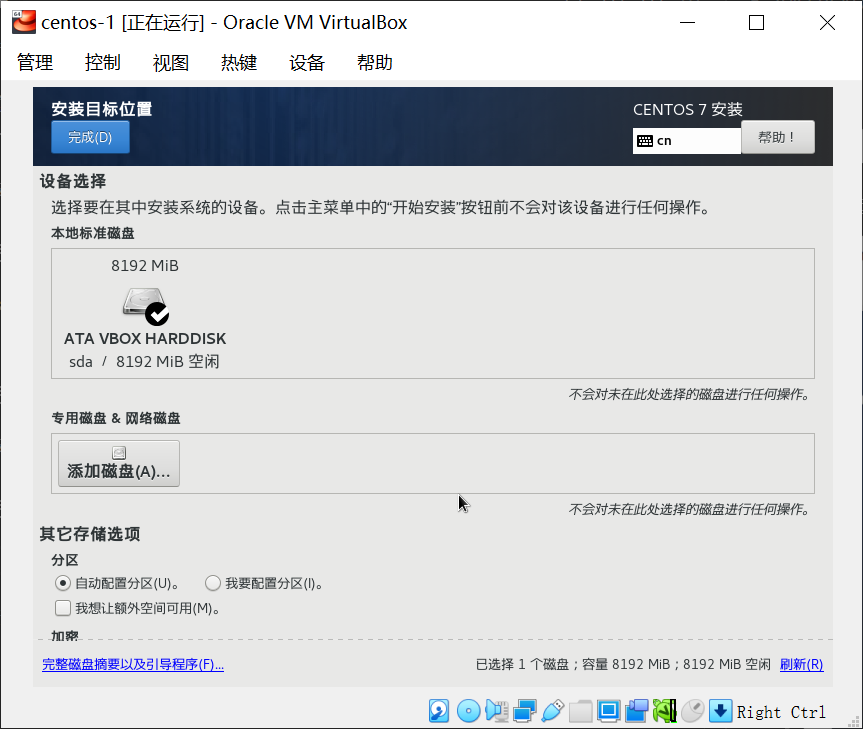

点击 “开始安装” 进入自动安装界面：

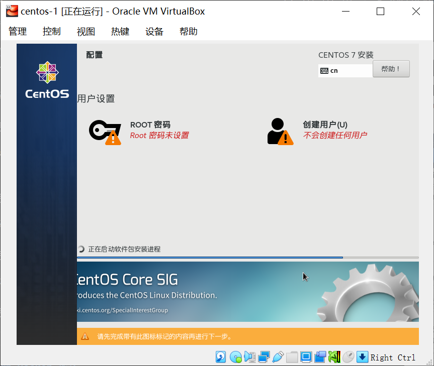

在这个界面你可以 “设置 ROOT 密码” 或者 “创建用户”，然后等待系统安装完成，并 “重启” 虚拟机。

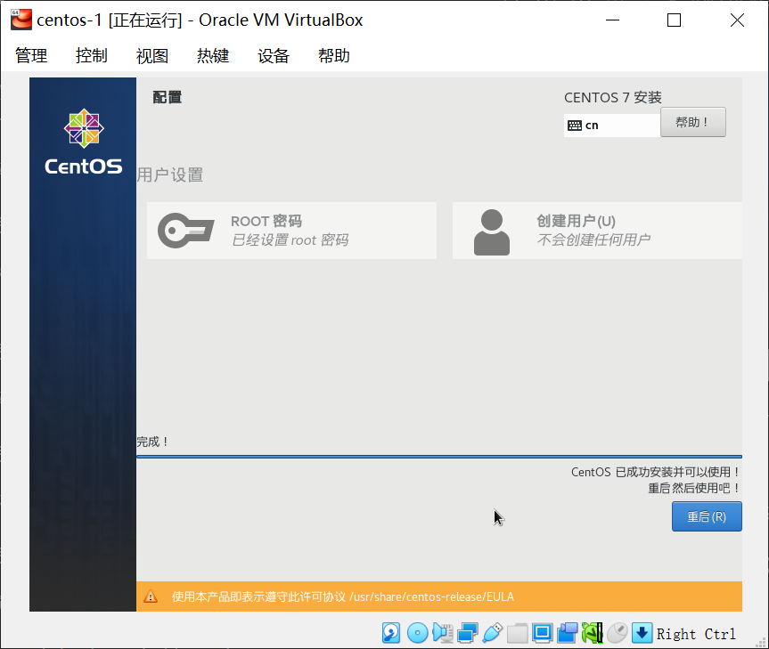

重启后，输入用户名和密码，就进入 CentOS 系统了：

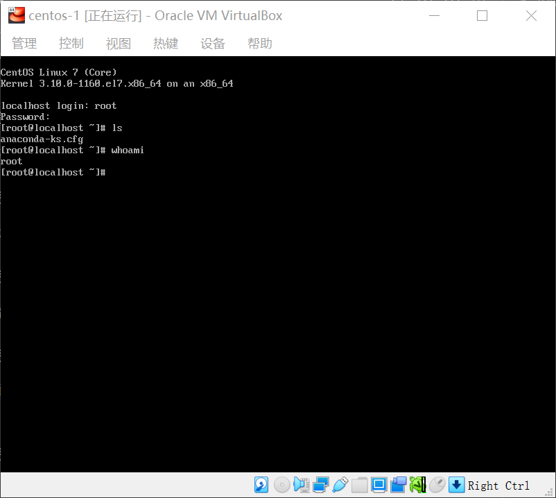

## 二、安装 Docker 服务

## 参考

## 更多
