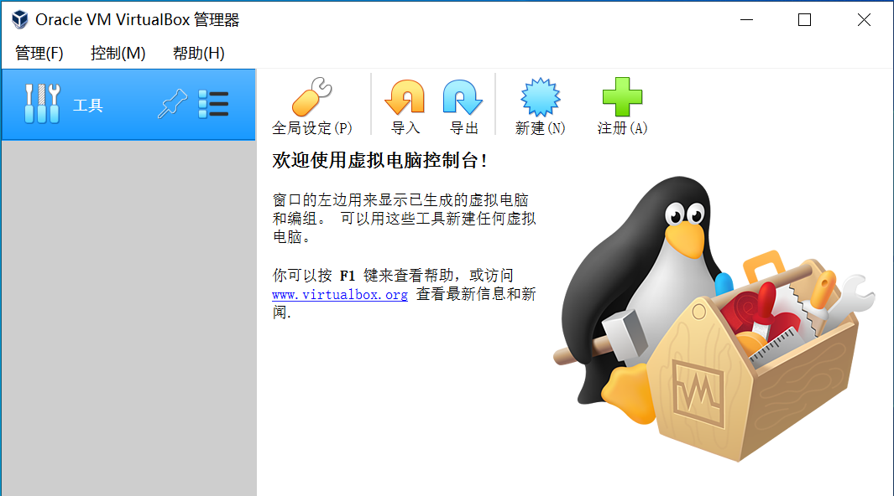

# WEEK001 - 在 VirtualBox 上安装 Docker 服务

## 一、安装 VirtualBox 实验环境

### 1. 下载 VirtualBox

进入 [VirtualBox 官方下载页面](https://www.virtualbox.org/wiki/Downloads) 下载即可。

### 2. 双击 exe 文件按步骤安装

安装完成后点击运行，运行截图如下：

### 3. 下载 CentOS ISO

进入 [CentOS 官方下载页面](http://isoredirect.centos.org/centos/7/isos/x86_64/)，选择任意一个 mirror 站点，下载精简版本的 CentOS-7-x86_64-Minimal-2009.iso 文件。

### 4. 在 VirtualBox 上创建一个虚拟机

点击 “新建” 弹出 “新建虚拟电脑” 对话框，依次填写：名称、文件夹、类型、版本、内存大小（1024MB）。

在 “虚拟硬盘” 下选择 “现在创建虚拟硬盘”，点击 “创建” 按钮弹出 “创建虚拟硬盘” 对话框：

然后选择文件位置、文件大小（8GB）、虚拟硬盘文件类型（VDI）、动态分配，并点击 “创建” 按钮完成虚拟机的创建。

### 5. 在 VirtualBox 上安装 CentOS 操作系统

TODO

## 二、安装 Docker 服务

## 参考

## 更多
