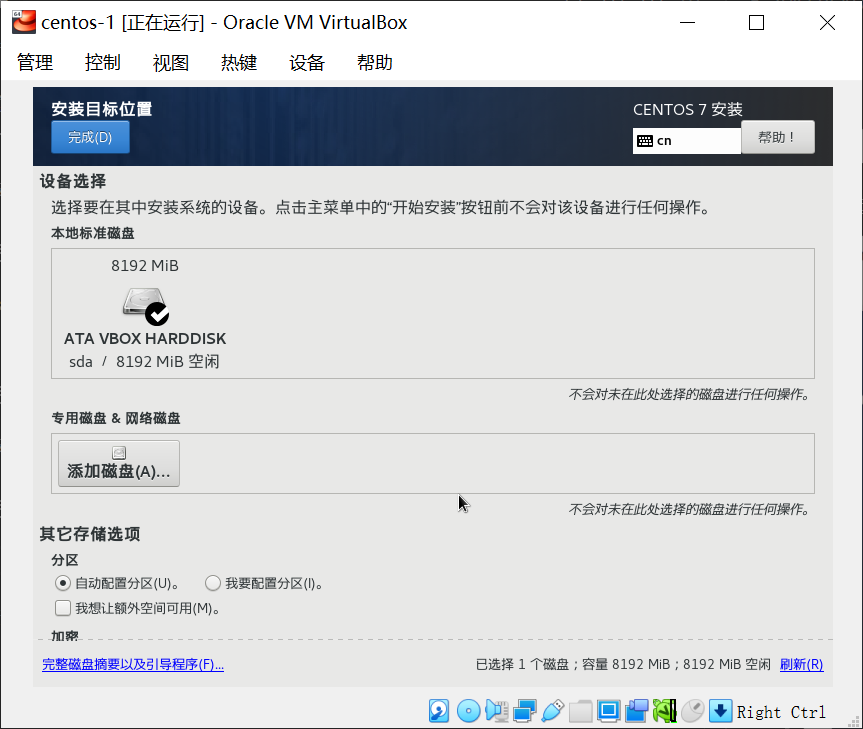
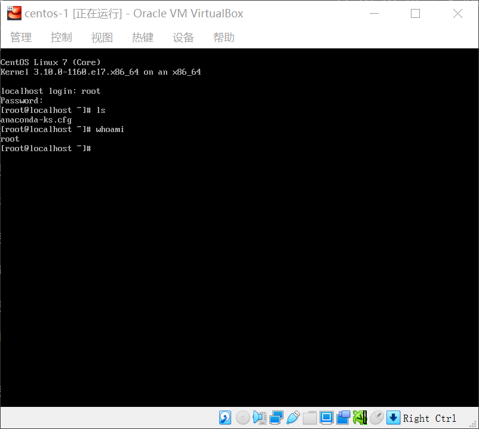

# WEEK001 - 在 VirtualBox 上安装 CentOS 实验环境

## 1. 下载 VirtualBox

进入 [VirtualBox 官方下载页面](https://www.virtualbox.org/wiki/Downloads) 下载即可。


## 2. 双击 exe 文件按步骤安装

安装完成后点击运行，运行截图如下：


## 3. 下载 CentOS ISO

进入 [CentOS 官方下载页面](http://isoredirect.centos.org/centos/7/isos/x86_64/)，选择任意一个 mirror 站点，下载精简版本的 CentOS-7-x86_64-Minimal-2009.iso 文件。

## 4. 在 VirtualBox 上创建一个虚拟机

点击 “新建” 弹出 “新建虚拟电脑” 对话框，依次填写：名称、文件夹、类型、版本、内存大小（1024MB）。


在 “虚拟硬盘” 下选择 “现在创建虚拟硬盘”，点击 “创建” 按钮弹出 “创建虚拟硬盘” 对话框：


然后选择文件位置、文件大小（8GB）、虚拟硬盘文件类型（VDI）、动态分配，并点击 “创建” 按钮完成虚拟机的创建。

## 5. 在 VirtualBox 上安装 CentOS 操作系统

完成虚拟机的创建后，该虚拟机默认为 “关闭中” 状态，这时的虚拟机还没有安装任何操作系统，是启动不了的。


我们点击 “设置” 按钮，在 “设置” 对话框中选择 “存储”，右侧的 “存储介质” 中可以看到 “控制器：IDE” 里显示着 “没有盘片”。我们单击选择 “没有盘片” 这一行，右侧会显示对应的 “分配光驱” 属性：


我们在下拉列表中点击 “选择虚拟盘”，并选择我们刚刚下载的 CentOS-7-x86_64-Minimal-2009.iso 文件，并点击 OK 确认。这个时候我们就可以开机了。双击这个虚拟机启动，首次启动会提示你选择启动盘，直接确定即可。进入我们的安装界面：


选择 “Install CentOS 7” 并按回车就开始安装 CentOS 操作系统了。首先选择语言：


然后选择安装位置：


直接 “自动配置分区” 即可：



点击 “开始安装” 进入自动安装界面：


在这个界面你可以 “设置 ROOT 密码” 或者 “创建用户”，然后等待系统安装完成，并 “重启” 虚拟机。


重启后，输入用户名和密码，就进入 CentOS 系统了：



## 6. 配置网络环境

系统刚安装好时，网络并没有配置，此时无法访问外网，也不能访问宿主机，如下：

```
# ping www.baidu.com
ping: www.baidu.com: Name or service not known

# 无线局域网适配器 WLAN
# ping 192.168.1.43
connect: Network is unreachable

# 以太网适配器 vEthernet (Default Switch)
# ping 172.24.128.1
connect: Network is unreachable

# 以太网适配器 VirtualBox Host-Only Network
# ping 192.168.56.1
connect: Network is unreachable
```

可以通过 `ifcfg` 文件来配置网络：

```
vi /etc/sysconfig/network-scripts/ifcfg-enp0s3
```

`ifcfg` 文件内容如下：

```
TYPE=Ethernet
PROXY_METHOD=none
BROWSER_ONLY=no
BOOTPROTO=dhcp
DEFROUTE=yes
IPV4_FAILURE_FATAL=no
IPV6INIT=yes
IPV6_AUTOCONF=yes
IPV6_DEFROUTE=yes
IPV6_FAILURE_FATAL=no
IPV6_ADDR_GEN_MODE=stable-privacy
NAME=enp0s3
UUID=68f56f36-xxxx-xxxx-xxxx-24ca69e80f4d
DEVICE=enp0s3
ONBOOT=no
```

将最后一行的 `ONBOOT=no` 改成 `ONBOOT=yes`，然后重启机器：

```
# reboot
```

重启后进入系统，就可以正常访问网络了：

```
# ping 192.168.1.43
```

至此，一台虚拟机环境搭建完成。

## 7. 搭建虚拟机集群环境

一台虚拟机环境对我们来说还远远不够，我们需要多创建几个虚拟机，VirtualBox 提供了虚拟机复制的功能，这样可以省去我们再重新安装。在虚拟机右键菜单中选择 “复制”：


在弹出的 “复制虚拟电脑” 对话框中填写新的虚拟机名称和其他一些配置：


“副本类型” 选择 “完全复制”：


复制完成后就生成了一个新的虚拟机，新的虚拟机和复制的虚拟机环境是完全一样的。我们通过这种方式复制 5 个虚拟机备用。

## 8. 测试集群网络

我们启动 centos-1 和 centos-2 两个虚拟机，登陆进去检查和主机的连通性，并使用 `ip addr` 查看本机的网络地址：


我们发现两台虚拟机的网络配置完全一样，就连 IP 都一模一样，这导致两个虚拟机之间根本无法通信，这是为什么呢？

这里我们就需要学习下 VirtualBox 的网络模式了，VirtualBox 提供了各种不同的网络模式来满足各种不同的实验要求：

* 网络地址转换（NAT）
* 桥接网卡
* 内部网络
* 仅主机（Host-Only）网络
* 通用网络
* NAT 网络
* Cloud Network（实验中）

默认的网络模式为 `网络地址转换（NAT）`：


[VirtualBox 官方文档](https://www.virtualbox.org/manual/ch06.html) 对 NAT 有如下一段说明：

> A virtual machine with NAT enabled acts much like a real computer that connects to the Internet through a router. The router, in this case, is the Oracle VM VirtualBox networking engine, which maps traffic from and to the virtual machine transparently. In Oracle VM VirtualBox this router is placed between each virtual machine and the host. This separation maximizes security since by default virtual machines cannot talk to each other.

可以看出，NAT 就像是一个介于宿主机和虚拟机之间的路由器，用于转发虚拟机到外网的流量。每个虚拟机和宿主机之间都有这么一个路由器，这就导致了所有的虚拟机之间是不能通信的。

根据下面这张图，如果要让虚拟机之间能通信，我们可以选择除 NAT 之外的任何一个网络模式都可以，但是 Host-Only 模式会导致虚拟机访问不了外网，Internal 模式会导致虚拟机访问不了外网和宿主机：


所以最好的选择是 `桥接网卡` 或 `NAT 网络` 这两个模式，这里我们选择 `NAT 网络` 模式。

### 8.1 新建 NAT 网络

### 8.2 验证

## 参考

1. https://www.virtualbox.org
2. https://centos.org/
1. [Chapter 6. Virtual Networking](https://www.virtualbox.org/manual/ch06.html)
1. [3.6. CONFIGURING IP NETWORKING WITH IP COMMANDS](https://access.redhat.com/documentation/en-us/red_hat_enterprise_linux/7/html/networking_guide/sec-configuring_ip_networking_with_ip_commands)
1. [3.5. CONFIGURING IP NETWORKING WITH IFCFG FILES](https://access.redhat.com/documentation/en-us/red_hat_enterprise_linux/7/html/networking_guide/sec-configuring_ip_networking_with_ifcg_files)

## 更多

### 1. 使用 ip 配置网络

根据 [Red Hat 官方文档](https://access.redhat.com/documentation/en-us/red_hat_enterprise_linux/7/html/networking_guide/sec-configuring_ip_networking_with_ip_commands) 中的说明，由于 `net-tools` 不支持 `InfiniBand`（无限带宽技术，缩写为 IB），`ip` 命令被用来替换 `ifconfig` 命令：

> Note that the ip utility replaces the ifconfig utility because the net-tools package (which provides ifconfig) does not support InfiniBand addresses.

`ip` 命令的使用示例如下：

```
ip link set enp0s3 down
ip address add 10.0.2.15/24 dev enp0s3
ip link set enp0s3 up
```
