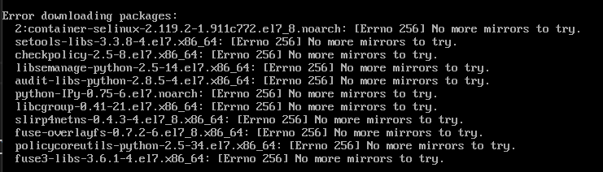

# WEEK002 - 在 VirtualBox 上安装 Docker 服务

在 WEEK001 中，我们在 VirtualBox 上安装了 CentOS 实验环境，这一节我们会继续在这个环境上安装 Docker 服务。

## 1. 使用 XShell 连接虚拟机

在虚拟机里进行几次操作之后，我们发现，由于这个系统是纯命令行界面，无法使用 VirtualBox 的增强功能，比如共享文件夹、共享剪切板等，每次想从虚拟机中复制一段文本出来都非常麻烦。所以，如果能从虚拟机外面用 XShell 登录进行操作，那就完美了。

我们首先登录虚拟机，查看 IP：

```
[root@localhost ~]# ip addr
1: lo: <LOOPBACK,UP,LOWER_UP> mtu 65536 qdisc noqueue state UNKNOWN group default qlen 1000
    link/loopback 00:00:00:00:00:00 brd 00:00:00:00:00:00
    inet 127.0.0.1/8 scope host lo
       valid_lft forever preferred_lft forever
    inet6 ::1/128 scope host 
       valid_lft forever preferred_lft forever
2: enp0s3: <BROADCAST,MULTICAST,UP,LOWER_UP> mtu 1500 qdisc pfifo_fast state UP group default qlen 1000
    link/ether 08:00:27:c1:96:99 brd ff:ff:ff:ff:ff:ff
    inet 10.0.2.6/24 brd 10.0.2.255 scope global noprefixroute dynamic enp0s3
       valid_lft 453sec preferred_lft 453sec
    inet6 fe80::e0ae:69af:54a5:f8d0/64 scope link noprefixroute 
       valid_lft forever preferred_lft forever
```

然后使用 XShell 连接 10.0.2.6 的 22 端口：


可是却发现连接不了：

```
Connecting to 10.0.2.6:22...
Could not connect to '10.0.2.6' (port 22): Connection failed.
```

通过复习 WEEK001 的内容，我们知道目前我们使用的 VirtualBox 的网络模式是 `NAT 网络`，在这种网络模式下，宿主机是无法直接访问虚拟机的，而要通过 `端口转发（Port Forwarding）`。

我们打开 VirtualBox “管理” -> “全局设定” 菜单，找到 “网络” 选项卡，在这里能看到我们使用的 NAT 网络：


双击 `NatNetwork` 打开 NAT 网络的配置：


会发现下面有一个 `端口转发` 的按钮，在这里我们可以定义从宿主机到虚拟机的端口映射：


我们新增这样一条规则：

* 协议： TCP
* 主机：192.168.1.43:2222
* 子系统：10.0.2.6:22

这表示 VirtualBox 会监听宿主机 192.168.1.43 的 2222 端口，并将 2222 端口的请求转发到 10.0.2.6 这台虚拟机的 22 端口。

我们使用 XShell 连接 192.168.1.43:2222，这一次成功进入了：

```
Connecting to 192.168.1.43:2222...
Connection established.
To escape to local shell, press 'Ctrl+Alt+]'.

WARNING! The remote SSH server rejected X11 forwarding request.
Last login: Mon Feb 21 06:49:44 2022
[root@localhost ~]#
```

## 2. 通过 yum 安装 Docker

系统默认的仓库里是没有 Docker 服务的：

```
[root@localhost ~]# ls /etc/yum.repos.d/
CentOS-Base.repo  CentOS-Debuginfo.repo  CentOS-Media.repo    CentOS-Vault.repo
CentOS-CR.repo    CentOS-fasttrack.repo  CentOS-Sources.repo  CentOS-x86_64-kernel.repo
```

我们需要先在系统中添加 [Docker 仓库](https://download.docker.com/linux/centos/docker-ce.repo)，可以直接将仓库文件下载下来放到 `/etc/yum.repos.d/` 目录，也可以通过 `yum-config-manager` 命令来添加。

先安装 `yum-utils`：

```
[root@localhost ~]# yum install -y yum-utils
```

再通过 `yum-config-manager` 添加 Docker 仓库：

```
[root@localhost ~]# yum-config-manager \
>     --add-repo \
>     https://download.docker.com/linux/centos/docker-ce.repo
已加载插件：fastestmirror
adding repo from: https://download.docker.com/linux/centos/docker-ce.repo
grabbing file https://download.docker.com/linux/centos/docker-ce.repo to /etc/yum.repos.d/docker-ce.repo
repo saved to /etc/yum.repos.d/docker-ce.repo
```

接下来我们继续安装 Docker 服务：

```
[root@localhost ~]# yum install docker-ce docker-ce-cli containerd.io
```

安装过程根据提示输入 `y` 确认即可，另外，还会提示你校验 GPG 密钥，正常情况下这个密钥的指纹应该是 `060a 61c5 1b55 8a7f 742b 77aa c52f eb6b 621e 9f35`：

```
从 https://download.docker.com/linux/centos/gpg 检索密钥
导入 GPG key 0x621E9F35:
 用户ID     : "Docker Release (CE rpm) <docker@docker.com>"
 指纹       : 060a 61c5 1b55 8a7f 742b 77aa c52f eb6b 621e 9f35
 来自       : https://download.docker.com/linux/centos/gpg
是否继续？[y/N]：y
```

如果安装顺利，就可以通过 `systemctl start docker` 启动 Docker 服务了，然后运行 `docker run hello-world` 验证 Docker 服务是否正常：

```
[root@localhost ~]# systemctl start docker
[root@localhost ~]# docker run hello-world
Unable to find image 'hello-world:latest' locally
latest: Pulling from library/hello-world
2db29710123e: Pull complete 
Digest: sha256:97a379f4f88575512824f3b352bc03cd75e239179eea0fecc38e597b2209f49a
Status: Downloaded newer image for hello-world:latest

Hello from Docker!
This message shows that your installation appears to be working correctly.

To generate this message, Docker took the following steps:
 1. The Docker client contacted the Docker daemon.
 2. The Docker daemon pulled the "hello-world" image from the Docker Hub.
    (amd64)
 3. The Docker daemon created a new container from that image which runs the
    executable that produces the output you are currently reading.
 4. The Docker daemon streamed that output to the Docker client, which sent it
    to your terminal.

To try something more ambitious, you can run an Ubuntu container with:
 $ docker run -it ubuntu bash

Share images, automate workflows, and more with a free Docker ID:
 https://hub.docker.com/

For more examples and ideas, visit:
 https://docs.docker.com/get-started/
```

看到这个提示信息，说明 Docker 服务已经在虚拟机中正常运行了。

## 3. 通过 `docker-install` 脚本安装 Docker

官方提供了一个便捷的脚本来一键安装 Docker，可以通过如下命令下载该脚本：

```
[root@localhost ~]# curl -fsSL https://get.docker.com -o get-docker.sh
```

其中，`-f/--fail` 表示连接失败时不显示 HTTP 错误，`-s/--silent` 表示静默模式，不输出任何内容，`-S/--show-error` 表示显示错误，`-L/--location` 表示跟随重定向，`-o/--output` 表示将输出写入到某个文件中。

下载完成后，执行该脚本会自动安装 Docker：

```
[root@localhost ~]# sh ./get-docker.sh
```

如果想知道这个脚本具体做了什么，可以在执行命令之前加上 `DRY_RUN=1` 选项：

```
[root@localhost ~]# DRY_RUN=1 sh ./get-docker.sh
# Executing docker install script, commit: 93d2499759296ac1f9c510605fef85052a2c32be
yum install -y -q yum-utils
yum-config-manager --add-repo https://download.docker.com/linux/centos/docker-ce.repo
yum makecache
yum install -y -q docker-ce
yum install -y -q docker-ce-rootless-extras
```

可以看出和上一节手工安装的步骤基本类似，安装完成后，启动 Docker 服务并运行 `hello-world` 验证：

```
[root@localhost ~]# systemctl start docker
[root@localhost ~]# docker run hello-world
```

## 4. 离线安装 Docker

上面两种安装方式都需要连接外网，当我们的机器位于离线环境时（`air-gapped systems`），我们需要提前将 Docker 的安装包下载准备好。

我们从 https://download.docker.com/linux/ 这里找到对应的 Linux 发行版本和系统架构，比如我这里的系统是 CentOS 7.9，系统架构是 x84_64，所以就进入 `/linux/centos/7/x86_64/stable/Packages/` 这个目录。但是这个目录里有很多的文件，我们该下载哪个文件呢？

为了确定要下载的文件和版本，我们进入刚刚安装的那个虚拟机中，通过 `yum list installed | grep docker` 看看自动安装时都安装了哪些包：

```
[root@localhost ~]# yum list installed | grep docker
containerd.io.x86_64                 1.4.12-3.1.el7                 @docker-ce-stable
docker-ce.x86_64                     3:20.10.12-3.el7               @docker-ce-stable
docker-ce-cli.x86_64                 1:20.10.12-3.el7               @docker-ce-stable
docker-ce-rootless-extras.x86_64     20.10.12-3.el7                 @docker-ce-stable
docker-scan-plugin.x86_64            0.12.0-3.el7                   @docker-ce-stable
```

我们将这些包都下载下来复制到一台新的虚拟机中，将网络服务关闭：

```
[root@localhost ~]# service network stop
```

然后执行 `yum install` 命令安装这些 RPM 包：

```
[root@localhost ~]# yum install *.rpm
```

我们会发现 yum 在安装的时候会自动解析依赖，还是会从外网下载，会出现一堆的报错：



我们可以对照着这个列表再去一个个的下载对应的包，全部依赖安装完毕后，再安装 Docker 即可。

## 参考

1. [Install Docker Engine on CentOS](https://docs.docker.com/engine/install/centos/)
1. [curl - How To Use](https://curl.se/docs/manpage.html)

## 更多

[Docker 官方文档](https://docs.docker.com/) 的内容非常丰富，主要分成如下几个部分：

### 1. Get Started

Learn Docker basics and the benifits of containerizing your applications.

#### Part 1: Getting started
#### Part 2: Sample application
#### Part 3: Update the application
#### Part 4: Share the application
#### Part 5: Persist the DB
#### Part 6: Use bind mounts
#### Part 7: Multi-container apps
#### Part 8: Use Docker Compose
#### Part 9: Image-building best practices
#### Part 10: What next?

### 2. Download and install

Download and install Docker on your machine in a few easy steps.

#### Docker Desktop for Mac
#### Docker Desktop for Windows
#### Docker for Linux

### 3. Guides

Learn how to set up your Docker environment and start containerizing your applications.

### 4. Language-specific guides

Learn how to containerize language-specific applications using Docker.

### 5. Manuals

Browse through the manuals and learn how to use Docker products.

### 6. Reference

Browse through the CLI and API reference documentation.
