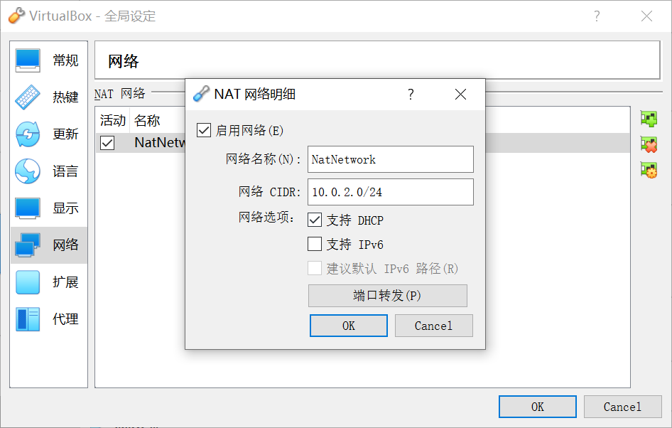

# WEEK002 - 在 VirtualBox 上安装 Docker 服务

在 WEEK001 中，我们在 VirtualBox 上安装了 CentOS 实验环境，这一节我们会继续在这个环境上安装 Docker 服务。

## 1. 使用 XShell 连接虚拟机

在虚拟机里进行几次操作之后，我们发现，由于这个系统是纯命令行界面，无法使用 VirtualBox 的增强功能，比如共享文件夹、共享剪切板等，每次想从虚拟机中复制一段文本出来都非常麻烦。所以，如果能从虚拟机外面用 XShell 登录进行操作，那就完美了。

我们首先登录虚拟机，查看 IP：

```
[root@localhost ~]# ip addr
1: lo: <LOOPBACK,UP,LOWER_UP> mtu 65536 qdisc noqueue state UNKNOWN group default qlen 1000
    link/loopback 00:00:00:00:00:00 brd 00:00:00:00:00:00
    inet 127.0.0.1/8 scope host lo
       valid_lft forever preferred_lft forever
    inet6 ::1/128 scope host 
       valid_lft forever preferred_lft forever
2: enp0s3: <BROADCAST,MULTICAST,UP,LOWER_UP> mtu 1500 qdisc pfifo_fast state UP group default qlen 1000
    link/ether 08:00:27:c1:96:99 brd ff:ff:ff:ff:ff:ff
    inet 10.0.2.6/24 brd 10.0.2.255 scope global noprefixroute dynamic enp0s3
       valid_lft 453sec preferred_lft 453sec
    inet6 fe80::e0ae:69af:54a5:f8d0/64 scope link noprefixroute 
       valid_lft forever preferred_lft forever
```

然后使用 XShell 连接 10.0.2.6 的 22 端口：


可是却发现连接不了：

```
Connecting to 10.0.2.6:22...
Could not connect to '10.0.2.6' (port 22): Connection failed.
```

通过复习 WEEK001 的内容，我们知道目前我们使用的 VirtualBox 的网络模式是 `NAT 网络`，在这种网络模式下，宿主机是无法直接访问虚拟机的，而要通过 `端口转发（Port Forwarding）`。

我们打开 VirtualBox “管理” -> “全局设定” 菜单，找到 “网络” 选项卡，在这里能看到我们使用的 NAT 网络：


双击 `NatNetwork` 打开 NAT 网络的配置：



会发现下面有一个 `端口转发` 的按钮，在这里我们可以定义从宿主机到虚拟机的端口映射：


我们新增这样一条规则：

* 协议： TCP
* 主机：192.168.1.43:2222
* 子系统：10.0.2.6:22

这表示 VirtualBox 会监听宿主机 192.168.1.43 的 2222 端口，并将 2222 端口的请求转发到 10.0.2.6 这台虚拟机的 22 端口。

我们使用 XShell 连接 192.168.1.43:2222，这一次成功进入了：

```
Connecting to 192.168.1.43:2222...
Connection established.
To escape to local shell, press 'Ctrl+Alt+]'.

WARNING! The remote SSH server rejected X11 forwarding request.
Last login: Mon Feb 21 06:49:44 2022
[root@localhost ~]#
```

## 2. 安装 Docker


## 参考

## 更多

[Docker 官方文档](https://docs.docker.com/) 的内容非常丰富，主要分成如下几个部分：

### 1. Get Started

Learn Docker basics and the benifits of containerizing your applications.

#### Part 1: Getting started
#### Part 2: Sample application
#### Part 3: Update the application
#### Part 4: Share the application
#### Part 5: Persist the DB
#### Part 6: Use bind mounts
#### Part 7: Multi-container apps
#### Part 8: Use Docker Compose
#### Part 9: Image-building best practices
#### Part 10: What next?

### 2. Download and install

Download and install Docker on your machine in a few easy steps.

#### Docker Desktop for Mac
#### Docker Desktop for Windows
#### Docker for Linux

### 3. Guides

Learn how to set up your Docker environment and start containerizing your applications.

### 4. Language-specific guides

Learn how to containerize language-specific applications using Docker.

### 5. Manuals

Browse through the manuals and learn how to use Docker products.

### 6. Reference

Browse through the CLI and API reference documentation.
