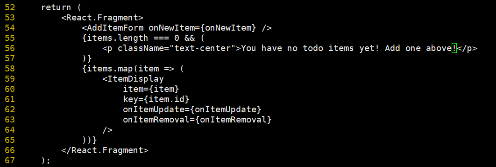

# WEEK003 Docker 快速入门

在 WEEK002 中，我们通过多种方法在 VirtualBox 上安装了 Docker 服务，这一节我们将根据官网文档，学习 Docker 的一些入门知识。这一节的内容主要包括：

* 构建和运行镜像
* 通过 Docker Hub 分享镜像
* 使用多个容器部署 Docker 应用
* 使用 Docker Compose 运行应用
* 构建镜像的最佳实践，对镜像进行安全扫描

## Part 1: Getting started

我们在命令行上输入如下的命令开始我们的 Docker 之旅：

```
[root@localhost ~]# docker run -d -p 80:80 docker/getting-started
```

其中，`-d` 表示让容器运行在 `detached mode`，也就是后台运行，`-p 80:80` 表示将容器内的 80 端口映射到主机的 80 端口，这样我们就可以通过主机的 80 端口来访问容器里的服务，在浏览器里输入 `http://localhost:80`，会看到如下页面：


这样我们就在我们的机器上成功运行了一个简单的容器了。

### 什么是容器？

简单来说，容器就是一个运行在沙箱（`sandboxed`）中的进程，通过 Linux 内核提供的 `namespace` 和 `cgroup` 等特性，它和主机上的其他进程之间是隔离的。它的特点如下：

* 容器是镜像的一个运行实例，你可以通过 Docker API 或 CLI 创建、运行、停止、移动或删除容器
* 容器可以在本地机器、虚拟机或云端运行
* 可移植到任意的操作系统
* 容器之间互相隔离

### 什么是镜像？

当我们运行容器时，它实际上使用了一个独立的文件系统，这个独立的文件系统就是镜像所提供的，并且这个文件系统里包含了容器运行所需要的所有东西，比如：配置，脚本，二进制程序等等，另外，镜像里还包含了一些其他的配置，比如：环境变量，启动后默认执行的命令，和其他元数据。

在 Linux 系统中有一个命令叫 [`chroot`](https://man7.org/linux/man-pages/man1/chroot.1.html)，它可以用来改变程序运行的根目录，系统默认都是以 `/` 作为根目录来运行程序，当使用了 `chroot` 之后，程序的根目录就变成了你指定的位置。你可以把容器简单理解成增强版的 `chroot`，根目录就是镜像所提供的文件系统，不过 `chroot` 只提供了文件系统的隔离，容器在 `chroot` 的基础上还增加了其他的隔离，比如进程隔离，用户隔离，网络隔离，资源限制等。

## Part 2: Sample application

这一部分我们将通过一个简单的待办清单程序来学习如何构建和运行镜像。首先，我们通过 `git clone` 下载程序的源码：

```
[root@localhost ~]# git clone https://github.com/docker/getting-started.git
```

这个代办清单程序的源码位于 `app` 目录下，让我们进去看一看：

```
[root@localhost ~]# cd getting-started/app/
[root@localhost app]# ls
package.json  spec  src  yarn.lock
```

这是一个 Node.js 程序，为了让这个程序能运行起来，我们必须得有 Node.js 的运行环境。

首先，我们在这个目录下新建一个 `Dockerfile` 文件：

```
[root@localhost app]# vi Dockerfile
```

在这个文件中输入如下内容：

```
FROM node:12-alpine
WORKDIR /app
COPY . .
RUN yarn install --production
CMD ["node", "src/index.js"]
EXPOSE 3000
```

`Dockerfile` 是我们构建镜像时所需的指令文件，`FROM node:12-alpine` 表示我们使用 `node:12-alpine` 来作为我们的基础镜像，这是一个内置了 Node.js 运行环境的镜像，`WORKDIR /app` 表示将镜像的 `/app` 目录作为工作目录，这样执行 `COPY . .` 的时候就可以把当前目录下的文件复制到镜像里的 `/app` 目录下了。然后通过 `RUN yarn install --production` 安装程序所需要的一些依赖，这些依赖定义在 `package.json` 文件里。最后的 `CMD ["node", "src/index.js"]` 和 `EXPOSE 3000` 指定了容器运行时的启动命令和容器对外暴露的端口。

写好这个 `Dockerfile` 文件后，就可以通过 `docker build -t todo-list .` 命令来构建镜像：

```
[root@localhost app]# docker build -t todo-list .
Sending build context to Docker daemon  4.641MB
Step 1/6 : FROM node:12-alpine
12-alpine: Pulling from library/node
59bf1c3509f3: Already exists 
8769eb813ad5: Pull complete 
7025e9ac362e: Pull complete 
1efe07d207fa: Pull complete 
Digest: sha256:dfa564312367b1a8fca8db7ae4bae102b28e68b39ebcb7b17022c938f105846b
Status: Downloaded newer image for node:12-alpine
 ---> 1b156b4c3ee8
Step 2/6 : WORKDIR /app
 ---> Running in fbb23d022619
Removing intermediate container fbb23d022619
 ---> a19fa5fc5c18
Step 3/6 : COPY . .
 ---> acdf512be224
Step 4/6 : RUN yarn install --production
 ---> Running in 9af3492b1571
yarn install v1.22.17
[1/4] Resolving packages...
warning Resolution field "ansi-regex@5.0.1" is incompatible with requested version "ansi-regex@^2.0.0"
warning Resolution field "ansi-regex@5.0.1" is incompatible with requested version "ansi-regex@^3.0.0"
warning sqlite3 > node-gyp > request@2.88.2: request has been deprecated, see https://github.com/request/request/issues/3142
warning sqlite3 > node-gyp > tar@2.2.2: This version of tar is no longer supported, and will not receive security updates. Please upgrade asap.
warning sqlite3 > node-gyp > request > har-validator@5.1.5: this library is no longer supported
warning sqlite3 > node-gyp > request > uuid@3.4.0: Please upgrade  to version 7 or higher.  Older versions may use Math.random() in certain circumstances, which is known to be problematic.  See https://v8.dev/blog/math-random for details.
[2/4] Fetching packages...
[3/4] Linking dependencies...
[4/4] Building fresh packages...
success Saved lockfile.
Done in 35.53s.
Removing intermediate container 9af3492b1571
 ---> c50542645f82
Step 5/6 : CMD ["node", "src/index.js"]
 ---> Running in 77212d79a3a7
Removing intermediate container 77212d79a3a7
 ---> 5f5a66a501ae
Step 6/6 : EXPOSE 3000
 ---> Running in c4d8ac990217
Removing intermediate container c4d8ac990217
 ---> eeb273056a6a
Successfully built eeb273056a6a
Successfully tagged todo-list:latest
```

其中 `-t todo-list` 指定了构建后的镜像名称，注意命令最后的 `.` 不能忽略，这表示让 `docker build` 将当前目录作为构建上下文，并从这里寻找 `Dockerfile` 文件。从上面的输出结果可以看出，`docker build` 命令按照 `Dockerfile` 文件中的指令一行一行的执行，最终生成了一个名为 `todo-list:latest` 的镜像。

现在我们构建好了镜像，让我们运行它：

```
[root@localhost app]# docker run -dp 3000:3000 todo-list
```

其中 `-dp` 是 `-d -p` 的缩写，当 `docker` 命令行中的参数是一个字母的时候，就可以通过这种方式缩写，比如 `docker run -i -t` 可以缩写成 `docker run -it`。

我们打开浏览器，访问 `http://localhost:3000`，你就能看到我们的代办清单小程序了：


## Part 3: Update the application

这一节我们将学习如何更新容器里的内容。当代办清单为空时，页面会显示一行提示信息：

> No items yet! Add one above!

如果现在我们需要把这行提示信息改为：

> You have no todo items yet! Add one above!

首先打开 `src/static/js/app.js` 文件，跳到第 56 行，修改如下：



保存文件后，通过 `docker build` 重新构建镜像：

```
[root@localhost app]# docker build -t todo-list .
```

在启动新容器之前，我们需要将老的容器删除，先通过 `docker ps` 找出老容器的 ID：

```
[root@localhost app]# docker ps
CONTAINER ID   IMAGE          COMMAND                  CREATED        STATUS         PORTS                                       NAMES
040a23aeff1e   eeb273056a6a   "docker-entrypoint.s…"   22 hours ago   Up 9 minutes   0.0.0.0:3000->3000/tcp, :::3000->3000/tcp   brave_sutherland
```

然后通过 `docker stop` 和 `docker rm` 停止并删除该容器：

```
[root@localhost app]# docker stop 040a23aeff1e
[root@localhost app]# docker rm 040a23aeff1e
```

你也可以通过 `docker rm -f` 强制删除该容器：

```
[root@localhost app]# docker rm -f 040a23aeff1e
```

最后重新启动新容器：

```
[root@localhost app]# docker run -dp 3000:3000 todo-list
```

刷新浏览器，页面已经更新了：


虽然应用已经成功更新，但是有两点需要注意：

1. 新容器启动后，所有的代办列表都清空了，也就是说这个应用没有持久化能力；
2. 每次对应用进行修改都要经过上面这一系列繁琐的操作，能不能做到更新代码后不用重新构建镜像就可以直接生效？

## Part 4: Share the application

这一节我们将学习如何将镜像分享给其他人。为了让其他人能访问到你的镜像，我们必须要将镜像上传到某个镜像仓库，Docker 默认使用的镜像仓库是 [Docker Hub](https://hub.docker.com/)，我们先在 Docker Hub 上注册一个账号。

注册成功之后，我们就可以通过 `docker login` 命令进行登录：

```
[root@localhost app]# docker login
Login with your Docker ID to push and pull images from Docker Hub. If you don't have a Docker ID, head over to https://hub.docker.com to create one.
Username: aneasystone
Password: 
WARNING! Your password will be stored unencrypted in /root/.docker/config.json.
Configure a credential helper to remove this warning. See
https://docs.docker.com/engine/reference/commandline/login/#credentials-store

Login Succeeded
```

这里有一个警告，你登录所用的账号密码信息其实保存在 `/root/.docker/config.json` 文件里，我们可以打开该文件看看：

```
{
        "auths": {
                "https://index.docker.io/v1/": {
                        "auth": "YXN5..."
                }
        }
}
```

其中，`auth` 字段是经过 BASE64 编码的，但对于稍懂技术的人来说，这点编码还是很容易破解的，所以，千万不要在公用的主机上登录你的账号。

登录了 Docker Hub 账号之后，你就可以将你本地的镜像推送到 Docker 仓库了，但是要注意的是，Docker Hub 上的每个镜像都有自己的名字空间，如果不指定名字空间，默认的名字空间是 `docker.io/library`，所以如果我们直接 `docker push` 我们的镜像，会得到下面的访问拒绝错误：

```
[root@localhost app]# docker push todo-list
Using default tag: latest
The push refers to repository [docker.io/library/todo-list]
1b9fd74047d7: Preparing 
325c8936fbcd: Preparing 
f46524a7ca21: Preparing 
c5088e2ef878: Preparing 
12587d8b4618: Preparing 
738f7039e20b: Waiting 
8d3ac3489996: Waiting 
denied: requested access to the resource is denied
```

我们可以通过 `docker tag` 修改镜像名：

```
[root@localhost app]# docker tag todo-list aneasystone/todo-list
```

然后再 `docker push` 推送镜像：

```
[root@localhost app]# docker push aneasystone/todo-list
```

推送成功后，就可以在 Docker Hub 上看到我们的镜像了：


别人也可以通过 `docker pull` 来访问你的镜像了：

```
[root@localhost app]# docker pull aneasystone/todo-list
```

你可以在 [Play with Docker](https://labs.play-with-docker.com/) 创建一个虚拟机，在这里做一些简单的 Docker 实验：


Play with Docker 这个站点对于学习 Docker 非常有用，它提供了 [很多的实验和教程](https://training.play-with-docker.com/) 来帮助运维人员或开发人员快速上手 Docker，感兴趣的同学可以把这里的实验挨个做一遍。

## Part 5: Persist the DB

在第三部分的最后我们讲到，每次创建新容器后，之前创建的代办清单都会消失，这是为什么呢？这是因为每个容器都使用自己独立的文件系统，各个容器之间是互相隔离的。这个应用默认使用的是 SQLite 数据库，它将数据保存在 `/etc/todos/todo.db` 文件中，当删除容器时，这个文件会随着容器的文件系统一并被删掉。那么怎样才能将这个数据文件持久化呢？答案就是 [`Volume`](https://docs.docker.com/storage/volumes/)。

Volume 可以让容器访问宿主机上的文件，并且这个文件可以在多个容器之间共享，在容器内对文件的修改会直接反映到宿主机的文件，这样当容器被删除后，Volume 依然保存在宿主机上，只要新建的容器继续使用这个 Volume ，新容器就能延用之前的数据。

首先，我们通过 `docker volume create` 命令创建一个 Volume：

```
[root@localhost ~]# docker volume create todo-db
```

然后重新启动容器，启动时通过 `-v` 参数将这个 Volume 挂载到容器的 `/etc/todos` 目录：

```
[root@localhost ~]# docker run -dp 3000:3000 -v todo-db:/etc/todos todo-list
```

启动后我们在浏览器中访问这个小程序，添加几条记录，然后通过 `docker rm -f` 删除容器，并使用上面的命令重新创建一个新容器，刷新浏览器，可以看到刚添加的几条记录都还在。

可能有人会问，Docker 将我们的数据保存在哪里呢？可以通过 `docker volume inspect` 命令来确认：

```
[root@localhost ~]# docker volume inspect todo-db
[
    {
        "CreatedAt": "2022-03-02T06:47:44+08:00",
        "Driver": "local",
        "Labels": {},
        "Mountpoint": "/var/lib/docker/volumes/todo-db/_data",
        "Name": "todo-db",
        "Options": {},
        "Scope": "local"
    }
]
```

上面的 `Mountpoint` 就是这个 Volume 在宿主机上的位置，我们添加的数据就保存在这里：

```
[root@localhost ~]# ls /var/lib/docker/volumes/todo-db/_data
todo.db
```

## Part 6: Use bind mounts

在上一节中，我们通过 `docker volume create` 创建了一个 `Volume` 来保存我们的数据，通过复用 Volume 我们做到了数据的持有化，像这种有名字的 Volume 我们称之为 `named volume`，当我们只是想保存数据而不关心数据保存在哪的时候，`named volume` 非常有用。

当然我们也可以指定挂载的位置，这种 Volume 被称为 `bind mounts`。很显然使用 `bind mounts` 我们也可以持有化数据，但是更多的时候，我们通过这种方式向容器添加额外的数据。下表是 `bind mounts` 和 `named volume` 的一个对比：


可以看到 `named volume` 相对于 `bind mounts` 来说有一个很大的特点：支持 `volume driver`，通过 volume driver 可以对接很多第三方存储，比如：SFTP, Ceph, NetApp, S3 等。

还记得在第三部分的最后我们提到的两个问题吗？第一个问题是数据的持久化，我们通过 `named volume` 解决了；第二个问题是每次修改代码，都需要一堆繁琐的操作才能看到修改生效，这在开发阶段是不能忍受的，这一节我们将通过 `bind mounts` 来解决这个问题。

## Part 7: Multi-container apps
## Part 8: Use Docker Compose
## Part 9: Image-building best practices
## Part 10: What next?

## 参考

1. [Docker 官方文档](https://docs.docker.com/)
1. [How to Get Started with Docker • DockerCon 2020](https://youtu.be/iqqDU2crIEQ)
1. [Containers From Scratch • Liz Rice • GOTO 2018](https://youtu.be/8fi7uSYlOdc)
1. [Demystifying Containers](https://github.com/saschagrunert/demystifying-containers)
1. [linux chroot 命令](https://www.cnblogs.com/sparkdev/p/8556075.html)

## 更多

### 1. 在虚拟机中使用代理

在虚拟机中通过 `git clone` 下载源码时，由于一些客观原因，经常会出现各种网络错误或超时，比如这样：

```
[root@localhost ~]# git clone https://github.com/docker/getting-started.git
正克隆到 'getting-started'...
fatal: unable to access 'https://github.com/docker/getting-started.git/': TCP connection reset by peer
```

又比如这样：

```
[root@localhost ~]# git clone https://github.com/docker/getting-started.git
正克隆到 'getting-started'...
error: RPC failed; result=35, HTTP code = 0
fatal: The remote end hung up unexpectedly
```

这让人无法忍受，这时我们可以通过下面的命令设置 Linux 的代理来解决（当然，前提是你得先准备好梯子）：

```
[root@localhost ~]# export http_proxy=192.168.1.43:10809 https_proxy=192.168.1.43:10809
```

### 2. 体验使用 `chroot` 命令

```
$ mkdir rootfs
$ (docker export $(docker create busybox) | tar -C rootfs -xvf -)
$ ls rootfs
$ sudo chroot rootfs /bin/sh
```

### 3. Play with Docker Classroom

https://training.play-with-docker.com/

### 4. Volume Drivers

* [SFTP](https://github.com/vieux/docker-volume-sshfs)
* [Ceph](https://ceph.com/geen-categorie/getting-started-with-the-docker-rbd-volume-plugin/)
* [NetApp](https://netappdvp.readthedocs.io/en/stable/)
* [S3](https://github.com/elementar/docker-s3-volume)

### 5. 关于 Docker 的更多文档

Docker 官方文档的内容非常丰富，主要分成如下几个部分：

#### 1. Get Started

Learn Docker basics and benefits of containerizing your applications.

#### 2. Download and install

Download and install Docker on your machine in a few easy steps.

##### Docker Desktop for Mac
##### Docker Desktop for Windows
##### Docker for Linux

#### 3. Guides

Learn how to set up your Docker environment and start containerizing your applications.

#### 4. Language-specific guides

Learn how to containerize language-specific applications using Docker.

#### 5. Manuals

Browse through the manuals and learn how to use Docker products.

#### 6. Reference

Browse through the CLI and API reference documentation.
