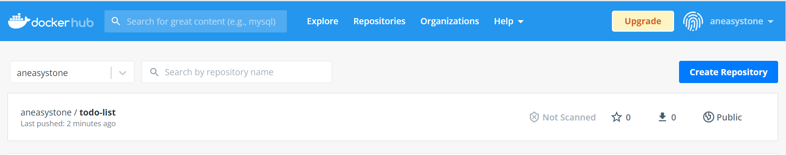

# WEEK003 Docker 快速入门

在 WEEK002 中，我们通过多种方法在 VirtualBox 上安装了 Docker 服务，这一节我们将根据官网文档，学习 Docker 的一些入门知识。这一节的内容主要包括：

* 构建和运行镜像
* 通过 Docker Hub 分享镜像
* 使用多个容器部署 Docker 应用
* 使用 Docker Compose 运行应用
* 构建镜像的最佳实践，对镜像进行安全扫描

## Part 1: Getting started

我们在命令行上输入如下的命令开始我们的 Docker 之旅：

```
[root@localhost ~]# docker run -d -p 80:80 docker/getting-started
```

其中，`-d` 表示让容器运行在 `detached mode`，也就是后台运行，`-p 80:80` 表示将容器内的 80 端口映射到主机的 80 端口，这样我们就可以通过主机的 80 端口来访问容器里的服务，在浏览器里输入 `http://localhost:80`，会看到如下页面：


这样我们就在我们的机器上成功运行了一个简单的容器了。

### 什么是容器？

简单来说，容器就是一个运行在沙箱（`sandboxed`）中的进程，通过 Linux 内核提供的 `namespace` 和 `cgroup` 等特性，它和主机上的其他进程之间是隔离的。它的特点如下：

* 容器是镜像的一个运行实例，你可以通过 Docker API 或 CLI 创建、运行、停止、移动或删除容器
* 容器可以在本地机器、虚拟机或云端运行
* 可移植到任意的操作系统
* 容器之间互相隔离

### 什么是镜像？

当我们运行容器时，它实际上使用了一个独立的文件系统，这个独立的文件系统就是镜像所提供的，并且这个文件系统里包含了容器运行所需要的所有东西，比如：配置，脚本，二进制程序等等，另外，镜像里还包含了一些其他的配置，比如：环境变量，启动后默认执行的命令，和其他元数据。

在 Linux 系统中有一个命令叫 [`chroot`](https://man7.org/linux/man-pages/man1/chroot.1.html)，它可以用来改变程序运行的根目录，系统默认都是以 `/` 作为根目录来运行程序，当使用了 `chroot` 之后，程序的根目录就变成了你指定的位置。你可以把容器简单理解成增强版的 `chroot`，根目录就是镜像所提供的文件系统，不过 `chroot` 只提供了文件系统的隔离，容器在 `chroot` 的基础上还增加了其他的隔离，比如进程隔离，用户隔离，网络隔离，资源限制等。

## Part 2: Sample application

这一部分我们将通过一个简单的待办清单程序来学习如何构建和运行镜像。首先，我们通过 `git clone` 下载程序的源码：

```
[root@localhost ~]# git clone https://github.com/docker/getting-started.git
```

这个代办清单程序的源码位于 `app` 目录下，让我们进去看一看：

```
[root@localhost ~]# cd getting-started/app/
[root@localhost app]# ls
package.json  spec  src  yarn.lock
```

这是一个 Node.js 程序，为了让这个程序能运行起来，我们必须得有 Node.js 的运行环境。

首先，我们在这个目录下新建一个 `Dockerfile` 文件：

```
[root@localhost app]# vi Dockerfile
```

在这个文件中输入如下内容：

```
FROM node:12-alpine
WORKDIR /app
COPY . .
RUN yarn install --production
CMD ["node", "src/index.js"]
EXPOSE 3000
```

`Dockerfile` 是我们构建镜像时所需的指令文件，`FROM node:12-alpine` 表示我们使用 `node:12-alpine` 来作为我们的基础镜像，这是一个内置了 Node.js 运行环境的镜像，`WORKDIR /app` 表示将镜像的 `/app` 目录作为工作目录，这样执行 `COPY . .` 的时候就可以把当前目录下的文件复制到镜像里的 `/app` 目录下了。然后通过 `RUN yarn install --production` 安装程序所需要的一些依赖，这些依赖定义在 `package.json` 文件里。最后的 `CMD ["node", "src/index.js"]` 和 `EXPOSE 3000` 指定了容器运行时的启动命令和容器对外暴露的端口。

写好这个 `Dockerfile` 文件后，就可以通过 `docker build -t todo-list .` 命令来构建镜像：

```
[root@localhost app]# docker build -t todo-list .
Sending build context to Docker daemon  4.641MB
Step 1/6 : FROM node:12-alpine
12-alpine: Pulling from library/node
59bf1c3509f3: Already exists 
8769eb813ad5: Pull complete 
7025e9ac362e: Pull complete 
1efe07d207fa: Pull complete 
Digest: sha256:dfa564312367b1a8fca8db7ae4bae102b28e68b39ebcb7b17022c938f105846b
Status: Downloaded newer image for node:12-alpine
 ---> 1b156b4c3ee8
Step 2/6 : WORKDIR /app
 ---> Running in fbb23d022619
Removing intermediate container fbb23d022619
 ---> a19fa5fc5c18
Step 3/6 : COPY . .
 ---> acdf512be224
Step 4/6 : RUN yarn install --production
 ---> Running in 9af3492b1571
yarn install v1.22.17
[1/4] Resolving packages...
warning Resolution field "ansi-regex@5.0.1" is incompatible with requested version "ansi-regex@^2.0.0"
warning Resolution field "ansi-regex@5.0.1" is incompatible with requested version "ansi-regex@^3.0.0"
warning sqlite3 > node-gyp > request@2.88.2: request has been deprecated, see https://github.com/request/request/issues/3142
warning sqlite3 > node-gyp > tar@2.2.2: This version of tar is no longer supported, and will not receive security updates. Please upgrade asap.
warning sqlite3 > node-gyp > request > har-validator@5.1.5: this library is no longer supported
warning sqlite3 > node-gyp > request > uuid@3.4.0: Please upgrade  to version 7 or higher.  Older versions may use Math.random() in certain circumstances, which is known to be problematic.  See https://v8.dev/blog/math-random for details.
[2/4] Fetching packages...
[3/4] Linking dependencies...
[4/4] Building fresh packages...
success Saved lockfile.
Done in 35.53s.
Removing intermediate container 9af3492b1571
 ---> c50542645f82
Step 5/6 : CMD ["node", "src/index.js"]
 ---> Running in 77212d79a3a7
Removing intermediate container 77212d79a3a7
 ---> 5f5a66a501ae
Step 6/6 : EXPOSE 3000
 ---> Running in c4d8ac990217
Removing intermediate container c4d8ac990217
 ---> eeb273056a6a
Successfully built eeb273056a6a
Successfully tagged todo-list:latest
```

其中 `-t todo-list` 指定了构建后的镜像名称，注意命令最后的 `.` 不能忽略，这表示让 `docker build` 将当前目录作为构建上下文，并从这里寻找 `Dockerfile` 文件。从上面的输出结果可以看出，`docker build` 命令按照 `Dockerfile` 文件中的指令一行一行的执行，最终生成了一个名为 `todo-list:latest` 的镜像。

现在我们构建好了镜像，让我们运行它：

```
[root@localhost app]# docker run -dp 3000:3000 todo-list
```

其中 `-dp` 是 `-d -p` 的缩写，当 `docker` 命令行中的参数是一个字母的时候，就可以通过这种方式缩写，比如 `docker run -i -t` 可以缩写成 `docker run -it`。

我们打开浏览器，访问 `http://localhost:3000`，你就能看到我们的代办清单小程序了：


## Part 3: Update the application

这一节我们将学习如何更新容器里的内容。当代办清单为空时，页面会显示一行提示信息：

> No items yet! Add one above!

如果现在我们需要把这行提示信息改为：

> You have no todo items yet! Add one above!

首先打开 `src/static/js/app.js` 文件，跳到第 56 行，修改如下：


保存文件后，通过 `docker build` 重新构建镜像：

```
[root@localhost app]# docker build -t todo-list .
```

在启动新容器之前，我们需要将老的容器删除，先通过 `docker ps` 找出老容器的 ID：

```
[root@localhost app]# docker ps
CONTAINER ID   IMAGE          COMMAND                  CREATED        STATUS         PORTS                                       NAMES
040a23aeff1e   eeb273056a6a   "docker-entrypoint.s…"   22 hours ago   Up 9 minutes   0.0.0.0:3000->3000/tcp, :::3000->3000/tcp   brave_sutherland
```

然后通过 `docker stop` 和 `docker rm` 停止并删除该容器：

```
[root@localhost app]# docker stop 040a23aeff1e
[root@localhost app]# docker rm 040a23aeff1e
```

你也可以通过 `docker rm -f` 强制删除该容器：

```
[root@localhost app]# docker rm -f 040a23aeff1e
```

最后重新启动新容器：

```
[root@localhost app]# docker run -dp 3000:3000 todo-list
```

刷新浏览器，页面已经更新了：


虽然应用已经成功更新，但是有两点需要注意：

1. 新容器启动后，所有的代办列表都清空了，也就是说这个应用没有持久化能力；
2. 每次对应用进行修改都要经过上面这一系列繁琐的操作，能不能做到更新代码后不用重新构建镜像就可以直接生效？

## Part 4: Share the application

这一节我们将学习如何将镜像分享给其他人。为了让其他人能访问到你的镜像，我们必须要将镜像上传到某个镜像仓库，Docker 默认使用的镜像仓库是 [Docker Hub](https://hub.docker.com/)，我们先在 Docker Hub 上注册一个账号。

注册成功之后，我们就可以通过 `docker login` 命令进行登录：

```
[root@localhost app]# docker login
Login with your Docker ID to push and pull images from Docker Hub. If you don't have a Docker ID, head over to https://hub.docker.com to create one.
Username: aneasystone
Password: 
WARNING! Your password will be stored unencrypted in /root/.docker/config.json.
Configure a credential helper to remove this warning. See
https://docs.docker.com/engine/reference/commandline/login/#credentials-store

Login Succeeded
```

这里有一个警告，你登录所用的账号密码信息其实保存在 `/root/.docker/config.json` 文件里，我们可以打开该文件看看：

```
{
        "auths": {
                "https://index.docker.io/v1/": {
                        "auth": "YXN5..."
                }
        }
}
```

其中，`auth` 字段是经过 BASE64 编码的，但对于稍懂技术的人来说，这点编码还是很容易破解的，所以，千万不要在公用的主机上登录你的账号。

登录了 Docker Hub 账号之后，你就可以将你本地的镜像推送到 Docker 仓库了，但是要注意的是，Docker Hub 上的每个镜像都有自己的名字空间，如果不指定名字空间，默认的名字空间是 `docker.io/library`，所以如果我们直接 `docker push` 我们的镜像，会得到下面的访问拒绝错误：

```
[root@localhost app]# docker push todo-list
Using default tag: latest
The push refers to repository [docker.io/library/todo-list]
1b9fd74047d7: Preparing 
325c8936fbcd: Preparing 
f46524a7ca21: Preparing 
c5088e2ef878: Preparing 
12587d8b4618: Preparing 
738f7039e20b: Waiting 
8d3ac3489996: Waiting 
denied: requested access to the resource is denied
```

我们可以通过 `docker tag` 修改镜像名：

```
[root@localhost app]# docker tag todo-list aneasystone/todo-list
```

然后再 `docker push` 推送镜像：

```
[root@localhost app]# docker push aneasystone/todo-list
```

推送成功后，就可以在 Docker Hub 上看到我们的镜像了：



别人也可以通过 `docker pull` 来访问你的镜像了：

```
[root@localhost app]# docker pull aneasystone/todo-list
```

你可以在 [Play with Docker](https://labs.play-with-docker.com/) 创建一个虚拟机，在这里做一些简单的 Docker 实验：


Play with Docker 这个站点对于学习 Docker 非常有用，它提供了 [很多的实验和教程](https://training.play-with-docker.com/) 来帮助运维人员或开发人员快速上手 Docker，感兴趣的同学可以把这里的实验挨个做一遍。

## Part 5: Persist the DB

在第三部分的最后我们讲到，每次创建新容器后，之前创建的代办清单都会消失，这是为什么呢？这是因为每个容器都使用自己独立的文件系统，各个容器之间是互相隔离的。这个应用默认使用的是 SQLite 数据库，它将数据保存在 `/etc/todos/todo.db` 文件中，当删除容器时，这个文件会随着容器的文件系统一并被删掉。那么怎样才能将这个数据文件持久化呢？答案就是 [`Volume`](https://docs.docker.com/storage/volumes/)。

Volume 可以让容器访问宿主机上的文件，并且这个文件可以在多个容器之间共享，在容器内对文件的修改会直接反映到宿主机的文件，这样当容器被删除后，Volume 依然保存在宿主机上，只要新建的容器继续使用这个 Volume ，新容器就能延用之前的数据。

首先，我们通过 `docker volume create` 命令创建一个 Volume：

```
[root@localhost ~]# docker volume create todo-db
```

然后重新启动容器，启动时通过 `-v` 参数将这个 Volume 挂载到容器的 `/etc/todos` 目录：

```
[root@localhost ~]# docker run -dp 3000:3000 -v todo-db:/etc/todos todo-list
```

启动后我们在浏览器中访问这个小程序，添加几条记录，然后通过 `docker rm -f` 删除容器，并使用上面的命令重新创建一个新容器，刷新浏览器，可以看到刚添加的几条记录都还在。

可能有人会问，Docker 将我们的数据保存在哪里呢？可以通过 `docker volume inspect` 命令来确认：

```
[root@localhost ~]# docker volume inspect todo-db
[
    {
        "CreatedAt": "2022-03-02T06:47:44+08:00",
        "Driver": "local",
        "Labels": {},
        "Mountpoint": "/var/lib/docker/volumes/todo-db/_data",
        "Name": "todo-db",
        "Options": {},
        "Scope": "local"
    }
]
```

上面的 `Mountpoint` 就是这个 Volume 在宿主机上的位置，我们添加的数据就保存在这里：

```
[root@localhost ~]# ls /var/lib/docker/volumes/todo-db/_data
todo.db
```

## Part 6: Use bind mounts

在上一节中，我们通过 `docker volume create` 创建了一个 `Volume` 来保存我们的数据，通过复用 Volume 我们做到了数据的持有化，像这种有名字的 Volume 我们称之为 `named volume`，当我们只是想保存数据而不关心数据保存在哪的时候，`named volume` 非常有用。

当然我们也可以指定挂载的位置，这种 Volume 被称为 `bind mounts`。很显然使用 `bind mounts` 我们也可以持有化数据，但是更多的时候，我们通过这种方式向容器添加额外的数据。下表是 `bind mounts` 和 `named volume` 的一个对比：


可以看到 `named volume` 相对于 `bind mounts` 来说有一个很大的特点：支持 `volume driver`，通过 volume driver 可以对接很多第三方存储，比如：SFTP, Ceph, NetApp, S3 等。

还记得在第三部分的最后我们提到的两个问题吗？第一个问题是数据的持久化，我们通过 `named volume` 解决了；第二个问题是每次修改代码，都需要一堆繁琐的操作才能看到修改生效，这在开发阶段是不能忍受的，这一节我们将通过 `bind mounts` 来解决这个问题。

首先，我们进入源码所在的目录：

```
[root@localhost ~]# cd getting-started/app/
```
然后运行下面这行命令（运行之前确保之前的容器已经停止）：

```
[root@localhost app]# docker run -dp 3000:3000 \
        -w /app \
        -v "$(pwd):/app" \
        node:12-alpine \
        sh -c "yarn install && yarn run dev"
```

其中，`-dp 3000:3000` 之前已经解释过，容器以 `detached mode` 运行，并将容器内的 3000 端口映射到宿主机的 3000 端口；`-w /app` 表示指定容器的工作目录；`-v "$(pwd):/app"` 表示将当前目录挂载到容器里的 `/app` 目录，这个就是 `bind mounts`；`node:12-alpine` 是要运行的镜像，它也是我们之前写 Dockerfile 时指定的基础镜像；最后的 `sh -c "yarn install && yarn run dev"` 表示容器起来后要执行的命令，在当前目录通过 yarn 安装依赖并执行 `dev` 脚本。打开 `package.json` 文件我们可以看出 `dev` 脚本实际上是执行 `nodemon src/index.js` 命令：

```
  "scripts": {
    "prettify": "prettier -l --write \"**/*.js\"",
    "test": "jest",
    "dev": "nodemon src/index.js"
  },
```

容器运行起来后，`nodemon` 就会开始监听源码目录内文件的变动，一旦发现有文件变动，就会重新启动应用，这样就可以让你的变动实时生效。使用 `docker log` 可以查看容器的日志：

```
[root@localhost app]# docker logs -f 60d
yarn install v1.22.17
[1/4] Resolving packages...
[2/4] Fetching packages...
[3/4] Linking dependencies...
[4/4] Building fresh packages...
success Saved lockfile.
Done in 42.06s.
yarn run v1.22.17
$ nodemon src/index.js
[nodemon] 2.0.13
[nodemon] to restart at any time, enter `rs`
[nodemon] watching path(s): *.*
[nodemon] watching extensions: js,mjs,json
[nodemon] starting `node src/index.js`
Using sqlite database at /etc/todos/todo.db
Listening on port 3000
```

现在我们对应用做一点修改，比如我们想将按钮上的 `Add Item` 改为 `Add`，可以打开 `src/static/js/app.js` 文件：

```
[root@localhost app]# vi src/static/js/app.js
```

跳转到 109 行进行修改即可：


修改完成后刷新页面，可以发现我们的修改立即生效了！


通过这一节的内容，我们学习了使用 `bind mounts` 搭建本地开发环境，这种做法的好处是开发机器上不用安装任何构建工具，也不用配置开发环境，只需要执行一句简单的 `docker run` 命令即可。

## Part 7: Multi-container apps

这一节我们将升级我们的程序，支持 MySQL 数据库。在之前的例子中，我们一直使用 SQLite 将数据存储在本地文件中，这种方式在开发时或应用规模很小时很方便，但是在生产环境，我们更多的是使用像 MySQL 这样具有扩展性的数据库。

那么问题来了，我们要在哪里运行 MySQL 服务呢？是运行在和应用同一个容器中？还是运行在独立的容器中？一般来说，**每个容器都应该只负责一件事**。但是我们知道，容器都是互相独立的，它们之间如何通信呢？答案就是 **网络**。只要两个容器位于同一个网络，它们之间就可以通信。

首先，我们创建一个名为 `todo-app` 的网络：

```
[root@localhost ~]# docker network create todo-app
```

然后，运行 MySQL 服务：

```
[root@localhost ~]# docker run -d \
        --network todo-app --network-alias mysql \
        -v todo-mysql-data:/var/lib/mysql \
        -e MYSQL_ROOT_PASSWORD=123456 \
        -e MYSQL_DATABASE=todos \
        mysql:5.7
```

我们通过 `--network todo-app` 让 MySQL 运行在我们刚刚创建的 `todo-app` 这个网络中，并通过 `--network-alias mysql` 给当前容器取了一个别名，这样其他容器就可以通过 `mysql` 这个名称来访问它。另外，我们使用 `-v todo-mysql-data:/var/lib/mysql` 创建了一个 `named volume` 并挂载到 MySQL 容器的数据目录，特别注意的是，我们并没有运行过 `docker volume create` 命令，Docker 会帮我们自动识别并创建 `named volume`。

`-e` 参数可以定义环境变量，MySQL 容器在初次启动时会根据环境变量来初始化数据库，`MYSQL_ROOT_PASSWORD` 用来设置 root 密码，指定 `MYSQL_DATABASE` 会创建一个默认数据库。关于 MySQL 容器的环境变量，可以 [参考这里](https://hub.docker.com/_/mysql/)。

为了确认 MySQL 服务已经成功启动，我们使用 `docker exec -it` 进入容器内部连接数据库：

```
[root@localhost ~]# docker exec -it ba1a2685 mysql -uroot -p
Enter password: 
Welcome to the MySQL monitor.  Commands end with ; or \g.
Your MySQL connection id is 2
Server version: 5.7.37 MySQL Community Server (GPL)

Copyright (c) 2000, 2022, Oracle and/or its affiliates.

Oracle is a registered trademark of Oracle Corporation and/or its
affiliates. Other names may be trademarks of their respective
owners.

Type 'help;' or '\h' for help. Type '\c' to clear the current input statement.
```

输入 `show databases` 查看数据库 `todos` 是否已创建：

```
mysql> show databases;
+--------------------+
| Database           |
+--------------------+
| information_schema |
| mysql              |
| performance_schema |
| sys                |
| todos              |
+--------------------+
5 rows in set (0.01 sec)
```

可以看到数据库 `todos` 已经创建好了。这时，就可以让我们的应用来连接 MySQL 数据库，和上面的 MySQL 启动命令一样，我们的应用也支持通过环境变量来设置 MySQL 的连接信息：

```
[root@localhost app]# docker run -dp 3000:3000 \
        -w /app -v "$(pwd):/app" \
        --network todo-app \
        -e MYSQL_HOST=mysql \
        -e MYSQL_USER=root \
        -e MYSQL_PASSWORD=123456 \
        -e MYSQL_DB=todos \
        node:12-alpine \
        sh -c "yarn install && yarn run dev"
```

和之前的启动命令对比，我们加上了 `--network todo-app` 参数，让应用程序运行在 `todo-app` 这个网络中，这个和 MySQL 服务同处于一个网络。注意这里的 `MYSQL_HOST` 环境变量，我们直接使用了 `mysql`，这个就是我们上面运行 MySQL 时指定的网络别名。

使用 `docker logs` 应该能看到类似下面的信息，说明我们的应用已经成功连接上 MySQL 数据库了：

```
[root@localhost app]# docker logs -f d3e
yarn install v1.22.17
[1/4] Resolving packages...
success Already up-to-date.
Done in 0.83s.
yarn run v1.22.17
$ nodemon src/index.js
[nodemon] 2.0.13
[nodemon] to restart at any time, enter `rs`
[nodemon] watching path(s): *.*
[nodemon] watching extensions: js,mjs,json
[nodemon] starting `node src/index.js`
Waiting for mysql:3306.
Connected!
Connected to mysql db at host mysql
Listening on port 3000
```

打开页面，随便添加几条记录：


再连接 MySQL 查看记录是否保存到数据库里了：

```
[root@localhost app]# docker exec -it ba1 mysql -p todos

mysql> select * from todo_items;
+--------------------------------------+------+-----------+
| id                                   | name | completed |
+--------------------------------------+------+-----------+
| 418dd28d-10af-40d6-83bd-6470e77d121f | a    |         1 |
| 431a53c5-250f-4eb6-87c0-4aae18f0df5c | b    |         1 |
| 6914e287-d954-4a51-964a-7cdd905619c5 | c    |         0 |
| bb35f81f-d265-461f-b867-cf1a84a72852 | d    |         0 |
+--------------------------------------+------+-----------+
4 rows in set (0.00 sec)
```

## Part 8: Use Docker Compose

使用 Docker Compose，我们可以方便的对多容器应用进行管理，在一个 YAML 文件中定义多个服务，并使用一个命令就可以对所有的服务进行启动和停止。

### 安装 Docker Compose

1. 下载 docker-compose

```
[root@localhost app]# curl -L "https://github.com/docker/compose/releases/download/1.29.2/docker-compose-$(uname -s)-$(uname -m)" -o /usr/local/bin/docker-compose
```

2. 给文件赋上执行权限

```
[root@localhost app]# chmod +x /usr/local/bin/docker-compose
```

3. 查看版本，确认是否已成功安装

```
[root@localhost app]# docker-compose --version
docker-compose version 1.29.2, build 5becea4c
```

### 编写 Compose 配置文件

首先在 `getting-started/app` 目录创建一个 `docker-compose.yml` 文件：

```
[root@localhost app]# vi docker-compose.yml
```

在文件中输入如下内容：

```
version: "3.7"

services:
  app:
    image: node:12-alpine
    command: sh -c "yarn install && yarn run dev"
    ports:
      - 3000:3000
    working_dir: /app
    volumes:
      - ./:/app
    environment:
      MYSQL_HOST: mysql
      MYSQL_USER: root
      MYSQL_PASSWORD: 123456
      MYSQL_DB: todos
  mysql:
    image: mysql:5.7
    volumes:
      - todo-mysql-data:/var/lib/mysql
    environment:
      MYSQL_ROOT_PASSWORD: 123456
      MYSQL_DATABASE: todos

volumes:
  todo-mysql-data:

```

将上面的 Compose 文件和之前运行的命令做个对比：

```
[root@localhost app]# docker run -dp 3000:3000 \
        -w /app -v "$(pwd):/app" \
        --network todo-app \
        -e MYSQL_HOST=mysql \
        -e MYSQL_USER=root \
        -e MYSQL_PASSWORD=123456 \
        -e MYSQL_DB=todos \
        node:12-alpine \
        sh -c "yarn install && yarn run dev"

[root@localhost ~]# docker run -d \
        --network todo-app --network-alias mysql \
        -v todo-mysql-data:/var/lib/mysql \
        -e MYSQL_ROOT_PASSWORD=123456 \
        -e MYSQL_DATABASE=todos \
        mysql:5.7
```

可以看出 Compose 文件比冗长的命令行更容易理解和编辑，而且在 Compose 文件中省去了 `--network` 定义，默认情况下，同一个 Compose 文件中的服务运行在同一个网络下，并将 `services` 的名称作为网络别名。

### 执行 Docker Compose

编写好 Compose 文件后，就可以运行 `docker-compose up` 命令：

```
[root@localhost app]# docker-compose up -d
Creating network "app_default" with the default driver
Creating volume "app_todo-mysql-data" with default driver
Creating app_mysql_1 ... done
Creating app_app_1   ... done
```

使用 `docker logs -f` 可以查看容器启动过程中打印的日志。

就这样，我们用一行命令就把将两个服务同时启动起来了，访问浏览器，做一些简单的操作，再查看数据库，确保一切正常。

当实验结束后，运行 `docker-compose down`：

```
[root@localhost app]# docker-compose down
Stopping app_app_1   ... done
Stopping app_mysql_1 ... done
Removing app_app_1   ... done
Removing app_mysql_1 ... done
Removing network app_default
```

所有的容器都被停止和删除，包括网络也一起被删除了。不过我们在 Compose 文件中定义的 `volume` 并没有删除，可以加上 `--volumes` 参数来删除。

## Part 9: Image-building best practices

这一节介绍构建镜像的最佳实践。

### 安全扫描

Docker 使用 [Snyk](https://snyk.io/) 提供的服务，可以通过 `docker scan` 命令对你的镜像进行安全扫描。执行这行命令之前要先使用 `docker login` 登录你的 Docker Hub 账号，否则会提示这样的错误：

```
[root@localhost ~]# docker scan todo-list
failed to get DockerScanID: You need to be logged in to Docker Hub to use scan feature.
please login to Docker Hub using the Docker Login command
```

登录账号后再执行 `docker scan`：

```
[root@localhost ~]# docker scan todo-list
Docker Scan relies upon access to Snyk, a third party provider, do you consent to proceed using Snyk? (y/N)
y

Testing todo-list...

Package manager:   apk
Project name:      docker-image|todo-list
Docker image:      todo-list
Platform:          linux/amd64
Base image:        node:12.22.10-alpine3.15

✔ Tested 16 dependencies for known vulnerabilities, no vulnerable paths found.

According to our scan, you are currently using the most secure version of the selected base image

For more free scans that keep your images secure, sign up to Snyk at https://dockr.ly/3ePqVcp

-------------------------------------------------------

Testing todo-list...

Tested 189 dependencies for known vulnerabilities, found 6 vulnerabilities.

Issues with no direct upgrade or patch:
  ✗ Arbitrary File Overwrite [High Severity][https://snyk.io/vuln/SNYK-JS-TAR-1536528] in tar@2.2.2
    introduced by sqlite3@5.0.2 > node-gyp@3.8.0 > tar@2.2.2
  This issue was fixed in versions: 3.2.3, 4.4.15, 5.0.7, 6.1.2
  ✗ Regular Expression Denial of Service (ReDoS) [Low Severity][https://snyk.io/vuln/SNYK-JS-TAR-1536758] in tar@2.2.2
    introduced by sqlite3@5.0.2 > node-gyp@3.8.0 > tar@2.2.2
  This issue was fixed in versions: 6.1.4, 5.0.8, 4.4.16
  ✗ Arbitrary File Write [High Severity][https://snyk.io/vuln/SNYK-JS-TAR-1579147] in tar@2.2.2
    introduced by sqlite3@5.0.2 > node-gyp@3.8.0 > tar@2.2.2
  This issue was fixed in versions: 6.1.7, 5.0.8, 4.4.16

Package manager:   yarn
Target file:       /app/package.json
Project name:      101-app
Docker image:      todo-list

Tip: Run `snyk wizard` to address these issues.

For more free scans that keep your images secure, sign up to Snyk at https://dockr.ly/3ePqVcp


Tested 2 projects, 1 contained vulnerable paths.
```

### 镜像分层

使用 `docker image history` 命令可以查看一个镜像的所有分层信息：

```
[root@localhost ~]# docker image history todo-list
IMAGE          CREATED        CREATED BY                                      SIZE      COMMENT
d76789154cb4   7 days ago     /bin/sh -c #(nop)  EXPOSE 3000                  0B        
53caa31c6bff   7 days ago     /bin/sh -c #(nop)  CMD ["node" "src/index.js…   0B        
2c57812f0d70   7 days ago     /bin/sh -c yarn install --production            86.1MB    
820c7e755433   7 days ago     /bin/sh -c #(nop) COPY dir:c209e9a63b2c3618c…   4.6MB     
a19fa5fc5c18   7 days ago     /bin/sh -c #(nop) WORKDIR /app                  0B        
1b156b4c3ee8   4 weeks ago    /bin/sh -c #(nop)  CMD ["node"]                 0B        
<missing>      4 weeks ago    /bin/sh -c #(nop)  ENTRYPOINT ["docker-entry…   0B        
<missing>      4 weeks ago    /bin/sh -c #(nop) COPY file:4d192565a7220e13…   388B      
<missing>      4 weeks ago    /bin/sh -c apk add --no-cache --virtual .bui…   7.84MB    
<missing>      4 weeks ago    /bin/sh -c #(nop)  ENV YARN_VERSION=1.22.17     0B        
<missing>      4 weeks ago    /bin/sh -c addgroup -g 1000 node     && addu…   77.6MB    
<missing>      4 weeks ago    /bin/sh -c #(nop)  ENV NODE_VERSION=12.22.10    0B        
<missing>      3 months ago   /bin/sh -c #(nop)  CMD ["/bin/sh"]              0B        
<missing>      3 months ago   /bin/sh -c #(nop) ADD file:9233f6f2237d79659…   5.59MB
```

通过这个列表，你可以看到 `todo-list` 这个镜像的每一层是如何构建的以及每一层的大小。不过，这里显示的信息可能并不是完整的，加上 `--no-trunc` 参数来显示完整信息：

```
[root@localhost ~]# docker image history --no-trunc todo-list
```

### 分层缓存

在构建镜像时，我们要记住一个很重要的原则：

> 一旦某个分层改变，这层下面的所有分层都会被重新创建。

我们再来看下我们在第二部分使用的 Dockerfile 文件：

```
FROM node:12-alpine
WORKDIR /app
COPY . .
RUN yarn install --production
CMD ["node", "src/index.js"]
```

这个镜像首先使用了 `node:12-alpine` 作为基础镜像，然后将当前目录的所有源码都拷贝到容器的 `/app` 目录，并执行 `yarn install` 安装依赖。这里有一个很不爽的地方，每次我们修改了源码重新构建镜像时，都会重新执行 `yarn install` 安装所有的依赖，这是一件相当耗时的操作。这是因为 `COPY . .` 这一层发生了改变，所以后面的所有分层都会重新构建。

我们将 Dockerfile 改成下面这样：

```
 FROM node:12-alpine
 WORKDIR /app
 COPY package.json yarn.lock ./
 RUN yarn install --production
 COPY . .
 CMD ["node", "src/index.js"]
```

首先将 `package.json` 文件拷贝到容器中，然后再执行 `yarn install` 安装依赖，等所有的依赖安装好后，再拷贝当前目录的所有源码。这样做的好处是，每次修改源码后，拷贝 `package.json` 和安装依赖这两层都是不变的，所以 `docker build` 会直接使用缓存，节约了大量的时间，只有当你修改了 `package.json` 文件时，才会重新安装依赖。

注意在源码目录下创建一个 `.dockerignore` 文件，将 `node_modules` 添加在里面：

```
node_modules
```

这样在构建的时候可以防止下面在构建 `COPY . .` 分层时把容器里已经安装好的依赖给覆盖了。

### 多阶段构建（Multi-stage builds）

我们在开发过程中构建的镜像中包含了大量的构建工具（比如 Node、Maven 等），这些构建工具在生产环境运行时是没有用的。通过多阶段构建，我们可以构建出仅包含应用所需工具的镜像，大幅降低构建镜像的大小。

下面是两个多阶段构建的例子：

#### Maven/Tomcat example

```
FROM maven AS build
WORKDIR /app
COPY . .
RUN mvn package

FROM tomcat
COPY --from=build /app/target/file.war /usr/local/tomcat/webapps 
```

开发环境使用了 `maven` 基础镜像，通过 `mvn package` 构建 jar 包，而生产环境直接使用 `tomcat` 镜像运行 Java 服务。

#### React example

```
FROM node:12 AS build
WORKDIR /app
COPY package* yarn.lock ./
RUN yarn install
COPY public ./public
COPY src ./src
RUN yarn run build

FROM nginx:alpine
COPY --from=build /app/build /usr/share/nginx/html
```

开发环境使用 `node` 基础镜像，通过 `yarn install && yarn run build` 将前端源码构建成静态文件，而生产环境直接使用 `nginx` 代理这些静态文件。

## Part 10: What next?

## 参考

1. [Docker 官方文档](https://docs.docker.com/)
1. [How to Get Started with Docker • DockerCon 2020](https://youtu.be/iqqDU2crIEQ)
1. [Containers From Scratch • Liz Rice • GOTO 2018](https://youtu.be/8fi7uSYlOdc)
1. [Demystifying Containers](https://github.com/saschagrunert/demystifying-containers)
1. [linux chroot 命令](https://www.cnblogs.com/sparkdev/p/8556075.html)

## 更多

### 1. 在虚拟机中使用代理

在虚拟机中通过 `git clone` 下载源码时，由于一些客观原因，经常会出现各种网络错误或超时，比如这样：

```
[root@localhost ~]# git clone https://github.com/docker/getting-started.git
正克隆到 'getting-started'...
fatal: unable to access 'https://github.com/docker/getting-started.git/': TCP connection reset by peer
```

又比如这样：

```
[root@localhost ~]# git clone https://github.com/docker/getting-started.git
正克隆到 'getting-started'...
error: RPC failed; result=35, HTTP code = 0
fatal: The remote end hung up unexpectedly
```

这让人无法忍受，这时我们可以通过下面的命令设置 Linux 的代理来解决（当然，前提是你得先准备好梯子）：

```
[root@localhost ~]# export http_proxy=192.168.1.43:10809 https_proxy=192.168.1.43:10809
```

### 2. 体验使用 `chroot` 命令

```
$ mkdir rootfs
$ (docker export $(docker create busybox) | tar -C rootfs -xvf -)
$ ls rootfs
$ sudo chroot rootfs /bin/sh
```

### 3. Play with Docker Classroom

https://training.play-with-docker.com/

### 4. Volume Drivers

* [SFTP](https://github.com/vieux/docker-volume-sshfs)
* [Ceph](https://ceph.com/geen-categorie/getting-started-with-the-docker-rbd-volume-plugin/)
* [NetApp](https://netappdvp.readthedocs.io/en/stable/)
* [S3](https://github.com/elementar/docker-s3-volume)

### 5. 使用 netshoot 排查容器网络故障

[nicolaka/netshoot](https://github.com/nicolaka/netshoot) 提供了大量的工具用来排查 Docker 或 Kubernetes 网络问题。我们用它来检查 MySQL 容器的网络：

```
[root@localhost ~]# docker run -it --network todo-app nicolaka/netshoot

~ dig mysql

; <<>> DiG 9.16.22 <<>> mysql
;; global options: +cmd
;; Got answer:
;; ->>HEADER<<- opcode: QUERY, status: NOERROR, id: 29927
;; flags: qr rd ra; QUERY: 1, ANSWER: 1, AUTHORITY: 0, ADDITIONAL: 0

;; QUESTION SECTION:
;mysql.				IN	A

;; ANSWER SECTION:
mysql.			600	IN	A	172.18.0.2

;; Query time: 0 msec
;; SERVER: 127.0.0.11#53(127.0.0.11)
;; WHEN: Thu Mar 03 23:59:14 UTC 2022
;; MSG SIZE  rcvd: 44

```

### 6. 关于 Docker 的更多文档

Docker 官方文档的内容非常丰富，主要分成如下几个部分：

#### 1. Get Started

Learn Docker basics and benefits of containerizing your applications.

#### 2. Download and install

Download and install Docker on your machine in a few easy steps.

##### Docker Desktop for Mac
##### Docker Desktop for Windows
##### Docker for Linux

#### 3. Guides

Learn how to set up your Docker environment and start containerizing your applications.

#### 4. Language-specific guides

Learn how to containerize language-specific applications using Docker.

#### 5. Manuals

Browse through the manuals and learn how to use Docker products.

#### 6. Reference

Browse through the CLI and API reference documentation.
