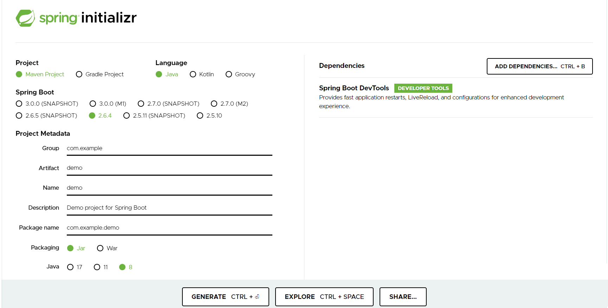
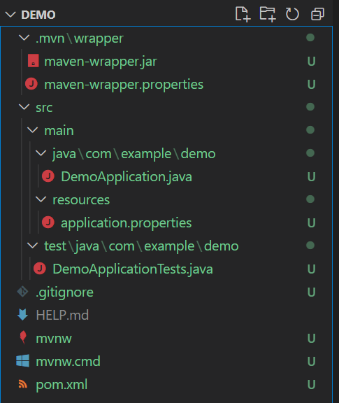
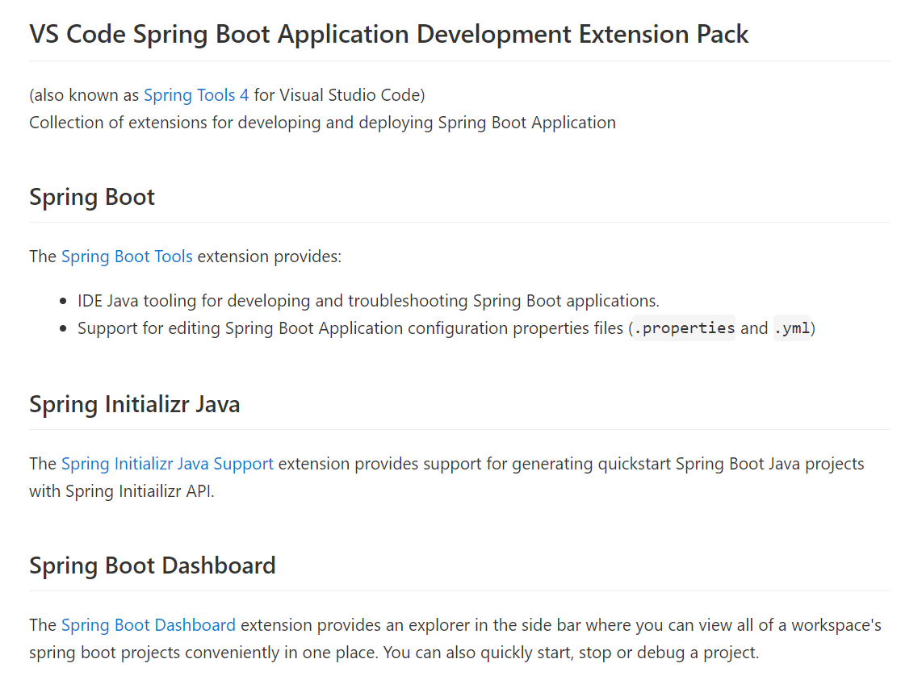
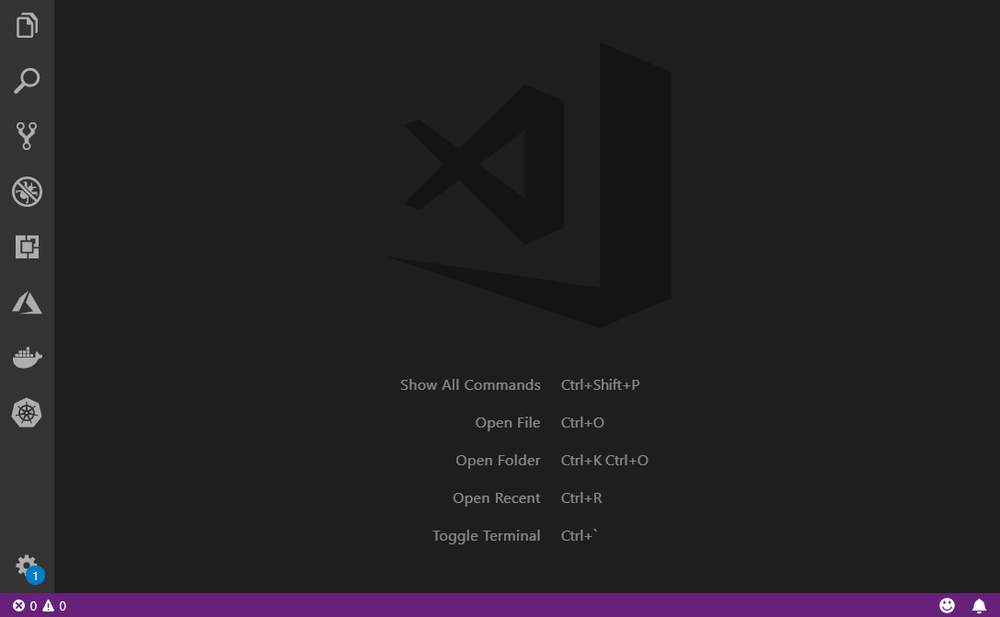

# WEEK004 - 使用 Spring 项目脚手架

在我们的日常工作中，经常需要从头开始创建一个 Spring 项目，很多人的做法是，复制一份已有的项目，然后改目录名，改项目名，改包名，然后再把一些不要的文件删掉，只保留项目的基本框架。

实际上，这样操作后保留下来的基本框架代码就是 **脚手架** 代码，有很多的工具可以帮我们自动生成脚手架代码。

## Spring Initializr

创建 Spring 项目最简单的方式就是使用官方提供的 [Spring Initializr](https://start.spring.io/)，下图是使用 Spring Initializr 生成项目脚手架代码的一个示例：



在这个页面中，我们需要填写这些信息：

* 项目类型
	* Maven
	* Gradle
* 语言类型
	* Java
	* Kotlin
	* Groovy
* Spring Boot 版本
* 项目基本信息
	* Group
	* Artifact
	* Name
	* Description
	* Package name
	* Packaging
	* Java
* 项目依赖

这里我选择的是 Maven 项目，语言类型为 Java，Spring Boot 版本为 2.6.4，项目基本信息为默认的 demo，打包方式为 jar，并添加了一个 Spring Web 依赖。生成的项目代码结构如下：



按照 [Spring Boot 快速入门教程](https://spring.io/quickstart)，我们在 `DemoApplication.java` 里加几行代码：

```
package com.example.demo;

import org.springframework.boot.SpringApplication;
import org.springframework.boot.autoconfigure.SpringBootApplication;
import org.springframework.web.bind.annotation.GetMapping;
import org.springframework.web.bind.annotation.RequestParam;
import org.springframework.web.bind.annotation.RestController;

@SpringBootApplication
@RestController
public class DemoApplication {

	public static void main(String[] args) {
		SpringApplication.run(DemoApplication.class, args);
	}

	@GetMapping("/hello")
	public String hello(@RequestParam(value = "name", defaultValue = "World") String name) {
		return String.format("Hello %s!", name);
	}
}
```

至此一个简单的 Web 项目就完成了，然后执行 `./mvnw spring-boot:run` 命令，第一次执行可能比较慢，这是在下载程序所需要的依赖，等启动结束后打开浏览器，访问 `http://localhost:8080/hello` 页面，就可以看到我们熟悉的 `Hello World` 了。

## Spring Tool Suite

[Spring Tool Suite](https://spring.io/tools) 被简称为 STS，是 Spring 官方推出的一套用于方便开发 Spring 项目的工具集，它可以集成到几乎所有的 IDE 中，比如：Eclipse、VS Code 或 Theia IDE 等。

这里以 VS Code 为例，体验下使用 STS 快速创建 Spring 项目脚手架代码。首先在 VS Code 的插件市场搜索 [`Spring Boot Extension Pack`](https://marketplace.visualstudio.com/items?itemName=Pivotal.vscode-boot-dev-pack)：



可以看到 STS 是一套工具集，包含了：

* Spring Boot Tools
* Spring Boot Dashboard
* Spring Initializr Java Support

如果我们只想体验 Spring Initializr 的功能，也可以只安装 [`Spring Initializr Java Support`](https://marketplace.visualstudio.com/items?itemName=vscjava.vscode-spring-initializr) 这个插件即可。安装完成后，通过 `Ctrl + Shift + P` 打开命令面板，输入 `Spring Initializr` 按提示就可以快速创建一个 Spring 项目，放一张官方的动图：



## Spring Boot CLI

https://docs.spring.io/spring-boot/docs/current/reference/htmlsingle/#cli

## 实现自己的 Spring Initializr

Spring Initializr 是一个完全开源的项目，我们可以通过它实现自己的代码脚手架。上面所介绍的 `start.spring.io`、STS 和 Spring Boot CLI 其实都是通过 Spring Initializr 来实现的，首先我们下载源码：

```
# git clone https://github.com/spring-io/initializr
```

```
# git clone https://github.com/spring-io/start.spring.io
```

另外，阿里的知行动手实验室也基于 Spring Initializr 做了一个类似于 `start.spring.io` 的脚手架生成站点 [start.aliyun.com](https://start.aliyun.com/)，在依赖列表中新增了阿里的一些开源项目，而且还提供了常见的几种应用架构的代码示例，有兴趣的同学可以体验下。

## Maven Archetype

https://maven.apache.org/guides/introduction/introduction-to-archetypes.html

## JHipster

https://www.jhipster.tech/

## 参考

1. [Spring Quickstart Guide](https://spring.io/quickstart)
1. [Spring Initializr Reference Guide](https://docs.spring.io/initializr/docs/current-SNAPSHOT/reference/html/)

## 更多

### 1. Spring Initializr 支持的依赖一览

在 Spring Initializr 上创建项目时，可以手工添加项目依赖，支持的依赖列表如下（记住这些依赖，大多是 Spring 生态中必学必会的技术）：

#### Developer Tools

* Spring Native
	* Incubating support for compiling Spring applications to native executables using the GraalVM native-image compiler.
* Spring Boot DevTools
	* Provides fast application restarts, LiveReload, and configurations for enhanced development experience.
* Lombok
	* Java annotation library which helps to reduce boilerplate code.
* Spring Configuration Processor
	* Generate metadata for developers to offer contextual help and "code completion" when working with custom configuration keys (ex.application.properties/.yml files).

#### Web

* Spring Web
	* Build web, including RESTful, applications using Spring MVC. Uses Apache Tomcat as the default embedded container.
* Spring Reactive Web
	* Build reactive web applications with Spring WebFlux and Netty.
* Spring GraphQL
	* Build GraphQL applications with Spring GraphQL and GraphQL Java.
* Rest Repositories
	* Exposing Spring Data repositories over REST via Spring Data REST.
* Spring Session
	* Provides an API and implementations for managing user session information.
* Rest Repositories HAL Explorer
	* Browsing Spring Data REST repositories in your browser.
* Spring HATEOAS
	* Eases the creation of RESTful APIs that follow the HATEOAS principle when working with Spring / Spring MVC.
* Spring Web Services
	* Facilitates contract-first SOAP development. Allows for the creation of flexible web services using one of the many ways to manipulate XML payloads.
* Jersey
	* Framework for developing RESTful Web Services in Java that provides support for JAX-RS APIs.
* Vaadin
	* A web framework that allows you to write UI in pure Java without getting bogged down in JS, HTML, and CSS.

#### Template Engines

* Thymeleaf
	* A modern server-side Java template engine for both web and standalone environments. Allows HTML to be correctly displayed in browsers and as static prototypes.
* Apache Freemarker
	* Java library to generate text output (HTML web pages, e-mails, configuration files, source code, etc.) based on templates and changing data.
* Mustache
	* Logic-less Templates. There are no if statements, else clauses, or for loops. Instead there are only tags.
* Groovy Templates
	* Groovy templating engine.

#### Security

* Spring Security
	* Highly customizable authentication and access-control framework for Spring applications.
* OAuth2 Client
	* Spring Boot integration for Spring Security's OAuth2/OpenID Connect client features.
* OAuth2 Resource Server
	* Spring Boot integration for Spring Security's OAuth2 resource server features.
* Spring LDAP
	* Makes it easier to build Spring based applications that use the Lightweight Directory Access Protocol.
* Okta
	* Okta specific configuration for Spring Security/Spring Boot OAuth2 features. Enable your Spring Boot application to work with Okta via OAuth 2.0/OIDC.

#### SQL

* JDBC API
	* Database Connectivity API that defines how a client may connect and query a database.
* Spring Data JPA
	* Persist data in SQL stores with Java Persistence API using Spring Data and Hibernate.
* Spring Data JDBC
	* Persist data in SQL stores with plain JDBC using Spring Data.
* Spring Data R2DBC
	* Provides Reactive Relational Database Connectivity to persist data in SQL stores using Spring Data in reactive applications.
* MyBatis Framework
	* Persistence framework with support for custom SQL, stored procedures and advanced mappings. MyBatis couples objects with stored procedures or SQL statements using a XML descriptor or annotations.
* Liquibase Migration
	* Liquibase database migration and source control library.
* Flyway Migration
	* Version control for your database so you can migrate from any version (incl. an empty database) to the latest version of the schema.
* JOOQ Access Layer
	* Generate Java code from your database and build type safe SQL queries through a fluent API.
* IBM DB2 Driver
	* A JDBC driver that provides access to IBM DB2.
* Apache Derby Database
	* An open source relational database implemented entirely in Java.
* H2 Database
	* Provides a fast in-memory database that supports JDBC API and R2DBC access, with a small (2mb) footprint. Supports embedded and server modes as well as a browser based console application.
* HyperSQL Database
	* Lightweight 100% Java SQL Database Engine.
* MariaDB Driver
	* MariaDB JDBC and R2DBC driver.
* MS SQL Server Driver
	* A JDBC and R2DBC driver that provides access to Microsoft SQL Server and Azure SQL Database from any Java application.
* MySQL Driver
	* MySQL JDBC and R2DBC driver.
* Oracle Driver
	* A JDBC driver that provides access to Oracle.
* PostgreSQL Driver
	* A JDBC and R2DBC driver that allows Java programs to connect to a PostgreSQL database using standard, database independent Java code.

#### NoSQL

* Spring Data Redis (Access+Driver)
	* Advanced and thread-safe Java Redis client for synchronous, asynchronous, and reactive usage. Supports Cluster, Sentinel, Pipelining, Auto-Reconnect, Codecs and much more.
* Spring Data Reactive Redis
	* Access Redis key-value data stores in a reactive fashion with Spring Data Redis.
* Spring Data MongoDB
	* Store data in flexible, JSON-like documents, meaning fields can vary from document to document and data structure can be changed over time.
* Spring Data Reactive MongoDB
	* Provides asynchronous stream processing with non-blocking back pressure for MongoDB.
* Spring Data Elasticsearch (Access+Driver)
	* A distributed, RESTful search and analytics engine with Spring Data Elasticsearch.
* Spring Data for Apache Cassandra
	* A free and open-source, distributed, NoSQL database management system that offers high-scalability and high-performance.
* Spring Data Reactive for Apache Cassandra
	* Access Cassandra NoSQL Database in a reactive fashion.
* Spring for Apache Geode
	* Apache Geode is a data management platform that helps users build real-time, highly concurrent, highly performant and reliable Spring Boot applications at scale that is compatible with Pivotal Cloud Cache.
* Spring Data Couchbase
	* NoSQL document-oriented database that offers in memory-first architecture, geo-distributed deployments, and workload isolation.
* Spring Data Reactive Couchbase
	* Access Couchbase NoSQL database in a reactive fashion with Spring Data Couchbase.
* Spring Data Neo4j
	* An open source NoSQL database that stores data structured as graphs consisting of nodes, connected by relationships.

#### Messaging

* Spring Integration
	* Adds support for Enterprise Integration Patterns. Enables lightweight messaging and supports integration with external systems via declarative adapters.
* Spring for RabbitMQ
	* Gives your applications a common platform to send and receive messages, and your messages a safe place to live until received.
* Spring for Apache Kafka
	* Publish, subscribe, store, and process streams of records.
* Spring for Apache Kafka Streams
	* Building stream processing applications with Apache Kafka Streams.
* Spring for Apache ActiveMQ 5
	* Spring JMS support with Apache ActiveMQ 'Classic'.
* Spring for Apache ActiveMQ Artemis
	* Spring JMS support with Apache ActiveMQ Artemis.
* WebSocket
	* Build WebSocket applications with SockJS and STOMP.
* RSocket
	* RSocket.io applications with Spring Messaging and Netty.
* Apache Camel
	* Apache Camel is an open source integration framework that empowers you to quickly and easily integrate various systems consuming or producing data.
* Solace PubSub+
	* Connect to a Solace PubSub+ Advanced Event Broker to publish, subscribe, request/reply and store/replay messages

#### I/O

* Spring Batch
	* Batch applications with transactions, retry/skip and chunk based processing.
* Validation
	* Bean Validation with Hibernate validator.
* Java Mail Sender
	* Send email using Java Mail and Spring Framework's JavaMailSender.
* Quartz Scheduler
	* Schedule jobs using Quartz.
* Spring cache abstraction
	* Provides cache-related operations, such as the ability to update the content of the cache, but does not provide the actual data store.
* Picocli
	* Build command line applications with picocli.

#### Ops

* Spring Boot Actuator
	* Supports built in (or custom) endpoints that let you monitor and manage your application - such as application health, metrics, sessions, etc.
* Codecentric's Spring Boot Admin (Client)
	* Required for your application to register with a Codecentric's Spring Boot Admin Server instance.
* Codecentric's Spring Boot Admin (Server)
	* A community project to manage and monitor your Spring Boot applications. Provides a UI on top of the Spring Boot Actuator endpoints.

#### Observability

* Datadog
	* Publish Micrometer metrics to Datadog, a dimensional time-series SaaS with built-in dashboarding and alerting.
* Influx
	* Publish Micrometer metrics to InfluxDB, a dimensional time-series server that support real-time stream processing of data.
* Graphite
	* Publish Micrometer metrics to Graphite, a hierarchical metrics system backed by a fixed-size database.
* New Relic
	* Publish Micrometer metrics to New Relic, a SaaS offering with a full UI and a query language called NRQL.
* Prometheus
	* Expose Micrometer metrics in Prometheus format, an in-memory dimensional time series database with a simple built-in UI, a custom query language, and math operations.
* Sleuth
	* Distributed tracing via logs with Spring Cloud Sleuth.
* Wavefront
	* Publish Micrometer metrics to Tanzu Observability by Wavefront, a SaaS-based metrics monitoring and analytics platform that lets you visualize, query, and alert over data from across your entire stack.
* Zipkin Client
	* Distributed tracing with an existing Zipkin installation and Spring Cloud Sleuth Zipkin.

#### Testing

* Spring REST Docs
	* Document RESTful services by combining hand-written with Asciidoctor and auto-generated snippets produced with Spring MVC Test.
* Testcontainers
	* Provide lightweight, throwaway instances of common databases, Selenium web browsers, or anything else that can run in a Docker container.
* Contract Verifier
	* Moves TDD to the level of software architecture by enabling Consumer Driven Contract (CDC) development.
* Contract Stub Runner
	* Stub Runner for HTTP/Messaging based communication. Allows creating WireMock stubs from RestDocs tests.
* Embedded LDAP Server
	* Provides a platform neutral way for running a LDAP server in unit tests.
* Embedded MongoDB Database
	* Provides a platform neutral way for running MongoDB in unit tests.

#### Spring Cloud

* Cloud Bootstrap
	* Non-specific Spring Cloud features, unrelated to external libraries or integrations (e.g. Bootstrap context and @RefreshScope).
* Function
	* Promotes the implementation of business logic via functions and supports a uniform programming model across serverless providers, as well as the ability to run standalone (locally or in a PaaS).
* Task
	* Allows a user to develop and run short lived microservices using Spring Cloud. Run them locally, in the cloud, and on Spring Cloud Data Flow.

#### Spring Cloud Tools

* Open Service Broker
	* Framework for building Spring Boot apps that implement the Open Service Broker API, which can deliver services to applications running within cloud native platforms such as Cloud Foundry, Kubernetes and OpenShift.

#### Spring Cloud Config

* Config Client
	* Client that connects to a Spring Cloud Config Server to fetch the application's configuration.
* Config Server
	* Central management for configuration via Git, SVN, or HashiCorp Vault.
* Vault Configuration
	* Provides client-side support for externalized configuration in a distributed system. Using HashiCorp's Vault you have a central place to manage external secret properties for applications across all environments.
* Apache Zookeeper Configuration
	* Enable and configure common patterns inside your application and build large distributed systems with Apache Zookeeper based components. The provided patterns include Service Discovery and Configuration.
* Consul Configuration
	* Enable and configure the common patterns inside your application and build large distributed systems with Hashicorp’s Consul. The patterns provided include Service Discovery, Distributed Configuration and Control Bus.

#### Spring Cloud Discovery

* Eureka Discovery Client
	* A REST based service for locating services for the purpose of load balancing and failover of middle-tier servers.
* Eureka Server
	* spring-cloud-netflix Eureka Server.
* Apache Zookeeper Discovery
	* Service discovery with Apache Zookeeper.
* Cloud Foundry Discovery
	* Service discovery with Cloud Foundry.
* Consul Discovery
	* Service discovery with Hashicorp Consul.

#### Spring Cloud Routing

* Gateway
	* Provides a simple, yet effective way to route to APIs and provide cross cutting concerns to them such as security, monitoring/metrics, and resiliency.
* OpenFeign
	* Declarative REST Client. OpenFeign creates a dynamic implementation of an interface decorated with JAX-RS or Spring MVC annotations.
* Cloud LoadBalancer
	* Client-side load-balancing with Spring Cloud LoadBalancer.

#### Spring Cloud Circuit Breaker

* Resilience4J
	* Spring Cloud Circuit breaker with Resilience4j as the underlying implementation.

#### Spring Cloud Messaging

* Cloud Bus
	* Links nodes of a distributed system with a lightweight message broker which can used to broadcast state changes or other management instructions (requires a binder, e.g. Apache Kafka or RabbitMQ).
* Cloud Stream
	* Framework for building highly scalable event-driven microservices connected with shared messaging systems (requires a binder, e.g. Apache Kafka, RabbitMQ or Solace PubSub+).

#### VMware Tanzu Application Service

* Config Client (TAS)
	* Config client on VMware Tanzu Application Service.
* Service Registry (TAS)
	* Eureka service discovery client on VMware Tanzu Application Service.

#### Microsoft Azure

* Azure Support
	* Auto-configuration for Azure Services (Service Bus, Storage, Active Directory, Key Vault, and more).
* Azure Active Directory
	* Spring Security integration with Azure Active Directory for authentication.
* Azure Cosmos DB
	* Fully managed NoSQL database service for modern app development, including Spring Data support.
* Azure Key Vault
	* Manage application secrets.
* Azure Storage
	* Azure Storage service integration.

#### Google Cloud Platform

* GCP Support
	* Contains auto-configuration support for every Spring Cloud GCP integration. Most of the auto-configuration code is only enabled if other dependencies are added to the classpath.
* GCP Messaging
	* Adds the GCP Support entry and all the required dependencies so that the Google Cloud Pub/Sub integration work out of the box.
* GCP Storage
	* Adds the GCP Support entry and all the required dependencies so that the Google Cloud Storage integration work out of the box.
	