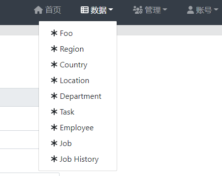

# WEEK005 - 学习 JHipster

在 WEEK004 中，我们学习了几种方法来快速生成 Spring 项目的脚手架代码，这一节将学习一个更强大的工具 [JHipster](https://www.jhipster.tech/)，它几乎是全能型选手，它能自动生成前后端一体的代码框架，并提供了大量的方便开发和测试以及用于生产环境的特性。

## JHipster 快速入门

### 1. 环境准备

根据 [官方文档]((https://www.jhipster.tech/installation/))，JHipster 有四种安装方式：

* [JHipster Online](https://start.jhipster.tech/)
* NPM 本地安装
* Yarn 本地安装
* Docker 容器安装

JHipster Online 是一个非常类似于 `start.spring.io` 的站点，用于在线生成代码，它一般是提供给第一次接触 JHipster 的用户使用的，用于展示 JHipster 的特性。虽然这种方式很简单，不过官方更推荐 NPM 安装方式。

首先确保你已经安装了 Java 和 Node：

```
> java -version
java version "11.0.8" 2020-07-14 LTS
Java(TM) SE Runtime Environment 18.9 (build 11.0.8+10-LTS)
Java HotSpot(TM) 64-Bit Server VM 18.9 (build 11.0.8+10-LTS, mixed mode)

> node --version
v16.14.2

> npm --version
8.5.0
```

然后使用下面的命令安装 JHipster：

```
> npm install -g generator-jhipster
```

如果你需要使用 JHipster 的 `module` 或 `blueprint`，还需要安装 [`Yeoman`](https://yeoman.io/)，它是一款现代化的项目脚手架工具：

```
> npm install -g yo
```

### 2. 创建应用

接下来就可以使用 JHipster 帮我们快速创建一个应用的脚手架代码了。首先创建一个空目录：

```
> mkdir demo
> cd demo
```

然后执行 `jhipster` 命令：

```
> jhipster
INFO! Using bundled JHipster

        ██╗ ██╗   ██╗ ████████╗ ███████╗   ██████╗ ████████╗ ████████╗ ███████╗
        ██║ ██║   ██║ ╚══██╔══╝ ██╔═══██╗ ██╔════╝ ╚══██╔══╝ ██╔═════╝ ██╔═══██╗
        ██║ ████████║    ██║    ███████╔╝ ╚█████╗     ██║    ██████╗   ███████╔╝
  ██╗   ██║ ██╔═══██║    ██║    ██╔════╝   ╚═══██╗    ██║    ██╔═══╝   ██╔══██║
  ╚██████╔╝ ██║   ██║ ████████╗ ██║       ██████╔╝    ██║    ████████╗ ██║  ╚██╗
   ╚═════╝  ╚═╝   ╚═╝ ╚═══════╝ ╚═╝       ╚═════╝     ╚═╝    ╚═══════╝ ╚═╝   ╚═╝
                            https://www.jhipster.tech
Welcome to JHipster v7.7.0

Application files will be generated in folder: D:\code\demo
 _______________________________________________________________________________________________________________

  Documentation for creating an application is at https://www.jhipster.tech/creating-an-app/
  If you find JHipster useful, consider sponsoring the project at https://opencollective.com/generator-jhipster
 _______________________________________________________________________________________________________________
```

接下来 JHipster 会向你提一系列的问题，你需要根据项目需要进行选择。首先选择的是应用类型，这里我们选择 `Monolithic application`（单体应用）：

```
? Which *type* of application would you like to create?
> Monolithic application (recommended for simple projects)
  Gateway application
  Microservice application
```

接下来需要填写应用名称和 Java 包名：

```
? What is the base name of your application? demo
? What is your default Java package name? com.example.demo
```

是否需要使用 `Spring WebFlux` 创建响应式应用？我们选 No：

```
? Do you want to make it reactive with Spring WebFlux? No
```

然后要选择应用的认证方式，默认选的是 JWT：

```
? Which *type* of authentication would you like to use? (Use arrow keys)
> JWT authentication (stateless, with a token)
  OAuth 2.0 / OIDC Authentication (stateful, works with Keycloak and Okta)
  HTTP Session Authentication (stateful, default Spring Security mechanism)
```

然后选择我们要使用什么类型的数据库，JHipster 支持不同类型的数据库，包括 MySQL、MongoDB、Cassandra 等，我们选择最常用的 SQL：

```
? Which *type* of database would you like to use? (Use arrow keys)
> SQL (H2, PostgreSQL, MySQL, MariaDB, Oracle, MSSQL)
  MongoDB
  Cassandra
  [BETA] Couchbase
  [BETA] Neo4j
  No database
```

紧接着上一个问题，JHipster 会让我们选择生产环境使用的数据库，我们选择 MySQL：

```
? Which *production* database would you like to use?
  PostgreSQL
> MySQL
  MariaDB
  Oracle
  Microsoft SQL Server
```

接着又会让我们选择开发环境使用的数据库，我们选择 `H2 with disk-based persistence`：

```
? Which *development* database would you like to use?
> H2 with disk-based persistence
  H2 with in-memory persistence
  MySQL
```

然后继续选择一个缓存类型，默认选择的是 `Ehcache`：

```
? Which cache do you want to use? (Spring cache abstraction) (Use arrow keys)
> Ehcache (local cache, for a single node)
  Caffeine (local cache, for a single node)
  Hazelcast (distributed cache, for multiple nodes, supports rate-limiting for gateway applications)
  Infinispan (hybrid cache, for multiple nodes)
  Memcached (distributed cache) - Warning, when using an SQL database, this will disable the Hibernate 2nd level cache!
  Redis (distributed cache)
  No cache - Warning, when using an SQL database, this will disable the Hibernate 2nd level cache!
```

是否开启 Hibernate 的二级缓存，选择 Y：

```
? Do you want to use Hibernate 2nd level cache? (Y/n)
```

后端的打包工具我们选择 Maven：

```
? Would you like to use Maven or Gradle for building the backend? (Use arrow keys)
> Maven
  Gradle
```

是否需要使用 `JHipster Registry` 注册中心？我们选 No:

```
? Do you want to use the JHipster Registry to configure, monitor and scale your application? (Use arrow keys)
> No
  Yes
```

是否需要使用 JHipster 支持的一些其他技术，包括：Elasticsearch、WebSockets、Kafka 等，我们这里可以直接跳过：

```
? Which other technologies would you like to use? (Press <space> to select, <a> to toggle all, <i> to invert selection, and <enter> to proceed)
>( ) Elasticsearch as search engine
 ( ) WebSockets using Spring Websocket
 ( ) Apache Kafka as asynchronous messages broker
 ( ) API first development using OpenAPI-generator
```

前端框架我们选择 `Vue`：

```
? Which *Framework* would you like to use for the client?
  Angular
  React
> Vue
  No client
```

并生成管理页面：

```
? Do you want to generate the admin UI? (Y/n)
```

然后选择一个前端主题，直接使用 JHipster 默认的即可：

```
? Would you like to use a Bootswatch theme (https://bootswatch.com/)?
  Vapor
  Yeti
  Zephyr
> Default JHipster
  Cerulean
  Cosmo
  Cyborg
(Move up and down to reveal more choices)
```

是否需要开启国际化，选择 Y：

```
? Would you like to enable internationalization support? (Y/n)
```

如果开启国际化之后，就会让我们选要支持的语言，我们选简体中文和英文：

```
? Please choose the native language of the application Chinese (Simplified)
? Please choose additional languages to install
```

除了 JUnit 和 Jest，还可以选择其他的测试框架，这里我们直接跳过：

```
? Besides JUnit and Jest, which testing frameworks would you like to use? (Press <space> to select, <a> to toggle all, <i> to invert selection, and <enter> to proceed)
>( ) Cypress
 ( ) [DEPRECATED] Protractor
 ( ) Gatling
 ( ) Cucumber
```

最后 JHipster 问是否需要安装其他的 generator？选择 N：

```
? Would you like to install other generators from the JHipster Marketplace? (y/N)
```

然后 JHipster 就开始按我们的选择自动生成代码了。

```
Application successfully committed to Git from D:\code\demo.

If you find JHipster useful consider sponsoring the project https://www.jhipster.tech/sponsors/

Server application generated successfully.

Run your Spring Boot application:
./mvnw (mvnw if using Windows Command Prompt)

Client application generated successfully.

Start your Webpack development server with:
 npm start


> demo@0.0.0 clean-www
> rimraf target/classes/static/app/{src,target/}

Congratulations, JHipster execution is complete!
```

代码生成完成后，执行 `./mvnw` 运行我们的应用：

```
> ./mvnw
```

> 注意，`./mvnw` 命令只会编译后端代码并运行，如果修改了前端代码，需要使用 `./mvnw -Pwebapp` 命令来编译运行。或者使用 `npm start` 命令来启动前端代码，这样在修改前端代码后可以立即生效，这被称为 `live reload`。

打开浏览器，输入 `http://localhost:8080/`：


系统默认内置了两个用户：管理员 admin 和普通用户 user，可以直接登录，管理员登录后可以看到一个管理菜单，JHipster 为我们内置了很多非常实用的系统管理功能：


### 用户管理

在这里可以对系统用户进行增删改查，新注册的用户也可以在这里进行激活。


### 资源监控

在这里可以查看系统资源占用情况和统计信息，比如：CPU 负载、内存占用、线程数、GC 情况等。


### 服务状态

在这里可以看到系统的健康状态，比如：数据库是否连接正常、磁盘空间是否已满等等。


### 配置

这里列出了系统所有的配置项，并支持按前缀过滤。


### 日志

这里列出了系统所有的日志配置，并支持实时修改刷新。


### API

这里通过 Swagger 列出系统的接口文档，可以在这里对接口进行调试。


### 数据库

对于 H2 数据库，JHipster 还提供了一个可视化的管理页面来方便我们对 H2 中的数据进行增删改查。


## 新增数据

可以看出，JHipster 内置了很多系统管理功能，不过这时应用里还没有任何数据，可以使用 `jhipster entity <entityName> --[options]` 子命令来创建实体，这被称之为 `sub-generator`。

下面我们来创建一个 `Foo` 实体：

```
> jhipster entity Foo
```

和上面生成代码的过程一样，JHipster 还会问一系列的问题。首先会问你是否要创建字段：

```
The entity Foo is being created.


Generating field #1

? Do you want to add a field to your entity? (Y/n)
```

这里我们就加一个字段 `name` 测试一下：

```
Generating field #1

? Do you want to add a field to your entity? Yes
? What is the name of your field? name
? What is the type of your field? String
? Do you want to add validation rules to your field? No

================= Foo =================
Fields
name (String)

Generating field #2

? Do you want to add a field to your entity? (Y/n)
```

输入字段名之后，还会让你选择字段类型，并填写校验规则。一个字段填写完成后，接着填写下一个字段，这里我们输入 `n` 结束添加。

然后选择实体和其他实体之间的关系，这里我们直接输入 `n`：

```
Generating relationships to other entities

? Do you want to add a relationship to another entity? (Y/n)
```

接下来的问题是是否创建 Service 层代码，也就是业务逻辑层，有三个选项：

* 不生成，直接在 Controller 里访问数据库
* 生成 Service 类
* 生成 Service 接口和相应的实现类

```
? Do you want to use separate service class for your business logic? (Use arrow keys)
  No, the REST controller should use the repository directly
  Yes, generate a separate service class
> Yes, generate a separate service interface and implementation
```

一般我们生成代码后都会进行一些修改，添加自己的业务逻辑，所以最好选择第三个选项，方便后面的改动。如果只是简单的演示程序，选第一个也未尝不可。

接下来，是否要创建 DTO 类，一般选择 `Yes`，对于代码后期维护上要方便点，如果选 `No` 的话，Controller 层的代码会直接使用 Entity 类：

```
? Do you want to use a Data Transfer Object (DTO)? (Use arrow keys)
  No, use the entity directly
> Yes, generate a DTO with MapStruct
```

然后是否要添加 `filtering` 功能，这是 JHipster 提供的一个很方便有用的特性，通过一定的参数形式，可以组装出非常通用的查询条件，具体的规则可以参考 [官方文档](https://www.jhipster.tech/entities-filtering/)：

```
? Do you want to add filtering? (Use arrow keys)
  Not needed
> Dynamic filtering for the entities with JPA Static metamodel
```

是否只读？我们选 `N`：

```
? Is this entity read-only? (y/N)
```

是否支持分页和排序？这里有两种不同的分页选项：`pagination links` 和 `infinite scroll`，一般选择第一个分页选项：

```
? Do you want pagination and sorting on your entity?
  No
> Yes, with pagination links and sorting headers
  Yes, with infinite scroll and sorting headers
```

至此，问题回答完毕，JHipster 自动为我们创建了下面这些文件：

```
Everything is configured, generating the entity...

     info Creating changelog for entities Foo
    force .yo-rc-global.json
    force .yo-rc.json
    force .jhipster\Foo.json
   create src\main\resources\config\liquibase\changelog\20220329001104_added_entity_Foo.xml
   create src\main\resources\config\liquibase\fake-data\foo.csv
 conflict src\main\resources\config\liquibase\master.xml
? Overwrite src\main\resources\config\liquibase\master.xml? overwrite this and all others
    force src\main\resources\config\liquibase\master.xml
   create src\main\java\com\example\demo\service\FooQueryService.java
   create src\main\java\com\example\demo\service\mapper\FooMapper.java
   create src\main\webapp\app\entities\foo\foo.component.ts
   create src\main\java\com\example\demo\repository\FooRepository.java
   create src\main\webapp\app\entities\foo\foo.service.ts
   create src\main\webapp\app\entities\foo\foo-update.vue
   create src\test\java\com\example\demo\domain\FooTest.java
   create src\main\webapp\app\entities\foo\foo-update.component.ts
   create src\test\javascript\spec\app\entities\foo\foo.component.spec.ts
   create src\test\java\com\example\demo\service\dto\FooDTOTest.java
   create src\test\javascript\spec\app\entities\foo\foo-details.component.spec.ts
   create src\main\java\com\example\demo\service\FooService.java
   create src\test\java\com\example\demo\service\mapper\FooMapperTest.java
   create src\test\javascript\spec\app\entities\foo\foo.service.spec.ts
   create src\main\java\com\example\demo\domain\Foo.java
   create src\main\java\com\example\demo\service\impl\FooServiceImpl.java
   create src\main\webapp\app\shared\model\foo.model.ts
   create src\test\javascript\spec\app\entities\foo\foo-update.component.spec.ts
   create src\main\java\com\example\demo\service\dto\FooDTO.java
   create src\main\webapp\app\entities\foo\foo-details.vue
   create src\main\webapp\i18n\zh-cn\foo.json
   create src\main\webapp\app\entities\foo\foo-details.component.ts
   create src\main\java\com\example\demo\service\criteria\FooCriteria.java
   create src\main\java\com\example\demo\web\rest\FooResource.java
   create src\main\java\com\example\demo\service\mapper\EntityMapper.java
   create src\main\webapp\app\entities\foo\foo.vue
   create src\test\java\com\example\demo\web\rest\FooResourceIT.java
    force src\main\java\com\example\demo\config\CacheConfiguration.java
    force src\main\webapp\app\router\entities.ts
    force src\main\webapp\app\entities\entities.component.ts
    force src\main\webapp\app\entities\entities-menu.vue
    force src\main\webapp\i18n\zh-cn\global.json
    force .yo-rc.json
    force .jhipster\Foo.json

No change to package.json was detected. No package manager install will be executed.
Entity Foo generated successfully.
```

JHipster 生成代码之后会自动进行编译，你可以直接执行 `./mvnw` 启动服务，查看新生成的实体是否生效。

## 使用 JDL

当要生成的实体类非常多时，使用 `jhipster entity` 命令一个个的生成就太麻烦了。为此官方特意创造了一种新的领域语言 `JDL` （[JHipster Domain Language](https://www.jhipster.tech/jdl/intro)）来解决这个问题，通过可视化的方式完成 JDL 的编写，再使用脚本转换为代码。

官方提供了多种方式来编写 JDL 文件，比如在线工具 [JDL-Studio](https://start.jhipster.tech/jdl-studio/)， 或者使用各个 IDE 的 JDL 插件，不过最方便的还是使用 JDL-Studio 在线编写：


我们选择官网提供的示例 `default sample` 并下载文件，执行下面的命令：

```
> jhipster jdl .\default-sample.jdl
```

JHipster 会自动生成下面 8 个实体类对应的代码：

```
INFO! Executing import-jdl .\default-sample.jdl
INFO! The JDL is being parsed.
warn: In the One-to-Many relationship from Employee to Job, only bidirectionality is supported for a One-to-Many association. The other side will be automatically added.
warn: In the One-to-Many relationship from Department to Employee, only bidirectionality is supported for a One-to-Many association. The other side will be automatically added.
INFO! Found entities: Region, Country, Location, Department, Task, Employee, Job, JobHistory.
INFO! The JDL has been successfully parsed
INFO! Generating 0 applications.
INFO! Generating 8 entities.
INFO! Generating entities for application undefined in a new parallel process
```

重新执行 `./mvnw` 启动程序，可以看到数据菜单里多了新增的几个实体，可以在这里对实体进行简单的增删改查。



## 参考

1. [Installing JHipster](https://www.jhipster.tech/installation/)
2. [Creating an application](https://www.jhipster.tech/creating-an-app/)
3. [Creating an entity](https://www.jhipster.tech/creating-an-entity/)

## 更多

### 1. 在 PowerShell 中运行 `jhipster` 报 UnauthorizedAccess 错误

```
> jhipster
jhipster : 无法加载文件 C:\Users\aneasystone\AppData\Roaming\npm\jhipster.ps1，因为在此系统上禁止运行脚本。有关详细信息，请参阅 https:/go.microsoft.com/fwlink/?LinkID=1351
70 中的 about_Execution_Policies。
所在位置 行:1 字符: 1
+ jhipster
+ ~~~~~~~~
    + CategoryInfo          : SecurityError: (:) []，PSSecurityException
    + FullyQualifiedErrorId : UnauthorizedAccess
```

解决方法是使用 `set-ExecutionPolicy` 命令将系统的执行策略设置为 `RemoteSigned`：

```
> set-ExecutionPolicy RemoteSigned
```

### 2. 管理实体之间的关系

https://www.jhipster.tech/managing-relationships/

### 3. 使用 JHipster 生成微服务

https://www.jhipster.tech/microservices-architecture/

### 4. 关于 JHipster 的更多文档

### 5. JHipster 技术一览
