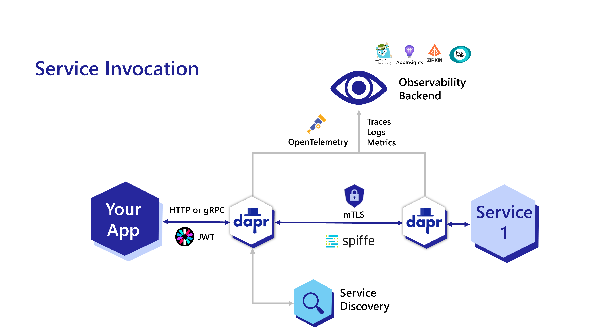
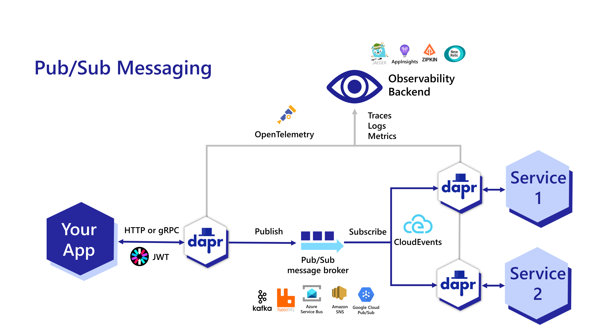
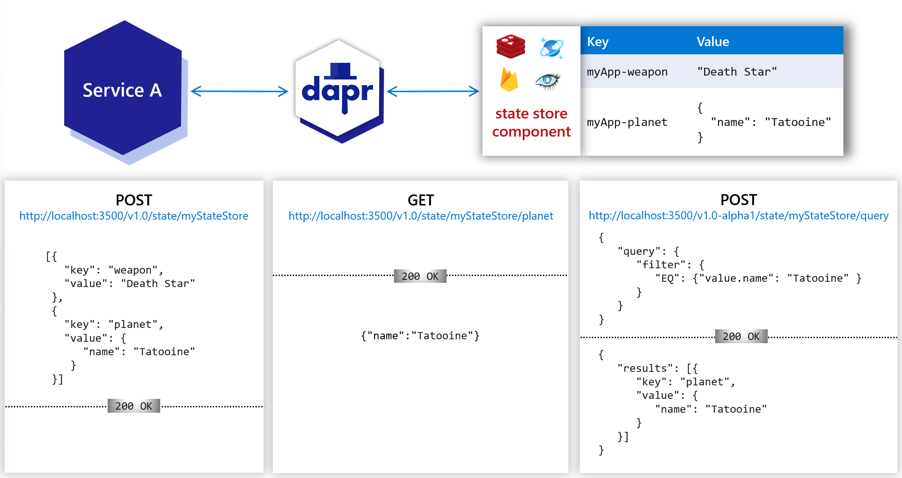
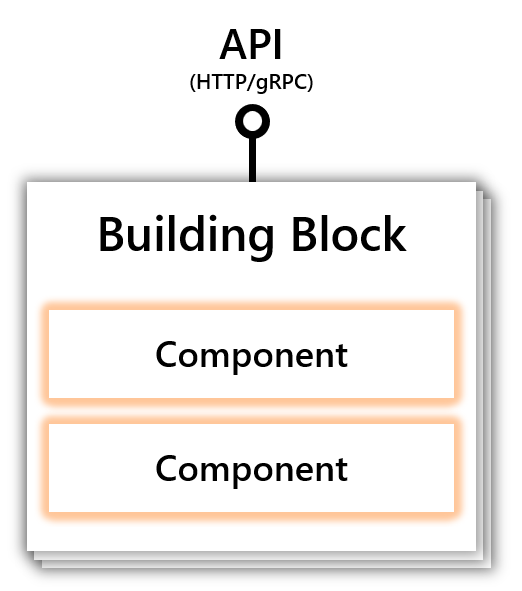
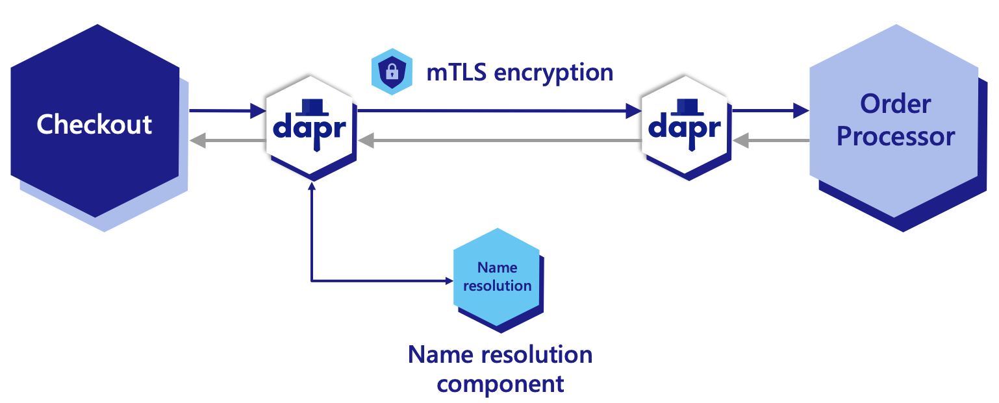

# WEEK006 CNCF 项目学习笔记（Dapr）

[Dapr](https://dapr.io/) 的全称为 `Distributed Application Runtime`（分布式应用运行时），顾名思义，它的目的就是为分布式应用提供运行所依赖的的执行环境。Dapr 为开发者提供了服务间调用（`service to service invocation`）、消息队列（`message queue`）和事件驱动（`event driven`）等服务模型，它可以让开发人员更聚焦业务代码，而不用去关心分布式系统所带来的其他复杂挑战，比如：服务发现（`service discovery`）、状态存储（`state management`）、加密数据存储（`secret management`）、可观察性（`observability`）等。

下面这张图说明了 Dapr 在分布式系统中所承担的作用：



这是分布式系统中最常用的一种场景，你的应用需要去调用系统中的另一个应用提供的服务。在引入 Dapr 之后，Dapr 通过边车模式运行在你的应用之上，Dapr 会通过服务发现机制为你去调用另一个应用的服务，并使用 mTLS 提供了服务间的安全访问，而且每个 Dapr 会集成 OpenTelemetry 自动为你提供服务之间的链路追踪、日志和指标等可观察性功能。

下图是基于事件驱动模型的另一种调用场景：



## 安装 Dapr

### 1. 安装 Dapr CLI

首先使用下面的一键安装脚本安装 `Dapr CLI`：

```
[root@localhost ~]# wget -q https://raw.githubusercontent.com/dapr/cli/master/install/install.sh -O - | /bin/bash
Getting the latest Dapr CLI...
Your system is linux_amd64
Installing Dapr CLI...

Installing v1.6.0 Dapr CLI...
Downloading https://github.com/dapr/cli/releases/download/v1.6.0/dapr_linux_amd64.tar.gz ...
dapr installed into /usr/local/bin successfully.
CLI version: 1.6.0 
Runtime version: n/a

To get started with Dapr, please visit https://docs.dapr.io/getting-started/
```

使用 `dapr -v` 校验是否安装成功：

```
[root@localhost ~]# dapr -v
CLI version: 1.6.0 
Runtime version: n/a
```

注意，这里我们可以看到 `Runtime version` 是 `n/a`，所以下一步我们还需要安装 `Dapr runtime`。

### 2. 初始化 Dapr

虽然 Dapr 也可以在非 Docker 环境下运行，但是官方更推荐使用 Docker，首先确保机器上已经安装有 Docker 环境，然后执行下面的 `dapr init` 命令：

```
[root@localhost ~]# dapr init
> Making the jump to hyperspace...
>> Installing runtime version 1.6.1
Dapr runtime installed to /root/.dapr/bin, you may run the following to add it to your path if you want to run daprd directly:
    export PATH=$PATH:/root/.dapr/bin
> Downloading binaries and setting up components...
> Downloaded binaries and completed components set up.
>> daprd binary has been installed to /root/.dapr/bin.
>> dapr_placement container is running.
>> dapr_redis container is running.
>> dapr_zipkin container is running.
>> Use `docker ps` to check running containers.
> Success! Dapr is up and running. To get started, go here: https://aka.ms/dapr-getting-started
```

从运行结果可以看到，Dapr 的初始化过程包含以下几个部分：

* 安装 Dapr 运行时（`daprd`），安装位置为 `/root/.dapr/bin`，同时会创建一个 `components` 目录用于默认组件的定义
* 运行 `dapr_placement` 容器，[dapr placement 服务](https://docs.dapr.io/concepts/dapr-services/placement/) 用于实现本地 actor 支持
* 运行 `dapr_redis` 容器，用于本地状态存储（`local state store`）和消息代理（`message broker`）
* 运行 `dapr_zipkin` 容器，用于实现服务的可观察性（`observability`）

初始化完成后，再次使用 `dapr -v` 校验是否安装成功：

```
[root@localhost ~]# dapr -v
CLI version: 1.6.0 
Runtime version: 1.6.1
```

并使用 `docker ps` 查看容器运行状态：

```
[root@localhost ~]# docker ps
CONTAINER ID   IMAGE               COMMAND                  CREATED             STATUS                       PORTS                                                 NAMES
63dd751ec5eb   daprio/dapr:1.6.1   "./placement"            About an hour ago   Up About an hour             0.0.0.0:50005->50005/tcp, :::50005->50005/tcp         dapr_placement
a8d3a7c93e12   redis               "docker-entrypoint.s…"   About an hour ago   Up About an hour             0.0.0.0:6379->6379/tcp, :::6379->6379/tcp             dapr_redis
52586882abea   openzipkin/zipkin   "start-zipkin"           About an hour ago   Up About an hour (healthy)   9410/tcp, 0.0.0.0:9411->9411/tcp, :::9411->9411/tcp   dapr_zipkin
```

## 使用 Dapr API

`dapr run` 是最常用的 Dapr 命令之一， 这个命令用于启动一个应用，同时启动一个 Dapr 边车进程，你也可以不指定应用，只启动 Dapr 边车：

```
[root@localhost ~]# dapr run --app-id myapp --dapr-http-port 3500
WARNING: no application command found.
ℹ️  Starting Dapr with id myapp. HTTP Port: 3500. gRPC Port: 39736
ℹ️  Checking if Dapr sidecar is listening on HTTP port 3500
INFO[0000] starting Dapr Runtime -- version 1.6.1 -- commit 2fa6bd832d34f5a78c5e336190207d46b761093a  app_id=myapp instance=localhost.localdomain scope=dapr.runtime type=log ver=1.6.1
INFO[0000] log level set to: info                        app_id=myapp instance=localhost.localdomain scope=dapr.runtime type=log ver=1.6.1
INFO[0000] metrics server started on :46773/             app_id=myapp instance=localhost.localdomain scope=dapr.metrics type=log ver=1.6.1
INFO[0000] standalone mode configured                    app_id=myapp instance=localhost.localdomain scope=dapr.runtime type=log ver=1.6.1
INFO[0000] app id: myapp                                 app_id=myapp instance=localhost.localdomain scope=dapr.runtime type=log ver=1.6.1
INFO[0000] mTLS is disabled. Skipping certificate request and tls validation  app_id=myapp instance=localhost.localdomain scope=dapr.runtime type=log ver=1.6.1
INFO[0000] local service entry announced: myapp -> 10.0.2.8:45527  app_id=myapp instance=localhost.localdomain scope=dapr.contrib type=log ver=1.6.1
INFO[0000] Initialized name resolution to mdns           app_id=myapp instance=localhost.localdomain scope=dapr.runtime type=log ver=1.6.1
INFO[0000] loading components                            app_id=myapp instance=localhost.localdomain scope=dapr.runtime type=log ver=1.6.1
INFO[0000] component loaded. name: pubsub, type: pubsub.redis/v1  app_id=myapp instance=localhost.localdomain scope=dapr.runtime type=log ver=1.6.1
INFO[0000] waiting for all outstanding components to be processed  app_id=myapp instance=localhost.localdomain scope=dapr.runtime type=log ver=1.6.1
INFO[0000] detected actor state store: statestore        app_id=myapp instance=localhost.localdomain scope=dapr.runtime type=log ver=1.6.1
INFO[0000] component loaded. name: statestore, type: state.redis/v1  app_id=myapp instance=localhost.localdomain scope=dapr.runtime type=log ver=1.6.1
INFO[0000] all outstanding components processed          app_id=myapp instance=localhost.localdomain scope=dapr.runtime type=log ver=1.6.1
INFO[0000] enabled gRPC tracing middleware               app_id=myapp instance=localhost.localdomain scope=dapr.runtime.grpc.api type=log ver=1.6.1
INFO[0000] enabled gRPC metrics middleware               app_id=myapp instance=localhost.localdomain scope=dapr.runtime.grpc.api type=log ver=1.6.1
INFO[0000] API gRPC server is running on port 39736      app_id=myapp instance=localhost.localdomain scope=dapr.runtime type=log ver=1.6.1
INFO[0000] enabled metrics http middleware               app_id=myapp instance=localhost.localdomain scope=dapr.runtime.http type=log ver=1.6.1
INFO[0000] enabled tracing http middleware               app_id=myapp instance=localhost.localdomain scope=dapr.runtime.http type=log ver=1.6.1
INFO[0000] http server is running on port 3500           app_id=myapp instance=localhost.localdomain scope=dapr.runtime type=log ver=1.6.1
INFO[0000] The request body size parameter is: 4         app_id=myapp instance=localhost.localdomain scope=dapr.runtime type=log ver=1.6.1
INFO[0000] enabled gRPC tracing middleware               app_id=myapp instance=localhost.localdomain scope=dapr.runtime.grpc.internal type=log ver=1.6.1
INFO[0000] enabled gRPC metrics middleware               app_id=myapp instance=localhost.localdomain scope=dapr.runtime.grpc.internal type=log ver=1.6.1
INFO[0000] internal gRPC server is running on port 45527  app_id=myapp instance=localhost.localdomain scope=dapr.runtime type=log ver=1.6.1
WARN[0000] app channel is not initialized. did you make sure to configure an app-port?  app_id=myapp instance=localhost.localdomain scope=dapr.runtime type=log ver=1.6.1
INFO[0000] actor runtime started. actor idle timeout: 1h0m0s. actor scan interval: 30s  app_id=myapp instance=localhost.localdomain scope=dapr.runtime.actor type=log ver=1.6.1
WARN[0000] app channel not initialized, make sure -app-port is specified if pubsub subscription is required  app_id=myapp instance=localhost.localdomain scope=dapr.runtime type=log ver=1.6.1
WARN[0000] failed to read from bindings: app channel not initialized   app_id=myapp instance=localhost.localdomain scope=dapr.runtime type=log ver=1.6.1
INFO[0000] dapr initialized. Status: Running. Init Elapsed 267.56237799999997ms  app_id=myapp instance=localhost.localdomain scope=dapr.runtime type=log ver=1.6.1
ℹ️  Checking if Dapr sidecar is listening on GRPC port 39736
ℹ️  Dapr sidecar is up and running.
✅  You're up and running! Dapr logs will appear here.

INFO[0002] placement tables updated, version: 0          app_id=myapp instance=localhost.localdomain scope=dapr.runtime.actor.internal.placement type=log ver=1.6.1
```

上面的命令通过参数 `--app-id myapp` 启动了一个名为 `myapp` 的空白应用，并让 Dapr 监听 3500 HTTP 端口（`--dapr-http-port 3500`）。由于没有指定组件目录，Dapr 会使用 `dapr init` 时创建的默认组件定义，可以在 `/root/.dapr/components` 目录查看：

```
[root@localhost ~]# ls /root/.dapr/components
pubsub.yaml  statestore.yaml
```

这个目录默认有两个组件：pubsub 和 statestore。我们查看组件的定义，可以发现两个组件都是基于 Redis 实现的。

pubsub 定义：

```
apiVersion: dapr.io/v1alpha1
kind: Component
metadata:
  name: pubsub
spec:
  type: pubsub.redis
  version: v1
  metadata:
  - name: redisHost
    value: localhost:6379
  - name: redisPassword
    value: ""
```

statestore 定义：

```
apiVersion: dapr.io/v1alpha1
kind: Component
metadata:
  name: statestore
spec:
  type: state.redis
  version: v1
  metadata:
  - name: redisHost
    value: localhost:6379
  - name: redisPassword
    value: ""
  - name: actorStateStore
    value: "true"
```

`statestore` 组件可以为分布式应用提供状态管理功能，你可以使用 Dapr 的状态管理 API 来对状态进行保存、读取和查询等。通过配置，Dapr 支持 [不同类型的存储后端](https://docs.dapr.io/reference/components-reference/supported-state-stores/)，如：Redis、MySQL、MongoDB、Zookeeper 等，如下图所示：



下面我们来体验下 Dapr 的状态管理 API。

使用 POST 请求向 `statestore` 中保存一个 `key` 为 `name`，`value` 为 `Bruce Wayne` 的键值对（注意这里的 `statestore` 必须和组件定义中的 `name` 一致）：

```
[root@localhost ~]# curl -X POST -H "Content-Type: application/json" -d '[{ "key": "name", "value": "Bruce Wayne"}]' http://localhost:3500/v1.0/state/statestore
```

使用 GET 请求查询 `statestore` 中 `key` 为 `name` 的值：

```
[root@localhost ~]# curl http://localhost:3500/v1.0/state/statestore/name
"Bruce Wayne"
```

为了进一步了解状态信息是如何保存在 Redis 中的，可以使用下面的命令进到容器里查看：

```
[root@localhost ~]# docker exec -it dapr_redis redis-cli
127.0.0.1:6379> keys *
1) "myapp||name"
127.0.0.1:6379> hgetall myapp||name
1) "data"
2) "\"Bruce Wayne\""
3) "version"
4) "1"
127.0.0.1:6379> exit
```

## 组件和构建块

Dapr 有两个基本概念我们需要了解：`组件（component）` 和 `构建块（building block）`。每个组件代表一个原子功能，有一个接口定义，并且可以有不同的实现，比如 `statestore` 组件，可以使用 Redis 实现，也可以使用 MySQL 实现。而构建块是基于一个或多个组件实现的一套用于在分布式系统中使用的 API 接口（HTTP 或 gRPC），比如上面的例子中我们使用的接口 `/v1.0/state/**` 就是 一个 `State management` 构建块，它是由 `statestore` 组件组成的，而这个 `statestore` 组件是由 Redis 实现的。下面是构建块和组件的示例图：



Dapr 提供了下面这些组件：

* [State stores](https://docs.dapr.io/reference/components-reference/supported-state-stores/)
* [Name resolution](https://docs.dapr.io/reference/components-reference/supported-name-resolution/)
* [Pub/sub brokers](https://docs.dapr.io/reference/components-reference/supported-pubsub/)
* [Bindings](https://docs.dapr.io/reference/components-reference/supported-bindings/)
* [Secret stores](https://docs.dapr.io/reference/components-reference/supported-secret-stores/)
* [Configuration stores](https://docs.dapr.io/reference/components-reference/supported-configuration-stores/)
* [Middleware](https://docs.dapr.io/reference/components-reference/supported-middleware/)

可以在 [这里](https://github.com/dapr/components-contrib) 查看 Dapr 支持的组件接口定义和实现。

Dapr 提供了下面这些构建块：

* [Service-to-service invocation](https://docs.dapr.io/developing-applications/building-blocks/service-invocation/service-invocation-overview/)
* [State management](https://docs.dapr.io/developing-applications/building-blocks/state-management/state-management-overview/)
* [Publish and subscribe](https://docs.dapr.io/developing-applications/building-blocks/pubsub/pubsub-overview/)
* [Resource bindings](https://docs.dapr.io/developing-applications/building-blocks/bindings/bindings-overview/)
* [Actors](https://docs.dapr.io/developing-applications/building-blocks/actors/actors-overview/)
* [Observability](https://docs.dapr.io/concepts/observability-concept/)
* [Secrets](https://docs.dapr.io/developing-applications/building-blocks/secrets/secrets-overview/)
* [Configuration](https://docs.dapr.io/developing-applications/building-blocks/configuration/configuration-api-overview/)

下面我们来体验下最常用的两个构建块：`Service-to-service invocation` 和 `Publish and subscribe`。

## 服务调用（Service-to-service Invocation）

使用 Dapr 的服务调用构建块，可以让你的应用可靠并安全地与其他应用进行通信。



Dapr 采用了边车架构，每个应用都有一个 Dapr 作为反向代理，在调用其他应用时，实际上是调用本应用的 Dapr 代理，并由 Dapr 来调用其他应用的 Dapr 代理，最后请求到你要调用的应用。这样做的好处是由 Dapr 来管理你的所有请求，实现了下面这些特性：

* 命名空间隔离（Namespace scoping）
* 服务调用安全（Service-to-service security）
* 访问控制（Access control）
* 重试（Retries）
* 插件化的服务发现机制（Pluggable service discovery）
* mDNS 负载均衡（Round robin load balancing with mDNS）
* 链路跟踪和监控指标（Tracing and metrics with observability）
* 服务调用 API（Service invocation API）
* gRPC 代理（gRPC proxying）

关于服务调用构建块，官方提供了多种语言的示例，可以下载下面的源码后，在 `service_invocation` 目录下找到你需要的语言：

```
[root@localhost ~]# git clone https://github.com/dapr/quickstarts.git
```

这里我们使用 Java 的示例来体验一下 Dapr 的服务调用，首先使用 `mvn clean package` 分别构建 `checkout` 和 `order-processor` 两个项目，得到 `CheckoutService-0.0.1-SNAPSHOT.jar` 和 `OrderProcessingService-0.0.1-SNAPSHOT.jar` 两个文件。

我们先使用 `dapr run` 启动 order-processor 服务：

```
[root@localhost ~]# dapr run --app-id order-processor \
  --app-port 6001 \
  --app-protocol http \
  --dapr-http-port 3501 \
  -- java -jar target/OrderProcessingService-0.0.1-SNAPSHOT.jar
```

这时我们同时启动了两个进程，Dapr 服务监听在 3501 端口，order-processor 服务监听在 6001 端口。order-processor 服务是一个非常简单的 Spring Boot Web 项目，暴露了一个 `/orders` API 模拟订单处理流程，我们可以使用 `curl` 直接访问它的接口：

```
[root@localhost ~]# curl -H Content-Type:application/json \
  -X POST \
  --data '{"orderId":"123"}' \
  http://127.0.0.1:6001/orders
```

当然这里我们更希望通过 Dapr 来调用它的接口：

```
[root@localhost ~]# curl -H Content-Type:application/json \
  -H dapr-app-id:order-processor \
  -X POST \
  --data '{"orderId":"123"}' \
  http://127.0.0.1:3501/orders
```

这里我们请求的是 Dapr 代理的端口，接口地址仍然是 `/orders`，特别注意的是，我们在请求里加了一个 `dapr-app-id` 头部，它的值就是我们要调用的应用 ID `order-processor`。但是这种做法官方是不推荐的，官方推荐每个应用都调用自己的 Dapr 代理，而不要去调别人的 Dapr 代理。

于是我们使用 `dapr run` 启动 checkout 服务：

```
[root@localhost ~]# dapr run --app-id checkout \
  --app-protocol http \
  --dapr-http-port 3500 \
  -- java -jar target/CheckoutService-0.0.1-SNAPSHOT.jar
```

这个命令同样会启动两个进程，checkout 服务是一个简单的命令行程序，它的 Dapr 代理服务监听在 3500 端口，可以看到想让 checkout 调用 order-processor，只需要调用它自己的 Dapr 代理即可，并在请求里加了一个 `dapr-app-id` 头部：

```
private static final String DAPR_HTTP_PORT = System.getenv().getOrDefault("DAPR_HTTP_PORT", "3500");

public static void main(String[] args) throws InterruptedException, IOException {
  String dapr_url = "http://localhost:"+DAPR_HTTP_PORT+"/orders";
  for (int i=1; i<=10; i++) {
    int orderId = i;
    JSONObject obj = new JSONObject();
    obj.put("orderId", orderId);

    HttpRequest request = HttpRequest.newBuilder()
        .POST(HttpRequest.BodyPublishers.ofString(obj.toString()))
        .uri(URI.create(dapr_url))
        .header("Content-Type", "application/json")
        .header("dapr-app-id", "order-processor")
        .build();

    HttpResponse<String> response = httpClient.send(request, HttpResponse.BodyHandlers.ofString());
    System.out.println("Order passed: "+ orderId);
    TimeUnit.MILLISECONDS.sleep(1000);
  }
}
```

我们还可以使用同一个 app-id 启动多个实例（要注意端口号不要和之前的冲突）：

```
[root@localhost ~]# dapr run --app-id order-processor \
  --app-port 6002 \
  --app-protocol http \
  --dapr-http-port 3502 \
  -- java -jar target/OrderProcessingService-0.0.1-SNAPSHOT.jar --server.port=6002
```

这样在请求 order-processor 服务时，Dapr 会为我们自动进行负载均衡。

## 发布订阅（Publish and Subscribe）

https://docs.dapr.io/getting-started/quickstarts/pubsub-quickstart/

## 参考

1. https://github.com/dapr/dapr
1. [Dapa 官方文档](https://docs.dapr.io/getting-started/)
1. [Dapr 知多少 | 分布式应用运行时](https://www.cnblogs.com/sheng-jie/p/how-much-you-know-about-dapr.html)

## 更多

### 1. Dapr Tutorials

https://docs.dapr.io/getting-started/tutorials/

### 2. Dapr 组件一览

* [State stores](https://docs.dapr.io/reference/components-reference/supported-state-stores/)
  * Aerospike
  * Apache Cassandra
  * Couchbase
  * Hashicorp Consul
  * Hazelcast
  * Memcached
  * MongoDB
  * MySQL
  * PostgreSQL
  * Redis
  * RethinkDB
  * Zookeeper
  * AWS DynamoDB
  * GCP Firestore
  * Azure Blob Storage
  * Azure CosmosDB
  * Azure SQL Server
  * Azure Table Storage
  * OCI Object Storage
* [Name resolution](https://docs.dapr.io/reference/components-reference/supported-name-resolution/)
  * HashiCorp Consul
  * mDNS
  * Kubernetes
* [Pub/sub brokers](https://docs.dapr.io/reference/components-reference/supported-pubsub/)
  * Apache Kafka
  * Hazelcast
  * MQTT
  * NATS Streaming
  * In Memory
  * JetStream
  * Pulsar
  * RabbitMQ
  * Redis Streams
  * AWS SNS/SQS
  * GCP Pub/Sub
  * Azure Event Hubs
  * Azure Service Bus
* [Bindings](https://docs.dapr.io/reference/components-reference/supported-bindings/)
  * Apple Push Notifications (APN)
  * Cron (Scheduler)
  * GraphQL
  * HTTP
  * InfluxDB
  * Kafka
  * Kubernetes Events
  * Local Storage
  * MQTT
  * MySQL
  * PostgreSql
  * Postmark
  * RabbitMQ
  * Redis
  * SMTP
  * Twilio
  * Twitter
  * SendGrid
  * Alibaba Cloud DingTalk
  * Alibaba Cloud OSS
  * Alibaba Cloud Tablestore
  * AWS DynamoDB	
  * AWS S3
  * AWS SES
  * AWS SNS
  * AWS SQS
  * AWS Kinesis
  * GCP Cloud Pub/Sub
  * GCP Storage Bucket
  * Azure Blob Storage
  * Azure CosmosDB
  * Azure CosmosDBGremlinAPI	
  * Azure Event Grid
  * Azure Event Hubs
  * Azure Service Bus Queues
  * Azure SignalR
  * Azure Storage Queues
  * Zeebe Command
  * Zeebe Job Worker
* [Secret stores](https://docs.dapr.io/reference/components-reference/supported-secret-stores/)
  * Local environment variables
  * Local file
  * HashiCorp Vault
  * Kubernetes secrets
  * AWS Secrets Manager
  * AWS SSM Parameter Store
  * GCP Secret Manager
  * Azure Key Vault
  * AlibabaCloud OOS Parameter Store
* [Configuration stores](https://docs.dapr.io/reference/components-reference/supported-configuration-stores/)
  * Redis
* [Middleware](https://docs.dapr.io/reference/components-reference/supported-middleware/)
  * Rate limit
  * OAuth2
  * OAuth2 client credentials
  * Bearer
  * Open Policy Agent
  * Uppercase