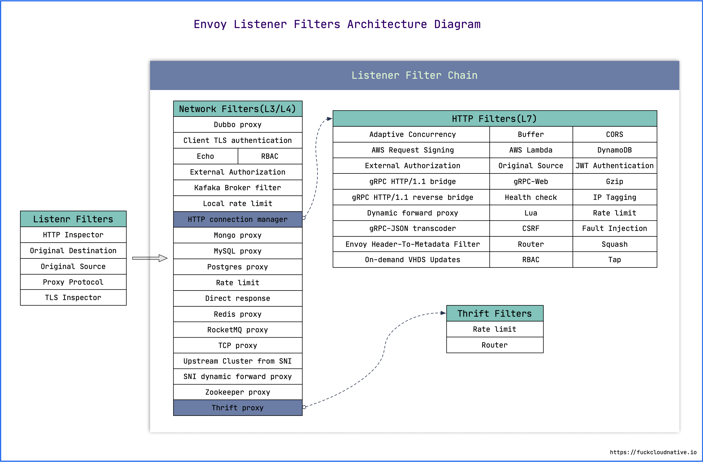
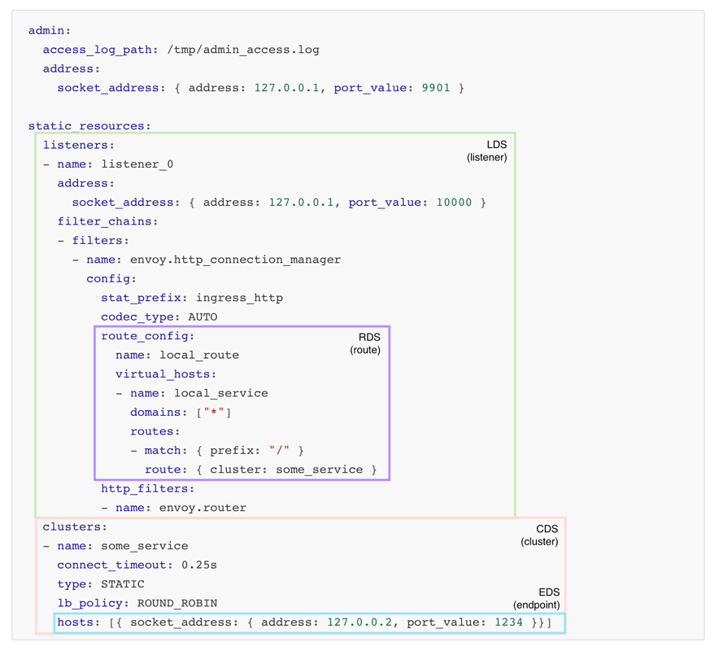

# WEEK007 CNCF 项目学习笔记（Envoy）

[Envoy](https://www.envoyproxy.io/) 是一款专为大型的 SOA 架构（面向服务架构，service oriented architectures）设计的 L7 代理和通信总线，它的诞生源于以下理念：

> 对应用程序而言，网络应该是透明的。当网络和应用程序出现故障时，应该能够很容易确定问题的根源。

要实现上面的目标是非常困难的，为了做到这一点，Envoy 提供了以下特性：

* **进程外架构**

Envoy 是一个独立的进程，伴随着每个应用程序运行。所有的 Envoy 形成一个透明的通信网络，每个应用程序发送消息到本地主机或从本地主机接收消息，不需要知道网络拓扑。进程外架构的好处是与应用程序的语言无关，Envoy 可以和任意语言的应用程序一起工作，另外，Envoy 的部署和升级也非常方便。

这种模式也被称为 **边车模式（Sidecar）**。

* **L3/L4 过滤器架构**

Envoy 是一个 L3/L4 网络代理，通过插件化的 **过滤器链（filter chain）** 机制处理各种 TCP/UDP 代理任务，支持 TCP 代理，UDP 代理，TLS 证书认证，Redis 协议，MongoDB 协议，Postgres 协议等。

* **HTTP L7 过滤器架构**

Envoy 不仅支持 L3/L4 代理，也支持 HTTP L7 代理，通过 **HTTP 连接管理子系统（HTTP connection management subsystem）** 可以实现诸如缓存、限流、路由等代理任务。

* **支持 HTTP/2**

在 HTTP 模式下，Envoy 同时支持 HTTP/1.1 和 HTTP/2。在 `service to service` 配置中，官方也推荐使用 HTTP/2 协议。

* **支持 HTTP/3（alpha）**

从 1.19.0 版本开始，Envoy 支持 HTTP/3。

* **HTTP L7 路由**

Envoy 可以根据请求的路径（path）、认证信息（authority）、Content Type、运行时参数等来配置路由和重定向。这在 Envoy 作为前端代理或边缘代理时非常有用。

* **支持 gRPC**

gRPC 是 Google 基于 HTTP/2 开发的一个 RPC 框架。Envoy 完美的支持 HTTP/2，也可以很方便的支持 gRPC。

* **服务发现和动态配置**

Envoy 可以通过一套动态配置 API 来进行中心化管理，这套 API 被称为 **[xDS](https://www.envoyproxy.io/docs/envoy/latest/intro/arch_overview/operations/dynamic_configuration)**：EDS（Endpoint Discovery Service）、CDS（Cluster Discovery Service）、RDS（Route Discovery Service）、VHDS（Virtual Host Discovery Service）、LDS（Listener Discovery Service）、SDS（Secret Discovery Service）等等。

* **健康状态检查**

Envoy 通过对上游服务集群进行健康状态检查，并根据服务发现和健康检查的结果来决定负载均衡的目标。

* **高级负载均衡**

Envoy 支持很多高级负载均衡功能，比如：自动重试、熔断、全局限流、流量跟踪（request shadowing）、异常检测（outlier detection）等。

* **支持前端代理和边缘代理**

Envoy 一般有三种部署方式：

1. Front Proxy：前端代理，也叫边缘代理，通常是部署在整个服务网格的边缘，用于接收来自于服务网格外的请求；
2. Ingress Listener：服务代理，通常部署在服务网格内服务的前面，用于接收发给该服务的请求，并转发给该服务；
3. Egress Listener：与 Ingress Listener 相反，用于代理服务发出的所有请求，并将请求转发给其他服务（可能是网格内服务，也可能是网格外服务）。


* **可观测性**

Envoy 的主要目标是使网络透明，可以生成许多流量方面的统计数据，这是其它代理软件很难取代的地方，内置 `stats` 模块，可以集成诸如 prometheus/statsd 等监控方案。还可以集成分布式追踪系统，对请求进行追踪。

## Envoy 整体架构与基本概念

下图是 Envoy 代理的整体架构图：[图片来源](https://github.com/yangchuansheng/envoy-handbook)


Envoy 接收到请求后，会经过过滤器链（filter chain），通过 L3/L4 或 L7 的过滤器对请求进行微处理，然后路由到指定集群，并通过负载均衡获取一个目标地址，最后再转发出去。这个过程中的每一个环节，可以静态配置，也可以通过 `xDS` 动态配置。

* Downstream：即客户端（Client），向 Envoy 发起请求的终端。
* Upstream：后端服务器，处理客户端请求的服务。
* Listener：监听器，它的作用就是打开一个监听端口，用于接收来自 Downstream 的请求。
* Cluster：一组逻辑上相似的上游主机组成一个集群。
* Route：用于将请求路由到不同的集群。
* xDS：各种服务发现 API 的统称，如：CDS、EDS、LDS、RDS 和 SDS 等。

## 安装和运行 Envoy

安装 Envoy 最简单的方式是使用官方的 Docker 镜像，首先获取镜像：

```
[root@localhost ~]# docker pull envoyproxy/envoy:v1.22-latest
```

使用 `docker run` 运行：

```
[root@localhost ~]# docker run -d -p 10000:10000 -p 9901:9901 envoyproxy/envoy:v1.22-latest
```

此时使用的是 Envoy 的默认配置文件，默认会监听两个端口，9901 为 Envoy 的管理端口，10000 为 Envoy 监听的代理端口，后端地址为 Envoy 官网：`www.envoyproxy.io`。

我们进入容器，查看 Envoy 配置文件如下：

```
root@localhost:/# cat /etc/envoy/envoy.yaml 
admin:
  address:
    socket_address:
      protocol: TCP
      address: 0.0.0.0
      port_value: 9901
static_resources:
  listeners:
  - name: listener_0
    address:
      socket_address:
        protocol: TCP
        address: 0.0.0.0
        port_value: 10000
    filter_chains:
    - filters:
      - name: envoy.filters.network.http_connection_manager
        typed_config:
          "@type": type.googleapis.com/envoy.extensions.filters.network.http_connection_manager.v3.HttpConnectionManager
          scheme_header_transformation:
            scheme_to_overwrite: https
          stat_prefix: ingress_http
          route_config:
            name: local_route
            virtual_hosts:
            - name: local_service
              domains: ["*"]
              routes:
              - match:
                  prefix: "/"
                route:
                  host_rewrite_literal: www.envoyproxy.io
                  cluster: service_envoyproxy_io
          http_filters:
          - name: envoy.filters.http.router
            typed_config:
              "@type": type.googleapis.com/envoy.extensions.filters.http.router.v3.Router
  clusters:
  - name: service_envoyproxy_io
    connect_timeout: 30s
    type: LOGICAL_DNS
    # Comment out the following line to test on v6 networks
    dns_lookup_family: V4_ONLY
    lb_policy: ROUND_ROBIN
    load_assignment:
      cluster_name: service_envoyproxy_io
      endpoints:
      - lb_endpoints:
        - endpoint:
            address:
              socket_address:
                address: www.envoyproxy.io
                port_value: 443
    transport_socket:
      name: envoy.transport_sockets.tls
      typed_config:
        "@type": type.googleapis.com/envoy.extensions.transport_sockets.tls.v3.UpstreamTlsContext
        sni: www.envoyproxy.io
```

我们打开浏览器，访问 http://127.0.0.1:10000 就可以看到 Envoy 的首页了。

如果要使用自己的配置文件，可以写一个 yaml 文件，并挂载到容器中覆盖 `/etc/envoy/envoy.yaml` 文件，或者通过 `-c` 参数指定配置文件：

```
[root@localhost ~]# docker run -d \
    -v $(pwd)/envoy-custom.yaml:/envoy-custom.yaml \
    -p 10000:10000 \
    -p 9901:9901 \
    envoyproxy/envoy:v1.22-latest -c /envoy-custom.yaml
```

## Envoy 静态配置

Envoy 的配置遵循 [xDS API v3](https://www.envoyproxy.io/docs/envoy/latest/api-v3/api) 规范，Evnoy 的配置文件也被称为 **Bootstrap 配置**，使用的接口为 [config.bootstrap.v3.Bootstrap](https://www.envoyproxy.io/docs/envoy/latest/api-v3/config/bootstrap/v3/bootstrap.proto#config-bootstrap-v3-bootstrap)，它的整体结构如下：

```
{
  "node": "{...}",
  "static_resources": "{...}",
  "dynamic_resources": "{...}",
  "cluster_manager": "{...}",
  "hds_config": "{...}",
  "flags_path": "...",
  "stats_sinks": [],
  "stats_config": "{...}",
  "stats_flush_interval": "{...}",
  "stats_flush_on_admin": "...",
  "watchdog": "{...}",
  "watchdogs": "{...}",
  "tracing": "{...}",
  "layered_runtime": "{...}",
  "admin": "{...}",
  "overload_manager": "{...}",
  "enable_dispatcher_stats": "...",
  "header_prefix": "...",
  "stats_server_version_override": "{...}",
  "use_tcp_for_dns_lookups": "...",
  "dns_resolution_config": "{...}",
  "typed_dns_resolver_config": "{...}",
  "bootstrap_extensions": [],
  "fatal_actions": [],
  "default_socket_interface": "...",
  "inline_headers": [],
  "perf_tracing_file_path": "..."
}
```

Envoy 自带的默认配置文件中包含了两个部分：`admin` 和 `static_resources`。

`admin` 部分是 Envoy 管理接口的配置，接口定义为 [config.bootstrap.v3.Admin](https://www.envoyproxy.io/docs/envoy/latest/api-v3/config/bootstrap/v3/bootstrap.proto#config-bootstrap-v3-admin)：

```
admin:
  address:
    socket_address:
      protocol: TCP
      address: 0.0.0.0
      port_value: 9901
```

该配置让 Envoy 暴露出 9901 的管理端口，我们可以通过 http://127.0.0.1:9901 访问 Envoy 的管理页面。


`static_resources` 部分就是 Envoy 的静态配置，接口定义为 [config.bootstrap.v3.Bootstrap.StaticResources](https://www.envoyproxy.io/docs/envoy/latest/api-v3/config/bootstrap/v3/bootstrap.proto#config-bootstrap-v3-bootstrap-staticresources)，结构如下：

```
{
  "listeners": [],
  "clusters": [],
  "secrets": []
}
```

其中，`listeners` 用于配置 Envoy 的监听地址，Envoy 会暴露一个或多个 Listener 来监听客户端的请求。而 `clusters` 用于配置服务集群，Envoy 通过服务发现定位集群成员并获取服务，具体路由到哪个集群成员由负载均衡策略决定。

`listeners` 的接口定义为 [config.listener.v3.Listener](https://www.envoyproxy.io/docs/envoy/latest/api-v3/config/listener/v3/listener.proto#envoy-v3-api-msg-config-listener-v3-listener)，其中最重要的几项有：`name`、`address` 和 `filter_chain`。

```
listeners:
- name: listener_0
  address:
    socket_address:
      protocol: TCP
      address: 0.0.0.0
      port_value: 10000
  filter_chains:
  - filters:
    - name: envoy.filters.network.http_connection_manager
      typed_config:
        "@type": type.googleapis.com/envoy.extensions.filters.network.http_connection_manager.v3.HttpConnectionManager
        scheme_header_transformation:
          scheme_to_overwrite: https
        stat_prefix: ingress_http
        route_config:
          name: local_route
          virtual_hosts:
          - name: local_service
            domains: ["*"]
            routes:
            - match:
                prefix: "/"
              route:
                host_rewrite_literal: www.envoyproxy.io
                cluster: service_envoyproxy_io
        http_filters:
        - name: envoy.filters.http.router
          typed_config:
            "@type": type.googleapis.com/envoy.extensions.filters.http.router.v3.Router
```

其中 `address` 表示 Envoy 监听的地址，`filter_chain` 为过滤器链，Envoy 通过一系列的过滤器对请求进行处理，下面是 Envoy 包含的过滤器链示意图：



这里使用的是 `http_connection_manager` 来代理 HTTP 请求，`route_config` 为路由配置，当请求路径以 `/` 开头时（`match prefix "/"`），路由到 `service_envoyproxy_io` 集群。集群使用 `clusters` 来配置，它的接口定义为 [config.cluster.v3.Cluster](https://www.envoyproxy.io/docs/envoy/latest/api-v3/config/cluster/v3/cluster.proto#envoy-v3-api-msg-config-cluster-v3-cluster)，配置的内容如下：

```
clusters:
- name: service_envoyproxy_io
  connect_timeout: 30s
  type: LOGICAL_DNS
  # Comment out the following line to test on v6 networks
  dns_lookup_family: V4_ONLY
  lb_policy: ROUND_ROBIN
  load_assignment:
    cluster_name: service_envoyproxy_io
    endpoints:
    - lb_endpoints:
      - endpoint:
          address:
            socket_address:
              address: www.envoyproxy.io
              port_value: 443
  transport_socket:
    name: envoy.transport_sockets.tls
    typed_config:
      "@type": type.googleapis.com/envoy.extensions.transport_sockets.tls.v3.UpstreamTlsContext
      sni: www.envoyproxy.io
```

Envoy 通过服务发现来定位集群成员，[服务发现的方式](https://www.envoyproxy.io/docs/envoy/latest/api-v3/config/cluster/v3/cluster.proto#enum-config-cluster-v3-cluster-discoverytype) 有以下几种：

* [STATIC](https://www.envoyproxy.io/docs/envoy/latest/intro/arch_overview/upstream/service_discovery#arch-overview-service-discovery-types-static)
* [STRICT_DNS](https://www.envoyproxy.io/docs/envoy/latest/intro/arch_overview/upstream/service_discovery#arch-overview-service-discovery-types-strict-dns)
* [LOGICAL_DNS](https://www.envoyproxy.io/docs/envoy/latest/intro/arch_overview/upstream/service_discovery#arch-overview-service-discovery-types-logical-dns)
* [EDS](https://www.envoyproxy.io/docs/envoy/latest/intro/arch_overview/upstream/service_discovery#arch-overview-service-discovery-types-eds)
* [ORIGINAL_DST](https://www.envoyproxy.io/docs/envoy/latest/intro/arch_overview/upstream/service_discovery#arch-overview-service-discovery-types-original-destination)

然后 Envoy 使用某种负载均衡策略从集群中找出一个服务来调用，Envoy 支持的 [负载均衡策略有](https://www.envoyproxy.io/docs/envoy/latest/api-v3/config/cluster/v3/cluster.proto#enum-config-cluster-v3-cluster-lbpolicy)：

* [ROUND_ROBIN](https://www.envoyproxy.io/docs/envoy/latest/intro/arch_overview/upstream/load_balancing/load_balancers#arch-overview-load-balancing-types-round-robin)
* [LEAST_REQUEST](https://www.envoyproxy.io/docs/envoy/latest/intro/arch_overview/upstream/load_balancing/load_balancers#arch-overview-load-balancing-types-least-request)
* [RING_HASH](https://www.envoyproxy.io/docs/envoy/latest/intro/arch_overview/upstream/load_balancing/load_balancers#arch-overview-load-balancing-types-ring-hash)
* [RANDOM](https://www.envoyproxy.io/docs/envoy/latest/intro/arch_overview/upstream/load_balancing/load_balancers#arch-overview-load-balancing-types-random)
* [MAGLEV](https://www.envoyproxy.io/docs/envoy/latest/intro/arch_overview/upstream/load_balancing/load_balancers#arch-overview-load-balancing-types-maglev)
* CLUSTER_PROVIDED
* LOAD_BALANCING_POLICY_CONFIG

而在我们的例子中，集群的服务发现方式为 `LOGICAL_DNS`，并使用 `ROUND_ROBIN` 方式来负载均衡。

## Envoy 动态配置

在上面的例子中，我们配置的地址都是固定的，但在实际应用中，我们更希望以一种动态的方式来配置，比如 K8S 环境下服务的地址随 Pod 地址变化而变化，我们不可能每次都去手工修改 Envoy 的配置文件。Envoy 使用了一套被称为 **[xDS](https://www.envoyproxy.io/docs/envoy/latest/intro/arch_overview/operations/dynamic_configuration)** 的 API 来动态发现资源。`xDS` 包括 LDS(Listener Discovery Service)、CDS(Cluster Discovery Service)、RDS(Route Discovery Service)、EDS(Endpoint Discovery Service)，以及 ADS(Aggregated Discovery Service)，每个 xDS 都对应着配置文件中的一小块内容，如下所示（[图片来源](https://www.bbsmax.com/A/Ae5RK6VLdQ/)）：



Envoy 通过订阅的方式来获取资源，如监控指定路径下的文件、启动 gRPC 流或轮询 REST-JSON URL。后两种方式会发送 [DiscoveryRequest](https://www.envoyproxy.io/docs/envoy/latest/api-v3/service/discovery/v3/discovery.proto.html#service-discovery-v3-discoveryrequest) 请求消息，发现的对应资源则包含在响应消息 [DiscoveryResponse](https://www.envoyproxy.io/docs/envoy/latest/api-v3/service/discovery/v3/discovery.proto.html#service-discovery-v3-discoveryresponse) 中。

### 基于文件的动态配置

基于文件的动态配置比较简单，Envoy 通过监听文件的变动来动态更新配置，我们创建一个文件 `envoy.yaml`，内容如下：

```
node:
  id: id_1
  cluster: test

admin:
  address:
    socket_address:
      protocol: TCP
      address: 0.0.0.0
      port_value: 9901

dynamic_resources:
  cds_config:
    path_config_source:
      path: /var/lib/envoy/cds.yaml
  lds_config:
    path_config_source:
      path: /var/lib/envoy/lds.yaml
```

这里我们可以看出，和静态配置的 `static_resources` 不一样，没有 `clusters` 和 `listeners` 的配置了，而是在 `dynamic_resources` 中定义了 `cds_config` 和 `lds_config`，并指定了 `clusters` 和 `listeners` 的配置文件的路径。

> 注意：在动态配置中，`node` 参数是必须的，用于区分 Envoy 是属于哪个集群。

我们再分别创建 `cds.yaml` 文件和 `lds.yaml` 文件。`cds.yaml` 的内容如下：

```
resources:
- "@type": type.googleapis.com/envoy.config.cluster.v3.Cluster
  name: service_envoyproxy_io
  connect_timeout: 30s
  type: LOGICAL_DNS
  # Comment out the following line to test on v6 networks
  dns_lookup_family: V4_ONLY
  lb_policy: ROUND_ROBIN
  load_assignment:
    cluster_name: service_envoyproxy_io
    endpoints:
    - lb_endpoints:
      - endpoint:
          address:
            socket_address:
              address: www.envoyproxy.io
              port_value: 443
  transport_socket:
    name: envoy.transport_sockets.tls
    typed_config:
      "@type": type.googleapis.com/envoy.extensions.transport_sockets.tls.v3.UpstreamTlsContext
      sni: www.envoyproxy.io
```

和静态配置的 `clusters` 是一样的，只不过换成了 `resources` 配置，并指定了 `type` 为 `envoy.config.cluster.v3.Cluster`。`lds.yaml` 的内容如下：

```
resources:
- "@type": type.googleapis.com/envoy.config.listener.v3.Listener
  name: listener_0
  address:
    socket_address:
      protocol: TCP
      address: 0.0.0.0
      port_value: 10000
  filter_chains:
  - filters:
    - name: envoy.filters.network.http_connection_manager
      typed_config:
        "@type": type.googleapis.com/envoy.extensions.filters.network.http_connection_manager.v3.HttpConnectionManager
        scheme_header_transformation:
          scheme_to_overwrite: https
        stat_prefix: ingress_http
        route_config:
          name: local_route
          virtual_hosts:
          - name: local_service
            domains: ["*"]
            routes:
            - match:
                prefix: "/"
              route:
                host_rewrite_literal: www.envoyproxy.io
                cluster: service_envoyproxy_io
        http_filters:
        - name: envoy.filters.http.router
          typed_config:
            "@type": type.googleapis.com/envoy.extensions.filters.http.router.v3.Router
```

这个配置和静态配置的 `listeners` 是一样的，只不过换成了 `resources` 配置，并指定了 `type` 为 `envoy.config.listener.v3.Listener`。

然后，运行下面的命令：

```
[root@localhost ~]# docker run -d \
    -v $(pwd):/var/lib/envoy \
    -p 10000:10000 \
    -p 9901:9901 \
    envoyproxy/envoy:v1.22-latest -c /var/lib/envoy/envoy.yaml
```

我们打开浏览器，访问 http://127.0.0.1:10000 就可以看到 Envoy 的首页了。

然后我们使用 `sed` 将文件中的 `www.envoy.io` 替换为 `www.baidu.com`：

```
[root@localhost ~]# sed -i s/www.envoyproxy.io/www.baidu.com/ lds.yaml cds.yaml
```

刷新浏览器，可以看到页面变成了 Baidu 的首页了，我们没有重启 Envoy，就实现了配置的动态更新。

> 这里有一点需要特别注意，我们不能直接使用 `vi` 去编辑 `lds.yaml` 和  `cds.yaml` 文件，我们必须将文件复制一份出来，编辑，然后再替换原文件，才可以让配置生效。而 `sed -i` 命令的 `inplace edit` 功能就是这样实现的。

### 基于控制平面（Control Plane）的动态配置

https://cloud.tencent.com/developer/article/1554609


## 参考

1. [Envoy 官方文档](https://www.envoyproxy.io/docs/envoy/latest/)
1. [Envoy 官方文档中文版（ServiceMesher）](https://www.servicemesher.com/envoy/)
1. [Istio 服务网格进阶实战（ServiceMesher）](https://www.servicemesher.com/istio-handbook/concepts/envoy.html)
1. [Envoy 官方文档中文版（CloudNative）](https://cloudnative.to/envoy/index.html)
1. [Envoy 基础教程（Jimmy Song）](https://jimmysong.io/envoy-handbook/)
1. [Kubernetes 中文指南（Jimmy Song）](https://jimmysong.io/kubernetes-handbook/usecases/envoy.html)
1. [Envoy Handbook（米开朗基杨）](https://github.com/yangchuansheng/envoy-handbook)
1. [What is Envoy](https://www.envoyproxy.io/docs/envoy/latest/intro/what_is_envoy)
1. [Envoy基础介绍](https://www.linux-note.cn/?p=1543)
1. [史上最全的高性能代理服务器 Envoy 中文实战教程 ！](https://cloud.tencent.com/developer/article/1554609)
1. [Envoy 中的 xDS REST 和 gRPC 协议详解](https://www.servicemesher.com/blog/envoy-xds-protocol/)
1. [Dynamic configuration (filesystem)](https://www.envoyproxy.io/docs/envoy/latest/start/sandboxes/dynamic-configuration-filesystem)
1. [Dynamic configuration (control plane)](https://www.envoyproxy.io/docs/envoy/latest/start/sandboxes/dynamic-configuration-control-plane)

## 更多

### 1. Envoy 的管理页面

默认情况下，Envoy 会暴露出 9901 的管理端口，我们访问 http://127.0.0.1:9901 可以看到 Envoy 的管理页面：


这里可以看到有很多很有用的功能，比如：查看 Envoy 统计信息，查看 Prometheus 监控指标，开启或关闭 CPU Profiler，开启或关闭 Heap Profiler 等等。

关于管理接口可以参考官方文档 [Administration interface](https://www.envoyproxy.io/docs/envoy/latest/operations/admin)。

### 2. 体验 Sandboxes

Envoy 通过 Docker Compose 创建了很多沙盒环境用于测试 Envoy 的特性，感兴趣的同学可以挨个体验一下：

* [Brotli](https://www.envoyproxy.io/docs/envoy/latest/start/sandboxes/brotli)
* [Cache filter](https://www.envoyproxy.io/docs/envoy/latest/start/sandboxes/cache)
* [CORS filter](https://www.envoyproxy.io/docs/envoy/latest/start/sandboxes/cors)
* [CSRF filter](https://www.envoyproxy.io/docs/envoy/latest/start/sandboxes/csrf)
* [Double proxy (with mTLS encryption)](https://www.envoyproxy.io/docs/envoy/latest/start/sandboxes/double-proxy)
* [Dynamic configuration (filesystem)](https://www.envoyproxy.io/docs/envoy/latest/start/sandboxes/dynamic-configuration-filesystem)
* [Dynamic configuration (control plane)](https://www.envoyproxy.io/docs/envoy/latest/start/sandboxes/dynamic-configuration-control-plane)
* [External authorization (ext_authz) filter](https://www.envoyproxy.io/docs/envoy/latest/start/sandboxes/ext_authz)
* [Fault injection filter](https://www.envoyproxy.io/docs/envoy/latest/start/sandboxes/fault_injection)
* [Front proxy](https://www.envoyproxy.io/docs/envoy/latest/start/sandboxes/front_proxy)
* [gRPC bridge](https://www.envoyproxy.io/docs/envoy/latest/start/sandboxes/grpc_bridge)
* [Gzip](https://www.envoyproxy.io/docs/envoy/latest/start/sandboxes/gzip)
* [Jaeger native tracing](https://www.envoyproxy.io/docs/envoy/latest/start/sandboxes/jaeger_native_tracing)
* [Jaeger tracing](https://www.envoyproxy.io/docs/envoy/latest/start/sandboxes/jaeger_tracing)
* [Load reporting service (LRS)](https://www.envoyproxy.io/docs/envoy/latest/start/sandboxes/load_reporting_service)
* [Locality Weighted Load Balancing](https://www.envoyproxy.io/docs/envoy/latest/start/sandboxes/locality_load_balancing)
* [Local Ratelimit](https://www.envoyproxy.io/docs/envoy/latest/start/sandboxes/local_ratelimit)
* [Lua filter](https://www.envoyproxy.io/docs/envoy/latest/start/sandboxes/lua)
* [MySQL filter](https://www.envoyproxy.io/docs/envoy/latest/start/sandboxes/mysql)
* [PostgreSQL filter](https://www.envoyproxy.io/docs/envoy/latest/start/sandboxes/postgres)
* [Redis filter](https://www.envoyproxy.io/docs/envoy/latest/start/sandboxes/redis)
* [SkyWalking tracing](https://www.envoyproxy.io/docs/envoy/latest/start/sandboxes/skywalking_tracing)
* [TLS Inspector Listener Filter](https://www.envoyproxy.io/docs/envoy/latest/start/sandboxes/tls-inspector)
* [TLS Server name indication (SNI)](https://www.envoyproxy.io/docs/envoy/latest/start/sandboxes/tls-sni)
* [Transport layer security (TLS)](https://www.envoyproxy.io/docs/envoy/latest/start/sandboxes/tls)
* [User Datagram Protocol (UDP)](https://www.envoyproxy.io/docs/envoy/latest/start/sandboxes/udp)
* [Wasm C++ filter](https://www.envoyproxy.io/docs/envoy/latest/start/sandboxes/wasm-cc)
* [WebSockets](https://www.envoyproxy.io/docs/envoy/latest/start/sandboxes/websocket)
* [Windows based Front proxy](https://www.envoyproxy.io/docs/envoy/latest/start/sandboxes/win32_front_proxy)
* [Zipkin tracing](https://www.envoyproxy.io/docs/envoy/latest/start/sandboxes/zipkin_tracing)
* [Zstd](https://www.envoyproxy.io/docs/envoy/latest/start/sandboxes/zstd)

### 3. 如何从 Nginx 迁移到 Envoy？

https://github.com/yangchuansheng/envoy-handbook/blob/master/content/zh/docs/practice/migrating-from-nginx-to-envoy.md
