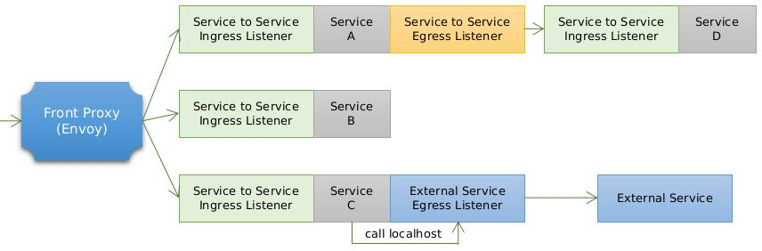
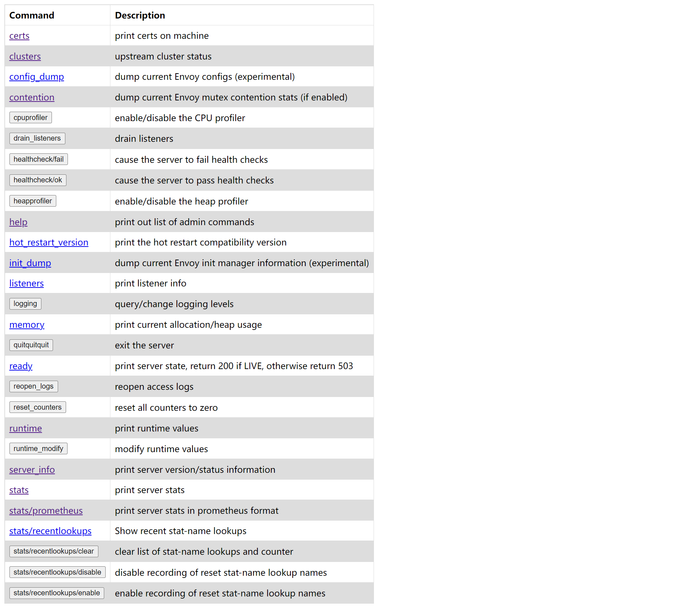

# WEEK007 CNCF 项目学习笔记（Envoy）

[Envoy](https://www.envoyproxy.io/) 是一款专为大型的 SOA 架构（面向服务架构，service oriented architectures）设计的 L7 代理和通信总线，它的诞生源于以下理念：

> 对应用程序而言，网络应该是透明的。当网络和应用程序出现故障时，应该能够很容易确定问题的根源。

要实现上面的目标是非常困难的，为了做到这一点，Envoy 提供了以下特性：

* **进程外架构**

Envoy 是一个独立的进程，伴随着每个应用程序运行。所有的 Envoy 形成一个透明的通信网络，每个应用程序发送消息到本地主机或从本地主机接收消息，不需要知道网络拓扑。进程外架构的好处是与应用程序的语言无关，Envoy 可以和任意语言的应用程序一起工作，另外，Envoy 的部署和升级也非常方便。

这种模式也被称为 **边车模式（Sidecar）**。

* **L3/L4 过滤器架构**

Envoy 是一个 L3/L4 网络代理，通过插件化的 **过滤器链（filter chain）** 机制处理各种 TCP/UDP 代理任务，支持 TCP 代理，UDP 代理，TLS 证书认证，Redis 协议，MongoDB 协议，Postgres 协议等。

* **HTTP L7 过滤器架构**

Envoy 不仅支持 L3/L4 代理，也支持 HTTP L7 代理，通过 **HTTP 连接管理子系统（HTTP connection management subsystem）** 可以实现诸如缓存、限流、路由等代理任务。

* **支持 HTTP/2**

在 HTTP 模式下，Envoy 同时支持 HTTP/1.1 和 HTTP/2。在 `service to service` 配置中，官方也推荐使用 HTTP/2 协议。

* **支持 HTTP/3（alpha）**

从 1.19.0 版本开始，Envoy 支持 HTTP/3。

* **HTTP L7 路由**

Envoy 可以根据请求的路径（path）、认证信息（authority）、Content Type、运行时参数等来配置路由和重定向。这在 Envoy 作为前端代理或边缘代理时非常有用。

* **支持 gRPC**

gRPC 是 Google 基于 HTTP/2 开发的一个 RPC 框架。Envoy 完美的支持 HTTP/2，也可以很方便的支持 gRPC。

* **服务发现和动态配置**

Envoy 可以通过一套动态配置 API 来进行中心化管理，这套 API 被称为 **[xDS](https://www.envoyproxy.io/docs/envoy/latest/intro/arch_overview/operations/dynamic_configuration)**：EDS（Endpoint Discovery Service）、CDS（Cluster Discovery Service）、RDS（Route Discovery Service）、VHDS（Virtual Host Discovery Service）、LDS（Listener Discovery Service）、SDS（Secret Discovery Service）等等。

* **健康状态检查**

Envoy 通过对上游服务集群进行健康状态检查，并根据服务发现和健康检查的结果来决定负载均衡的目标。

* **高级负载均衡**

Envoy 支持很多高级负载均衡功能，比如：自动重试、熔断、全局限流、流量跟踪（request shadowing）、异常检测（outlier detection）等。

* **支持前端代理和边缘代理**

Envoy 一般有三种部署方式：

1. Front Proxy：前端代理，也叫边缘代理，通常是部署在整个服务网格的边缘，用于接收来自于服务网格外的请求；
2. Ingress Listener：服务代理，通常部署在服务网格内服务的前面，用于接收发给该服务的请求，并转发给该服务；
3. Egress Listener：与 Ingress Listener 相反，用于代理服务发出的所有请求，并将请求转发给其他服务（可能是网格内服务，也可能是网格外服务）。



* **可观测性**

Envoy 的主要目标是使网络透明，可以生成许多流量方面的统计数据，这是其它代理软件很难取代的地方，内置 `stats` 模块，可以集成诸如 prometheus/statsd 等监控方案。还可以集成分布式追踪系统，对请求进行追踪。

## Envoy 整体架构与基本概念

下图是 Envoy 代理的整体架构图：[图片来源](https://github.com/yangchuansheng/envoy-handbook)


Envoy 接收到请求后，会经过过滤器链（filter chain），通过 L3/L4 或 L7 的过滤器对请求进行微处理，然后路由到指定集群，并通过负载均衡获取一个目标地址，最后再转发出去。这个过程中的每一个环节，可以静态配置，也可以通过 `xDS` 动态配置。

* Downstream：即客户端（Client），向 Envoy 发起请求的终端。
* Upstream：后端服务器，处理客户端请求的服务。
* Listener：监听器，它的作用就是打开一个监听端口，用于接收来自 Downstream 的请求。
* Cluster：一组逻辑上相似的上游主机组成一个集群。
* Route：用于将请求路由到不同的集群。
* xDS：各种服务发现 API 的统称，如：CDS、EDS、LDS、RDS 和 SDS 等。

## 安装 Envoy

安装 Envoy 最简单的方式是使用官方的 Docker 镜像，首先获取镜像：

```
[root@localhost ~]# docker pull envoyproxy/envoy:v1.23-latest
```

使用 `docker run` 运行：

```
[root@localhost ~]# docker run -d -p 10000:10000 -p 9901:9901 envoyproxy/envoy:v1.22-latest
```

此时使用的是 Envoy 的默认配置文件，默认会监听两个端口，9901 为 Envoy 的管理端口，10000 为 Envoy 监听的代理端口，后端地址为 Envoy 官网：`www.envoyproxy.io`。

我们进入容器，查看 Envoy 配置文件如下：

```
root@localhost:/# cat /etc/envoy/envoy.yaml 
admin:
  address:
    socket_address:
      protocol: TCP
      address: 0.0.0.0
      port_value: 9901
static_resources:
  listeners:
  - name: listener_0
    address:
      socket_address:
        protocol: TCP
        address: 0.0.0.0
        port_value: 10000
    filter_chains:
    - filters:
      - name: envoy.filters.network.http_connection_manager
        typed_config:
          "@type": type.googleapis.com/envoy.extensions.filters.network.http_connection_manager.v3.HttpConnectionManager
          scheme_header_transformation:
            scheme_to_overwrite: https
          stat_prefix: ingress_http
          route_config:
            name: local_route
            virtual_hosts:
            - name: local_service
              domains: ["*"]
              routes:
              - match:
                  prefix: "/"
                route:
                  host_rewrite_literal: www.envoyproxy.io
                  cluster: service_envoyproxy_io
          http_filters:
          - name: envoy.filters.http.router
            typed_config:
              "@type": type.googleapis.com/envoy.extensions.filters.http.router.v3.Router
  clusters:
  - name: service_envoyproxy_io
    connect_timeout: 30s
    type: LOGICAL_DNS
    # Comment out the following line to test on v6 networks
    dns_lookup_family: V4_ONLY
    lb_policy: ROUND_ROBIN
    load_assignment:
      cluster_name: service_envoyproxy_io
      endpoints:
      - lb_endpoints:
        - endpoint:
            address:
              socket_address:
                address: www.envoyproxy.io
                port_value: 443
    transport_socket:
      name: envoy.transport_sockets.tls
      typed_config:
        "@type": type.googleapis.com/envoy.extensions.transport_sockets.tls.v3.UpstreamTlsContext
        sni: www.envoyproxy.io
```

我们打开浏览器，访问 http://127.0.0.1:10000 就可以看到 Envoy 的首页了。

## Envoy 静态配置

## Envoy 动态配置

https://cloud.tencent.com/developer/article/1554609
https://www.jianshu.com/p/d9db52330c0f
https://www.bbsmax.com/A/Ae5RK6VLdQ/
https://www.envoyproxy.io/docs/envoy/latest/start/install
https://github.com/yangchuansheng/envoy-handbook/blob/master/content/zh/docs/gettingstarted/setup.md


## 参考

1. [Envoy 官方文档](https://www.envoyproxy.io/docs/envoy/latest/)
1. [Envoy 官方文档中文版（ServiceMesher）](https://www.servicemesher.com/envoy/)
1. [Istio 服务网格进阶实战（ServiceMesher）](https://www.servicemesher.com/istio-handbook/concepts/envoy.html)
1. [Envoy 官方文档中文版（CloudNative）](https://cloudnative.to/envoy/index.html)
1. [Envoy 基础教程（Jimmy Song）](https://jimmysong.io/envoy-handbook/)
1. [Kubernetes 中文指南（Jimmy Song）](https://jimmysong.io/kubernetes-handbook/usecases/envoy.html)
1. [Envoy Handbook（米开朗基杨）](https://github.com/yangchuansheng/envoy-handbook)
1. [What is Envoy](https://www.envoyproxy.io/docs/envoy/latest/intro/what_is_envoy)
1. [Envoy基础介绍](https://www.linux-note.cn/?p=1543)
1. [史上最全的高性能代理服务器 Envoy 中文实战教程 ！](https://cloud.tencent.com/developer/article/1554609)

## 更多

### 1. Envoy 的管理页面

默认情况下，Envoy 会暴露出 9901 的管理端口，我们访问 http://127.0.0.1:9901 可以看到 Envoy 的管理页面：



这里有很多很有用的功能，比如：查看 Envoy 统计信息，查看 Prometheus 监控指标，开启或关闭 CPU Profiler，开启或关闭 Heap Profiler 等等。
