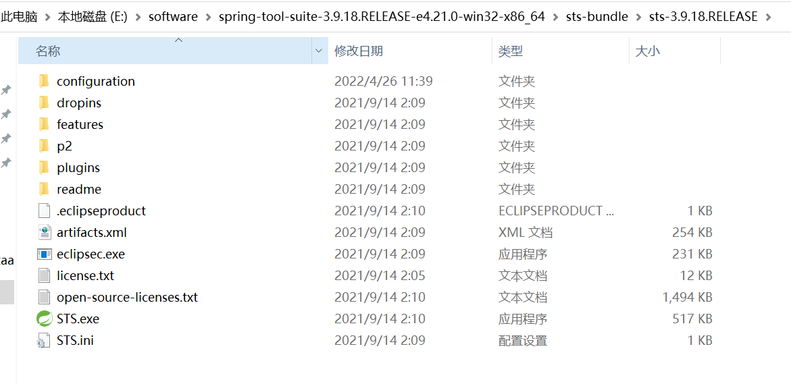
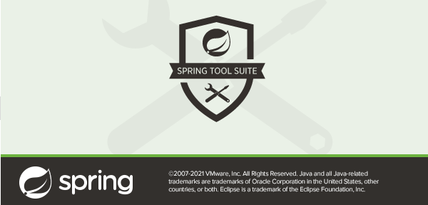
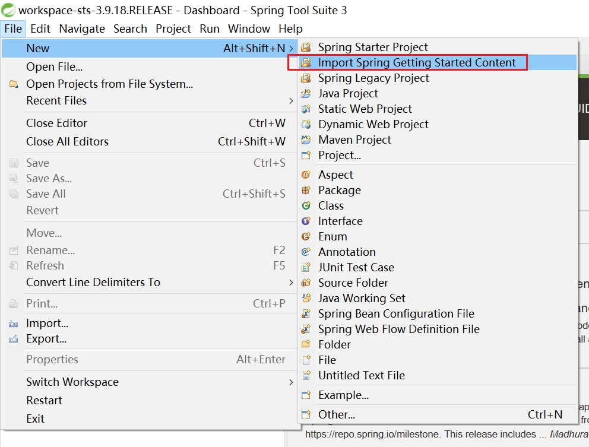
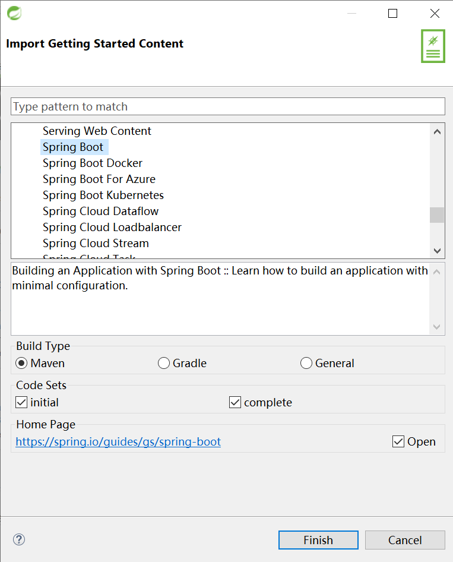
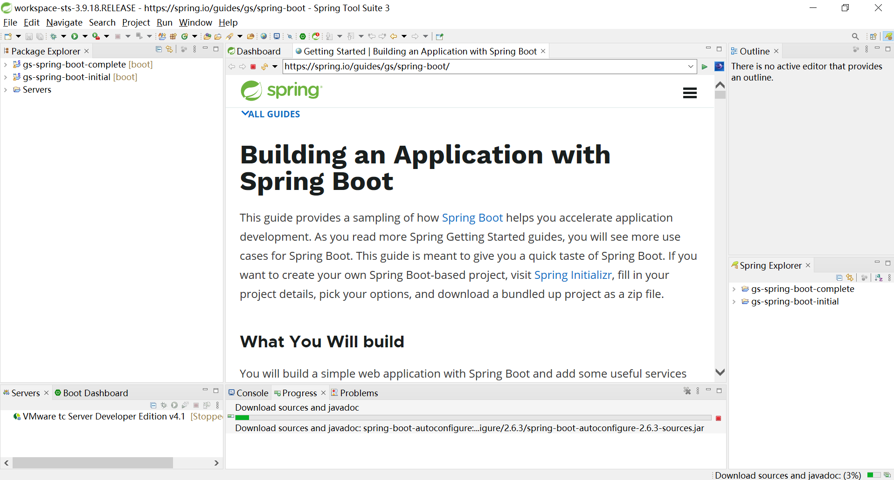

# 使用 STS 体验入门指南

> 这篇教程是基于 Spring Tool Suite 3 写的，STS 3 目前已经不维护了，官方推荐升级到 Spring Tools 4。

这篇教程介绍了如何使用 [Spring Tool Suite (STS)](https://spring.io/tools) 来体验 Spring 的入门指南。由于 STS 3 不再维护，只能从 [归档页面下载](https://github.com/spring-projects/toolsuite-distribution/wiki/Spring-Tool-Suite-3)，最新的版本是 `Spring Tool Suite 3.9.18`，基于 `Eclipse 4.21` 实现的。

## 安装 STS

我们将文件 [spring-tool-suite-3.9.18.RELEASE-e4.21.0-win32-x86_64.zip](https://download.springsource.com/release/STS/3.9.18.RELEASE/dist/e4.21/spring-tool-suite-3.9.18.RELEASE-e4.21.0-win32-x86_64.zip) 下载到本地，解压后，可以看到这些文件：

STS 不用安装，双击 `STS.exe` 就可以直接运行，但要注意的是，你的计算机上必须安装有 Java 11 以上的版本。

## 导入入门指南

STS 启动之后，从 `File` 菜单中依次选择 `New` -> `Import Spring Getting Started Content`：

在弹出的窗口中选择你要体验的入门指南：

我们这里选 Spring Boot，构建类型（Build Type）选 Maven，代码集（Code Sets）选 `initial` 和 `complete`。`initial` 代码集一般来说就是一个空项目，包含了必要的依赖，而 `complete` 代码集是教程的完整代码，可以把两个代码集都下载下来，然后进行对比查看差异。最下面会显示出教程的网址，单选 Open 选项，STS 在导入项目后会自动打开教程。

从上图可以看出 STS 成功导入了两个项目：`gs-spring-boot-initial` 和 `gs-spring-boot-complete`，并且会自动进行构建，右侧显示着教程页面，我们可以一边查看教程，一边浏览代码。

点击 `Run` 或 `Debug` 按钮，可以直接启动项目。
