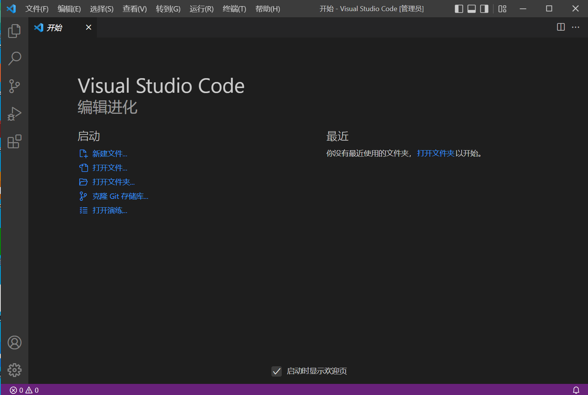
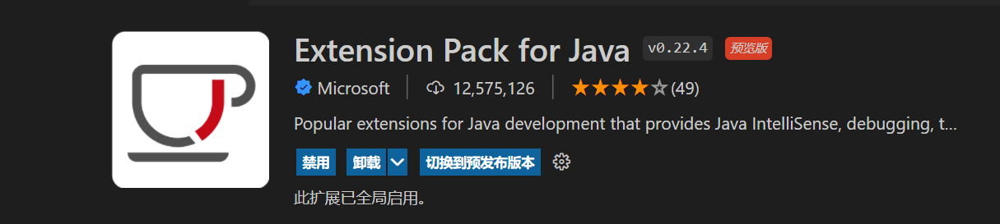
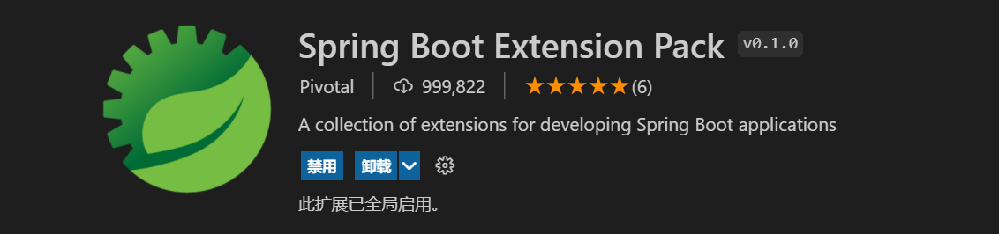
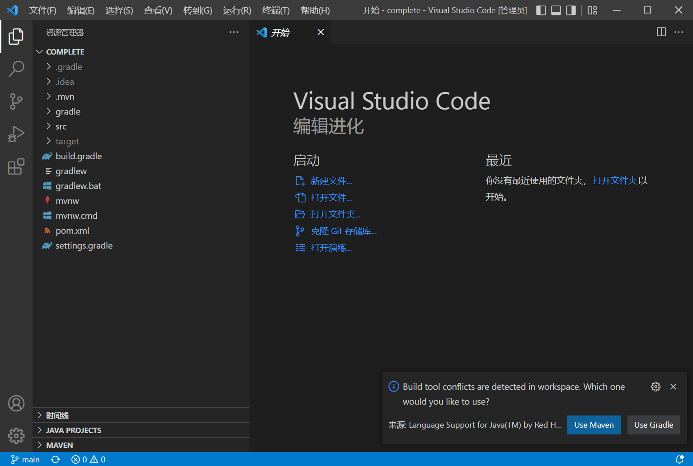
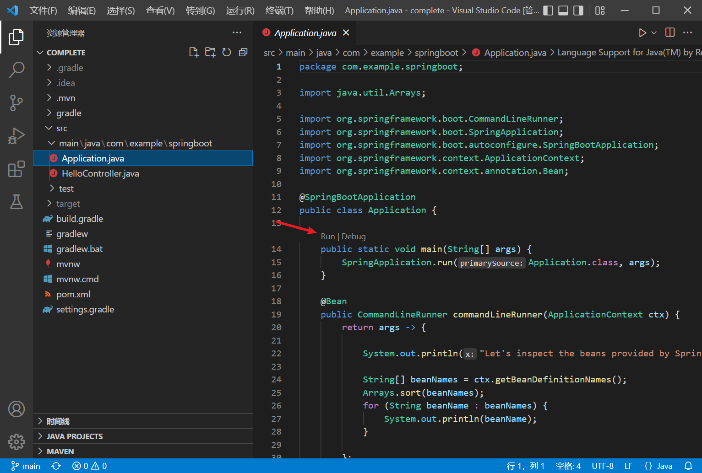

# 使用 VS Code 体验入门指南

这篇教程介绍了如何使用 [Visual Studio Code](https://code.visualstudio.com/) 来体验 Spring 的入门指南。

## 安装 VS Code

我们直接从官方 [下载页面](https://code.visualstudio.com/download) 选择合适的版本下载到本地安装即可。安装完成后双击启动：



由于 VS Code 的定位是一款通用的源码编辑器，它通过插件系统来支持不同的编程语言，要让它变成一款 Java IDE，还需要提前安装两款插件：

* [Extension Pack for Java](https://marketplace.visualstudio.com/items?itemName=vscjava.vscode-java-pack)



* [Spring Boot Extension Pack](https://marketplace.visualstudio.com/items?itemName=Pivotal.vscode-boot-dev-pack)



`Extension Pack for Java` 是微软官方推出的用于 Java 开发的扩展包。`Spring Boot Extension Pack` 是 Spring 官方推出的用于 Spring Boot 项目开发的扩展包。

## 导入入门指南

和 STS 不一样，VS Code 没有 `Import Spring Getting Started Content` 菜单（参见 [STS 的教程](../sts/README.md)），不能直接导入 Spring 的入门指南，所以只能根据需要提前下载相应指南的源码，譬如我们想体验下 [Spring Boot 指南](https://spring.io/guides/gs/spring-boot/)，我们通过下面的 `git clone` 命令下载源码：

```
$ git clone https://github.com/spring-guides/gs-spring-boot.git
```

然后启动 VS Code，然后选择 `文件` 菜单里的 `打开文件夹`，在弹出的窗口中找到刚刚下载的源码，然后选择 `complete` 目录。



一般情况下，Spring 提供的的指南源码都包含了两种构建类型文件：`pom.xml` 用于 Maven 构建，`build.gradle` 用于 Gradle 构建。VS Code 会自动检测项目的构建类型，我们这里选择 `Use Maven`，项目加载完成后，打开项目的入口类 `Application.java`，点击 `main` 方法上面的 Run 或 Debug 按钮，即可启动或调试项目。


