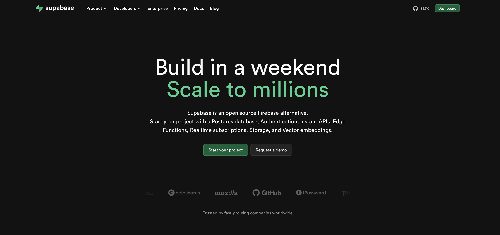
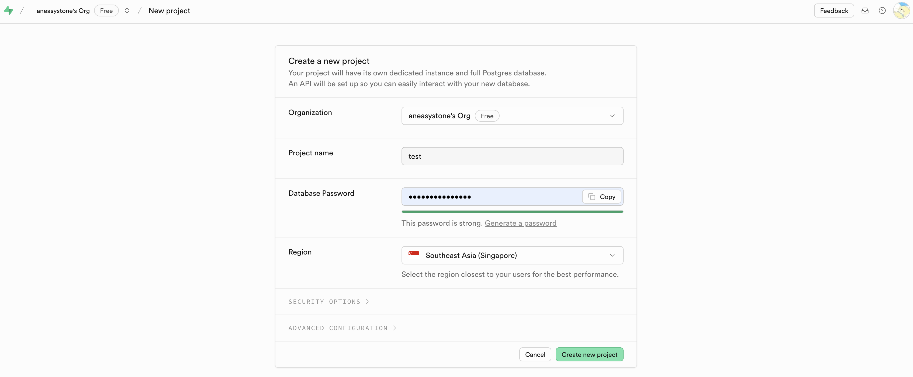
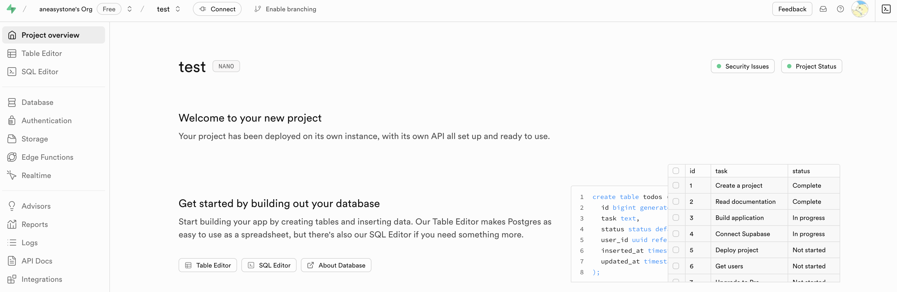
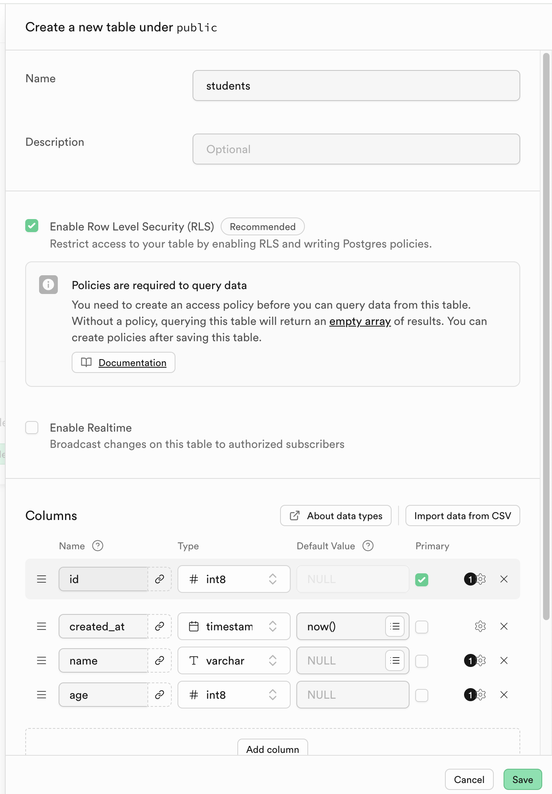
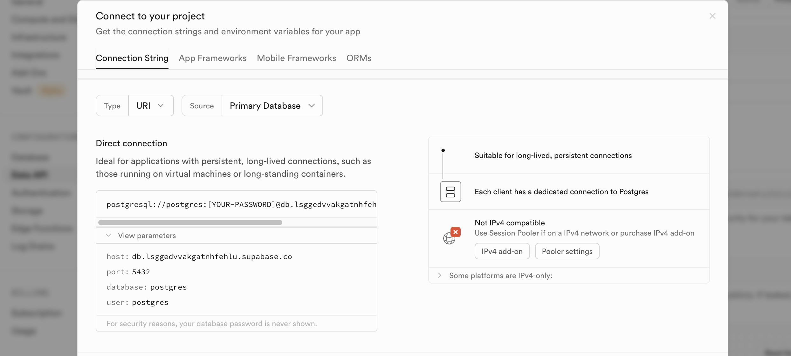

# Supabase 快速入门

今天给大家介绍一个开源的 **后端即服务（BaaS）** 平台 [Supabase](https://supabase.com/)，它被认为是 Firebase 的替代品，旨在帮助开发者更快地构建产品，让开发者可以专注于前端开发，而无需花费大量时间和精力来构建和维护后端基础设施。



Supabase 的核心功能如下：

- **数据库**：使用 PostgreSQL 作为数据库，支持 SQL 和 RESTful API 访问。它会自动为每个表生成 RESTful API，方便开发者通过简单的 HTTP 请求与数据库进行通信，实现增、删、改、查等操作。

- **认证系统**：提供完整的认证体系，支持邮箱、手机号、第三方服务（如谷歌、苹果、Twitter、Facebook、Github、Azure、Gitlab 和 Bitbucket 等）等多种登录方式，还支持像 SAML 这样的企业登录，并且可以轻松管理用户注册和登录流程。

- **实时订阅**：允许通过 WebSocket 实现实时数据同步，开发者可以订阅数据库的变更，如插入、更新和删除操作，从而创建实时应用，如聊天应用或协作工具等，用户能在操作发生时立即看到更新。

- **存储服务**：提供对象存储服务，可方便地上传、下载和管理文件，适用于图片、视频等各种文件类型，并具有较高的可扩展性。

- **边缘函数**：支持在边缘节点上运行 JavaScript 函数，可用于处理请求或触发事件。

本文学习和实践 Supabase 的数据库功能，并结合不同用例给出代码实例。

## 创建 Supabase 项目

首先，我们需要访问 Supabase 官网，并创建一个账户，然后进入 Dashboard 页面，创建新项目：



项目创建后，进入项目概览页：



此时，我们就可以创建表以及准备数据了。可以看到 Supabase 提供了 Table Editor 和 SQL Editor 两个工具，Table Editor 通过像电子表格一样的可视化页面管理数据，SQL Editor 则是通过 SQL 语句管理数据。

## 创建表和数据

我们通过 Table Editor 创建一个 `students` 表：



再通过 SQL Editor 插入一些数据：

```sql
INSERT INTO students (name, age)
VALUES
  ('John Doe', 15),
  ('Jane Doe', 16),
  ('Bob Smith', 14),
  ('Alice Johnson', 17);
```

## 访问并操作数据库

操作 Supabase 和操作普通 PostgreSQL 数据库一样，我们点击项目顶部的 `Connect` 按钮，可以看到数据库的连接信息：



然后创建一个 `.env` 文件，将连接信息写进去：

```
host=db.lsggedvvakgatnhfehlu.supabase.co
port=5432
database=postgres
user=postgres
password=[YOUR-PASSWORD]
```

这些信息可以通过 `dotenv` 加载：

```python
from dotenv import load_dotenv
import os

# Load environment variables from .env
load_dotenv()

# Fetch variables
USER = os.getenv("user")
PASSWORD = os.getenv("password")
HOST = os.getenv("host")
PORT = os.getenv("port")
DBNAME = os.getenv("dbname")
```

然后就可以通过 `psycopg2` 访问和操作数据库了：

```
import psycopg2

# Connect to the database
try:
    connection = psycopg2.connect(
        user=USER,
        password=PASSWORD,
        host=HOST,
        port=PORT,
        dbname=DBNAME
    )
    print("Connection successful!")
    
    # Create a cursor to execute SQL queries
    cursor = connection.cursor()
    
    # Example query
    cursor.execute("SELECT * FROM students;")
    result = cursor.fetchone()
    print("Query result:", result)

    # Close the cursor and connection
    cursor.close()
    connection.close()
    print("Connection closed.")

except Exception as e:
    print(f"Failed to connect: {e}")
```
