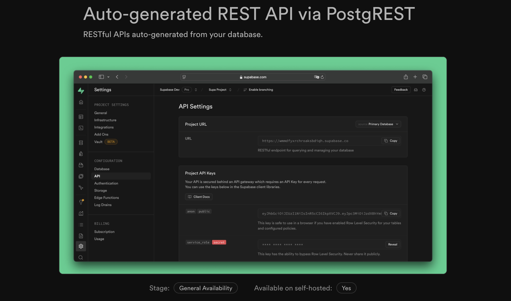
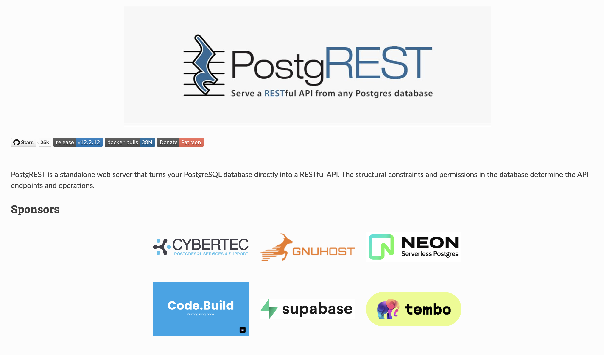
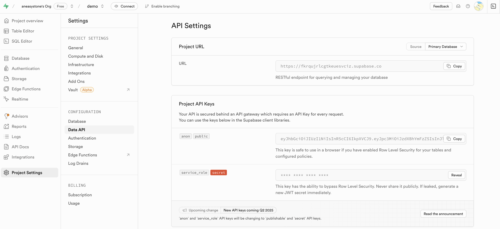
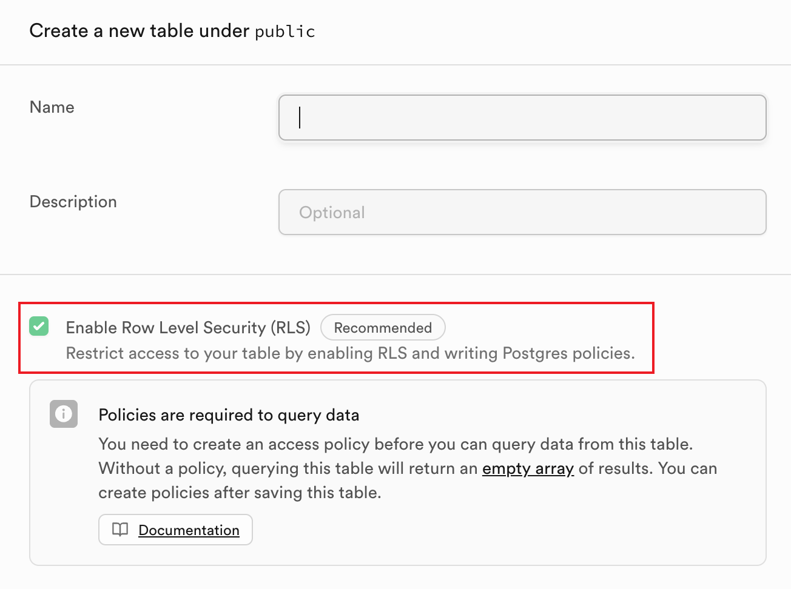
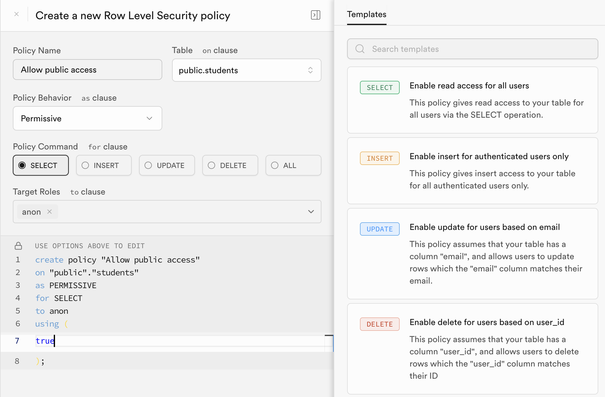
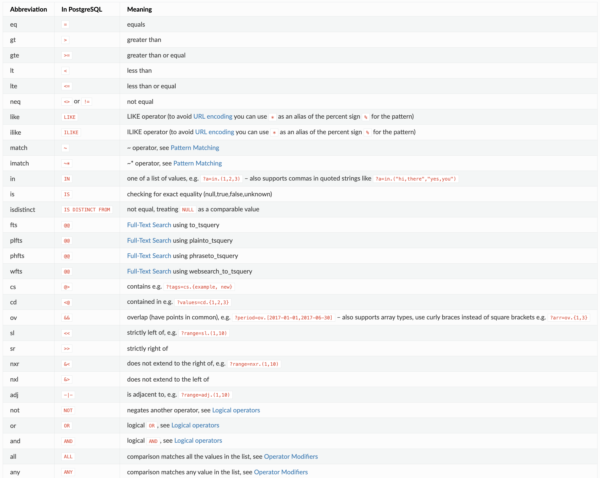

# 使用 Supabase REST API 实现数据库的增删改查

在上一篇文章中，我们学习了如何在 Supabase 中创建项目和数据库，并知道了 Supabase 本质上就是 PostgreSQL 数据库，所以可以通过 psycopg2 库来连接和操作它。另外，Supabase 还提供了 RESTful API，方便我们通过 HTTP 请求来操作数据库。



我们今天继续学习 Supabase，使用 RESTful API 来实现数据库的增删改查。

## PostgREST

[PostgREST](https://postgrest.org/) 是一个开源的 Web 服务器，用于将 PostgreSQL 数据库直接转换为 RESTful API，方便开发者通过简单的 HTTP 请求与数据库进行通信，实现增、删、改、查等操作。



Supabase 的 [REST API](https://supabase.com/docs/guides/api) 就是基于 PostgREST 开发的，我们可以通过 RESTful API 来操作 Supabase 数据库。

## RESTful API

Supabase REST API 的 URL 格式如下：

```
https://<project-ref>.supabase.co/rest/v1/<table-name>
```

其中，`<project-ref>` 是 Supabase 项目的 ID，`<table-name>` 是数据库表的名称。

请求中需要带上 `apikey` 请求头，`<project-ref>` 和 `apikey` 都可以在 Supabase 项目的 API 设置中找到：



在 Project API Keys 中可以看到 `anon` 和 `service_role` 两个密钥，这两个密钥都可以用于访问 Supabase REST API，但是它们的权限不同：`anon` 是受限的，所有操作都受到 RLS 的约束，因此可以安全地公开；而 `service_role` 可以绕过 RLS 限制，访问数据库中的所有表和数据，因此需要高度保密，应仅在服务器端或安全环境中使用。关于这两个密钥的详细说明，可以参考 [Understanding API Keys](https://supabase.com/docs/guides/api/api-keys)。

下面通过 `curl` 来查询 `students` 表中的所有数据：

```
$ curl 'https://lsggedvvakgatnhfehlu.supabase.co/rest/v1/students' \
    -H "apikey: <ANON_KEY>"
```

## Row Level Security

如果你第一次尝试访问上面的接口，你会发现返回的结果是空数组，这是因为我们在创建数据表的时候， Supabase 默认会启用 [Row Level Security](https://supabase.com/docs/guides/database/postgres/row-level-security)，即行级安全，它会根据请求头中的 `apikey` 来判断用户是否有权限访问数据：



我们可以打开 SQL Editor，执行如下 SQL 语句为 `students` 表创建一个匿名访问的策略：

```
-- Allow anonymous access
create policy "Allow public access"
  on students
  for select
  to anon
  using (true);
```

我们也可以在 `Authentication` - `Policies` 页面手动创建：



再次访问上面的接口，就可以看到返回的数据了。

## 增删改查

Supabase REST API 和 [PostgREST API](https://docs.postgrest.org/en/v12/references/api.html) 一致，支持以下 HTTP 方法：

- GET：获取数据
- POST：插入数据
- PUT：更新数据
- PATCH：部分更新数据
- DELETE：删除数据

在开始之前，我们需要为 `students` 表创建一个策略，允许 `anon` 对数据进行增删改：

```
-- Allow anonymous write
create policy "Allow public write"
  on students
  for all
  to anon
  using (true);
```

否则可能会报权限错误：

```
{"code":"42501","details":null,"hint":null,"message":"new row violates row-level security policy for table \"students\""}
```

插入数据：

```
$ curl -X POST 'https://lsggedvvakgatnhfehlu.supabase.co/rest/v1/students' \
    -H "apikey: <ANON_KEY>" \
    -H "Content-Type: application/json" \
    -d '{"name": "zhangsan", "age": 18}'
```

获取满足条件的数据：

```
$ curl -X GET 'https://lsggedvvakgatnhfehlu.supabase.co/rest/v1/students?id=eq.3' -H "apikey: <ANON_KEY>"
```

其中 `id=eq.3` 是 PostgREST 特有的过滤器语法，表示查询 id 等于 3 的数据，它还支持更多的过滤器，如下图所示：



更新数据：

```
$ curl -X PUT 'https://lsggedvvakgatnhfehlu.supabase.co/rest/v1/students?id=eq.10' \
    -H "apikey: <ANON_KEY>" \
    -H "Content-Type: application/json" \
    -d '{"id": 10, "name": "zhangsan", "age": 19}'
```

注意 `id=eq.10` 和请求体中的 id 必须一致，否则会报错：

```
{"code":"PGRST115","details":null,"hint":null,"message":"Payload values do not match URL in primary key column(s)"}
```

部分更新数据：

```
$ curl -X PATCH 'https://lsggedvvakgatnhfehlu.supabase.co/rest/v1/students?id=eq.10' \
    -H "apikey: <ANON_KEY>" \
    -H "Content-Type: application/json" \
    -d '{"id": 10, "age": 20}'
```

部分更新和更新的区别在于，部分更新只更新请求体中指定的字段，而更新会更新所有字段。

删除数据：

```
$ curl -X DELETE 'https://lsggedvvakgatnhfehlu.supabase.co/rest/v1/students?id=eq.10' \
    -H "apikey: <ANON_KEY>" \
    -H "Content-Type: application/json"
```
