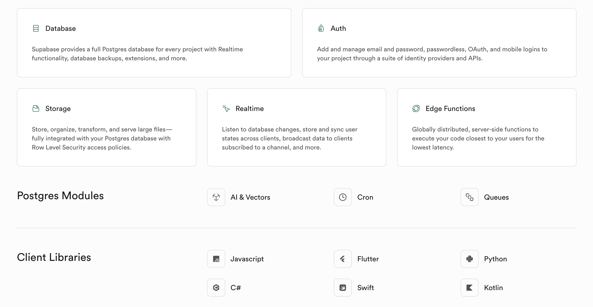

# 使用 Supabase Python SDK 实现数据库的增删改查

在之前的文章中，我们学习了 RESTful API 来操作 Supabase 数据库，但是调用方式比较繁琐，其实，Supabase 还提供了多种编程语言的客户端库，可以更方便地操作数据库，包括 JavaScript、Flutter、Swift、Python、C# 和 Kotlin 等。



我们今天继续学习 Supabase，使用 Python SDK 来实现数据库的增删改查。

## Python SDK 快速上手

首先安装所需的依赖：

```
$ pip install dotenv supabase
```

然后创建一个 `.env` 文件，写入 Supabase 项目地址和密钥：

```
SUPABASE_URL=https://lsggedvvakgatnhfehlu.supabase.co
SUPABASE_KEY=<ANON_KEY>
```

这两个值可以在 Supabase 项目的 API 设置中找到：


然后通过 `dotenv` 加载：

```python
from dotenv import load_dotenv
import os

# Load environment variables from .env
load_dotenv()

# Fetch variables
SUPABASE_URL = os.getenv("SUPABASE_URL")
SUPABASE_KEY = os.getenv("SUPABASE_KEY")
```

然后就可以通过 `supabase` 库的 `create_client` 方法创建客户端，访问和操作数据库了：

```
from supabase import create_client, Client
supabase: Client = create_client(SUPABASE_URL, SUPABASE_KEY)
response = (
    supabase.table("students")
    .select("*")
    .execute()
)
print(response)
```

## 增删改查

Supabase Python SDK 提供了 `table` 方法来操作表，然后通过 `insert`、`update`、`delete` 和 `select` 方法来实现增删改查。

**新增数据：**

```
response = (
    supabase.table("students")
    .insert({"name": "zhangsan", "age": 18})
    .execute()
)
```

其中 `insert` 也可以接收一个列表，批量插入数据：

```
response = (
    supabase.table("students")
    .insert([
        {"name": "zhangsan", "age": 18},
        {"name": "lisi", "age": 20},
    ])
    .execute()
)
```

**修改数据：**

```
response = (
    supabase.table("students")
    .update({"age": 20})
    .eq("name", "zhangsan")
    .execute()
)
```

Supabase 也提供了 `upsert` 方法，根据主键判断，如果数据不存在，则插入，如果存在，则更新：

```
response = (
    supabase.table("students")
    .upsert({"id": 15, "name": "zhangsan", "age": 20})
    .execute()
)
```

**删除数据：**

```
response = (
    supabase.table("students")
    .delete()
    .eq("id", 15)
    .execute()
)
```

当有多个 id 需要删除时，可以使用 `in_` 方法批量删除：

```
response = (
    supabase.table("students")
    .delete()
    .in_("id", [11, 12, 13, 14])
    .execute()
)
```

**查询数据：**

```
response = (
    supabase.table("students")
    .select("*")
    .execute()
)
```

其中 `select("*")` 用于查询所有字段，也可以指定查询的字段：

```
response = (
    supabase.table("students")
    .select("name, age")
    .execute()
)
```
