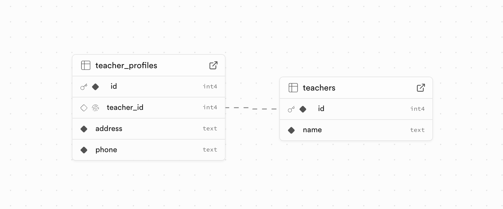

# 学习 Supabase 的关联查询

Supabase 本质上是 Postgres 数据库的一个封装。由于 Postgres 是一个关系数据库，所以处理表之间的关系是一种非常常见的情况。Supabase 会通过外键自动检测表之间的关系，在调用 RESTful API 或 SDK 时，提供了便捷的语法实现跨表查询。

## 一对多关系

班级和学生可以是一对多关系，一个班级可以有多个学生，一个学生只能属于一个班级。


我们创建两个表：

```sql
create table classes (
  id serial primary key,
  name text not null
);

create table students (
  id serial primary key,
  name text not null,
  age int not null,
  class_id integer references classes(id)
);
```

再准备一些测试数据：

```sql
insert into classes (name) values 
('一年级一班'),
('一年级二班');
insert into students (name, age, class_id) values 
('张三', 7, 1), 
('李四', 8, 1), 
('王五', 8, 2), 
('赵六', 7, 2);
```

我们通过下面的代码查询所有班级：

```python
response = (
    supabase.table("classes")
    .select("name")
    .execute()
)
```

如果要查询所有班级以及该班级的学生，可以这样：

```python
response = (
    supabase.table("classes")
    .select("name, students(name, age)")
    .execute()
)
```

在上面的查询中 `classes` 为主表，`students` 为从表。Supabase 会自动检测它们之间的关系，知道它们是一对多，因此返回 `students` 时会返回一个数组：

```
[
    {
        'name': '一年级一班', 
        'students': [
            {'age': 7, 'name': '张三'}, 
            {'age': 8, 'name': '李四'}
        ]
    }, 
    {
        'name': '一年级二班', 
        'students': [
            {'age': 8, 'name': '王五'}, 
            {'age': 7, 'name': '赵六'}
        ]
    }
]
```

我们也可以对主表和从表进行过滤，比如只查询一年级一班以及该班级的学生：

```python
response = (
    supabase.table("classes")
    .select("name, students(name, age)")
    .eq("name", "一年级一班")
    .execute()
)
```

或者查询所有班级以及该班级年龄为7岁的学生：

```python
response = (
    supabase.table("classes")
    .select("name, students(name, age)")
    .eq("students.age", 7)
    .execute()
)
```

## 多对一关系

上面的主表和从表可以反过来，让 `students` 为主表，`classes` 为从表，比如查询所有学生以及该学生的班级：

```python
response = (
    supabase.table("students")
    .select("name, age, classes(name)")
    .execute()
)
```

这时 Supabase 会自动检测出主表和从表之间是多对一关系，因此返回的 `classes` 是一个对象：

```
[
    {'name': '张三', 'age': 7, 'classes': {'name': '一年级一班'}},
    {'name': '李四', 'age': 8, 'classes': {'name': '一年级一班'}}, 
    {'name': '王五', 'age': 8, 'classes': {'name': '一年级二班'}}, 
    {'name': '赵六', 'age': 7, 'classes': {'name': '一年级二班'}}
] 
```

## 多对多关系

接着我们再来看下多对多关系。我们新建一个老师表，老师和班级是多对多关系，一个老师可以教多个班级，一个班级也可以有多个老师。

```sql
create table teachers (
  id serial primary key,
  name text not null
);
```

多对多关系不能直接在两个表之间用外键约束进行表达，要表达多对多关系，需要一张额外的表，该表需要包含两个外键约束，分别关联到不同的表：

```sql
create table classes_teachers (
  class_id integer references classes(id),
  teacher_id integer references teachers(id),
  primary key (class_id, teacher_id)
);
```

它们之间的关系如下图所示：


我们再准备一些测试数据：

```sql
insert into teachers (name) values 
('张老师'), 
('李老师'), 
('王老师'), 
('赵老师');
insert into classes_teachers (class_id, teacher_id) values 
(1, 1), 
(1, 2), 
(1, 4), 
(2, 1), 
(2, 3), 
(2, 4);
```

从上面的建表语句可以看出，`classes` 和 `teachers` 之间没有直接的外键关联关系，而是通过 `classes_teachers` 表进行关联，Supabase 会自动识别这种情况，我们在编写代码时，可以直接关联 `classes` 和 `teachers` 表。比如查询所有班级以及该班级的老师：

```python
response = (
    supabase.table("classes")
    .select("name, teachers(name)")
    .execute()
)
```

查询结果如下：

```
[
    {
        'name': '一年级一班', 
        'teachers': [
            {'name': '张老师'}, 
            {'name': '李老师'}, 
            {'name': '赵老师'}
        ]
    }, 
    {
        'name': '一年级二班', 
        'teachers': [
            {'name': '张老师'}, 
            {'name': '王老师'}, 
            {'name': '赵老师'}
        ]
    }
]
```

也可以反过来，查询所有老师以及该老师的班级：

```python
response = (
    supabase.table("teachers")
    .select("name, classes(name)")
    .execute()
)
```

查询结果如下：

```
[
    {
        'name': '张老师', 
        'classes': [
            {'name': '一年级一班'}, 
            {'name': '一年级二班'}
        ]
    }, 
    {
        'name': '李老师', 
        'classes': [
            {'name': '一年级一班'}
        ]
    }, 
    {
        'name': '王老师', 
        'classes': [
            {'name': '一年级二班'}
        ]
    }, 
    {
        'name': '赵老师', 
        'classes': [
            {'name': '一年级一班'}, 
            {'name': '一年级二班'}
        ]
    }
]
```

可以看到 Supabase 会自动根据关联表 `classes_teachers` 检测出这两个表是多对多关系，在这种情况下，无论哪个表是主表，从表返回的都是一个数组。

## 一对一关系

表和表之间还有一种特殊的一对一关系，比如老师表和老师档案表，老师表存储老师的基本信息，老师档案表存储老师的详细信息，每个老师只能有一份老师档案。



我们创建老师档案表如下：

```sql
create table teacher_profiles (
  id serial primary key,
  teacher_id integer references teachers(id) unique,
  address text not null,
  phone text not null
);
```

注意这里的 `teacher_id` 字段，它是一个外键，关联到 `teachers` 表，同时它又是一个唯一约束，这说明一个老师只能有一份老师档案。如果没有这个唯一约束，那么老师和老师档案表之间就是多对一关系了。

以及一些测试数据：

```sql
insert into teacher_profiles (teacher_id, address, phone) values 
(1, '北京市朝阳区', '13800000000'), 
(2, '上海市浦东新区', '13900000000'), 
(3, '广州市天河区', '13700000000'), 
(4, '深圳市南山区', '13600000000');
```

我们查询所有老师以及该老师的档案信息：

```python
response = (
    supabase.table("teachers")
    .select("name, teacher_profiles(address, phone)")
    .execute()
)
```

查询结果如下：

```
[
    {
        'name': '张老师', 
        'teacher_profiles': {
            'phone': '13800000000', 
            'address': '北京市朝阳区'
        }
    }, 
    ...
]
```

可以看到 Supabase 自动检测出老师和老师档案表之间是一对一关系，因此返回的 `teacher_profiles` 是一个对象。

如果反过来，查询所有老师档案以及对应的老师：

```python
response = (
    supabase.table("teacher_profiles")
    .select("address, phone, teachers(name)")
    .execute()
)
```

查询结果中的 `teachers` 也是一个对象：

```
[
    {
        'address': '北京市朝阳区', 
        'phone': '13800000000', 
        'teachers': {'name': '张老师'}
    }, 
    ...
]
```

## 两个表之间有多个外键关联

还有一种特殊情况，两个表之间有多个外键关联，比如订单表和地址表，订单表中有一个发货地址和一个收货地址，它们都关联到地址表。

建表语句如下：

```sql
create table addresses (
  id serial primary key,
  name text not null
);

create table orders (
  id serial primary key,
  shipping_address_id integer references addresses(id),
  receiving_address_id integer references addresses(id)
);
```

插入示例数据：

```sql
insert into addresses (name) values 
('北京市朝阳区'), 
('上海市浦东新区'), 
('广州市天河区'), 
('深圳市南山区');
insert into orders (shipping_address_id, receiving_address_id) values 
(1, 2), 
(2, 3), 
(3, 4), 
(4, 1);
```

如果我们要查询出所有订单以及发货地址和收货地址，在查询语句中指定 `addresses(name)` 就不行了，因为 Supabase 不知道是查询发货地址还是收货地址，所以需要在查询语句中指定外键字段名：

```python
response = (
    supabase.table("orders")
    .select("""
        id, 
        shipping_address_id(name), 
        receiving_address_id(name)
    """)
    .execute()
)
```

不过这样查询出来的结果中，发货地址和收货地址的字段名是 `shipping_address_id` 和 `receiving_address_id`：

```
[
    {
        'id': 1, 
        'shipping_address_id': {'name': '北京市朝阳区'}, 
        'receiving_address_id': {'name': '上海市浦东新区'}
    }, 
    ...
]
```

为了方便，我们可以在查询语句中指定别名：

```python
response = (
    supabase.table("orders")
    .select("""
        id, 
        shipping:shipping_address_id(name), 
        receiving:receiving_address_id(name)
    """)
    .execute()
)
```

这样查询出来的结果中，发货地址和收货地址的字段名就变成了 `shipping` 和 `receiving`：

```
[
    {
        'id': 1, 
        'shipping': {'name': '北京市朝阳区'}, 
        'receiving': {'name': '上海市浦东新区'}
    }, 
    ...
]
```

## 参考

- [Querying Joins and Nested tables](https://supabase.com/docs/guides/database/joins-and-nesting)
- [【原理篇】Supabase关联查询：内联、外联及外键约束](https://zhuanlan.zhihu.com/p/669622983)
