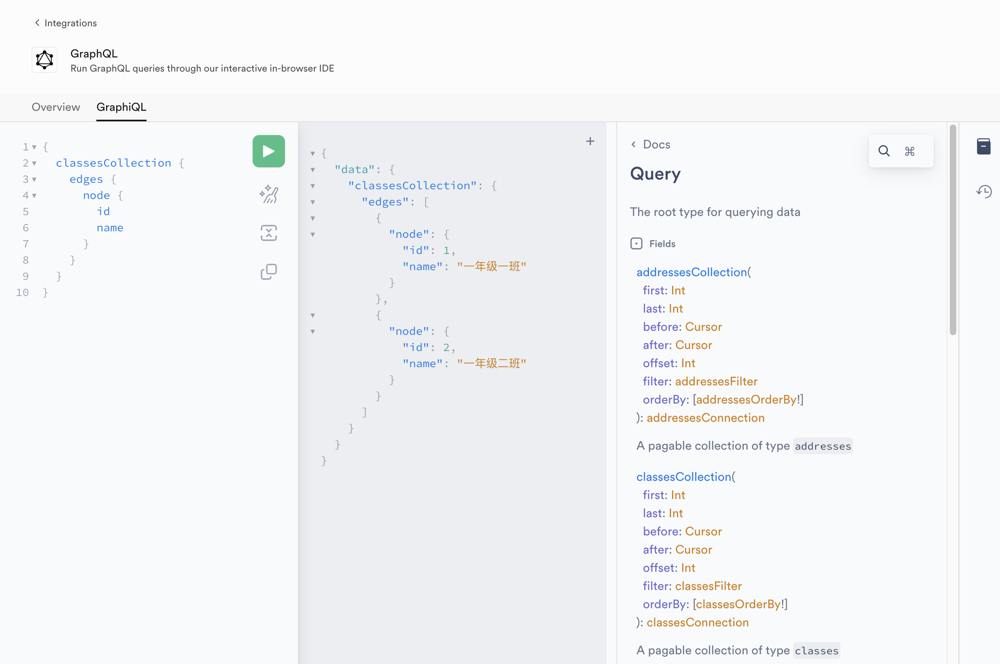

# 学习 Supabase 的 GraphQL API

在前面的文章中，我们知道了 Supabase 使用 [PostgREST](https://postgrest.org/) 将 PostgreSQL 数据库直接转换为 RESTful API，方便开发者通过简单的 HTTP 请求与数据库进行通信，实现增、删、改、查等操作。其实，Supabase 还提供了另一种 GraphQL API 供开发者使用，我们今天就来学习它。

## GraphQL 简介

[GraphQL](https://graphql.org/) 是一种用于 API 的查询语言，由 Facebook 于 2012 年开发并在 2015 年开源。它相比于传统的 RESTful API 提供了一种更高效、强大和灵活的方式来获取和操作数据。


GraphQL 的核心特点如下：

* **单一端点**：与 RESTful API 不同，GraphQL 使用单一端点（通常是 `/graphql`），客户端通过查询语句指定需要的数据，简化了客户端的实现，减少了 API 管理的复杂性；
* **精确的数据获取**：客户端可以精确请求所需字段，避免了 RESTful API 中常见的 **过度获取** 或 **不足获取** 问题，提高了性能和响应速度；
* **强类型系统**：使用强类型的 Schema 定义数据结构，确保客户端和服务器之间的数据交互是安全的，数据的一致性和可靠性得到保障，客户端可以在编译时检查查询的有效性，减少运行时错误；
* **支持复杂查询**：允许嵌套查询，一次请求即可获取多个相关资源，能减少网络往返次数，提高用户体验，适用于处理复杂或经常变化的数据需求；

GraphQL 支持三种基本操作：

* **Query（查询）**：用于从服务器获取数据，客户端通过发送一个查询语句来请求特定的数据，查询语句是一个树状结构，描述了需要获取的数据字段及其子字段；
* **Mutation（变更）**：用于修改数据，如创建、更新或删除操作，遵循严格的类型定义，负责执行对服务器数据的写操作；
* **Subscription（订阅）**：用于监听数据变化并实现实时更新，允许客户端实时接收数据更新，通常用于实现实时通信功能；

## 开启 Supabase 的 GraphQL 功能

Supabase 的 GraphQL API 是基于 Postgres 扩展 [pg_graphql](https://supabase.github.io/pg_graphql/) 实现的，它会根据数据库架构自动生成 GraphQL 接口：

* 支持基本的增删改查操作；
* 支持表、视图、物化视图和外部表；
* 支持查询表/视图之间任意深度的关系；
* 支持用户定义的计算字段；
* 支持 Postgres 的安全模型，包括行级安全、角色和权限。

进入 Dashboard -> Database -> Extension 页面，确认下 pg_graphql 扩展是否开启（默认是开启的）：


## GraphQL 初体验

如果是第一次使用 Supabase 的 GraphQL 功能，推荐通过 Supabase Studio 内置的 GraphiQL IDE 来调试验证。首先进入 Dashborad -> Integrations -> GraphQL 页面：


点击 GraphiQL 页签，在查询编辑器中输入 GraphQL 语句，并点击绿色图标发送请求，查询结果显示在编辑器的右侧区域：


这里使用的查询语句是：

```graphql
{
  classesCollection {
    edges {
      node {
        id
        name
      }
    }
  }
}
```

表示查询我们之前创建的 `classes` 表，查询结果要包含 `id` 和 `name` 两个字段，查询结果如下：

```json
{
  "data": {
    "classesCollection": {
      "edges": [
        {
          "node": {
            "id": 1,
            "name": "一年级一班"
          }
        },
        {
          "node": {
            "id": 2,
            "name": "一年级二班"
          }
        }
      ]
    }
  }
}
```

下面是一个更复杂的查询，查询 `id=1` 的班级下的前 10 个学生：

```graphql
{
  classesCollection(filter: {id: {eq: 1}}) {
    edges {
      node {
        id
        name
        studentsCollection(first: 10) {
          edges {
            node {
              id
              name
            }
          }
        }
      }
    }
  }
}
```

另外，还可以通过 `Mutation` 请求类型实现数据的增删改，关于 Supabase 的 GraphQL API 接口规范和核心概念，可以参考这里的 [官方文档](https://supabase.com/docs/guides/graphql/api)，也可以点击旁边的 Docs 按钮查看支持的 API 接口类型：



## GraphQL API

Supabase GraphQL API 请求格式如下：

```
POST https://<PROJECT-REF>.supabase.co/graphql/v1
Content-Type: application/json
apiKey: <API-KEY>

{"query": "<QUERY>", "variables": {}}
```

其中，`<PROJECT-REF>` 是 Supabase 项目的 ID，请求头中的 `<API-KEY>` 是 API 密钥，都可以在 Supabase 项目的 API 设置中找到。请求体中的 `<QUERY>` 是查询语句，也就是上面我们在 GraphiQL IDE 中输入的 GraphQL 语句。

下面通过 `curl` 来查询所有的班级：

```shell
$ curl -X POST https://lsggedvvakgatnhfehlu.supabase.co/graphql/v1 \
    -H 'apiKey: <API-KEY>' \
    -H 'Content-Type: application/json' \
    --data-raw '{"query": "{ classesCollection { edges { node { id, name } } } }", "variables": {}}'
```
