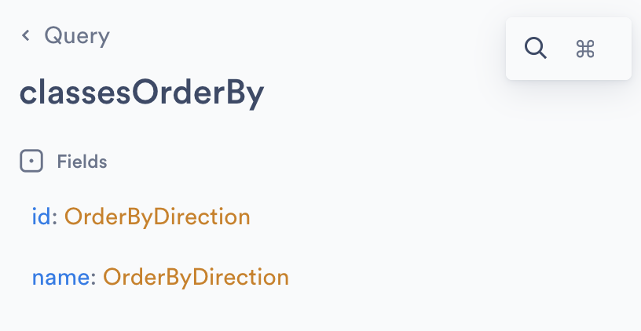

# 再学 Supabase 的 GraphQL API

在上一篇文章中我们学习了 Supabase 的 GraphQL API 功能，并通过 Supabase Studio 内置的 GraphiQL IDE 和 curl 简单验证了查询接口。但是，关于 GraphQL API，还有一些点可以展开聊聊，比如如何实现复杂查询，如何实现增删改，如何通过 SDK 调用，等等，我们今天来进一步学习它。

## 实现复杂查询

下面是一个稍微复杂点的带过滤条件的查询，查询 `id=1` 的班级：

```
{
  classesCollection(filter: {id: {eq: 1}}) {
    edges {
      node {
        id
        name
      }
    }
  }
}
```

其中 `classesCollection` 表示查询 `classes` 表，后面的括号里除了加上过滤条件，还可以加上分页、排序等条件。可以在 GraphiQL IDE 右侧的文档中查看 `classesCollection` 的定义如下：


### 分页

Supabase 的 GraphQL API 支持两种分页方式：**键集分页（Keyset Pagination）** 和 **偏移分页（Offset Pagination）**。键集分页是通过游标实现的，使用 `first`、`last`、`before` 和 `after` 参数来处理在集合中向前和向后分页，遵循 [Relay 的分页规范](https://relay.dev/graphql/connections.htm)。

我们首先通过 `first:10, after:null` 查询表中前 10 条记录：

```
{
  classesCollection(first:10, after:null) {
    pageInfo {
      startCursor,
      endCursor,
      hasNextPage
    }
    edges {
      node {
        id
        name
      }
    }
  }
}
```

其中 `pageInfo` 表示查询结果中要带上分页信息，分页信息中的 `endCursor` 是最后一条记录的游标：

```
{
  "data": {
    "classesCollection": {
      "edges": [
        {
          "node": {
            "id": 1,
            "name": "一年级一班"
          }
        },
        ...
      ],
      "pageInfo": {
        "endCursor": "WzJd",
        "hasNextPage": true,
        "startCursor": "WzFd"
      }
    }
  }
}
```

我们将 `pageInfo.endCursor` 赋值到 `after` 就可以继续查询下一页：

```
{
  classesCollection(first:10, after:"WzJd") {
    pageInfo {
      startCursor,
      endCursor,
      hasNextPage
    }
    edges {
      node {
        id
        name
      }
    }
  }
}
```

偏移分页和传统 SQL 的 `limit` 和 `offset` 类似，使用 `first` 和 `offset` 参数进行分页，可以跳过结果中的 `offset` 条记录。下面的查询表示一页 10 条记录，查询第二页：

```
{
  classesCollection(first:10, offset:10) {
    ...
  }
}
```

### 过滤

`filter` 参数用于设置过滤条件，它的类型为 `classesFilter`，定义如下：


我们可以通过 `classes` 表的每一个字段进行过滤，也可以通过 `and/or/not` 逻辑操作符组合过滤条件。当我们根据字段进行过滤时，不同的字段类型对应的过滤类是不一样的，支持的过滤操作也不一样，比如 `int` 类型对应的 `IntFilter`，`string` 类型对应 `StringFilter`，下面的表格列出了常见的过滤操作符：


比如过滤 id 小于 2 的班级：

```
{
  classesCollection(filter:{id:{lt:2}}) {
    ...
  }
}
```

过滤名称以 一年级 开头的班级：

```
{
  classesCollection(filter:{name:{like:"一年级%"}}) {
    ...
  }
}
```

使用 `and` 将多个条件组合：

```
{
  classesCollection(filter:{
    and: [
      {name:{like:"一年级%"}}
      {id: {lt:10}}
    ]  
  }) {
    ...
  }
}
```

也可以简写成：

```
{
  classesCollection(filter:{
    name:{like:"一年级%"},
    id: {lt:10}
  }) {
    ...
  }
}
```

### 排序

`orderBy` 参数用于控制排序，它的类型为 `classesOrderBy!`：



支持四种排序方式：

* AscNullsFirst - 正序，空值靠前
* AscNullsLast - 正序，空值靠后
* DescNullsFirst - 倒序，空值靠前
* DescNullsLast - 倒序，空值靠后

比如下面是按 `id` 倒序的例子：

```
{
  classesCollection(orderBy: {id: DescNullsLast}) {
    ...
  }
}
```

### 表间关联

和 RESTful API 一样，Supabase 会自动检测表之间的外键关系，下面是一个关联查询的例子，查询 `id=1` 的班级下的前 10 个学生：

```
{
  classesCollection(filter: {id: {eq: 1}}) {
    edges {
      node {
        id
        name
        studentsCollection(first: 10) {
          edges {
            node {
              id
              name
            }
          }
        }
      }
    }
  }
}
```

## 实现增删改

在上一篇文章中我们了解到，GraphQL 支持三种基本操作：

* **Query（查询）**：用于从服务器获取数据，客户端通过发送一个查询语句来请求特定的数据，查询语句是一个树状结构，描述了需要获取的数据字段及其子字段；
* **Mutation（变更）**：用于修改数据，如创建、更新或删除操作，遵循严格的类型定义，负责执行对服务器数据的写操作；
* **Subscription（订阅）**：用于监听数据变化并实现实时更新，允许客户端实时接收数据更新，通常用于实现实时通信功能；

Supabase 的 GraphQL API 支持 Mutation 操作实现数据的创建、更新或删除。打开右侧 Docs 面板，可以看到支持 Mutation 操作：


通过下面的语句往 `classes` 表新增两条记录：

```
mutation {
  insertIntoclassesCollection (
    objects: [
      {name: "二年级一班"},
      {name: "二年级二班"},
    ]
  ) {
    affectedCount
    records {
      id
      name
    }
  }
}
```

通过下面的语句编辑 `classes` 表中 `id=4` 的记录：

```
mutation {
  updateclassesCollection (
    set: {name: "二年级X班"},
    filter: {id: {eq: 4}}
  ) {
    affectedCount
    records {
      id
      name
    }
  }
}
```

通过下面的语句删除 `classes` 表中 `id=4` 的记录：

```
mutation {
  deleteFromclassesCollection (
    filter: {id: {eq: 4}}
  ) {
    affectedCount
    records {
      id
      name
    }
  }
}
```

## 通过 SDK 调用

Supabase 提供的 SDK，比如 Python SDK 或 JS SDK 等是通过 RESTful API 来实现查询的，要实现 GraphQL API 的调用，可以采用一些 GraphQL JS 框架，比如 [Relay](https://relay.dev/) 和 [Apollo](https://www.apollographql.com/docs) 等。

可参考官方的集成文档：

* Relay - https://supabase.com/docs/guides/graphql/with-relay
* Apollo - https://supabase.com/docs/guides/graphql/with-apollo

## 深入 Supabase GraphQL API 原理

我们前面曾提到过，Supabase 的 GraphQL API 是基于 Postgres 扩展 [pg_graphql](https://supabase.github.io/pg_graphql/) 实现的，它会根据数据库架构自动生成 GraphQL 接口。如果更深入一步，我们会发现，这个扩展是通过内置函数 `graphql.resolve(...)` 来实现 GraphQL 接口的：当我们请求 GraphQL 接口时，实际上调用的是 `graphql.resolve(...)` 函数。我们可以打开 SQL Editor 输入下面的查询语句验证下：

```
select graphql.resolve($$
{
  classesCollection {
    edges {
      node {
        id
        name
      }
    }
  }
}
$$)
```

运行结果如下：


对 pg_graphql 的原理感兴趣的同学，可以看官方这篇博客：https://supabase.com/blog/how-pg-graphql-works
