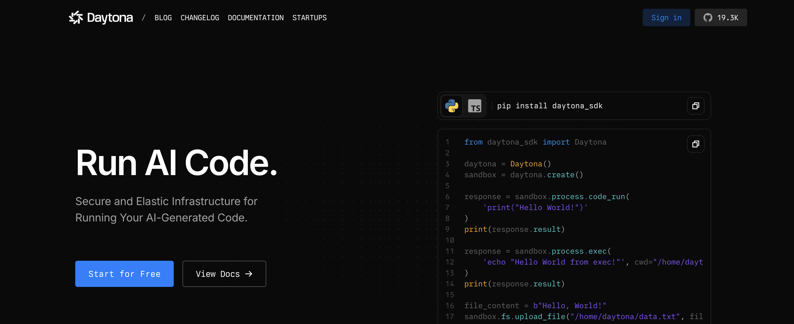
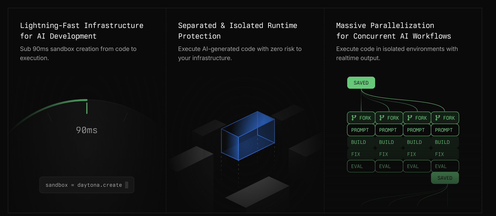
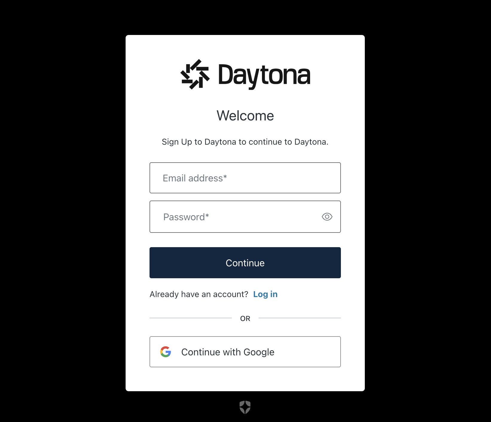
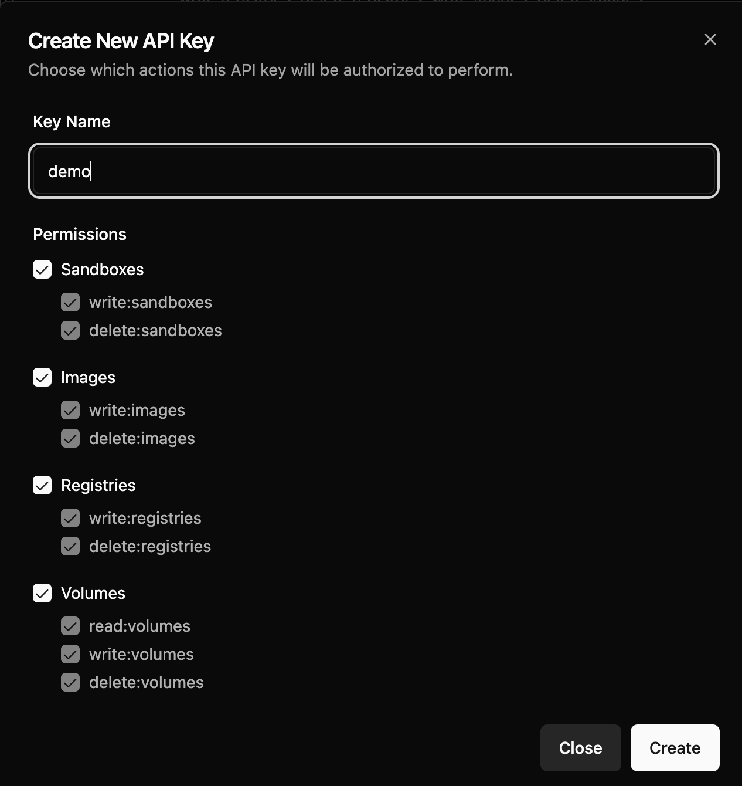
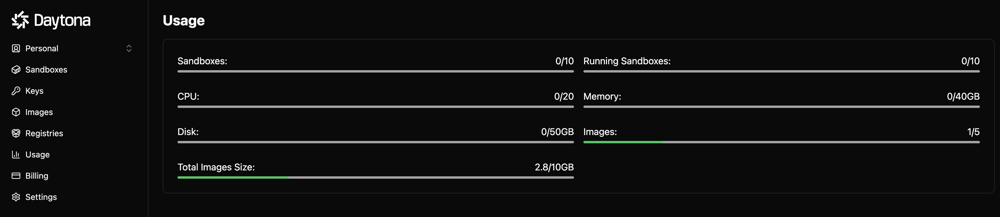
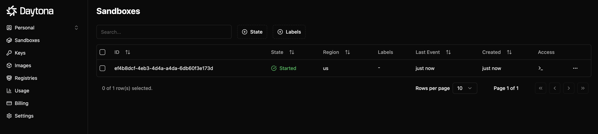

# Daytona 快速入门

在当今的技术浪潮中，人工智能的飞速发展正在重新定义我们的工作方式，尤其是在软件开发领域。随着大模型生成代码能力的不断提升，越来越多的开发者开始探索如何利用这些强大的工具提高工作效率。然而，伴随而来的是一个重要的问题：生成的代码的安全性和可靠性能否得到保障？我们今天要介绍一个新的开源项目 [Daytona](https://www.daytona.io/)，就是为了解决这一挑战。



Daytona 是一个旨在提供安全且弹性的基础设施的 SaaS 服务，专门用于在隔离环境中运行 AI 生成的代码。这样的设计理念不仅能确保代码在执行过程中的安全性，还能为开发者们提供一个稳定和可靠的运行平台。自从 Daytona 在开源社区推出以来，它受到了广泛关注，Github Star 数量已接近 20k，更在 Product Hunt 榜单上夺得了 Top 1 的佳绩。这一切都表明，Daytona 已成为开发者们的新宠，正引领着未来代码生成与执行的潮流。接下来，就让我们快速学习下 Daytona 的核心特性和用法。

## 核心特性

Daytona 的核心特性如下：

* 极速基础设施：快速创建沙箱，低于 90 毫秒；
* 独立与隔离的运行时：以零风险执行 AI 生成的代码，保护你的基础设施；
* 大规模并行化以支持并发 AI 工作流程：支持沙箱文件系统和内存状态的分叉；



此外，还有很多对开发人员友好的特性：

* 编程控制：支持文件、Git、LSP 和 执行 API；
* 无限持久化：支持将沙箱设置为永久存在；
* 原生 SSH 访问：支持通过 SSH 或 IDE 访问沙箱；
* OCI/Docker 兼容性：支持使用任何 OCI/Docker 镜像来创建沙箱；
* 开源透明：代码完全开源，支持自托管；

Daytona 被称为 AI 优先基础设施（AI-First Infrastructure），针对大模型、智能体和 AI 评估专门优化，通过 Daytona 可以实现下面这些功能：

* 代码解释器（Code Interpreter）
* 代码智能体（Coding Agents）
* 数据分析（Data Analysis）
* 数据可视化（Data Visualisation）
* AI 评估（AI Evaluations）

## 准备 API Key

为了体验 Daytona 的功能，我们需要做一些环境准备。首先登录 Daytona 官网，注册一个账号：https://app.daytona.io



然后，进入 Dashboard -> Keys 页面，创建一个 API Key：



注意这个 API Key 只会出现一次，务必记下这个 API Key，后面会用到。

然后就可以使用 Daytona 的各种功能了，Daytona 为免费用户提供了 10 个沙箱、20 核 CPU、40G 内存、50G 磁盘，以及 5 个镜像、10G 镜像大小的限额：



## 使用 Python SDK

接下来我们使用 Python SDK 简单体验下 Daytona 的基础用法。首先安装依赖：

```
$ pip install daytona-sdk
```

然后编写代码如下：

```
from daytona_sdk import Daytona, DaytonaConfig, CreateSandboxParams

# Initialize the Daytona client
daytona = Daytona(DaytonaConfig(api_key=DAYTONA_API_KEY))

# Create the Sandbox instance
sandbox = daytona.create(CreateSandboxParams(language="python"))

# Run code securely inside the Sandbox
response = sandbox.process.code_run('print("Sum of 3 and 4 is " + str(3 + 4))')
if response.exit_code != 0:
    print(f"Error running code: {response.exit_code} {response.result}")
else:
    print(response.result)

# Clean up the Sandbox
daytona.remove(sandbox)
```

整个代码结构非常清晰，就是四大步：

1. 初始化 Daytona 客户端：传入刚刚在 Dashboard 页面生成的 API Key；
2. 创建沙箱：指定沙箱环境为 `python` 语言，这里也可以传入 `typescript`，Daytona 也支持执行 JS 代码；
3. 在沙箱执行代码：这里传入 Python 代码，代码在沙箱中安全地被执行，并返回执行结果；
4. 销毁沙箱：如果沙箱不需要了，可以销毁掉；也可以不销毁，这时我们可以在 Dashboard -> Sandboxes 页面查看沙箱状态，甚至通过 SSH 进到沙箱环境中排查问题；



最后的运行结果如下：

```
Sum of 3 and 4 is 7
```

至此我们对 Daytona 已经有了一个基本了解，下一篇我们将学习更高级的用法。