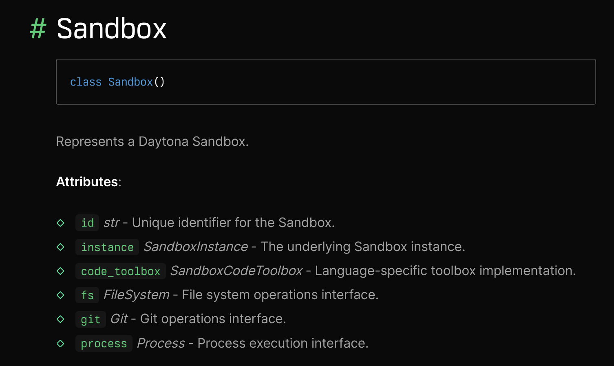

# 详解 Daytona 的代码执行

在上一篇文章中，我们学习了 Daytona 的核心特性和基本用法，然后通过 Python SDK 创建沙箱并执行代码。回顾下之前学过的内容，可以将 Daytona 执行代码分成四步：

1. 初始化 Daytona 客户端；
2. 通过客户端创建沙箱，指定沙箱环境，Daytona 支持执行 Python 和 JS 代码；
3. 在沙箱执行代码，返回执行结果；
4. 销毁沙箱；

其中第三步执行代码是 Daytona 最核心的功能，我们今天继续深入学习它。

## 执行代码和运行命令

Daytona 的 `Sandbox` 类含有不少属性，如下：



其中 `process` 属性是我们关注的焦点，通过它的 `code_run()` 方法可以执行代码：

```python
response = sandbox.process.code_run('print("Hello")')
```

这个方法支持传入一些额外参数，比如环境变量或命令行参数等：

```python
params = CodeRunParams(
    argv=[
        "-h", "-i"
    ], 
    env={
        'DEMO_ENV': 'xxx'
    }
)
response = sandbox.process.code_run('''
import os
import sys

print("环境变量：DEMO_ENV = ", os.getenv("DEMO_ENV"))
print("命令行参数：", *[f"{arg}" for _, arg in enumerate(sys.argv)])
''', params=params)
```

在代码中可以通过 `os.getenv()` 或  `sys.argv` 来获取，调用结果如下：

```
环境变量：DEMO_ENV =  xxx
命令行参数： -c -h -i
```

这里的命令行参数比较有意思，可以看到我们只传入了 `-h -i` 两个参数，但是输出却多了一个 `-c`，这说明 Daytona 很有可能是通过 `python -c` 去执行我们的 Python 代码的：

```sh
python -c "print('Hello')"
```

`process` 属性还有一个 `exec()` 方法，可以运行 Shell 命令：

```python
response = sandbox.process.exec('echo "Hello"')
```

这个方法同样支持传入一些额外参数，比如设置当前工作目录：

```python
response = sandbox.process.exec('ls', cwd="/")
```

设置环境变量：

```python
response = sandbox.process.exec('echo $DEMO_ENV', env={"DEMO_ENV": "xxx"})
```

## 运行长耗时任务

对于一些长耗时任务，为避免超时，可以在运行时加上 `timeout` 参数：

```python
response = sandbox.process.exec("sleep 5", timeout=10)
```

除此之外，Daytona 还提供了一种推荐做法：**通过后台会话运行长耗时任务**。

`sandbox.process` 属性提供了一系列和会话相关的方法：

* `create_session()` - 创建会话
* `get_session()` - 获取会话
* `list_sessions()` 列出所有会话
* `delete_session()` - 删除会话
* `execute_session_command()` - 在会话中执行命令
* `get_session_command()` - 获取会话中的命令
* `get_session_command_logs()` - 获取会话中的命令日志
* `get_session_command_logs_async()` - 异步获取会话中的命令日志

我们首先选择一个唯一标志作为会话 ID，然后通过它创建一个会话：

```python
session_id = "my-session"
sandbox.process.create_session(session_id)
```

接着就可以使用 `execute_session_command()` 在会话中执行命令，要执行的命令需要放在一个 `SessionExecuteRequest` 对象中：

```python
req = SessionExecuteRequest(
    run_async=True,
    command="for ((i=0; i<10; i++)); do echo $i; sleep 1; done"
)
response = sandbox.process.execute_session_command(session_id, req)
```

注意这里的 `run_async=True` 表示异步执行，调用完 `execute_session_command()` 方法后会立即返回，不会阻塞后面的代码。返回的 `response` 有一个 `cmd_id` 字段，通过 `get_session_command()` 方法可以检查命令的实时状态以及命令输出的日志。下面的代码示例中每隔 1 秒检查一次命令状态：

```
while(True):
    time.sleep(1)
    command = sandbox.process.get_session_command(session_id, response.cmd_id)
    if command.exit_code is None:
        print(f"Command is running ...")
        continue
    if command.exit_code == 0:
        print(f"Command {command.command} completed successfully")    
    else:
        print(f"Command {command.command} failed")
    logs = sandbox.process.get_session_command_logs(session_id, response.cmd_id)
    print(f"{logs}")
    break
```

当命令处于运行中状态时，`exit_code` 一直等于 `None`，当 `exit_code` 为 0 时表示命令运行成功，否则运行失败，再通过 `get_session_command_logs()` 方法获取命令的完整日志。

有时候我们不想等命令运行结束才打印日志，而是希望实时地输出日志，这对调试和监控都非常有意义。这时我们可以使用 `get_session_command_logs_async()` 方法：

```
await sandbox.process.get_session_command_logs_async(
    session_id,
    response.cmd_id,
    lambda chunk: print(f"Log chunk: {chunk}")
)
```

该方法接受一个 callback 函数，当有日志输出时就回调该函数。

## 小结

在本文中，我们深入探讨了 Daytona 的代码执行功能，特别是如何在沙箱中有效地执行代码和长耗时任务。我们学习了 Daytona 的 `process` 属性以及其便捷的 `code_run()` 和 `exec()` 方法，这些方法支持环境变量、命令行参数等设置，让我们能够灵活地执行 Python 和 Shell 代码。

此外，对于长耗时任务，我们介绍了如何通过后台会话进行处理，实现非阻塞的命令执行。我们可以创建会话、执行异步命令，并实时获取日志输出，这为任务的监控和调试提供了极大的便利。通过 `get_session_command_logs_async()` 方法，我们甚至能够实现实时日志的流式处理，进一步增强了我们对代码执行过程的可控性。

以上就是今天的全部内容了，基本上涉及到了和 Daytona 代码执行相关的各个细节，不过还有一点非常重要，那就是代码执行的环境，我们下一篇继续学习。