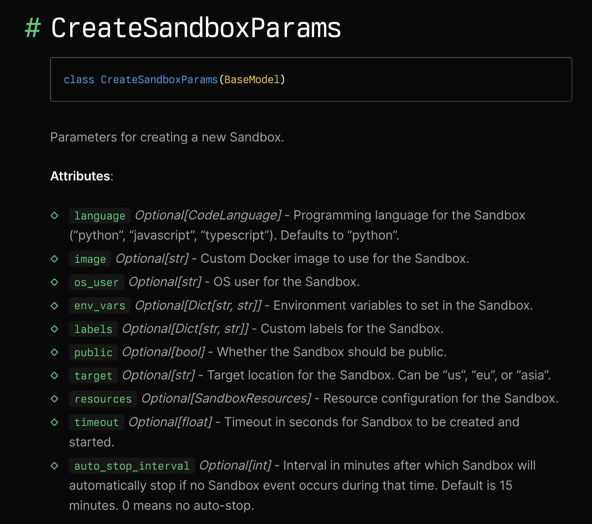
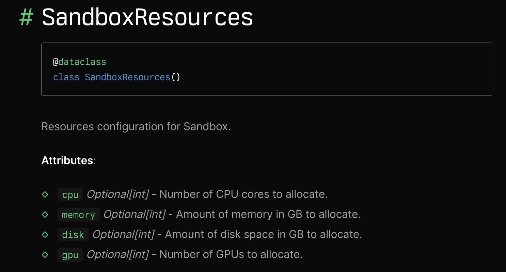

# 详解 Daytona 的沙箱管理

在上一篇文章中，我们学习了 Daytona 的代码执行功能，特别是如何在沙箱中执行 Python 代码、Shell 脚本和长耗时任务。关于代码执行，还有一个小尾巴没有讲完，那就是代码执行的环境。我们知道，执行代码之前首先要创建沙箱，代码是在沙箱中被安全地执行，那么这个沙箱环境里都有什么东西呢？我们到底能在沙箱中执行哪些代码呢？我们今天就来看看这些问题。

## 沙箱的创建

回顾下前面的内容，创建沙箱的代码如下：

```python
sandbox = daytona.create(CreateSandboxParams(language="python"))
```

我们是通过 Daytona 的 `create()` 方法创建沙箱的，其中 `CreateSandboxParams` 用于配置沙箱环境，该类的定义如下：



可以看到，除了编程语言还有不少的配置选项，包括镜像、环境变量、标签、资源限制、自动停止时间等等，下面是一个较复杂的例子：

```python
params = CreateSandboxParams(
    language="python",
    image="debian:12.9",
    env_vars={"DEBUG": "true"},
    labels={"ENV": "dev"},
    resources=SandboxResources(cpu=2, memory=4),
    auto_stop_interval=0
)
```

在这个例子里，我们指定了基础镜像为 `debian:12.9`，学过 Docker 的同学应该很快就能理解这里的沙箱其实就是容器，而容器都是由镜像创建而来，我们指定不同的镜像，也就是为沙箱配置不同的环境，关于镜像的使用，我们后面再看，这里先看另几个配置。

值得注意的是，Daytona 针对默认镜像提前创建了一些沙箱放在池中，当用户使用默认镜像创建沙箱时，就会直接从池中取出一个可用的沙箱，从而将创建时间缩短到毫秒。所以，当使用自定义镜像时，你会发现创建沙箱的速度会变慢，因为自定义的镜像没有提前池化。

## 对沙箱进行资源限制

我们在用 Docker 启动一个容器的时候，可以通过 `--memory` 和 `--cpus` 等参数限制容器能使用的系统资源：

```sh
$ docker run --memory=512m --cpus=1 ubuntu
```

Daytona 也提供了类似的机制，通过 `SandboxResources` 可以控制沙箱能使用的资源上限，该类定义如下：



下面是一个示例，限制 2 个 CPU 核心，1 个 GPU，4G 内存 和 20G 磁盘：

```python
resources = SandboxResources(
    cpu=2,
    gpu=1,
    memory=4,
    disk=20
)
```

## 沙箱的自动停止

在前面的学习中，我们每次使用完沙箱后都是通过 `daytona.remove(sandbox)` 将沙箱删除掉。如果你不手工删除，Daytona 为了避免资源浪费，会自动检测沙箱的活动状态，对于 15 分钟内不活跃的沙箱，将自动停止。

这个 15 分钟就是默认的自动停止时间，我们可以在创建沙箱时通过 `auto_stop_interval` 参数修改这个值，如果我们不希望沙箱被自动停止，可以将其设置为 0：

```python
sandbox = daytona.create(CreateSandboxParams(
    language = "python",
    auto_stop_interval = 0
))
```

## 操作沙箱

Daytona 对象提供了一系列和沙箱有关的操作，包括：

* `create()` - 创建沙箱
* `delete()` - 删除沙箱
* `get_current_sandbox()` - 根据 ID 获取沙箱
* `find_one()` - 根据 ID 或标签获取沙箱
* `list()` - 列出所有沙箱
* `start()` - 启动沙箱
* `stop()` - 停止沙箱

这些操作都比较简单，和 Docker 操作容器也很类似，此处略过。

## 沙箱的状态

对沙箱的操作必然导致沙箱状态的变动，Daytona 的沙箱可以有三种状态：

* 运行中：运行中的沙箱会占用 CPU、内存和磁盘存储，每种资源都按使用时间计费，所以当沙箱不再被主动使用时，建议将其停止。可以选择手动停止，也可以通过设置自动停止时间自动停止；
* 已停止：已停止的沙箱不会占用 CPU 和内存，只占用磁盘存储，当你需要使用沙箱时可以再启动它；
* 已归档：当沙箱被归档时，整个文件系统会迁移到更廉价的对象存储，这样可以更加节约成本，但是启动一个已归档的沙箱需要更多时间，你需要根据实际情况来权衡是停止还是归档你的沙箱。

## 小结

在本篇文章中，我们详细探讨了 Daytona 的沙箱管理，包括沙箱的创建、资源限制、自动停止机制以及沙箱状态的管理。了解沙箱的配置选项，不仅能提高代码的执行效率，还能有效控制成本，避免资源的浪费。自动停止功能进一步提升了资源管理的灵活性，使得开发者无需担心长时间未使用的沙箱占用系统资源。

沙箱和镜像是两个密不可分的概念，在后续的内容中，我们将进一步学习 Daytona 的镜像管理功能，希望大家继续关注！
