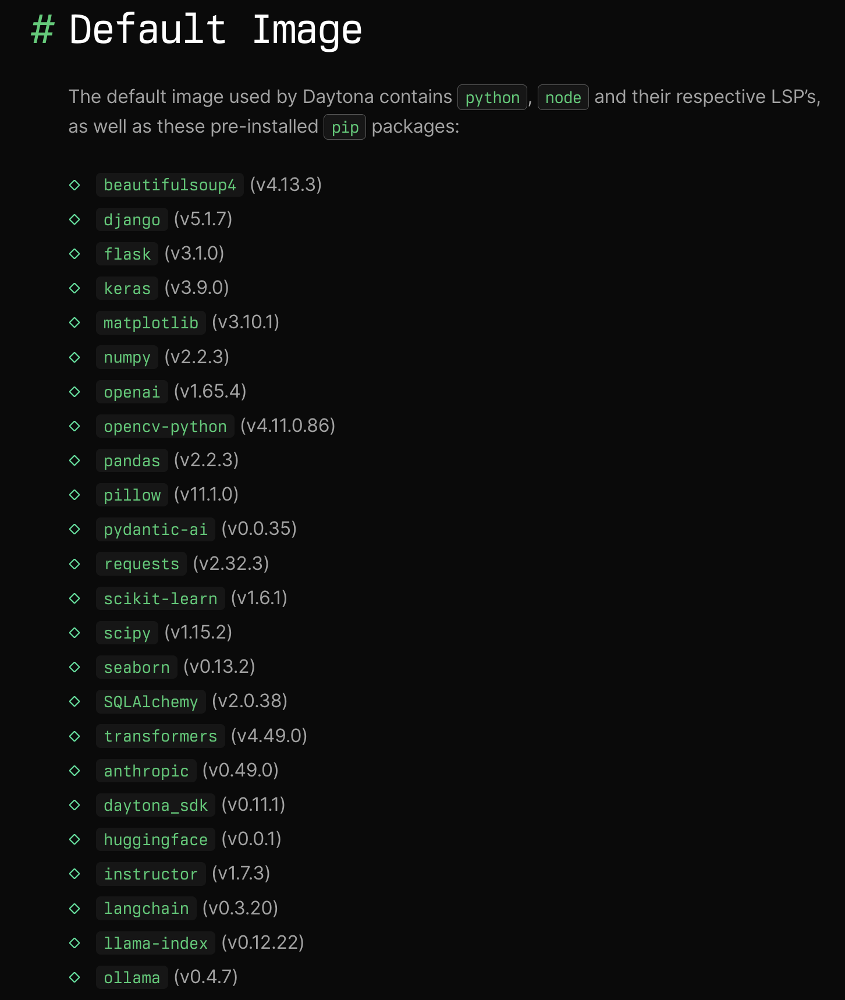
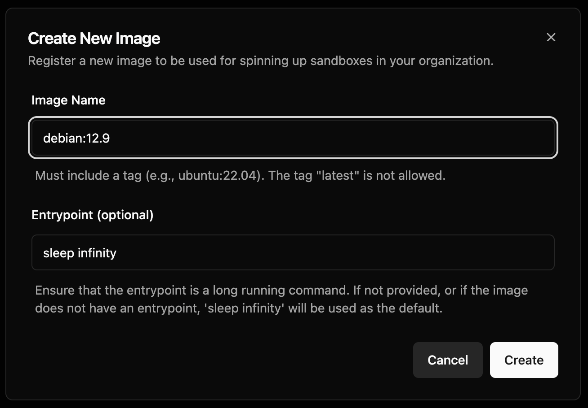
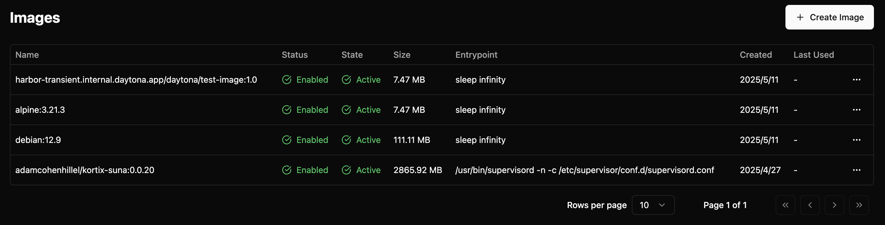
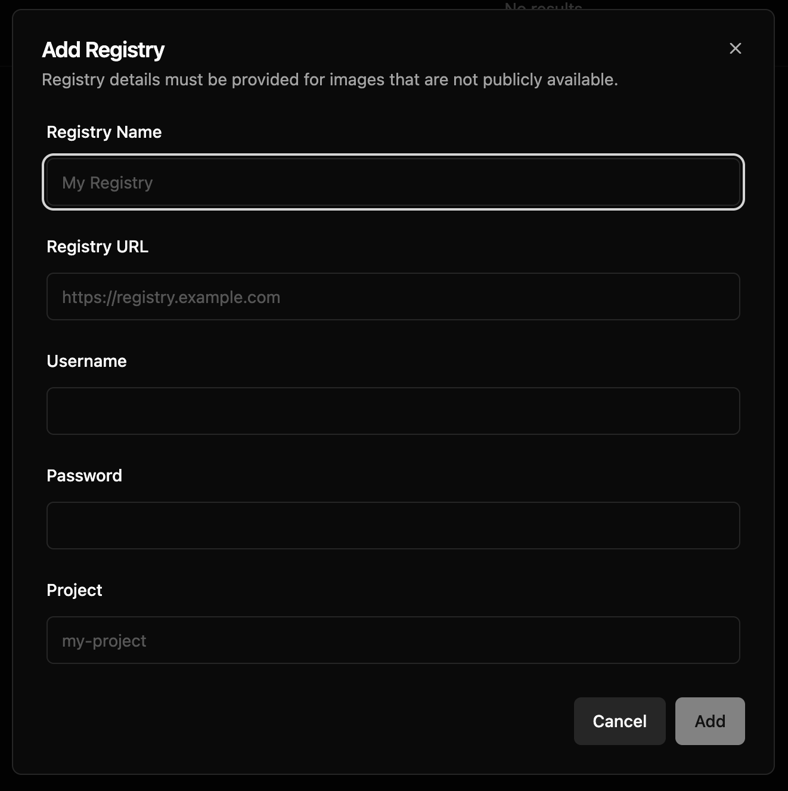
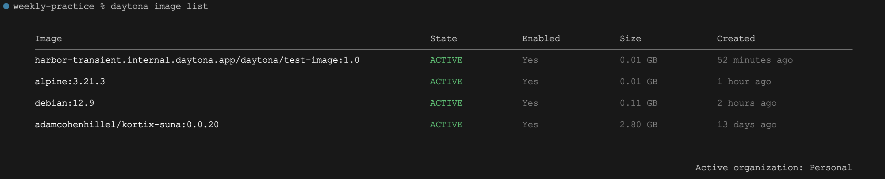

# 详解 Daytona 的镜像管理

在上一篇文章中，我们学习了 Daytona 的沙箱管理功能，包括沙箱的创建、资源限制、自动停止机制以及沙箱状态的管理。今天我们将继续学习 Daytona 的镜像管理功能。可以把镜像比喻成一个模板，它包含了沙箱中所需的所有依赖项、工具和环境设置。Daytona 支持所有标准的 Docker 或 OCI 兼容镜像。

我们在之前的代码中创建沙箱时使用了一个自定义镜像 `debian:12.9`，细心的同学可能已经发现了，如果你直接运行那段代码是会报错的：

```
daytona_sdk.common.errors.DaytonaError: 
    Failed to create sandbox: Image debian:12.9 not found or not accessible
```

这是因为在 Daytona 中使用自定义镜像，我们必须得提前创建它。

## 默认镜像

在创建镜像之前，我们先来看看 Daytona 的默认镜像长啥样，前面提到过，当使用默认镜像时，Daytona 会自动从池中获取，所以创建速度极快，如果用自定义镜像，就没有这个优势了，所以我们应该当且仅当默认镜像满足不了我们的需求时，才使用自定义镜像。

Daytona 默认镜像中预装了一些有用的工具，例如 python、node、pip 以及一些常见的 pip 包，如下：



## 镜像的创建

当我们确实需要使用自定义镜像时，可以进入 Dashboard -> Images 页面，点击 Create Image 按钮创建新镜像：



这里可以填写 Docker Hub 上的任何公共镜像，注意名称和标签都必须填写，比如我们这里使用的 `debian:12.9`，而且建议不要写 latest 或 stable 这样的标签。也可以填写来自其他公共仓库上的镜像，只要在前面加上仓库地址即可，比如来自 Github 的镜像仓库的 `ghcr.io/graalvm/jdk-community:21` 镜像。

另外，为了确保你的镜像运行后不会立即退出，一定要有一个长时间运行的入口点（entrypoint），如果不确定，可以直接填上 `sleep infinity` 命令。

镜像一旦被创建，就会被自动拉取，然后自动验证，验证通过后就会进入 Active 状态，此时我们才可以在程序中使用它：



## 私有仓库镜像

Daytona 也支持使用来自私有仓库的镜像，我们需要先在 Dashboard -> Registries 页面配置私有仓库：



在这里输入仓库名称、URL、用户名、密码以及项目名称即可，确保 Daytona 能访问你的私有仓库。然后就可以创建私有仓库的镜像了，注意镜像名称包括私有仓库的 URL 和项目名称，比如 `my-private-registry.com/<my-project>/alpine:3.21`。

## 本地镜像

除了公共镜像和私有仓库镜像，还有一种情况是，我们在本地开发和构建的镜像。我们可能没有自己的私有镜像仓库，也不想推送到公共镜像仓库中，这时，就可以使用 Daytona 提供的命令行工具将本地镜像推送到 Daytona 来使用。

首先，安装 Daytona CLI：

```
$ brew install daytonaio/cli/daytona
```

然后，通过 `daytona login` 登录：

```
$ daytona login

Select Authentication Method

  › Login with Browser
    Authenticate using OAuth in your browser

    Set Daytona API Key
    Authenticate using Daytona API key
```

Daytona 会显示两种登录方式：浏览器登录，或输入 API KEY。这里我们选择浏览器，登录成功：

```
 Opening the browser for authentication ...
                                           
 If opening fails, visit:
                         
https://daytonaio.us.auth0.com/authorize?audience=...
                        
 Successfully logged in!
```

接着就可以通过 `daytona image push` 推送本地镜像了：

```
$ daytona image push test-image:1.0
The push refers to repository [harbor-transient.internal.daytona.app/daytona/test-image]
08000c18d16d: Pushed 
1.0: digest: sha256:ec1b05d1eac264d9204a57f4ad9d4dc35e9e756e9fedaea0674aefc7edb1d6a4 size: 527
                                              
 Successfully pushed test-image:1.0 to Daytona
                                              
 ✓  Use 'harbor-transient.internal.daytona.app/daytona/test-image:1.0' to create a new sandbox using this image
```

这个命令将本地的 `test-image:1.0` 镜像成功推送到 Daytona 的镜像仓库中了，注意在使用这个镜像时，需要指定全路径。除了推送本地已有镜像，Daytona 也支持通过 Dockerfile 自动构建并推送镜像：

```
$ daytona image push test-image:1.0 --dockerfile ./Dockerfile
```

最后还有一点要注意的是，Daytona 目前仅支持 AMD 架构的镜像，还不支持 ARM 架构的镜像，否则会报错：

```
$ daytona image push test-image:1.0
FATA[0000] image 'test-image:1.0' is not compatible with AMD architecture
```

## 镜像管理

上面提到，我们可以在 Dashboard -> Images 页面对镜像进行管理，比如创建、禁用、删除等。我们也可以通过 `daytona image` 命令对镜像进行管理，比如：

* `daytona image create` - 创建镜像
* `daytona image push` - 推送本地镜像
* `daytona image delete` - 删除镜像
* `daytona image list` - 显示镜像列表

下面通过 `daytona image list` 命令列出所有镜像：



## 小结

好了，今天的内容就这么多。在本文中，我们详细探索了 Daytona 的镜像管理功能，包括镜像的创建、使用及管理。我们学习了默认镜像、创建自定义镜像以及如何使用私有仓库镜像和本地镜像，相信大家对 Daytona 的镜像功能有了更深入的了解。
