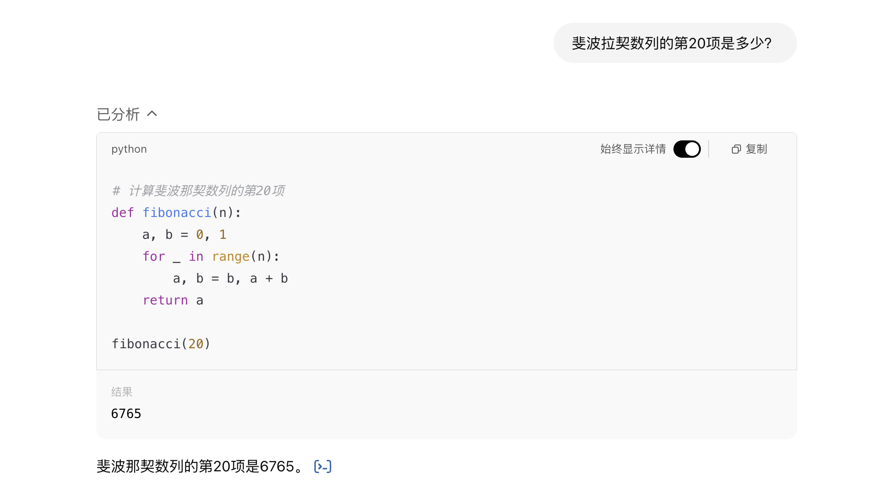
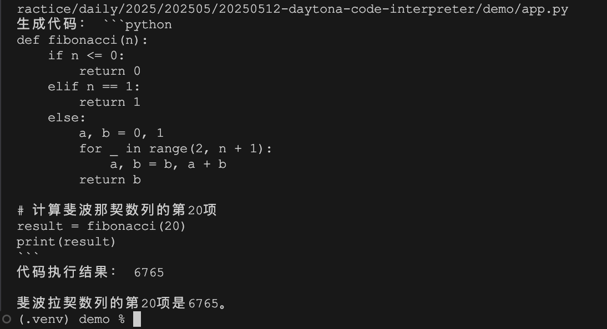

# 基于 Daytona 实现代码解释器

在入门篇里，我们提到 Daytona 作为一个 AI 优先基础设施，特别适合运行由 AI 生成的代码，比如下面这些场景：

* 代码解释器（Code Interpreter）
* 代码智能体（Coding Agents）
* 数据分析（Data Analysis）
* 数据可视化（Data Visualisation）
* AI 评估（AI Evaluations）

到目前为止，我们已经学习了 Daytona 的大多数功能，包括代码执行、沙箱管理和镜像管理等，这些知识已经足够我们应付 80% 的应用场景。在今天这篇文章中，我将带大家从零开始基于 Daytona 实现一个代码解释器。

## 什么是代码解释器？

代码解释器（Code Interpreter）是 OpenAI 2023 年 7 月推出的一项功能，作为 ChatGPT 的插件，它允许用户通过自然语言指令生成并执行代码，支持数据分析、文件处理、图表生成等任务：



代码解释器功能推出后颇受用户欢迎，在复杂任务中它可以显著提升效率，例如从 PDF 中提取文本、分析 CSV 数据或转换文件格式等。

## 实现 Function Calling

代码解释器的实现依赖于 OpenAI 更早时候推出的 [Function Calling](https://openai.com/blog/function-calling-and-other-api-updates) 功能，它为 `Chat Completions API` 添加了函数调用的能力，帮助开发者通过 API 的方式实现类似于 ChatGPT 插件的数据交互能力。

简单来说，Function Calling 就是在调用大模型时提供几个工具选项，大模型判断用户的问题是否需要调用某个工具。如果不需要则直接回复，这和传统的调用没有区别；如果需要调用则返回合适的工具和对应的参数给用户，用户拿到后调用对应的工具，再将调用结果送给大模型，最后，大模型根据工具的调用结果来回答用户的问题。

根据需要，工具的调用可能有多轮，我们可以将 Function Calling 实现成下面这样一个循环：

```python
def chat_completion_with_function_calling(query):
  # 原始用户问题
  messages=[
    {'role': 'user', 'content': query},
  ]
  while True:
    # 调用大模型
    completion = client.chat.completions.create(
      model="gpt-4o",
      messages=messages,
      tools=tools,
    )

    # 不需要工具直接返回
    message = completion.choices[0].message
    if not message.tool_calls:
      break

    # 工具调用消息
    tool_calls = message.tool_calls
    messages.append(
      {'role': 'assistant', 'tool_calls': tool_calls, 'content': ''},
    )
    
    for tool_call in tool_calls:
      # 调用工具
      function = globals().get(tool_call.function.name)
      args = json.loads(tool_call.function.arguments)
      result = function(args)

      # 工具调用结果消息
      messages.append(
        {'role': 'tool', 'content': result, 'tool_call_id': tool_call.id},
      )
  return completion
```

其中 `tools` 字段是我们提供的工具列表，比如这样：

```python
tools = [
  {
    "type": "function",
    "function": {
      "name": "get_current_date",
      "description": "获取今天的日期信息，包括几月几号和星期几",
      "parameters": {
        "type": "object",
        "properties": {}
      }
    }
  },
  {
    "type": "function",
    "function": {
      "name": "get_weather_info",
      "description": "获取某个城市某一天的天气信息",
      "parameters": {
        "type": "object",
        "properties": {
          "city": {
            "type": "string",
            "description": "城市名",
          },
          "date": {
            "type": "string",
            "description": "日期，格式为 yyyy-MM-dd",
          },
        },
        "required": ["city", "date"],
      }
    }
  }
]
```

上面我们定义了两个工具 `get_current_date` 和 `get_weather_info`，分别用于获取日期和查询天气。这两个工具都需要我们自己实现，大模型只负责告诉我们要不要调用工具，它自己不会主动调用工具，所以调用的逻辑还是需要我们来做，比如上面代码中的这段：

```python
function = globals().get(tool_call.function.name)
args = json.loads(tool_call.function.arguments)
result = function(args)
```

这里从大模型返回的 `tool_call.function` 字段中提取出调用的工具名称和参数，然后调用对应的工具函数：

```python
def get_current_date(args):
  import datetime
  today = datetime.date.today()
  weekday = today.weekday()
  weeekdays = ['一','二','三','四','五','六','日']
  return '今天是' + str(today) + ', ' + '星期' + weeekdays[weekday]

def get_weather_info(args):
  import requests
  import json
  day = args['date'].split('-')[2]
  url = 'https://query.asilu.com/weather/baidu/?city=' + args['city']
  content = requests.get(url).content
  response = json.loads(content.decode())
  for weather in response['weather']:
    if day == weather['date'].split('日')[0]:
      return weather['weather'] + "，" + weather['temp'] + "，" + weather['wind']
  return '未查询到天气'
```

## Function Calling 执行流程

接下来，我们问大模型一个问题，看看整体的执行流程是什么样的：

```python
completion = chat_completion_with_function_calling('明天合肥的天气怎么样？')
print(completion.choices[0].message.content)
```

首先，我们调用大模型的入参是这样：

```json
[
  {
    "role": "user",
    "content": "明天合肥的天气怎么样？"
  }
]
```

大模型返回的结果是这样：

```json
{
  "id": "chatcmpl-BWFUtwaRXeOo3v7T9dynk8DI1bevC",
  "choices": [
    {
      "message": {
        "content": null,
        "role": "assistant",
        "tool_calls": [
          {
            "id": "call_Omy5d3I2D3lOccmy1V8DjFiL",
            "function": {
              "arguments": "{}",
              "name": "get_current_date"
            },
            "type": "function"
          }
        ]
      }
    }
  ]
}
```

可以看到大模型希望先知道今天的日期，于是我们调用 `get_current_date` 函数得到今天的日期，再次调用大模型：

```json
[
  {
    "role": "user",
    "content": "明天合肥的天气怎么样？"
  },
  {
    "role": "assistant",
    "tool_calls": [
      {
        "id": "call_Omy5d3I2D3lOccmy1V8DjFiL",
        "function": {
          "arguments": "{}",
          "name": "get_current_date"
        },
        "type": "function"
      }
    ],
    "content": ""
  },
  {
    "role": "tool",
    "content": "今天是2025-05-12, 星期一",
    "tool_call_id": "call_Omy5d3I2D3lOccmy1V8DjFiL"
  }
]
```

大模型返回结果如下：

```json
{
  "id": "chatcmpl-BWFUv9hHWuFDNUJ4OrlkaoajT3VKT",
  "choices": [
    {
      "message": {
        "content": null,
        "role": "assistant",
        "tool_calls": [
          {
            "id": "call_dnxfTpHKBUwAC1dwdR45pYqx",
            "function": {
              "arguments": "{\"city\":\"合肥\",\"date\":\"2025-05-13\"}",
              "name": "get_weather_info"
            },
            "type": "function"
          }
        ]
      }
    }
  ]
}
```

可以看到大模型已经知道了今天的日期是 2025-05-12，并推出明天的日期是 2025-05-13，接下来需要调用天气查询了，于是我们拿着大模型给的工具名称和参数调用 `get_weather_info` 函数，将调用结果再次丢给大模型：

```json
[
  {
    "role": "user",
    "content": "明天合肥的天气怎么样？"
  },
  {
    "role": "assistant",
    "tool_calls": [
      {
        "id": "call_Omy5d3I2D3lOccmy1V8DjFiL",
        "function": {
          "arguments": "{}",
          "name": "get_current_date"
        },
        "type": "function"
      }
    ],
    "content": ""
  },
  {
    "role": "tool",
    "content": "今天是2025-05-12, 星期一",
    "tool_call_id": "call_Omy5d3I2D3lOccmy1V8DjFiL"
  },
  {
    "role": "assistant",
    "tool_calls": [
      {
        "id": "call_dnxfTpHKBUwAC1dwdR45pYqx",
        "function": {
          "arguments": "{\"city\":\"合肥\",\"date\":\"2025-05-13\"}",
          "name": "get_weather_info"
        },
        "type": "function"
      }
    ],
    "content": ""
  },
  {
    "role": "tool",
    "content": "晴转多云，28/19℃，南风",
    "tool_call_id": "call_dnxfTpHKBUwAC1dwdR45pYqx"
  }
]
```

至此，大模型终于可以回答我们的问题了：

```json
{
  "id": "chatcmpl-BWFUyjlIADisfQnvm8e0E7td2m6Rj",
  "choices": [
    {
      "message": {
        "content": "明天合肥的天气是晴转多云，气温为28到19摄氏度，南风。",
        "role": "assistant"
      }
    }
  ]
}
```

## 实现代码解释器

现在我们已经知道了 Function Calling 的执行流程，要实现代码解释器就很容易了，我们只需要将上面的工具列表替换成 `code_interpreter`：

```json
tools = [
  {
    "type": "function",
    "function": {
      "name": "code_interpreter",
      "description": "生成 Pytohn 代码并执行，用于解决用户提出的数学或代码类问题",
      "parameters": {
        "type": "object",
        "properties": {
          "query": {
            "type": "string",
            "description": "用户问题",
          }
        },
        "required": ["query"],
      }
    }
  }
]
```

这个工具可以生成 Pytohn 代码并执行，专门用于解决用户提出的数学或代码类问题。工具的实现如下：

```python
def code_interpreter(args):
  result = generate_code(args['query'])
  print("生成代码：", result)
  
  import re
  code_match = re.search(r"```python\n(.*?)```", result, re.DOTALL)
  code = code_match.group(1) if code_match else result
  code = code.replace('\\', '\\\\')
  
  result = execute_code(code)
  print("代码执行结果：", result)
  return result
```

主要分为两个部分，第一部分为生成代码，我们直接调大模型接口来生成 Python 代码：

```python
def generate_code(query):
  completion = client.chat.completions.create(
    model="gpt-4o-mini",
    messages=[
      {
        "role": "system", 
        "content": "你是一个 Python 编码助手，请生成一段 Python 代码解决用户的问题，直接输出代码，不用解释。"
      },
      {
        "role": "user",
        "content": query,
      },
    ],
  )
  return completion.choices[0].message.content
```

第二部分为执行代码，注意大模型返回的内容可能包含一些 Markdown 的代码语法，需要通过正则处理下，然后通过 Daytona SDK 创建沙箱，并在沙箱中安全地执行代码：

```python
def execute_code(code):
  params = CreateSandboxParams(
    language="python"
  )
  sandbox = daytona.create(params)
  response = sandbox.process.code_run(code)
  if response.exit_code != 0:
    return f"Error running code: {response.exit_code} {response.result}"
  else:
    return response.result
```

接下来，我们问大模型一个数学问题：

```python
completion = chat_completion_with_function_calling('斐波拉契数列的第20项是多少？')
print(completion.choices[0].message.content)
```

执行结果如下：



可以看到大模型正确生成了 Python 代码，通过 Daytona 的沙箱功能，我们可以放心地执行由大模型生成的代码，然后我们将执行结果丢给大模型，最终回答了用户问题。

至此，我们成功实现了一个简单的代码解释器。

## 小结

在本文中，我们详细讲解了如何基于 Daytona 实现一个简单的代码解释器。通过结合 OpenAI 的 Function Calling 功能和 Daytona 的沙箱管理，我们成功构建了一个能够生成并运行 Python 代码的系统。关于这个代码解释器，还有很多可以优化的地方，比如支持文件处理，生成分析图表，等等，有机会后面再实践，感兴趣的同学也可以自己尝试下。

本文所有源码，可以点击阅读原文。
