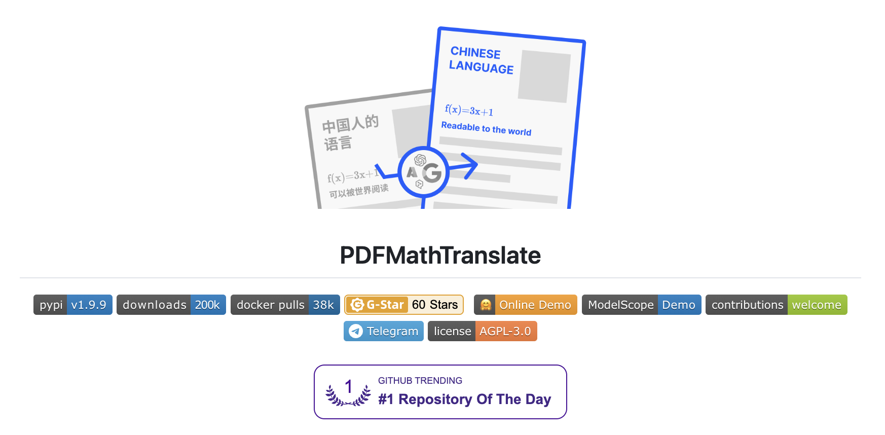
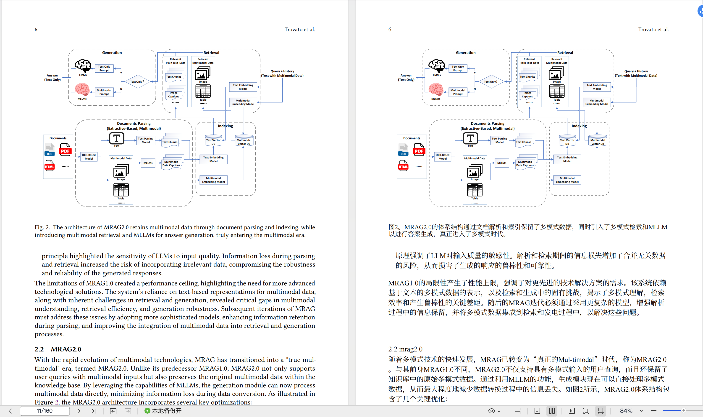
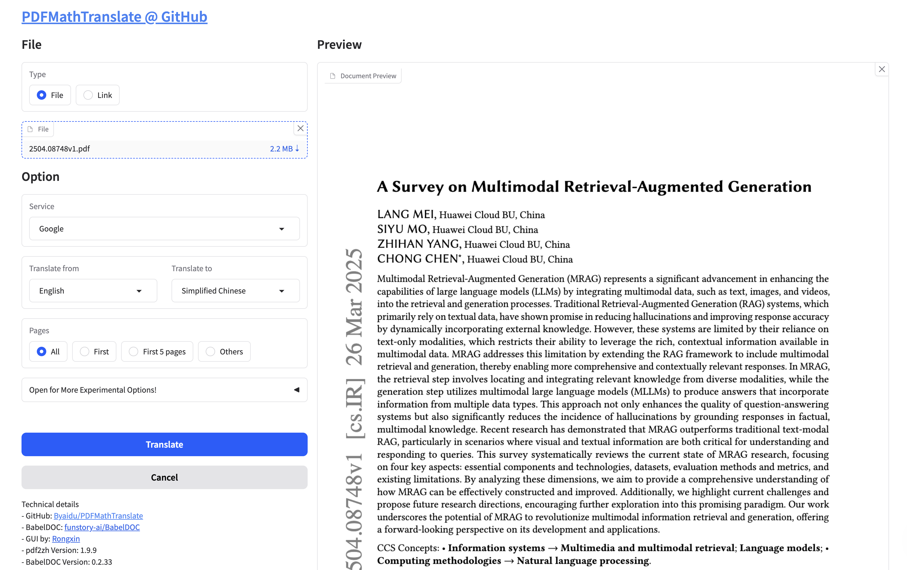

# PDFMathTranslate 介绍：一款免费开源的 PDF 文档翻译工具

最近几年 AI 技术发展很快，和 AI 相关的论文也是层出不穷，比如我关注的论文网站 arXiv 上，经常发布一些 PDF 论文，但是这些论文常常以英文呈现，对于英文不好的同学来说，阅读和理解这些论文是一大挑战。

今天给大家介绍一款免费开源的 PDF 文档翻译工具 PDFMathTranslate，可以在保留原文档排版的前提下，将文档内容翻译成中文，是数学、科学等领域学习者的必备神器！



项目地址：https://github.com/Byaidu/PDFMathTranslate

## 功能介绍

PDFMathTranslate 是一个专注于科学论文翻译的开源工具，能够将 PDF 文档全文翻译并生成双语对照版本。它的核心功能如下：

* **保留原文格式** ：翻译过程中保持论文中的公式、图表、目录结构和注释不变；
* **多语言支持** ：支持中文、英语、日语等100多种语言，可以在多种语言之间进行翻译；
* **多种翻译服务** ：支持 Google、DeepL、Ollama、OpenAI 等多种翻译服务或大模型服务，并支持 [Xinference](https://github.com/xorbitsai/inference) 本地模型；
* **全文翻译与部分翻译** ：支持全文翻译，或用户选定页面翻译；
* **双语对照** ：支持生成双语对照文件，方便用户对照原文和译文；
* **多种使用方式** ：提供命令行（CLI）、图形界面（GUI）、Docker 部署和 [Zotero](https://www.zotero.org/) 插件等多种使用方式，满足科研人员快速翻译和阅读的需求；
* **公共服务** ：提供在线翻译服务，用户无需安装任何软件；

## 安装 PDFMathTranslate

首先确保电脑上有 Python 环境，版本不低于 3.10 且不高于 3.12，然后使用 `pip install` 命令直接安装：

```
$ pip install pdf2zh
```

不过，官方推荐的安装方式是使用 `uv` 命令，不仅速度更快，而且对 Python 环境的管理更方便。我们可以通过下面的命令安装 `uv`：

```
$ pip install uv
```

[uv](https://docs.astral.sh/uv/) 是一个快速的 Python 包安装器和解析器，由 Astral 开发，旨在替代传统的 `pip`、`pip-tools` 和 `virtualenv` 等工具。主要特点如下：

* **极速性能** ：`uv` 使用 Rust 编写，相比传统工具速度提升显著，安装包的速度可以比 `pip` 快 10-100 倍；
* **兼容性** ：与现有的 Python 生态系统完全兼容，支持 `requirements.txt`、`pyproject.toml` 等标准格式；
* **虚拟环境管理** ：内置虚拟环境创建和管理功能，可以替代 `virtualenv` 命令；
* **依赖解析** ：提供先进的依赖解析器，可以替代 `pip-tools`，解决复杂的依赖关系；
* **工具管理** ：通过 `uv tool` 命令可以安装和管理全局 Python 工具，类似于 `pipx` 命令；

然后使用 [uv tool install](https://docs.astral.sh/uv/concepts/tools/) 安装：

```
$ uv tool install --python 3.12 pdf2zh
```

这行命令会创建一个 Python 3.12 的虚拟环境，并将 PDFMathTranslate 安装在该环境中，安装成功会列出所有的依赖包，可以看到 PDFMathTranslate 使用了不少优秀的开源项目，如下：

```
Resolved 117 packages in 16.69s
      Built peewee==3.18.1
      Built untokenize==0.1.1
Prepared 103 packages in 34.29s
Installed 117 packages in 535ms
 + aiofiles==24.1.0
 + annotated-types==0.7.0
 + anyio==4.9.0
 + azure-ai-translation-text==1.0.1
 + azure-core==1.34.0
 + babeldoc==0.2.33
 + bitarray==3.4.0
 + bitstring==4.3.1
 + certifi==2025.4.26
 + cffi==1.17.1
 + charset-normalizer==3.4.2
 + click==8.2.0
 + click-default-group==1.2.4
 + coloredlogs==15.0.1
 + configargparse==1.7
 + cryptography==44.0.3
 + deepl==1.22.0
 + deprecated==1.2.18
 + distro==1.9.0
 + docformatter==1.7.7
 + fastapi==0.115.12
 + ffmpy==0.5.0
 + filelock==3.18.0
 + flatbuffers==25.2.10
 + fonttools==4.58.0
 + freetype-py==2.5.1
 + fsspec==2025.3.2
 + gradio==5.29.0
 + gradio-client==1.10.0
 + gradio-pdf==0.0.22
 + groovy==0.1.2
 + h11==0.16.0
 + hf-xet==1.1.1
 + httpcore==1.0.9
 + httpx==0.28.1
 + huggingface-hub==0.31.1
 + humanfriendly==10.0
 + idna==3.10
 + imageio==2.37.0
 + isodate==0.7.2
 + jinja2==3.1.6
 + jiter==0.9.0
 + lazy-loader==0.4
 + levenshtein==0.27.1
 + lxml==5.4.0
 + markdown-it-py==3.0.0
 + markupsafe==3.0.2
 + mdurl==0.1.2
 + mpmath==1.3.0
 + msgpack==1.1.0
 + networkx==3.4.2
 + numpy==2.2.5
 + ollama==0.4.8
 + onnx==1.18.0
 + onnxruntime==1.22.0
 + openai==1.78.1
 + opencv-python==4.11.0.86
 + opencv-python-headless==4.11.0.86
 + orjson==3.10.18
 + packaging==25.0
 + pandas==2.2.3
 + pdf2zh==1.9.9
 + pdfminer-six==20250416
 + peewee==3.18.1
 + pikepdf==9.7.0
 + pillow==11.2.1
 + protobuf==6.30.2
 + psutil==7.0.0
 + pyclipper==1.3.0.post6
 + pycparser==2.22
 + pydantic==2.11.4
 + pydantic-core==2.33.2
 + pydub==0.25.1
 + pygments==2.19.1
 + pymupdf==1.25.2
 + python-dateutil==2.9.0.post0
 + python-levenshtein==0.27.1
 + python-multipart==0.0.20
 + pytz==2025.2
 + pyyaml==6.0.2
 + rapidfuzz==3.13.0
 + rapidocr-onnxruntime==1.4.4
 + regex==2024.11.6
 + requests==2.32.3
 + rich==14.0.0
 + ruff==0.11.9
 + safehttpx==0.1.6
 + scikit-image==0.25.2
 + scipy==1.15.3
 + semantic-version==2.10.0
 + shapely==2.1.0
 + shellingham==1.5.4
 + six==1.17.0
 + sniffio==1.3.1
 + socksio==1.0.0
 + starlette==0.46.2
 + sympy==1.14.0
 + tenacity==9.1.2
 + tencentcloud-sdk-python-common==3.0.1377
 + tencentcloud-sdk-python-tmt==3.0.1377
 + tifffile==2025.5.10
 + tiktoken==0.9.0
 + toml==0.10.2
 + tomlkit==0.13.2
 + toposort==1.10
 + tqdm==4.67.1
 + typer==0.15.3
 + typing-extensions==4.13.2
 + typing-inspection==0.4.0
 + tzdata==2025.2
 + untokenize==0.1.1
 + urllib3==2.4.0
 + uvicorn==0.34.2
 + websockets==15.0.1
 + wrapt==1.17.2
 + xinference-client==1.5.1
 + xsdata==25.4
Installed 1 executable: pdf2zh
```

## 使用 PDFMathTranslate

通过 `pdf2zh -v` 显示 PDFMathTranslate 版本号，确认安装无误：

```
$ pdf2zh -v
pdf2zh v1.9.9
```

然后就可以使用 PDFMathTranslate 的翻译功能了。我们先找一个英文的 PDF 文件，比如我最近在看的这篇关于多模态 RAG 的一个综述论文：

* https://arxiv.org/abs/2504.08748
* A Survey of Multimodal Retrieval-Augmented Generation

我们将其下载到本地，然后直接运行 `pdf2zh xxx.pdf` 即可：

```
$ pdf2zh ./2504.08748v1.pdf
```

运行结束后会在当前目录生成两个文件：`2504.08748v1-mono.pdf` 和 `2504.08748v1-dual.pdf`，其中 `mono` 文件是翻译后的中文 PDF 文件，而 `dual` 文件是中英双语 PDF 文件：



我认为这个功能非常赞，打开 PDF 文件时使用双页视图，双语的阅读体验非常好。

需要注意的是，PDFMathTranslate 在使用时会从 HuggingFace 下载一个模型 [wybxc/DocLayout-YOLO-DocStructBench-onnx](https://huggingface.co/wybxc/DocLayout-YOLO-DocStructBench-onnx) 用于 PDF 的布局分析，如果你访问 HuggingFace 时遇到网络问题，建议通过下面的命令将 HuggingFace 地址替换为国内的镜像源：

```
$ set HF_ENDPOINT=https://hf-mirror.com
```

由于使用了沉浸式翻译团队开源的 [BabelDOC](https://github.com/funstory-ai/BabelDOC) 项目，下载的模型位于 `~/.cache/babeldoc/models/` 位置。

另外，PDFMathTranslate 也提供了可视化 Web 页面，运行 `pdf2zh -i` 自动打开浏览器：

```
$ pdf2zh -i
[05/13/25 07:20:11] INFO     INFO:babeldoc.docvision.doclayout:Loading ONNX model...
                    INFO     INFO:babeldoc.docvision.doclayout:Available Provider: CPUExecutionProvider
* Running on local URL:  http://0.0.0.0:7860
* To create a public link, set `share=True` in `launch()`.
```

如果浏览器没有自动打开，手工访问 `http://localhost:7860/` 即可：



也可以使用 Docker 命令启动 Web 服务：

```
$ docker run -d -p 7860:7860 byaidu/pdf2zh
```

## 在线服务

我们也可以通过以下几个在线服务免安装体验 PDFMathTranslate 的功能：

* 官方的免费服务
    * https://pdf2zh.com/
* 沉浸式翻译提供的 BabelDOC 服务
    * https://app.immersivetranslate.com/babel-doc/
* 在 HuggingFace 上托管的演示
    * https://huggingface.co/spaces/reycn/PDFMathTranslate-Docker
* 在 ModelScope 上托管的演示
    * https://www.modelscope.cn/studios/AI-ModelScope/PDFMathTranslate

免费服务的计算资源有限，因此请避免滥用它们。
