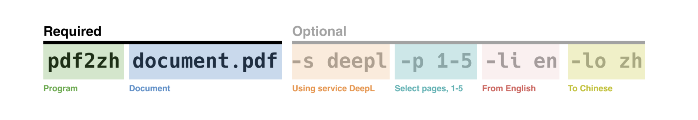
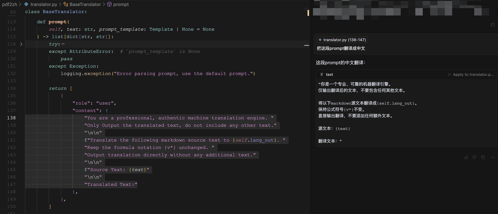
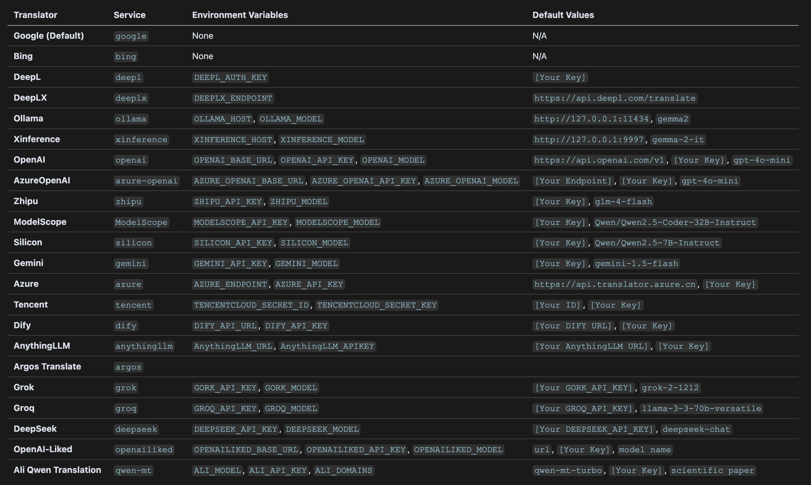

# 学习 PDFMathTranslate 的基本用法

昨天给大家介绍了 PDFMathTranslate 这款免费开源的 PDF 文档翻译工具，主要包括功能介绍、安装步骤以及基本使用。今天继续学习它的基本用法，介绍下它的几个基本命令行参数。

## 基本参数

初次使用 PDFMathTranslate 时，我们直接执行了下面这个不带任何参数的命令：

```
$ pdf2zh example.pdf
```

这个命令默认使用 Google 作为翻译服务，将 `example.pdf` 翻译成中文文档 `example-mono.pdf` 以及双语文档 `example-dual.pdf`。

翻译后的文档默认输出到当前工作目录中，可以通过 `-o` 指定输出目录：

```
$ pdf2zh example.pdf -o output_dir
```

下图是 PDFMathTranslate 的一些基本参数：



## 指定翻译文档

命令行的第一部分指定要翻译的文档，PDFMathTranslate 支持本地单个文档翻译，本地目录批量翻译，以及在线文档翻译。

本地单个文档翻译：

```
$ pdf2zh ~/local.pdf
```

本地目录批量翻译：

```
$ pdf2zh --dir /path/to/translate/
```

在线文档翻译：

```
$ pdf2zh http://arxiv.org/paper.pdf
```

## 指定翻译服务

PDFMathTranslate 支持传统的翻译服务，如 Google、Bing、DeepL 等，也支持使用大模型翻译，如 OpenAI、Gemini、DeepSeek 等。除了 Google 和 Bing 这两个免费的翻译服务，其他的服务在使用前需要通过环境变量设置必要的参数。

比如使用 DeepL 翻译，通过 `DEEPL_AUTH_KEY` 设置 API KEY：

```
$ export DEEPL_AUTH_KEY=xxx
$ pdf2zh example.pdf -s deepl
```

使用 OpenAI 大模型翻译，通过 `OPENAI_BASE_URL` 设置 API 接口地址，这对于一些 OpenAI 兼容的服务非常有用，另外 `OPENAI_API_KEY` 和 `OPENAI_MODEL` 分别用于设置 API KEY 和模型：

```
$ export OPENAI_BASE_URL=https://api.bianxie.ai/v1
$ export OPENAI_API_KEY=sk-xxx
$ export OPENAI_MODEL=gpt-4o-mini
$ pdf2zh example.pdf -s openai
```

当使用大模型翻译时，默认使用的 Prompt 如下：



可以通过 `--prompt` 参数进行修改，用户自定义的 Prompt 中可以使用 `lang_in`、`lang_out` 和 `text` 三个变量：

```
$ pdf2zh --prompt [prompt.txt]
```

下面是关于每个翻译服务所需环境变量的详细表格，在使用相应服务之前，请确保设置它们：



## 指定翻译范围

PDFMathTranslate 默认翻译整个 PDF 文档，可以通过 `-p` 指定只翻译部分页，多个页码之间使用逗号分割，连续页码可以用连字符连接：

```
$ pdf2zh example.pdf -p 1-3,5
```

## 指定翻译语言

通过 `-li` 和 `-lo` 设置源语言和目标语言，比如下面的命令表示从英文翻译成日文：

```
$ pdf2zh example.pdf -li en -lo ja
```

其中的语言编码符合 ISO 639-1 标准，可以参考 [Google Languages Codes](https://developers.google.com/admin-sdk/directory/v1/languages) 或 [DeepL Languages Codes](https://developers.deepl.com/docs/resources/supported-languages)。
