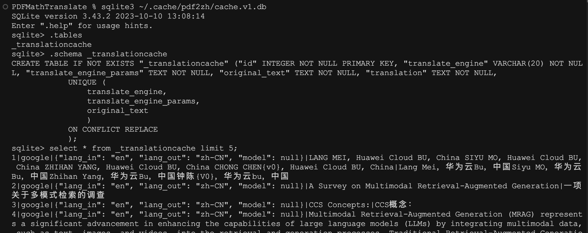
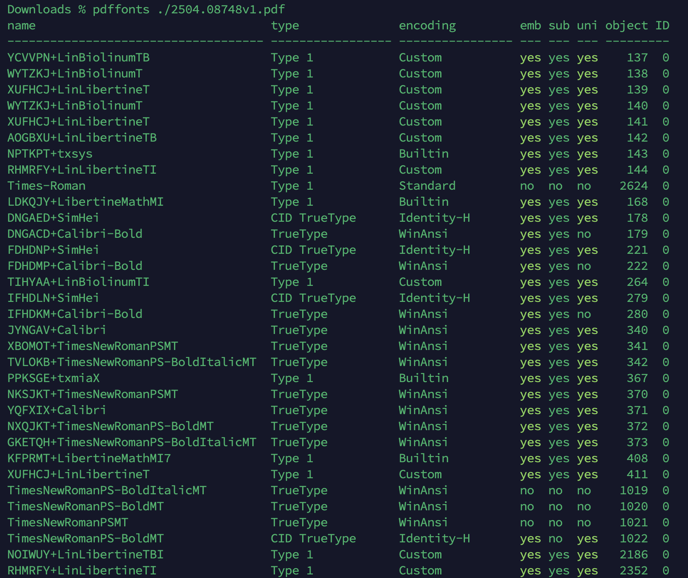
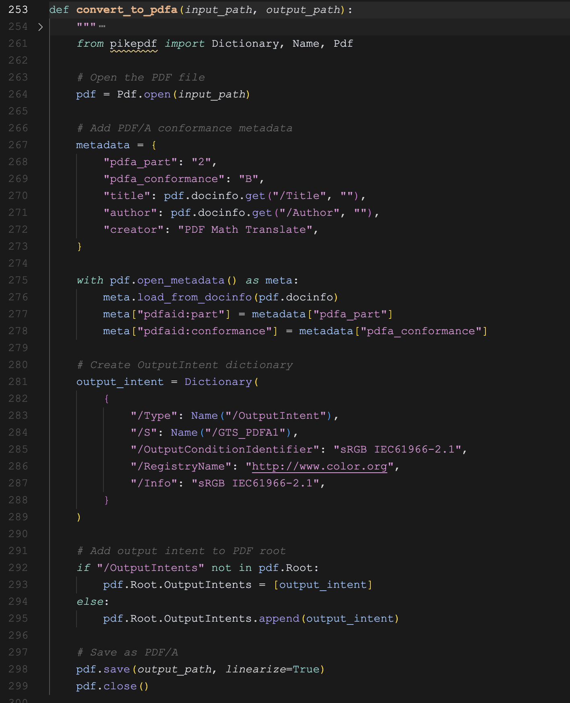
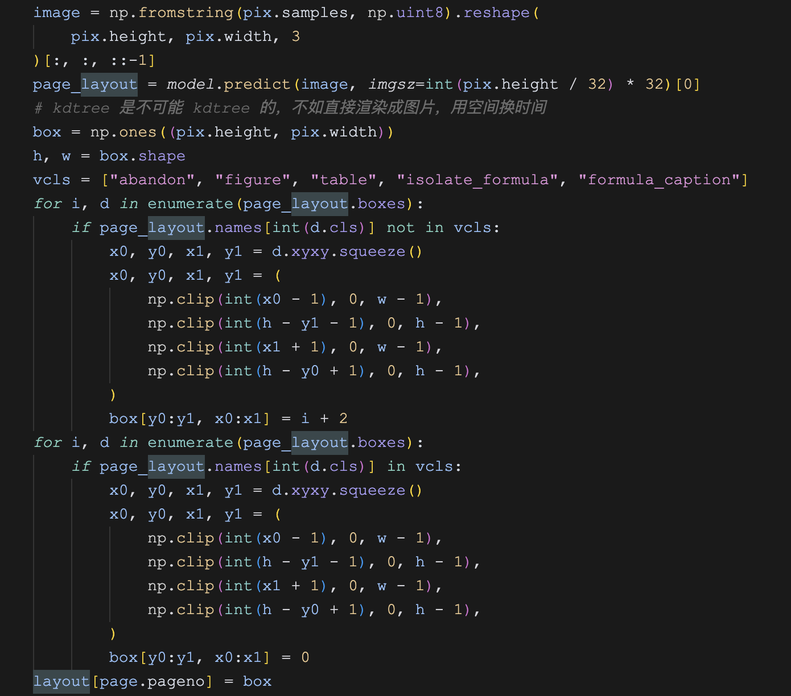

# 深入 PDFMathTranslate 的高级用法

昨天学习了 PDFMathTranslate 的基本用法，主要是一些简单的命令行参数。它的命令行参数还有很多，今天继续看看它的一些高级用法。

## 多线程

使用多线程可以显著提高翻译速度，特别是对于包含大量文本的文档。可以通过 `-t` 或 `--thread` 参数控制翻译时使用的线程数，默认值为 4：

```
$ pdf2zh example.pdf -t 8
```

## 忽略翻译缓存

PDFMathTranslate 在翻译的过程中会将原文和译文保存到缓存里，下次再遇到相同文本时直接使用缓存，这样不仅可以提高翻译速度，也避免了对相同内容进行不必要的 API 调用。

可以通过 `--ignore-cache` 参数来忽略翻译缓存，强制重新翻译：

```
$ pdf2zh example.pdf --ignore-cache
```

深入源码可以发现 PDFMathTranslate 使用 SQLite 作为缓存，缓存的文件位于 `~/.cache/pdf2zh/cache.v1.db`，感兴趣的同学可以打开这个文件研究下：



可以看到它使用 `翻译引擎`+`翻译引擎参数`+`原文` 三个参数作为唯一键：

```
UNIQUE (
    translate_engine,
    translate_engine_params,
    original_text
    )
ON CONFLICT REPLACE
```

## 处理特殊情况

PDFMathTranslate 的核心功能是翻译过程中保持论文中的公式、图表、目录结构和注释不变。其中公式识别是比较难做的，源码中有大量和公式相关的处理代码（参考 `TranslateConverter` 类的 `receive_layout()` 方法）。尽管如此，难免会遇到一些特殊情况，PDFMathTranslate 提供了 `-f` 和 `-c` 两个参数来允许我们手动处理这些例外。

这两个参数都是正则表达式，`-f` 表示需要保留的公式字体，`-c` 表示需要保留的字符，比如下面这个例子：

```
$ pdf2zh example.pdf -f "(CM[^RT].*|MS.*|.*Ital)" -c "(\(|\||\)|\+|=|\d|[\u0080-\ufaff])"
```

其中 `-f "(CM[^RT].*|MS.*|.*Ital)"` 使用正则表达式来匹配特定的字体名称：

- `CM[^RT].*` ：匹配以 `CM` 开头，后面不是 `R` 或 `T` 的字体，如 `CMSans`、`CMMono` 等；
- `MS.*` ：匹配以 `MS` 开头的字体，如 `MSGothic`、`MSSong` 等；
- `.*Ital` ：匹配以 `Ital` 结尾的字体，如 `TimesItal`、`ArialItal` 等；

后面的 `-c "(\(|\||\)|\+|=|\d|[\u0080-\ufaff])"` 匹配特定的字符：

- `\(` ：左括号
- `\|` ：竖线符号
- `\)` ：右括号
- `\+` ：加号
- `=` ：等号
- `\d` ：任何数字（0-9）
- `[\u0080-\ufaff]` ：Unicode 范围从 0x0080 到 0xfaff 的字符，这个范围包含了大多数非 ASCII 字符，包括中文、日文、韩文等 CJK 字符；

或者下面这个更复杂的例子，保留 `Latex` 、 `Mono` 、 `Code` 、 `Italic` 、 `Symbol` 和 `Math` 字体：

```
$ pdf2zh example.pdf -f "(CM[^R]|MS.M|XY|MT|BL|RM|EU|LA|RS|LINE|LCIRCLE|TeX-|rsfs|txsy|wasy|stmary|.*Mono|.*Code|.*Ital|.*Sym|.*Math)"
```

这些字体一般都是数学公式中常用的字体，这对于正确识别和保留数学公式非常重要，确保 PDFMathTranslate 不会尝试翻译数学符号，而是保持它们的原样。

可以使用 `Poppler` 的 `pdffonts` 命令查看某个 PDF 文件使用的所有字体：



## 兼容模式

`PDF/A` 是一种专为长期电子文档归档设计的国际标准格式，它解决了普通 PDF 可能面临的长期可读性挑战，确保文档在未来数十年内无论使用何种软硬件环境仍可访问和完整呈现。`PDF/A` 通过三大核心原则实现这一目标：**自包含性**（嵌入所有字体和资源）、**自文档化**（包含标准元数据）和 **自描述性**（禁用外部依赖）。它禁止使用 `JavaScript`、外部链接和多媒体内容等不稳定元素，同时要求文档包含必要的结构信息。这使其成为法律文档、医疗记录、学术论文和政府档案等重要信息的理想载体，既满足合规要求，又保障内容的长期可用性和完整性。

PDFMathTranslate 支持通过 `--compatible` 或 `-cp` 参数将 PDF 转换为 `PDF/A` 格式，提高 PDF 文件的兼容性：

```
$ pdf2zh example.pdf --compatible
```

在遇到 PDF 解析问题时，可以考虑这个参数试试。

值得一提的是，这个功能主要是通过 [pikepdf](https://github.com/pikepdf/pikepdf) 这个 PDF 库实现的：



## 跳过字体子集化

**字体子集化（Fonts subsetting）** 是一种字体处理技术，用于减少字体文件的大小。具体来说，它从一个完整的字体文件中提取出只需要的字符或字形，从而创建一个包含所需字符的较小的字体文件。这在 **网页设计**、**移动应用开发** 和 **文档生成** 等场景中非常有用，能够提高加载速度和性能，同时也可以减少占用的存储空间。

> 上面 `pdffonts` 命令的输出结果中，`ABCDEF+XXX` 这种格式的字体其实就是子集化字体。

默认情况下，PDFMathTranslate 会使用字体子集化来减小输出文件的大小。可以通过 `--skip-subset-fonts` 参数跳过这个步骤：

```
$ pdf2zh example.pdf --skip-subset-fonts
```

使用这个参数的主要原因是解决兼容性问题。在某些情况下，字体子集化可能会导致生成的 PDF 文件在某些阅读器上无法正确显示，特别是那些对字体处理有特殊要求的阅读器。当你发现翻译后的文件在某些 PDF 阅读器中显示不正确或排版有问题时，可以尝试使用这个参数。

PDFMathTranslate 的字体子集化使用的是 [PyMuPDF](https://github.com/pymupdf/PyMuPDF) 的 `Document.subset_fonts()` 方法实现的：

```
if not skip_subset_fonts:
    doc_zh.subset_fonts(fallback=True)
    doc_en.subset_fonts(fallback=True)
```

## 使用自定义的 DocLayout 模型

PDFMathTranslate 在使用时会从 HuggingFace 下载一个模型 [wybxc/DocLayout-YOLO-DocStructBench-onnx](https://huggingface.co/wybxc/DocLayout-YOLO-DocStructBench-onnx) 用于 PDF 的布局分析，可以使用 `--onnx` 这个参数指定自己训练或微调的 ONNX 模型来替代默认模型：

```
$ pdf2zh --onnx [onnx/model/path]
```

DocLayout 模型一般用于确定文档中的不同元素（如文本、图形、表格、公式等）的位置，下面这段代码是使用 ONNX 模型对 PDF 页面进行布局分析并处理的核心部分：



这段代码的大致逻辑如下：

1. 使用 ONNX 模型识别 PDF 页面中的各种元素（文本、图片、表格、公式等）；
2. 创建一个"蒙版"矩阵，标记页面上需要翻译的区域（值>1）和不需要翻译的区域（值=0）；
3. 这个蒙版矩阵后续会被用于指导翻译过程，确保只翻译正常文本而保留图片、表格和数学公式等不需要翻译的内容；

## 使用 BabelDOC 后端

[BabelDOC](https://funstory-ai.github.io/BabelDOC/) 是沉浸式翻译团队提供的 PDF 翻译服务，可以通过他们的在线页面进行体验：

* https://app.immersivetranslate.com/babel-doc/

同时他们也将其核心部分开源了出来。PDFMathTranslate 支持通过 `--babeldoc` 参数，允许用户使用 BabelDOC 作为后端进行 PDF 翻译，而不是使用 pdf2zh 的默认后端：

```
pdf2zh --babeldoc -s openai example.pdf
```

使用 BabelDOC 后端目前还处于实验特性，如果默认翻译有问题的话可以尝试下。
