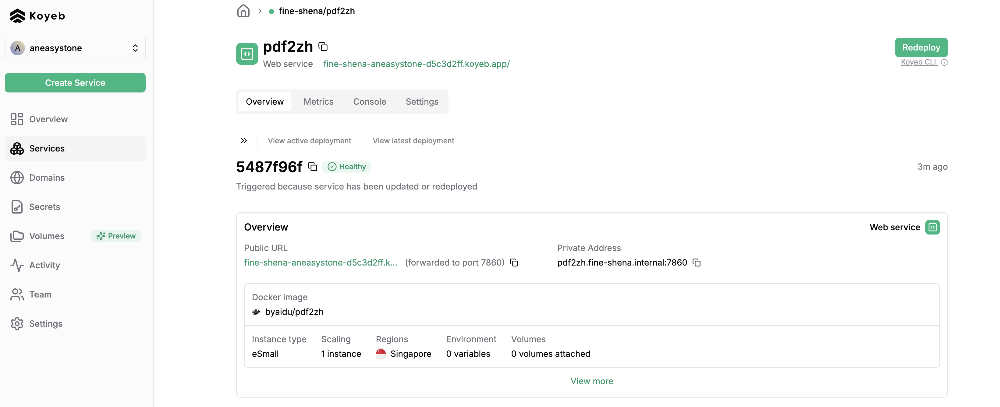

# 学习 PDFMathTranslate 的 Web UI

这两天对 PDFMathTranslate 的命令行用法大致学习了一遍。首先，我们学习了它的基本参数，使用基本参数已经可以满足我们的日常需要，然后在高级参数里，我们又深入研究了它的实现原理。除了使用命令行，PDFMathTranslate 还提供了可视化 Web 页面，这可以方便我们搭建自己的 PDF 翻译服务，今天就继续看看 Web UI 的使用。

## 使用 Web UI

输入 `pdf2zh -i` 命令启动 Web 服务：

```
$ pdf2zh -i
```

启动后通过浏览器访问 `http://localhost:7860/` 即可进入 PDFMathTranslate 的 Web 页面：


> 启动如果报错，注意看下电脑上是不是开启了全局代理。

## 修改端口号

Web 服务默认端口为 7860，可以通过 `--serverport` 参数修改：

```
$ pdf2zh -i --serverport 7861

* Running on local URL:  http://0.0.0.0:7861
```

## 公开链接

通过上面的命令启动 Web 服务只能在本机通过 localhost 访问，或者同一局域网的人通过你的内网 IP 访问。PDFMathTranslate 支持为我们的 Web 服务生成一个公开链接，分享给互联网上的其他人访问：

```
$ pdf2zh -i --share

* Running on public URL: https://8e15230244c69bee4e.gradio.live
```

这是通过 HuggingFace 提供的 [Gradio](https://www.gradio.app/) 服务实现的：


Gradio 能为我们分配一个公共 URL，这个 URL 会反向代理到你的本地应用。注意这个 URL 是临时的，有效期通常是 1 个星期。

> 其实，PDFMathTranslate 的整个 Web UI 功能就是基于 [gradio](https://github.com/gradio-app/gradio) 库实现的，这个库看上去蛮有意思，可以让 Python 开发人员不写任何前端代码实现一个 Web 页面，后面有机会专门学习下这个库。

## 用户认证

如果不想让你的 Web 服务对所有人开放，可以开启用户认证功能。首先建一个 `users.txt` 文件：

```
admin,123456
test,test
```

文件中每行代表一条用户信息，包含用户名和密码，用逗号分隔。然后通过 `--authorized` 参数启动：

```
$ pdf2zh -i --authorized users.txt
```

再次打开 Web 页面，就需要输入用户名和密码：


我们还可以对登录页面做一些定制，比如修改标题或加一些自己的文案。创建一个 `auth.html` 文件：

```html
<!DOCTYPE html>
<html>
<head>
    <title>Simple HTML</title>
</head>
<body>
    <h1>Hello, World!</h1>
    <p>Welcome to my simple HTML page.</p>
</body>
</html>
```

通过下面的命令启动：

```
$ pdf2zh -i --authorized users.txt auth.html
```

刷新登录页面，如下：


## 指定配置文件

当我们自己部署 PDFMathTranslate 的 Web 服务并分享给别人使用时，还有两个问题需要特别注意。第一个问题是，默认情况下 PDFMathTranslate 在翻译服务列表中会显示所有支持的服务：


但是很显然，可能只有几个服务是可用的，其他的服务不希望显示在下拉列表中。另一个问题是，当我们选某个翻译服务时，这个翻译服务的配置信息也会显示出来：


这会把我们的 API KEY 泄露出去，这也是公开部署时不希望看到的。

为了解决这两个问题，PDFMathTranslate 支持在配置文件中设置 `ENABLED_SERVICES` 和 `HIDDEN_GRADIO_DETAILS` 两个参数：

* **ENABLED_SERVICES** - 控制选项列表中仅显示启用的服务；
* **HIDDEN_GRADIO_DETAILS** - 隐藏真实的 API KEY，防止用户获取服务器端密钥；

默认情况下，PDFMathTranslate 的配置文件保存在 `~/.config/PDFMathTranslate/config.json` 中，可以通过 `--config` 参数修改配置文件的位置：

```
$ pdf2zh -i --config /path/to/config/config.json
```

程序首先读取 `config.json` 的内容，然后读取环境变量的内容，当环境变量可用时，优先使用环境变量，同时更新文件。修改后的配置文件如下：


其中，Google 和 Bing 翻译服务默认就有，不用配置。

## 部署到云平台

PDFMathTranslate 的 Web 服务可以使用 Docker 部署：

```
$ docker run -d -p 7860:7860 byaidu/pdf2zh
```

因此也可以很方便地部署到云平台上：


这里列出的是一些比较热门的云应用部署平台：

* [Heroku](https://www.heroku.com/) - The AI PaaS for Deploying, Managing, and Scaling Apps
* [Render](https://render.com/) - Cloud Application Platform
* [Zeabur](https://zeabur.com/) - Deploy Painlessly, Scale Infinitely
* [Sealos](https://sealos.io/) - Develop, deploy, and scale in one seamless cloud platform
* [Koyeb](https://www.koyeb.com/) - High-performance Infrastructure for APIs, Inference, and Databases

这几个基本上都需要付费使用的，免费的额度内存太小部署不起来。其中 Koyeb 有几天 Pro 权益的试用，我体验下来感觉还可以，感兴趣的朋友可以尝试下。


