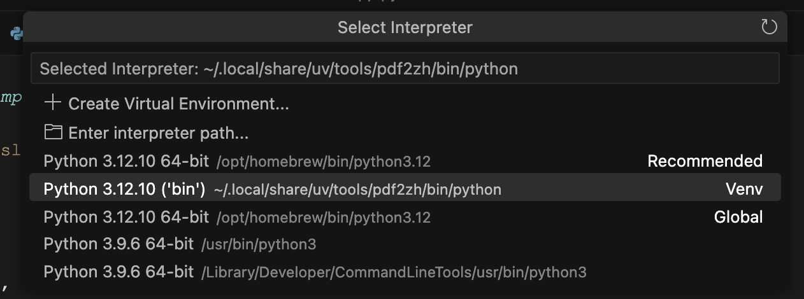
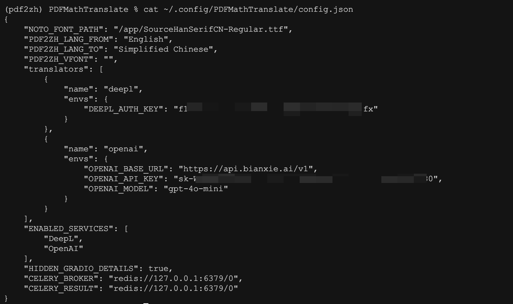

# 基于 PDFMathTranslate 的二次开发

经过前几天的学习，我们对 PDFMathTranslate 这款 PDF 翻译工具应该基本上会用了，不仅可以自己用，还可以做成 Web 页面分享给别人用。如果只是将 PDFMathTranslate 作为工具使用的话，没有问题，但是如果希望将 PDF 翻译这个功能集成到我们自己的产品或应用中，那么就需要二次开发了。今天是 PDFMathTranslate 系列的最后一篇，关于如何使用它的 SDK 或 API 进行二次开发。

## Python SDK

`pdf2zh` 不仅是一个命令行工具，同时它也是一个 Python 模块，它提供了两个方法，以便在其他程序中调用：

```python
from pdf2zh import translate, translate_stream
```

要注意的是，之前我们安装 `pdf2zh` 的命令如下：

```sh
$ uv tool install --python 3.12 pdf2zh
```

这行命令会创建一个 Python 3.12 的虚拟环境，并将 `pdf2zh` 及其依赖安装在该环境中，因此在开发时，可以将 Python 环境指向这个虚拟环境。

那么这个虚拟环境的位置在哪呢？可以先通过 `which pdf2zh` 查看 `pdf2zh` 的安装位置：

```sh
$ which pdf2zh
/Users/aneasystone/.local/share/uv/tools/pdf2zh/bin/pdf2zh
```

然后再看下这个脚本的内容：

```sh
% cat /Users/aneasystone/.local/share/uv/tools/pdf2zh/bin/pdf2zh
#!/Users/aneasystone/.local/share/uv/tools/pdf2zh/bin/python
# -*- coding: utf-8 -*-
import sys
from pdf2zh.pdf2zh import main
if __name__ == "__main__":
    if sys.argv[0].endswith("-script.pyw"):
        sys.argv[0] = sys.argv[0][:-11]
    elif sys.argv[0].endswith(".exe"):
        sys.argv[0] = sys.argv[0][:-4]
    sys.exit(main())
```

脚本开头的 `#!` 符号后面就是它使用的 Python 虚拟环境的位置，可以将 IDE 的 Interpreter 设置成这个：



`pdf2zh` 提供的两个方法都比较简单，`translate` 方法用于直接翻译 PDF 文件，运行效果和命令行几乎一样：

```python
from pdf2zh.doclayout import OnnxModel
params = {
    'lang_in': 'en',
    'lang_out': 'zh',
    'service': 'google',
    'thread': 4,
    'model': OnnxModel.load_available()
}

(file_mono, file_dual) = translate(files=['example.pdf'], **params)[0]
print(file_mono, file_dual)
```

> 注意这里的 `model` 参数必须设置，这个在官方文档中是缺失的，可以使用默认的 `OnnxModel.load_available()`，否则运行会报错。

运行成功后，在当前目录生成 `example-mono.pdf` 和 `example-dual.pdf` 两个文件。

`translate_stream` 方法用于输出文件流，这个方式的好处是可以自己控制输出哪个文件、输出位置以及文件名：

```python
with open(filepath, 'rb') as f:
    (stream_mono, stream_dual) = translate_stream(stream=f.read(), **params)
    with open('./dual.pdf', 'wb') as dual:
        dual.write(stream_dual)
```

## HTTP API

PDFMathTranslate 默认安装是不带 HTTP API 功能的，我们必须安装 `pdf2zh` 的 `backend` 模块：

```sh
$ uv tool install --python 3.12 "pdf2zh[backend]"
```

安装结束后，`pdf2zh` 命令会多两个参数 `--flask` 和 `--celery`。

在使用 PDFMathTranslate 的 API 功能之前，还需要启动 Redis 服务：

```sh
$ docker run -d -p 6379:6379 redis:alpine
```

这是因为它的 API 是通过 Celery 任务队列异步实现的，默认使用的 Broker 和 Backend 是 Redis 服务：

```python
flask_app = Flask("pdf2zh")
flask_app.config.from_mapping(
    CELERY=dict(
        broker_url=ConfigManager.get("CELERY_BROKER", "redis://127.0.0.1:6379/0"),
        result_backend=ConfigManager.get("CELERY_RESULT", "redis://127.0.0.1:6379/0"),
    )
)
```

可以在配置文件中修改 `CELERY_BROKER` 和 `CELERY_RESULT` 参数：



> [Celery](https://github.com/celery/celery) 是一个基于 Python 的 **分布式任务队列（Distributed Task Queue）**，主要用于处理异步任务和定时任务。它可以让你把一些耗时的操作（比如发送邮件、处理图片、数据分析等）放到后台去执行，而不会阻塞主程序的运行。Celery 通过 **消息中间件（Broker）** 来传递任务，常用的有 Redis、RabbitMQ、Amazon SQS 等。

### Flash Web 服务

当以 `--flask` 参数启动时，代码会调用 `flask_app.run(port=11008)`，即以 11008 端口启动 Flask Web 服务：

```sh
$ pdf2zh --flask
 * Serving Flask app 'pdf2zh'
 * Debug mode: off
 * Running on http://127.0.0.1:11008
```

此时我们就可以调用 HTTP 接口了。

首先，提交任务：

```sh
$ curl http://localhost:11008/v1/translate \
    -F "file=@2504.08748v1.pdf" \
    -F "data={\"lang_in\":\"en\",\"lang_out\":\"zh\",\"service\":\"google\",\"thread\":4}"
{"id":"2294c23a-8fbe-4ab6-9d57-c6ece0cd9e9e"}
```

该接口返回任务 ID，通过 ID 可以查看任务状态和进度：

```sh
$ curl http://localhost:11008/v1/translate/2294c23a-8fbe-4ab6-9d57-c6ece0cd9e9e
```

等待处理状态：

```json
{"state":"PENDING"}
```

处理中状态：

```json
{"info":{"n":5,"total":80},"state":"PROGRESS"}
```

处理结束状态：

```json
{"state":"SUCCESS"}
```

当任务状态为 `SUCCESS` 时，即可下载翻译后的文件：

```sh
# 中文版本
$ curl http://localhost:11008/v1/translate/2294c23a-8fbe-4ab6-9d57-c6ece0cd9e9e/mono \
    --output example-mono.pdf

# 双语版本
$ curl http://localhost:11008/v1/translate/2294c23a-8fbe-4ab6-9d57-c6ece0cd9e9e/dual \
    --output example-dual.pdf
```

### Celery Worker

当以 `--celery` 参数启动时，代码会调用 `celery_app.start(argv=sys.argv[2:])`，即用命令行参数启动 Celery Worker：

```
$ pdf2zh --celery worker
 
 -------------- celery@aneasystone.local v5.5.2 (immunity)
--- ***** ----- 
-- ******* ---- macOS-15.3.2-arm64-arm-64bit 2025-05-17 07:14:05
- *** --- * --- 
- ** ---------- [config]
- ** ---------- .> app:         pdf2zh:0x12d604a40
- ** ---------- .> transport:   redis://127.0.0.1:6379/0
- ** ---------- .> results:     disabled://
- *** --- * --- .> concurrency: 8 (prefork)
-- ******* ---- .> task events: OFF (enable -E to monitor tasks in this worker)
--- ***** ----- 
 -------------- [queues]
                .> celery           exchange=celery(direct) key=celery
```

参考 `pdf2zh/backend.py` 的代码，可以调用 `translate_task.delay()` 来向 Celery Worker 提交任务：

```python
from pdf2zh.backend import translate_task

with open(filepath, 'rb') as f:
    task = translate_task.delay(f.read(), params)
    print(task.id)
    
    while True:
        time.sleep(1)
        if str(task.state) == "PROGRESS":
            print('state: ', task.state, 'info: ', task.info)
        else:
            print('state: ', task.state)
        if str(task.state) == "SUCCESS":
            break

    doc_mono, doc_dual = task.get()
    with open('./dual.pdf', 'wb') as dual:
        dual.write(doc_dual)
```

## 小结

至此，关于 PDFMathTranslate 的学习暂时就告一段落了，除了 SDK 和 API 之外，PDFMathTranslate 还提供了 MCP 工具，方便我们在 AI 工具中使用，或者用在智能体应用的开发中，感兴趣的朋友可以继续探究。

从 PDFMathTranslate 的学习中我们可以看到，虽然这只是一个小小的工具，解决的也只是一个小小的 PDF 翻译问题，但是麻雀虽小，五脏俱全，从命令行工具，到 Web 页面，到 Docker 部署和云部署，到 SDK、API、MCP 样样俱全，满足了各类人群的需求，这也是它为什么在开源社区如此流行的原因，目前 Github 上星标已经超过 23K。通过对 PDFMathTranslate 的深入学习和探索，可以看到一个流行的开源项目是怎么做的，希望能给大家一些启发。
