# NotebookLM 介绍：Google 打造的 AI 笔记助手

在当今信息爆炸的时代，我们每天都面临着海量的数据和知识。如何高效地处理、理解和应用这些信息，成为了现代学习者、研究者和专业人士的重要挑战。为了解决这一问题，Google 推出了一款革命性的 AI 工具 —— NotebookLM，这是一款基于最新的 Gemini 大模型构建的研究与笔记助手，旨在为用户提供个性化的 AI 研究助手体验。

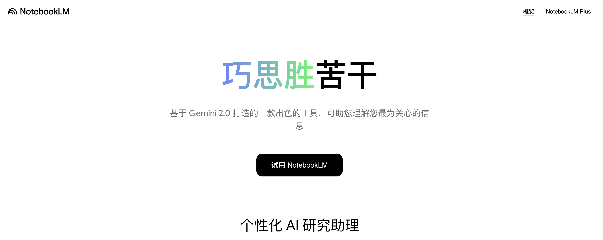

NotebookLM 的核心理念是 **Think Smarter, Not Harder（巧思胜苦干）**，与传统的笔记工具不同，NotebookLM 不仅能够存储信息，还能深入理解内容，建立知识连接，并基于用户提供的可信资料生成有价值的洞察。

## 核心特性

NotebookLM 具备如下几个核心特性：

* **多样化资料上传和处理**：基于 Gemini 2.0 的多模态理解能力，NotebookLM 能够处理各种类型的资料，包括 PDF 文件、网站、YouTube 视频、音频文件、Google 文档或 Google 幻灯片等；
* **智能问答与深度洞察**：基于上传的资料，NotebookLM 能够回答用户的各种问题，提供深度洞察。它的回答都基于用户提供的资料，并附带精确引用，显示信息来源，确保了回答的可靠性和可验证性；
* **一键生成多种内容格式**：NotebookLM 能够自动生成多种实用的内容格式，包括内容摘要、常见问题解答(FAQ)、时间线、简报文档和脑图等；
* **随时随地边听边学**：全新的 “音频概览” 功能可将文本内容转换为类似播客的音频讨论，便于移动学习，提升学习体验；

下面带大家一起体验下 NotebookLM 的基本功能。

## 添加数据源

创建一个新笔记，第一步需要添加笔记的数据源：

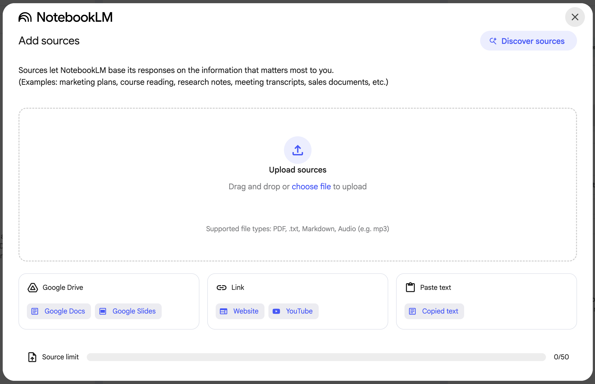

这里支持多种途径添加数据源：

* 上传文件：支持上传 PDF、TXT、Markdown 以及音频等格式的文件；
* Google Drive：支持导入 Google Drive 中的文档和幻灯片；
* 链接：支持输入网页或 Youtube 视频地址；
* 粘贴文本：支持手工复制粘贴添加数据源内容；

另外，右上角还有一个 "Discover sources" 的功能，可以输入你感兴趣的话题进行检索：

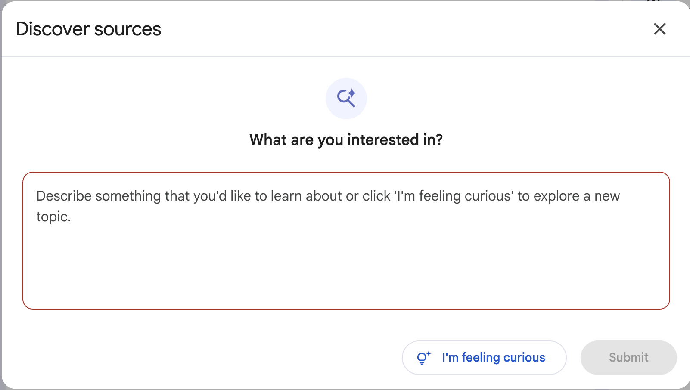

如果你第一次使用这个工具，可能一时想不到什么话题，可以尝试点击下面的 "I'm feeling curious"，NotebookLM 会随机搜索一些话题供你参考。下面是我输入 "多模态检索增强生成" 后搜索的结果：

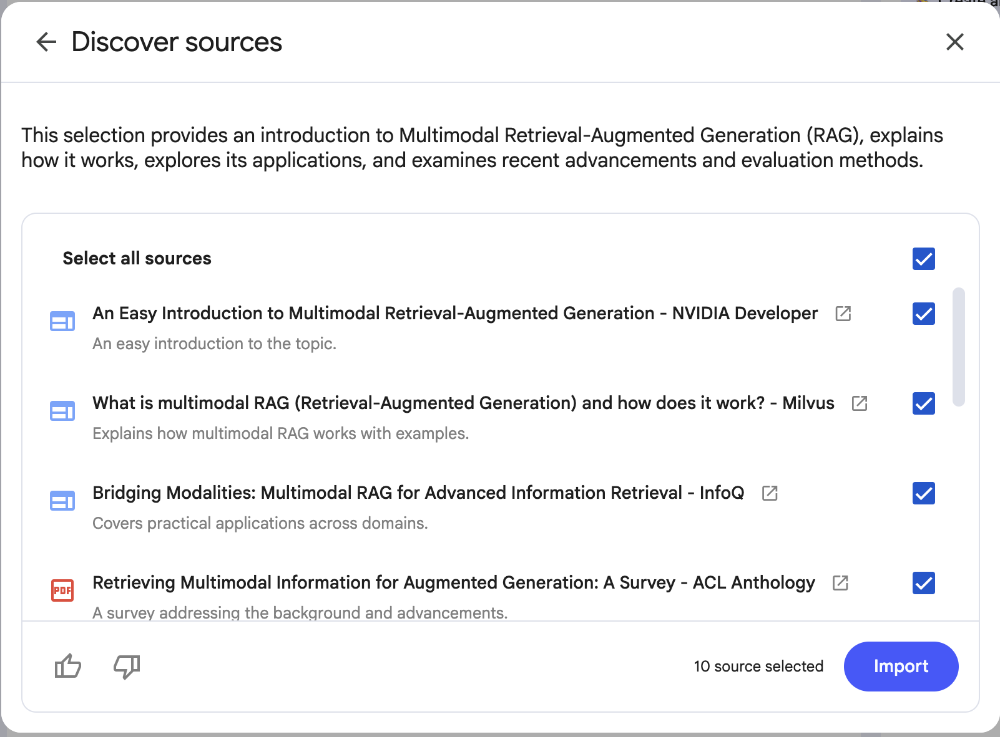

可以看到搜索的质量还蛮高的，对于手头没有资料又想学习某个主题的用户非常友好。不过我这里暂时不用这些，而是使用最近在看的一篇关于多模态 RAG 的综述论文《A Survey of Multimodal Retrieval-Augmented Generation》：

* https://arxiv.org/abs/2504.08748

将这篇论文的 PDF 上传后，NotebookLM 自动生成了笔记的标题和简要概述，如下：

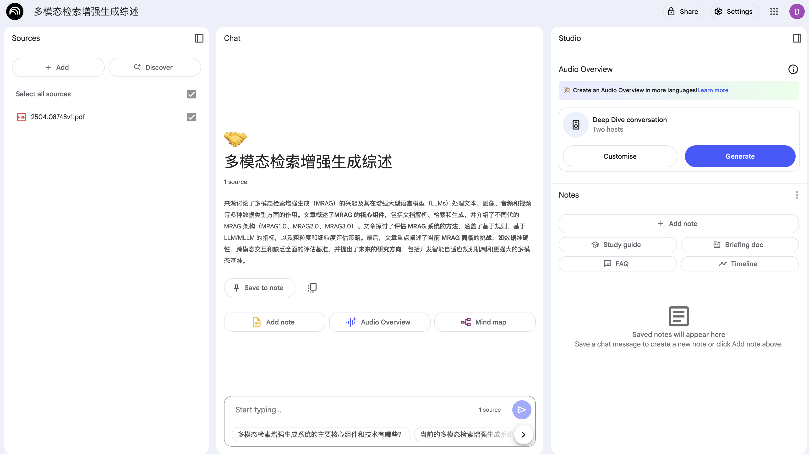

## 知识问答

NotebookLM 的整个面板分成三个部分：

* Sources
* Chat
* Studio

"Sources" 部分我们仍然可以继续添加新的数据源，"Chat" 部分可以对我们上传的数据进行提问：

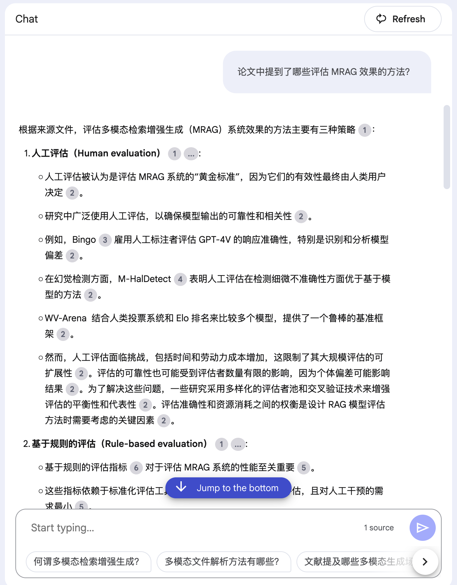

问答的结果支持点击数字角标进行溯源：

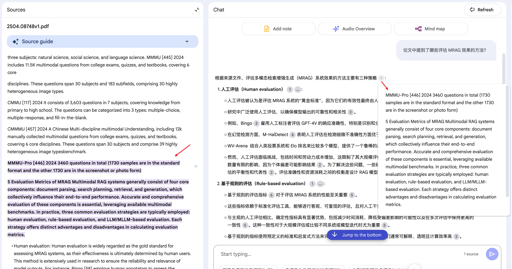

## 内容生成

NotebookLM 还支持根据你添加的数据源生成多种实用的内容格式，包括：

* 脑图（Mind map）

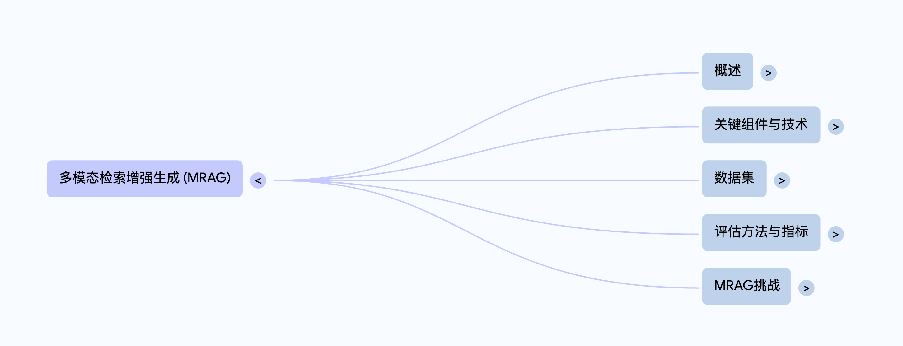

* 学习指南（Study guide）

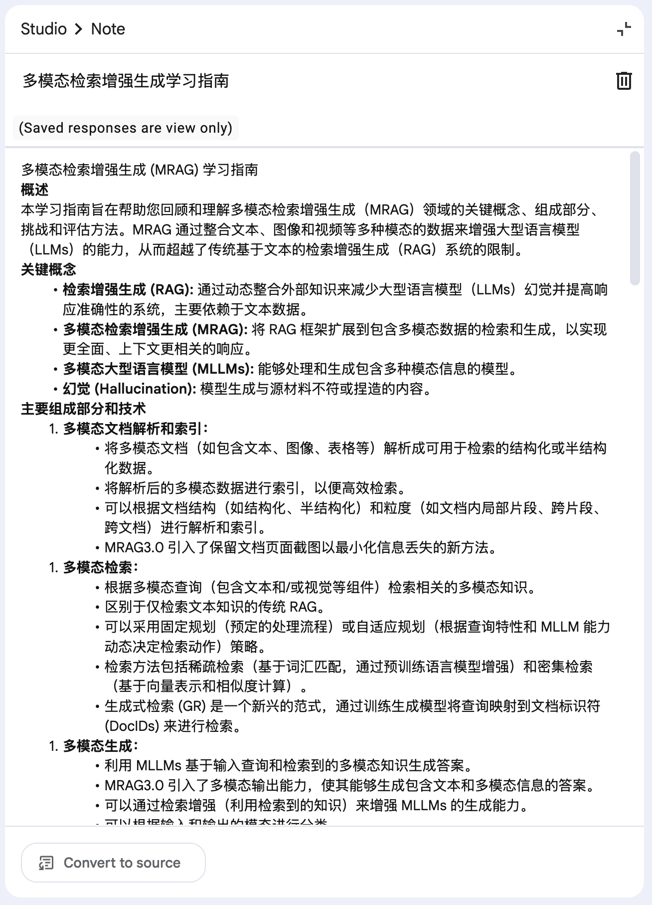

* 简报文档（Briefing doc）

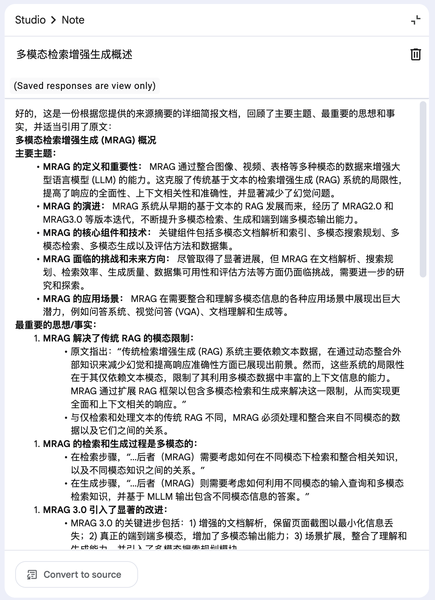

* 常见问题（FAQ）

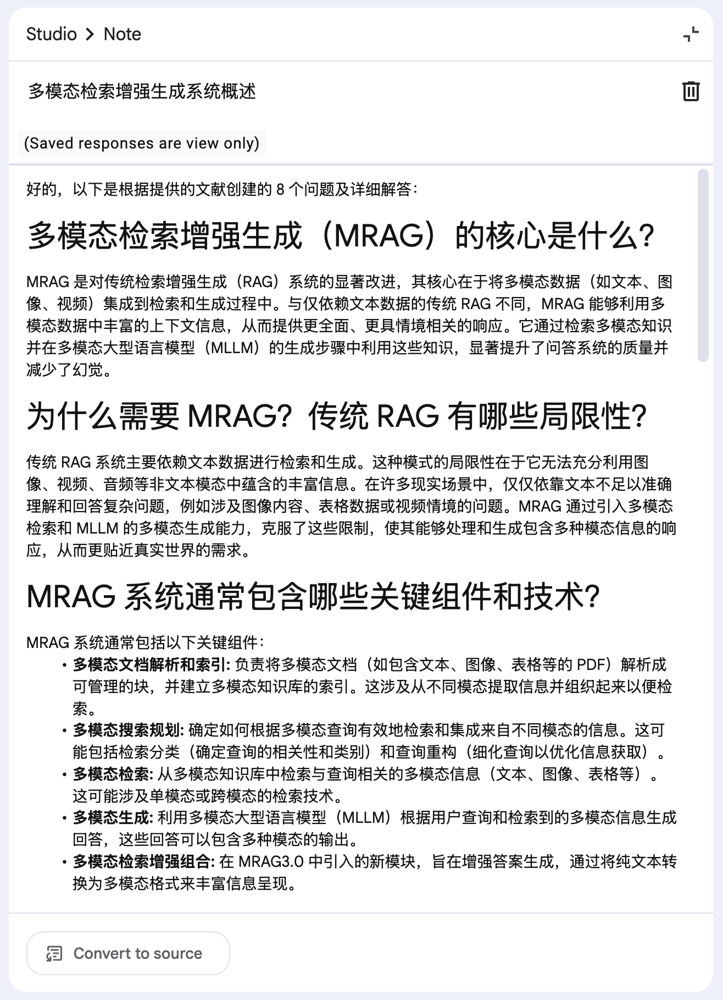

* 时间线（Timeline）

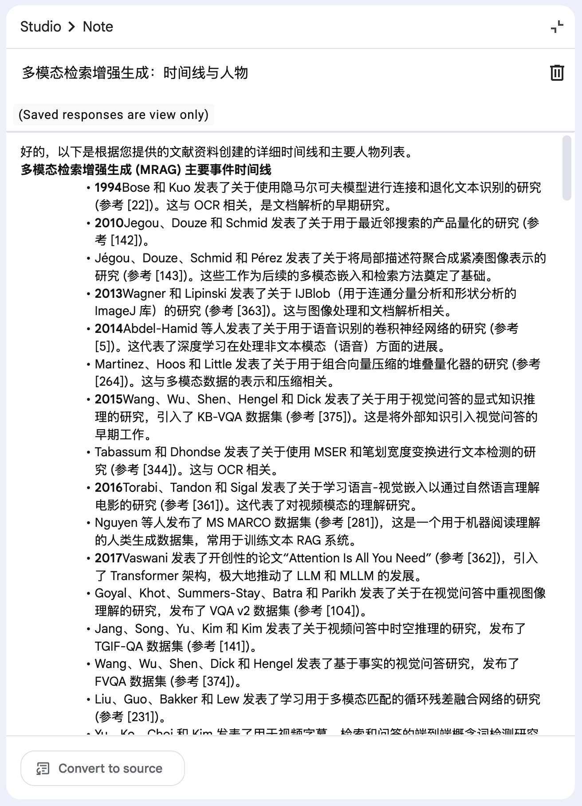

## 音频概览

最后是音频概览（Audio Overview）功能，它可以说是 NotebookLM 的杀手锏，也是它广受好评的主要原因。

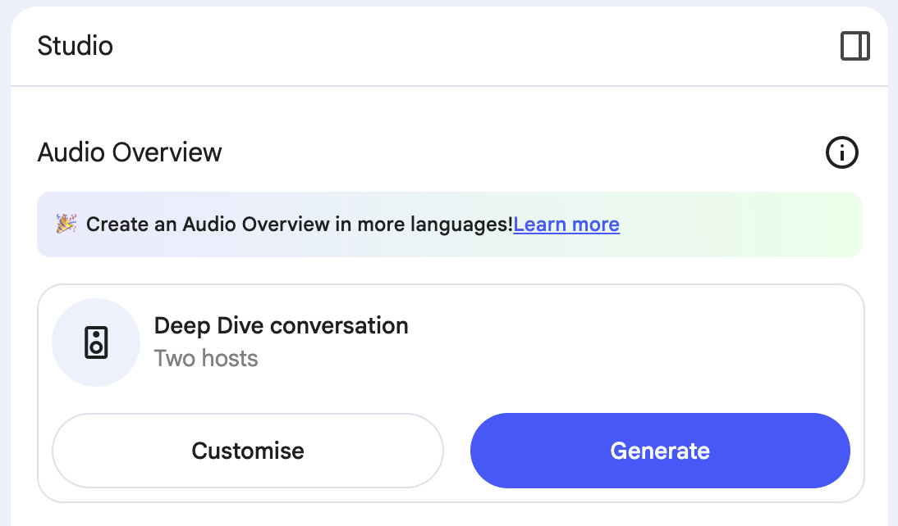

用户只需一键点击，就可以将文本内容转换为类似播客的音频讨论，这一功能特别适合那些喜欢听觉学习或需要在通勤、运动等场景下继续学习的用户。

NotebookLM 默认生成英文播客，[但就在最近](https://blog.google/technology/google-labs/notebooklm-audio-overviews-50-languages/)，Google 宣布已支持中文等超过 50 种不同语言的音频生成，可以在用户配置中修改输出语言选项来生成中文音频。

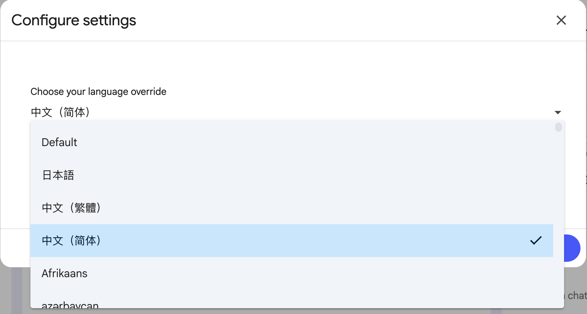

下面是我生成的关于 多模态检索增强生成综述 的播客，感兴趣的朋友可以试听下：

* [英文版](https://notebooklm.google.com/notebook/cd9fae7e-6320-4f53-9dfc-de64fc3afb14/audio)
* [中文版](https://notebooklm.google.com/notebook/d917d76e-619f-42bc-856c-f56b02d44064/audio)

可以听出来，英文的效果非常丝滑，中文的语速有点慢，但总体也是不错的，在通勤或运动时听听还是挺不错的。

此外，对于英文音频，NotebookLM 还有一个额外的 **交互模式（Interactive mode）**，用户可以在收听播客的时候随时打断，加入主持人的讨论，跟听电台一样，体验感爆棚：

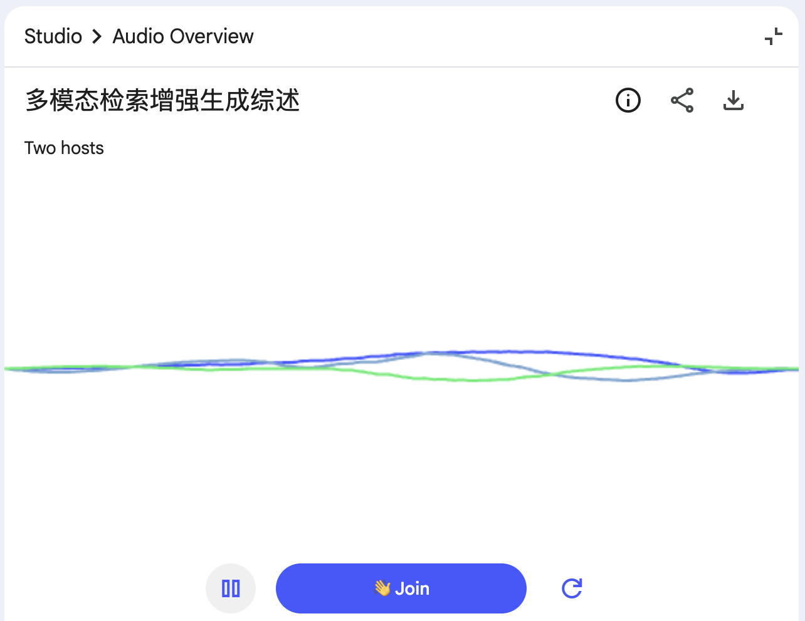

## 小结

NotebookLM 是一款基于 Gemini 大模型的 AI 笔记助手，旨在帮助用户高效处理和理解信息。其核心理念是 **巧思胜苦干**，通过多样化的资料处理、多模态理解能力和深度洞察，为用户提供个性化的研究体验。关键特性包括支持多种数据源上传，智能问答功能提供可靠的回答和引用，一键生成学习指南、脑图、FAQ 等内容格式，以及将文本转换成播客的音频概览功能，极大提升了学习的灵活性和便捷性。总之，NotebookLM 是现代学习者和研究者的理想助手，助力知识的获取与应用。