# SurfSense 介绍：NotebookLM 的开源平替

昨天我给大家介绍了一款 AI 笔记助手 —— NotebookLM，使用它可以方便地对我们的资料进行处理，支持智能问答和引用，一键生成学习指南、脑图、FAQ 等内容格式，以及将文本转换成播客，极大提升了学习的灵活性和便捷性。

今天再给大家介绍一个 Github 上最近比较热门的开源项目 —— SurfSense，它号称是 NotebookLM 的开源平替：


SurfSense 不仅实现了 NotebookLM 的各项功能，而且高度可定制，同时也更加的开放。比如它支持数十种不同类型的文件格式；支持连接各种外部数据源 Tavily、LinkUp、Slack、Linear、Notion、YouTube、GitHub 等；支持对接 150+ 不同的大模型，6000+ 不同的嵌入模型以及几乎所有主流的重排序模型。

下面我就带大家一起，在本地把 SurfSense 跑起来看看。

## 安装前准备

根据官方的 [Prerequisites](https://www.surfsense.net/docs) 文档，在安装之前，我们需要做一些准备工作：

### 安装 PGVector

SurfSense 平台使用 PostgreSQL 数据库，同时需要安装 [pgvector](https://github.com/pgvector/pgvector) 扩展支持向量类型，用于文档的向量检索，可以直接通过 Docker 安装：

```
$ docker run -d -p 5432:5432 -e POSTGRES_PASSWORD=postgres pgvector/pgvector:pg17
```

> 注意必须设置一个初始密码，否则启动报错。

### 开启 Google People API

SurfSense 默认使用 Google OAuth 认证来实现登录，需要开通 Google People API 服务。

首先进入 [Google API Library](https://console.cloud.google.com/apis/library)

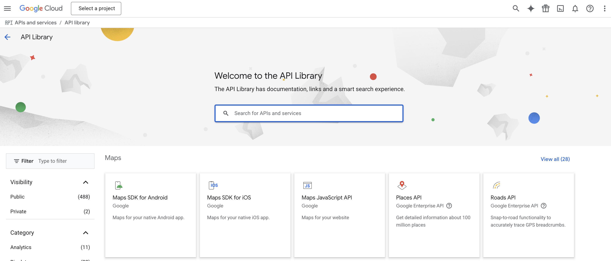

搜索 `People API`：

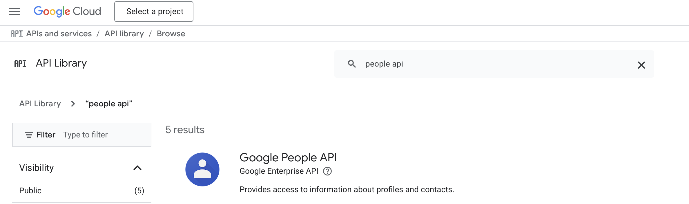

点击进去后，点击 "Enable" 开启 Google People API 服务：

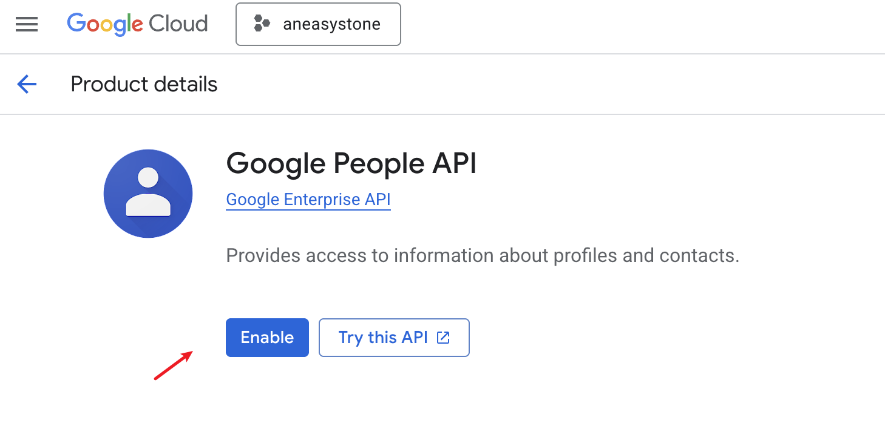

然后进入 "Credentials" 页面，创建一个凭据（注意凭据类型选 "OAuth client ID"）：

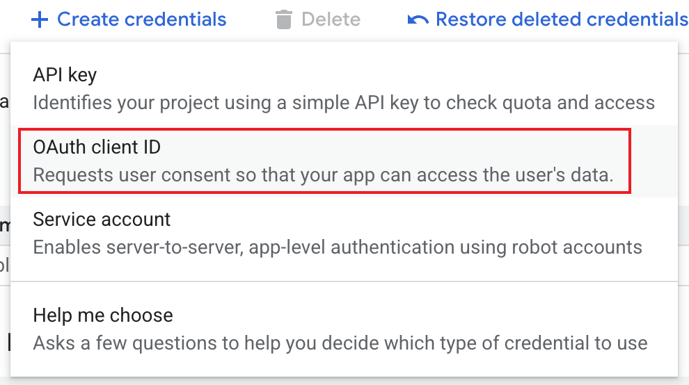

在填写表单时，客户端名称随便填，主要是下面两个参数要填对：

* Authorised JavaScript origins
    * `http://localhost:8000`
* Authorised redirect URIs
    * `http://localhost:8000/auth/google/callback`

如下图所示：

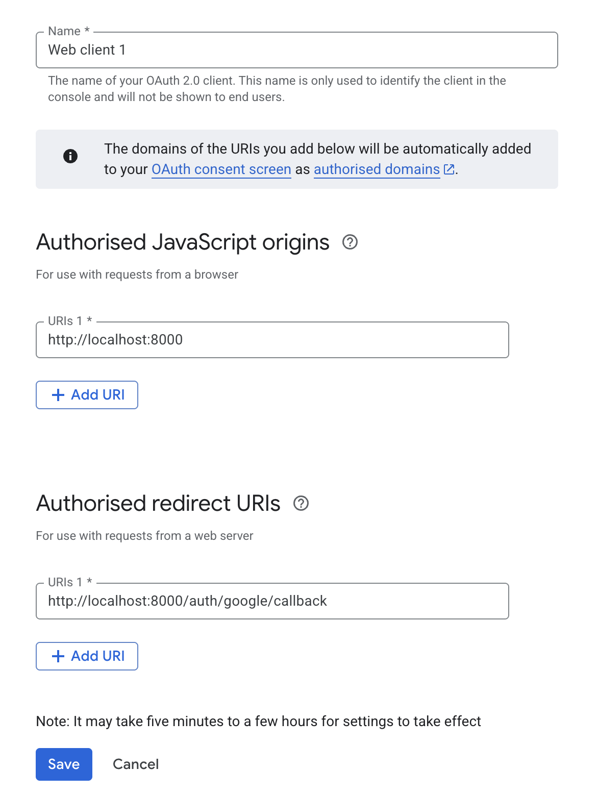

创建成功后，得到 Client ID 和 Client secret 两个配置：

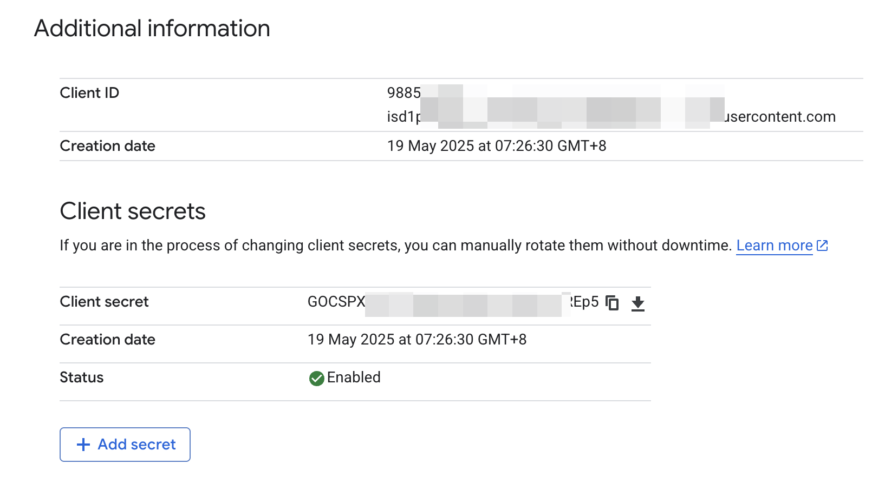

### 获取 Unstructured.io API KEY

SurfSense 使用 [Unstructured.io](https://unstructured.io/) 的 API 进行文档解析，不过当前 Unstructured.io 注册后会进入一个 Contact Sales 页面，无法进入 Platform 页面，也拿不到 API KEY，这一步暂时跳过。

### 获取 LangSmith API KEY（可选）

这一步是可选的，但是监控 LLM 调用是推荐做法。

[LangSmith](https://www.langchain.com/langsmith) 是 LangChain 开发的免费开源的 LLM 可观测平台，我们可以自己独立部署，也可以直接免费使用在线服务：

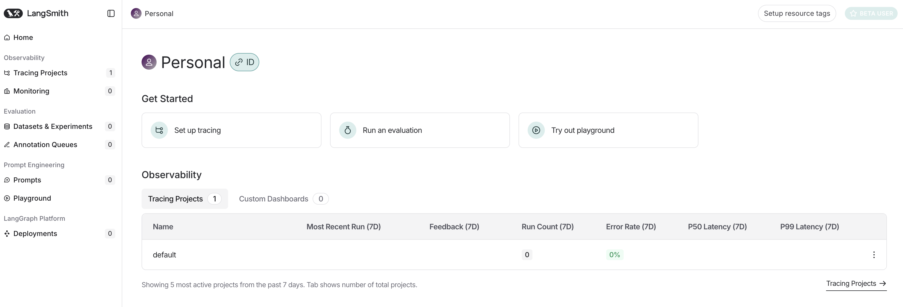

### 获取 Firecrawl API KEY（可选）

SurfSense 通过 [Firecrawl](https://www.firecrawl.dev/) 来爬取 URL 内容，我们可以免费注册，注册后有免费的额度：

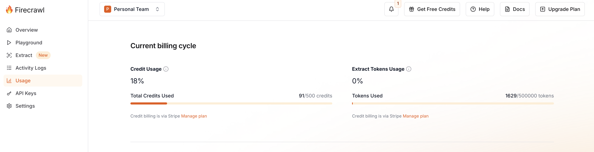

### 配置大模型

最后，SurfSense 通过 [LiteLLM](https://github.com/BerriAI/litellm) 调用大模型，所以我们必须有可调用的大模型服务，按 LiteLLM 的规范配置好对应的环境变量，比如 `OPENAI_API_KEY` 或 `GEMINI_API_KEY` 等，参考 LiteLLM 的文档：

* https://docs.litellm.ai/docs/providers

## SurfSense 安装

一切准备就绪，接下来就可以安装 SurfSense 了。

尽管官方提供了两种安装方式：Docker 安装 和 手工安装，但是由于项目比较新，变动比较频繁，推荐使用手工安装，过程更可控。

首先，克隆代码：

```
$ git clone https://github.com/MODSetter/SurfSense.git
```

SurfSense 包含前后端两个部分，需要分别安装。

### 安装后端

进入后端目录，复制 `.env.example` 文件配置环境变量，基本上就是上一节我们得到的 API KEY 等信息：

```
$ cd surfsense_backend
$ cp .env.example .env
```

然后通过 `uv sync` 安装依赖：

```
$ uv sync
```

[uv](https://docs.astral.sh/uv/) 是一个极速的 Python 包和项目管理工具，`uv sync` 是它的一个命令，用于更新项目的环境，确保项目环境中的依赖与 `uv.lock` 文件一致。另外，它会检查虚拟环境（`.venv`）是否存在，如果不存在，将自动创建它。

依赖安装完毕后，通过 `uv run` 启动服务：

```
$ uv run main.py
```

如果一切设置正确，可以看到服务正在 `http://localhost:8000` 上运行的日志。

### 安装前端

接下来运行前端，首先进入前端目录，复制 `.env.example` 文件配置环境变量：

```
$ cd surfsense_web
$ cp .env.example .env
```

前端的环境变量比较简单，就只有一个 `NEXT_PUBLIC_FASTAPI_BACKEND_URL=http://localhost:8000`，保持默认值即可。

然后通过 `pnpm install` 安装依赖：

```
$ pnpm install
```

`pnpm` 和 `npm` 的命令行接口基本一致，但是 `pnpm` 是一个更现代和高效的包管理工具，在性能和存储效率上更具竞争力。

最后运行前端服务：

```
$ pnpm run dev
```

启动成功后，默认监听 3000 端口，在浏览器输入 `http://localhost:3000` 即可访问 SurfSense 首页：

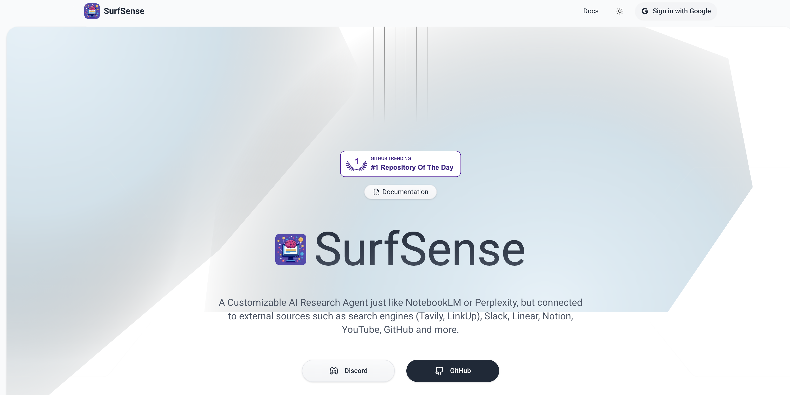

点击 "Sign in with Google" 进入登录页面：

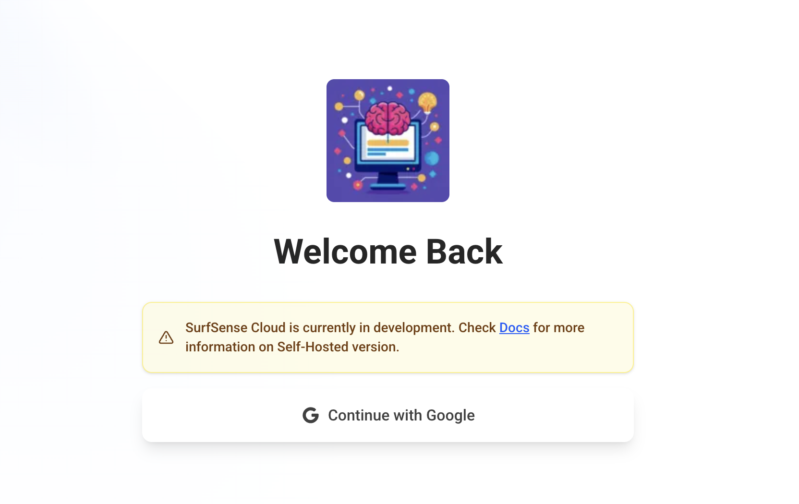

继续点击 "Continue with Google" 进入 Google 认证页面：

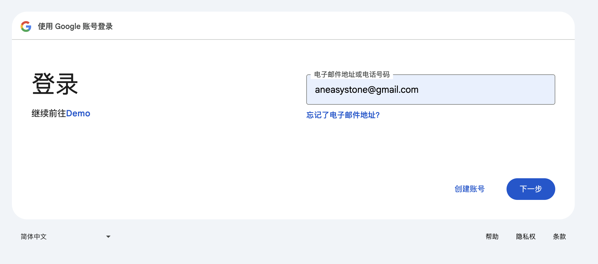

认证通过后，进入 SurfSense Dashboard 页面：

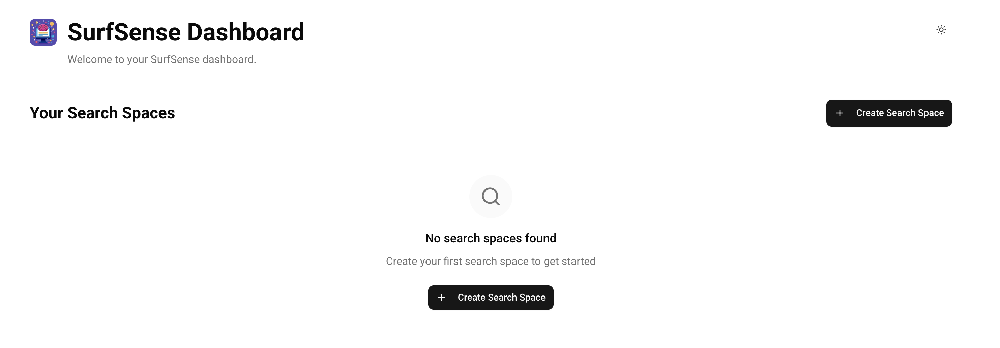

接下来就可以愉快的体验 SurfSense 的各个功能了。