# 学习 SurfSense 的文档管理

昨天给大家介绍了一款号称是 NotebookLM 的开源平替的项目 —— SurfSense，经过一些前期准备工作，我们在本地已经成功部署了它，并通过 Google OAuth 成功登录：

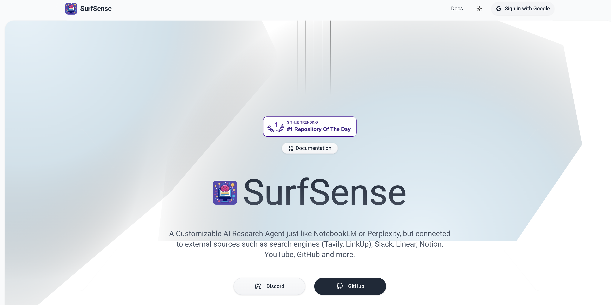

接下来，我们再来看看它的各项功能特性，顺便研究下每个功能是如何实现的。首先当然是它的文档管理功能。

## 一个小插曲

昨天注册 [Unstructured.io](https://unstructured.io/) 之后，会进入一个 Contact Sales 页面，无法进入 Platform 页面，也拿不到 API KEY，后来就放弃了。今天抱着试一试的态度，通过 F12 审查这个页面的源码，看看能不能绕过这个限制，突然发现这个页面只是一层全屏弹框：

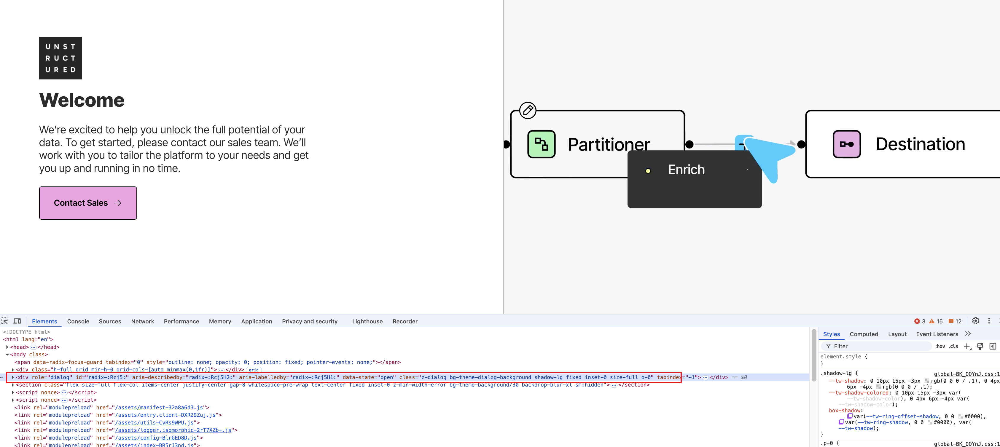

直接在 "Elements" 里删除这个弹框的 HTML 就能看到控制台页面了：

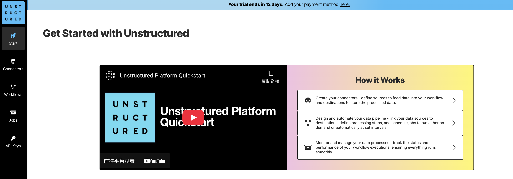

进而也拿到了 API KEY，新用户有 14 天的免费试用期。

## 文档管理

接着我们继续看 SurfSense 的文档管理功能。首次进入 SurfSense 的控制台页面时，需要手动创建一个 **搜索空间（Search Space）**：

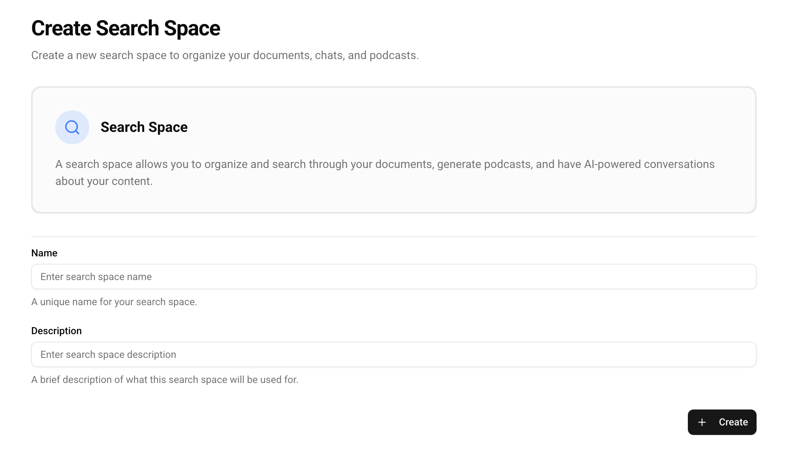

点击创建好的空间，进入文档管理页面：

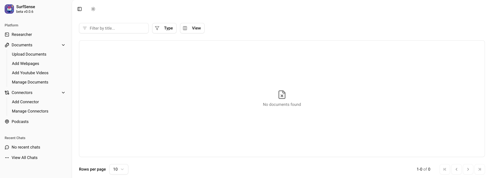

在左侧菜单中可以看到，我们有三种方式来添加文档：上传文件、添加网页、添加 Youtube 视频。

## 上传文件

SurfSense 支持数十种不同的文件格式，我们还是拿《A Survey of Multimodal Retrieval-Augmented Generation》这篇 MRAG 的论文 PDF 作为示例：

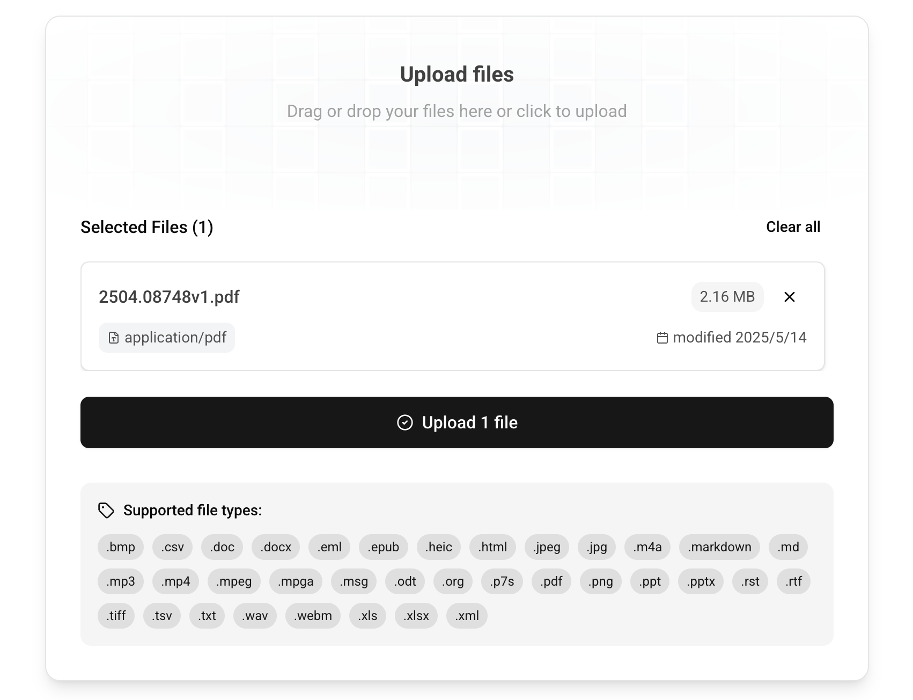

点击上传后，要稍等一会，在后端可以看到不断地在刷日志，处理结束后刷新文档列表，如下（可以看到 SurfSense 为文档生成了一份摘要）：

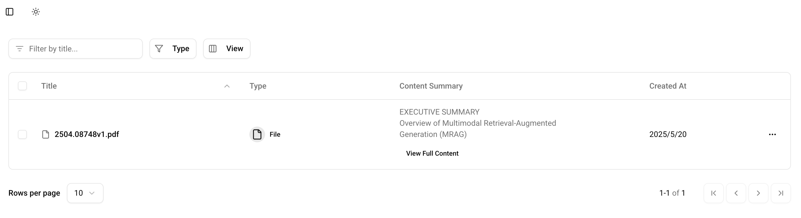

## 上传文件的实现

上传文件的代码逻辑位于 `documents_routes.py` 文件中，接口名为 `POST /documents/fileupload`：

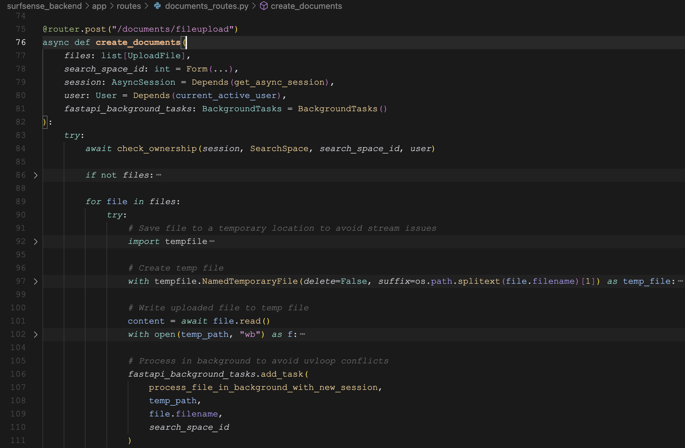

通过 FastAPI 的 `BackgroundTasks` 创建一个后台任务对文件进行处理。根据不同的文件后缀分别处理：

* `.md`, `.markdown`

对于 Markdown 格式的文本，直接读取文件内容。

* `.mp3`, `.mp4`, `.mpeg`, `.mpga`, `.m4a`, `.wav`, `.webm`

对于音频文件，通过 LiteLLM 的 `atranscription()` 方法，调用 STT（Speech-to-Text，语音转文本）服务，在 `.env` 文件中可以看到默认的 STT 是 OpenAI 的 `whisper-1` 服务。

```python
STT_SERVICE="openai/whisper-1"
```

* 其他类型

对于其他类型的文件，统一使用 LangChain 的 [`UnstructuredLoader`](https://python.langchain.com/docs/integrations/document_loaders/unstructured_file/) 进行处理，实际上就是调 Unstructured.io 的接口：

```python
loader = UnstructuredLoader(
    file_path,
    mode="elements",
    post_processors=[],
    languages=["eng"],
    include_orig_elements=False,
    include_metadata=False,
    strategy="auto",
)

docs = await loader.aload()
```

LangChain 支持大量的文档处理器，被称为 **Document loaders**，如果 Unstructured.io 的接口不可用，也可以考虑换成其他的：

* https://python.langchain.com/docs/integrations/document_loaders/

## 添加网页

SurfSense 支持添加网页文档，输入 URL 自动抓取网页的内容：

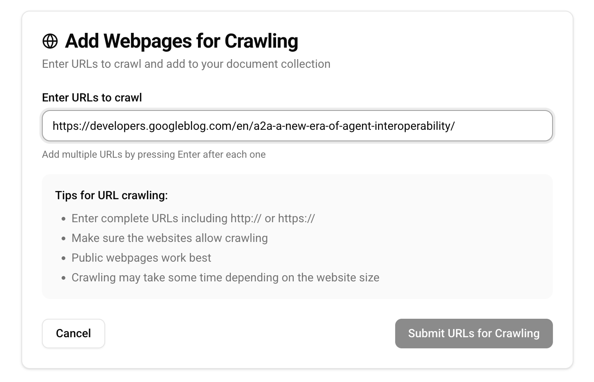

比如这里我对 Google 的 A2A 比较感兴趣，就将 A2A 的这篇博客丢进去：

* https://developers.googleblog.com/en/a2a-a-new-era-of-agent-interoperability/

同样的，等后台处理一会，刷新文档列表，如下：

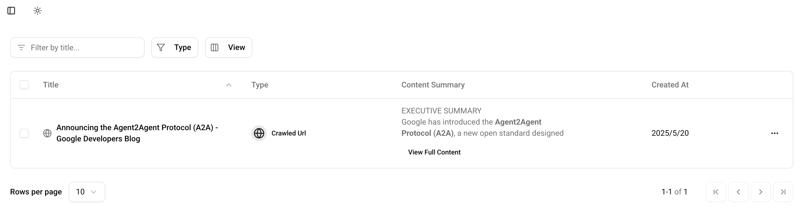

## 添加网页的实现

添加网页的代码逻辑同样位于 `documents_routes.py` 文件中，接口名为 `POST /documents/`：

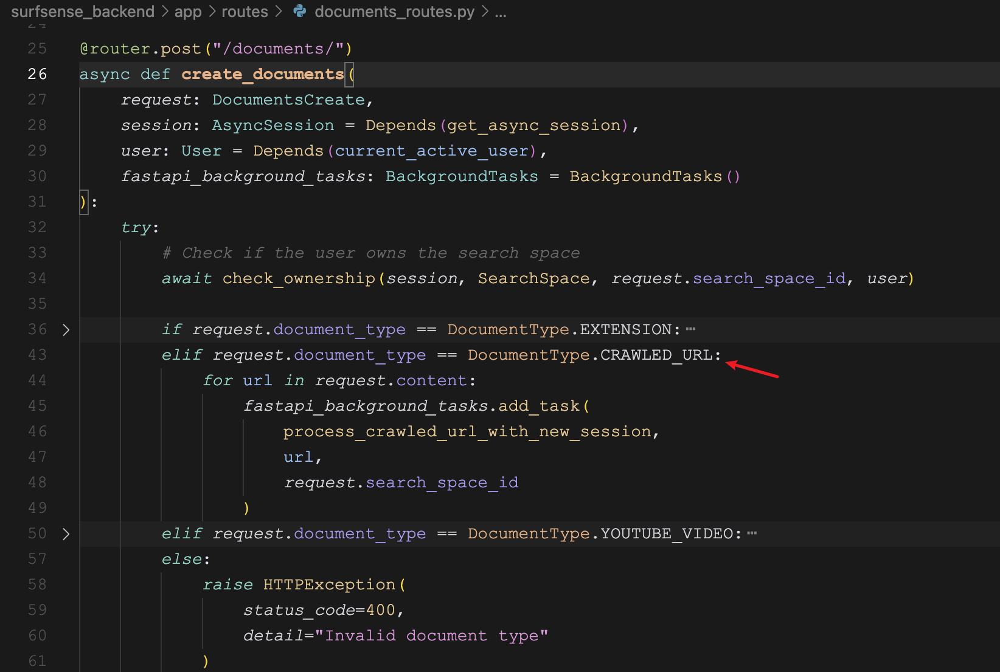

通过 FastAPI 的 `BackgroundTasks` 创建一个后台任务对网页进行处理：

```
if config.FIRECRAWL_API_KEY:
    crawl_loader = FireCrawlLoader(
        url=url,
        api_key=config.FIRECRAWL_API_KEY,
        mode="scrape",
        params={
            "formats": ["markdown"],
            "excludeTags": ["a"],
        },
    )
else:
    crawl_loader = AsyncChromiumLoader(urls=[url], headless=True)

url_crawled = await crawl_loader.aload()
```

可以看到，这里同样是用的 LangChain 的 Document loaders 来处理网页，如果配置了 `FIRECRAWL_API_KEY`，就使用 [`FireCrawlLoader`](https://python.langchain.com/docs/integrations/document_loaders/firecrawl/) 调用 FireCrawl 的接口 ，否则就使用 [`AsyncChromiumLoader`](https://python.langchain.com/docs/integrations/document_loaders/async_chromium/) 调用 Chrome 浏览器，它的底层实际上是靠 [Playwright](https://playwright.dev/) 自动操作浏览器实现的。

## 添加 Youtube 视频

最后，我们来看下 SurfSense 的添加 Youtube 视频的功能：

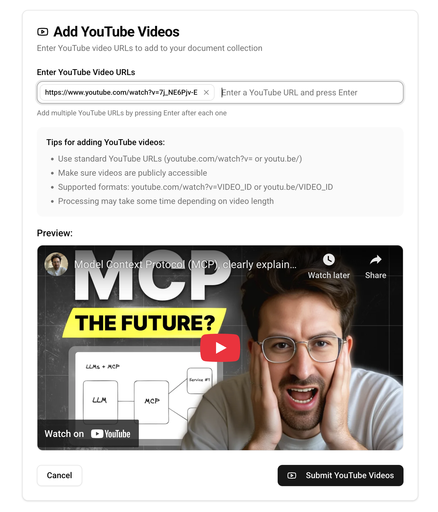

这里随便找了一篇介绍 MCP 的视频：

* https://www.youtube.com/watch?v=7j_NE6Pjv-E

将视频地址填入后，下面还可以对视频进行预览。提交之后，稍等片刻，刷新文档列表，如下：

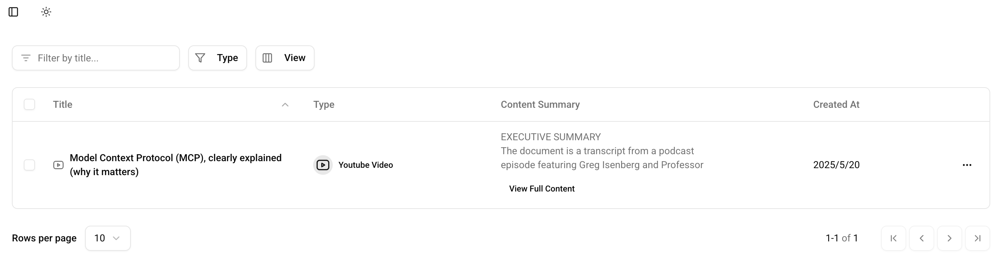

## 添加 Youtube 视频的实现

添加 Youtube 视频的代码逻辑同样位于 `documents_routes.py` 文件中，接口名为 `POST /documents/`：

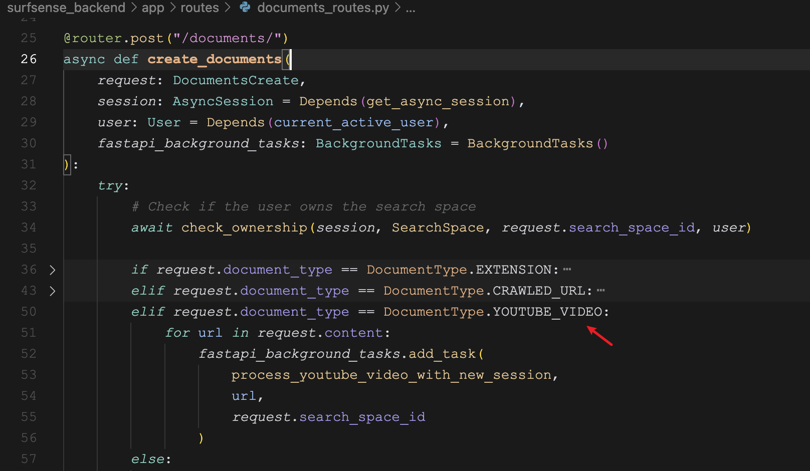

后台任务的处理逻辑如下：

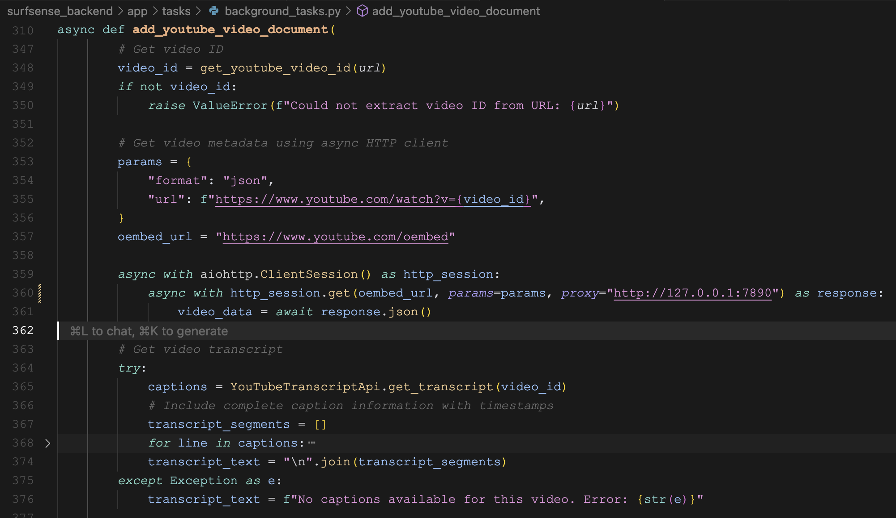

首先通过 `https://www.youtube.com/oembed` 接口获取视频的基本信息，包括视频标题、作者、缩略图等：

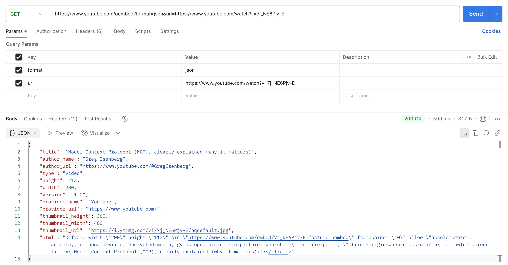

注意这里使用了 Python 中的异步请求库 [aiohttp](https://github.com/aio-libs/aiohttp) 来发送 HTTP 请求，这个库默认不走系统代理，需要稍微改下代码才能访问 Youtube 的接口：

```python
async with aiohttp.ClientSession() as http_session:
    async with http_session.get(
        oembed_url, 
        params=params, 
        proxy="http://127.0.0.1:7890"
    ) as response:
        video_data = await response.json()
```

接着程序使用另一个开源库 [YouTube Transcript API](https://github.com/jdepoix/youtube-transcript-api) 抓取视频字幕：

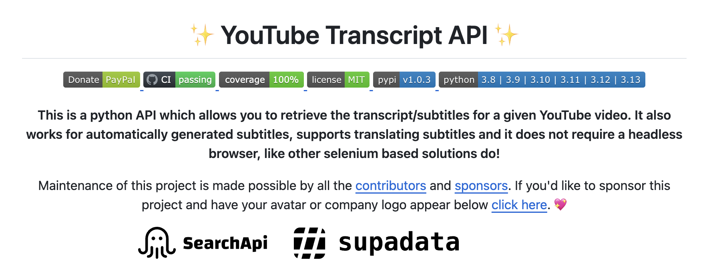

最终存到数据库中的文本信息实际上就是视频的字幕。
