# 学习 SurfSense 的浏览器扩展

昨天体验了 SurfSense 的文档管理功能，包括上传文件、添加网页、添加 Youtube 视频这三种添加文档的方式。其中，添加网页是通过 [Firecrawl](https://www.firecrawl.dev/) 或 [Playwright](https://playwright.dev/) 实现的，这两种方式其实都有弊端，比如不能访问内部网页，不能绕过身份认证，等。于是，SurfSense 还提供了另一种添加文档的方式 —— 浏览器扩展，通过浏览器扩展，我们可以添加任何网页，包括那些受到身份验证保护的网页。

## 构建 SurfSense 浏览器扩展

首先进入扩展目录，复制 `.env.example` 文件配置环境变量：

```
$ cd surfsense_browser_extension
$ cp .env.example .env
```

环境变量比较简单，保持默认值即可：

```
PLASMO_PUBLIC_API_SECRET_KEY = "surfsense"
PLASMO_PUBLIC_BACKEND_URL = "http://127.0.0.1:8000"
```

然后通过 `pnpm install` 安装依赖：

```
$ pnpm install
```

注意安装后可能会有下面这样的警告信息：

```
╭ Warning ───────────────────────────────────────────────────────────────────────────────────╮
│                                                                                            │
│   Ignored build scripts: @swc/core, esbuild, lmdb, msgpackr-extract, sharp.                │
│   Run "pnpm approve-builds" to pick which dependencies should be allowed to run scripts.   │
│                                                                                            │
╰────────────────────────────────────────────────────────────────────────────────────────────╯
```

它的意思是，在安装期间有一些依赖项需要运行脚本，这个默认是不允许的，我们需要手动执行 `pnpm approve-builds` 命令来允许。

```
$ pnpm approve-builds
```

命令会弹出提示，选择要运行哪些脚本，按 `<a>` 全选即可：

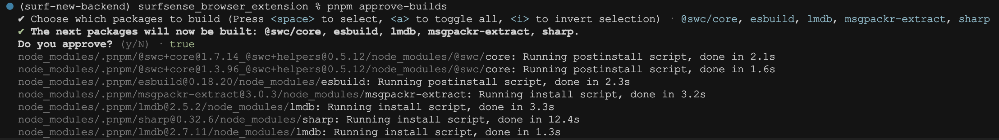

最后构建浏览器扩展：

```
$ pnpm build
```

这个命令默认构建的是 Chrome 扩展，也支持构建其他浏览器的扩展：

```
$ pnpm build --target=firefox
$ pnpm build --target=edge
```

构建好的 Chrome 扩展位于 `./build/chrome-mv3-prod` 目录。

## Plasmo 框架

SurfSense 的浏览器扩展是使用 [Plasmo](https://github.com/PlasmoHQ/plasmo) 框架开发的：


这是一款功能强大的浏览器扩展 SDK，功能特性如下：

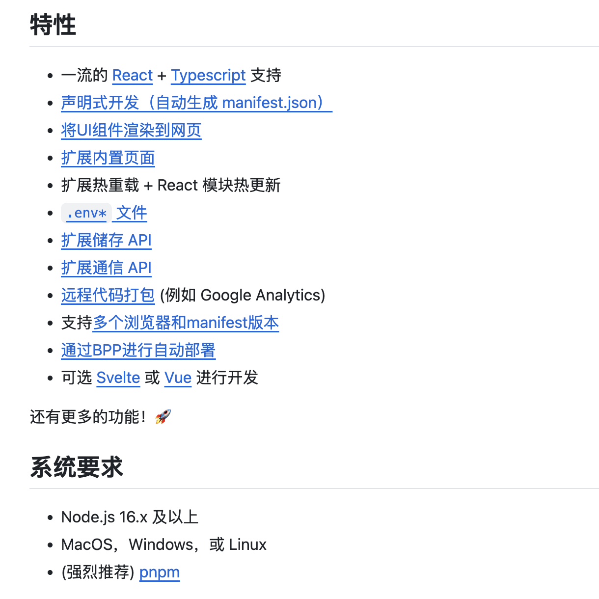

Plasmo 将各大浏览器扩展抽象成统一标准，使用 Plasmo 构建浏览器扩展，可以不用操心扩展的配置文件，以及不同浏览器构建时的一些奇怪特性等。

## 安装 SurfSense 浏览器扩展

接下来，打开 Chrome 浏览器的扩展程序页面 —— `chrome://extensions/`：


开启 “开发者模式”，点击 “加载已解压的扩展程序”，然后选择构建好的 Chrome 扩展目录（`./build/chrome-mv3-prod`），扩展即安装完成。在浏览器的扩展栏可以看到 SurfSense 的小图标，点击小图标弹出扩展的配置页面：

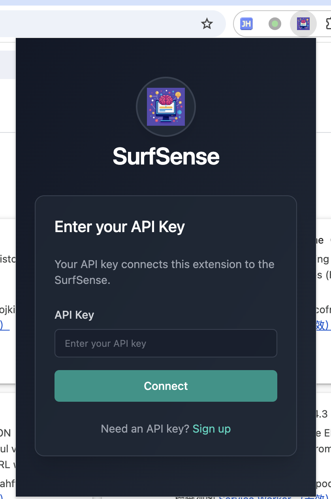

在这里需要填写 SurfSense 的 API KEY，这个可以在平台左下角点击账号进行查看：

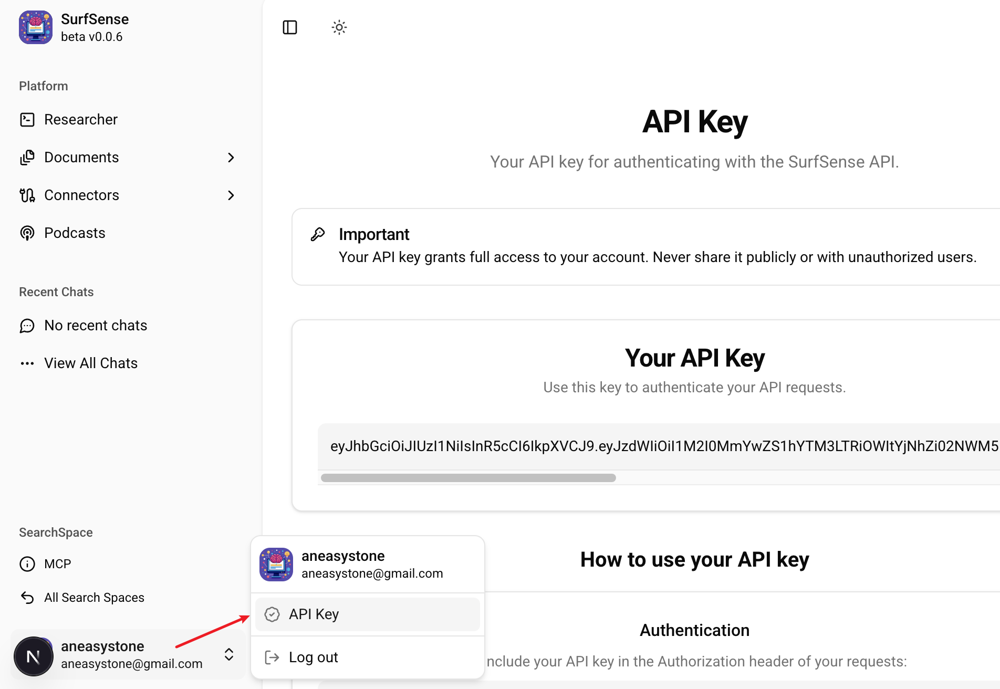

填上 API KEY 之后进入扩展的使用页面：

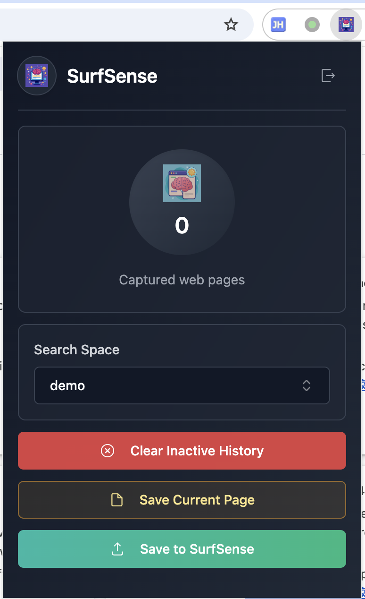

## 使用 SurfSense 浏览器扩展

进入 SurfSense 扩展的使用页面后，首先需要选择将网页推送到哪个搜索空间，下面可以看到三个按钮：

* Clear Inactive History - 清空不活跃的网页缓存，指的是那些已经关闭的网页标签
* Save Current Page - 将当前网页内容保存到缓存中
* Save to SurfSense - 将缓存的网页内容推送到 SurfSense 的搜索空间中

我们拿 SurfSense 的 Github 页面做个示例：

* https://github.com/MODSetter/SurfSense

首先点击 `Save Current Page` 保存网页到缓存，然后点击 `Save to SurfSense` 将网页推送到 SurfSense 的搜索空间中，刷新文档列表页面如下：

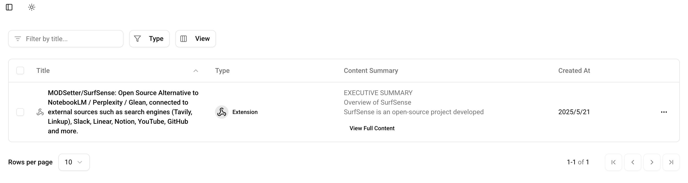

## 代码实现

SurfSense 扩展的主要逻辑位于 `routes/pages/HomePage.tsx` 文件：

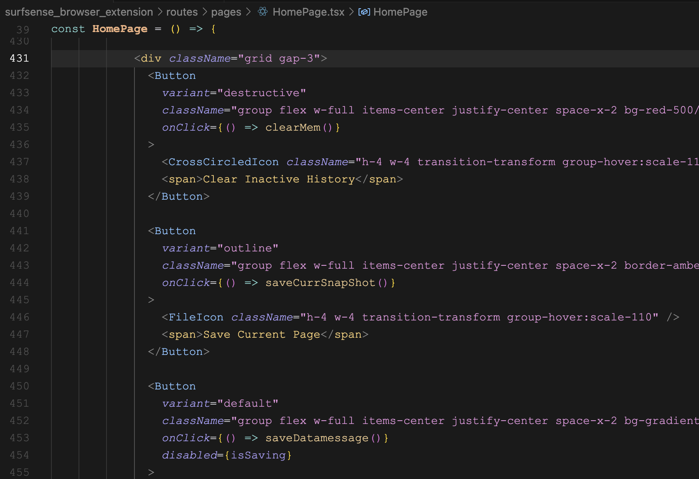

三个按钮对应的函数分别是：

* clearMem
* saveCurrSnapShot
* saveDatamessage

其中 `saveCurrSnapShot` 的逻辑如下：

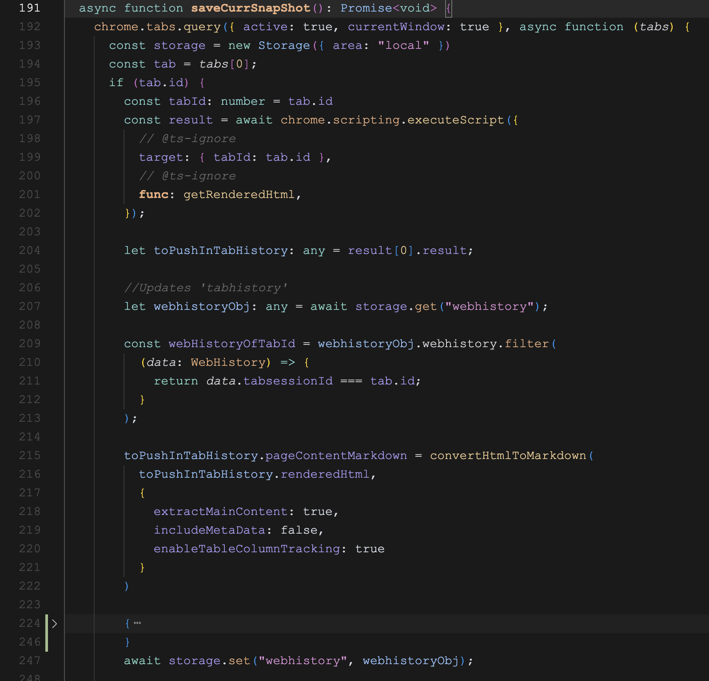

首先通过 `chrome.scripting.executeScript()` 获取网页的完整 HTML 源码，然后使用 [dom-to-semantic-markdown](https://github.com/romansky/dom-to-semantic-markdown) 库的 `convertHtmlToMarkdown()` 函数将 HTML 转换为 Markdown 文本，保存到浏览器的缓存中，这个缓存可以在浏览器的 Extension storage 中看到：

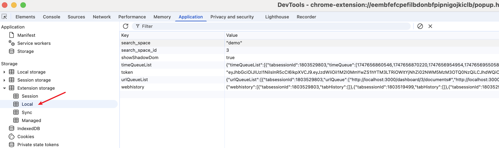

而 `saveDatamessage` 的逻辑如下：

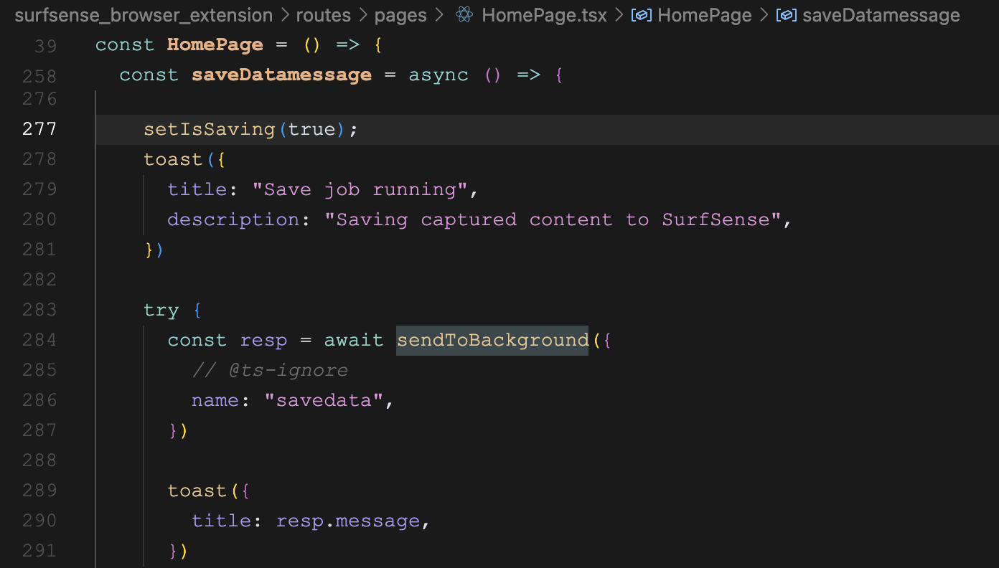

通过 Plasmo 的 `sendToBackground()` 发送一个 `savedata` 消息，这个消息由后台脚本 `background/messages/savedata.ts` 接受并处理，向 SurfSense 发送请求，将 Markdown 保存到指定的搜索空间：

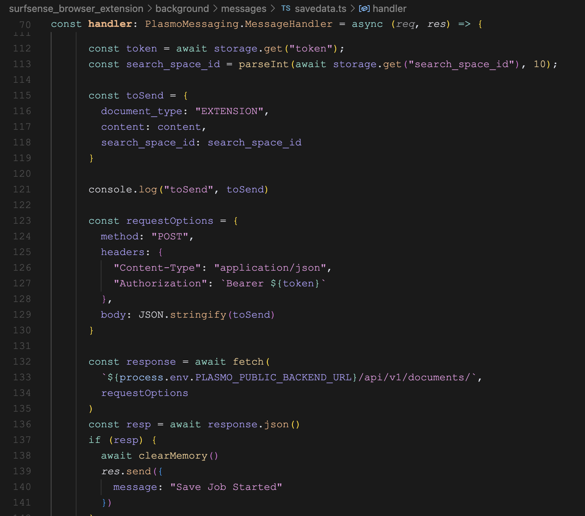

后端逻辑和添加网页、添加 Youtube 视频的逻辑一样，同样位于 `documents_routes.py` 文件中，接口名为 `POST /documents/`，由于接受的直接是 Markdown 文本，不需要额外处理，直接 `分片 -> 生成向量 -> 入库` 一套流程走完即可。

## 小结

好了，关于 SurfSense 文档管理基本上就这些内容，花了两天时间，介绍了上传文件、添加网页、添加 Youtube 视频、浏览器插件四种添加文档的方式，并简单研究了每种添加方式的实现。不过目前还只是数据摄入部分，后面的这套数据入库流程，以及检索、问答、生成播客、等，才是 SurfSense 的核心功能，我们明天继续。
