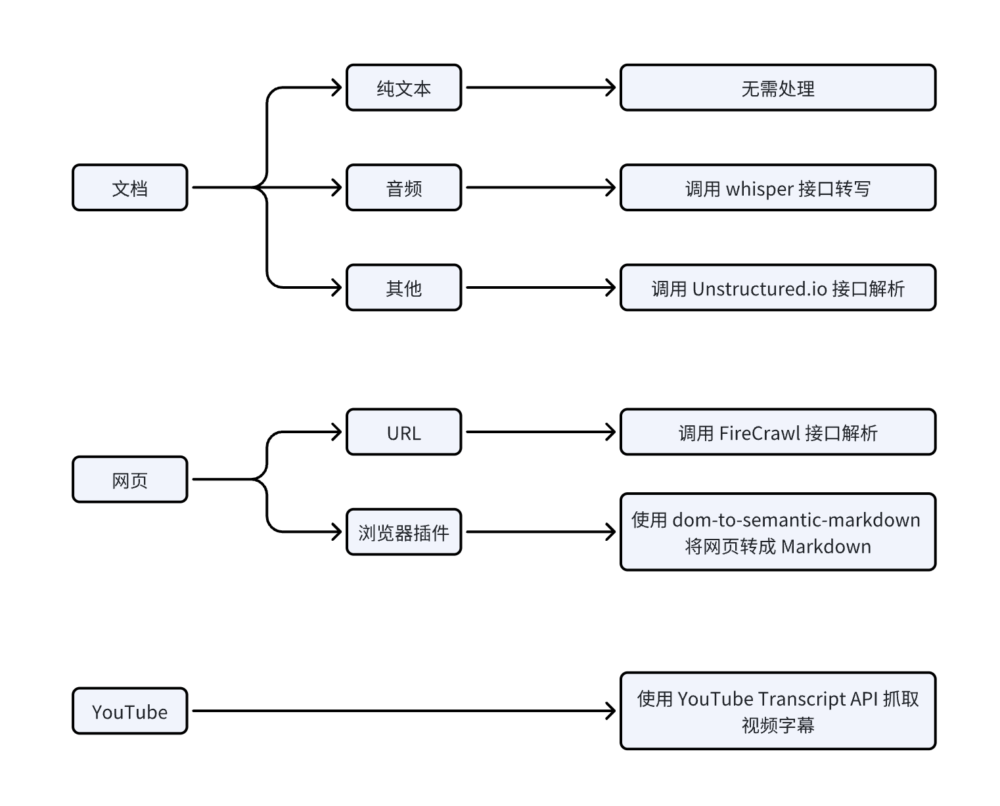
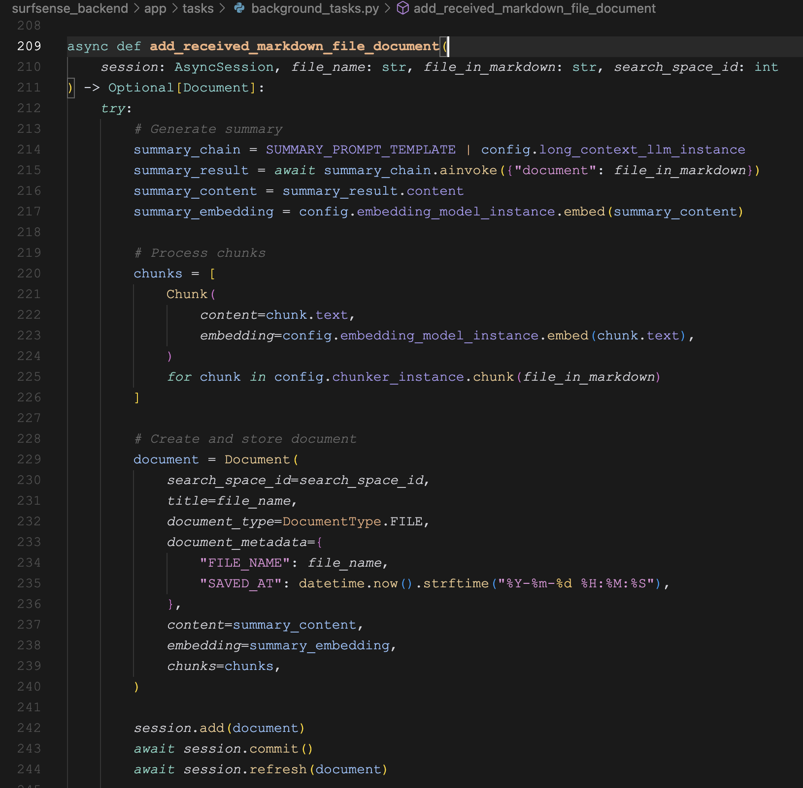
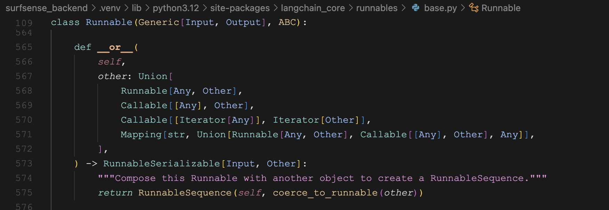
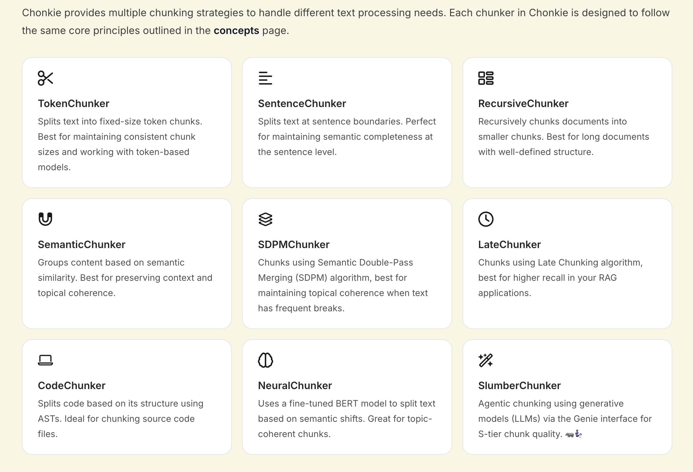

# 学习 SurfSense 的数据入库流程

花了两天时间，我们学习了 SurfSense 文档管理功能，学习了上传文件、添加网页、添加 Youtube 视频、浏览器插件四种添加文档的方式，以及每种添加方式的实现原理。不过目前还只是数据摄入部分，我们今天继续研究下后面的流程，看看这些文档是如何入库的。

## 数据入库流程

我们总结下几种添加文档的方式，可以看出，最终的结果都是转为纯文本或 Markdown 格式：



拿到文本之后的入库流程几乎是一样的，如下：



主要分三个步骤：

1. 对整个文档进行总结和向量化；
2. 将文档分块，对每个分块进行向量化；
3. 将文档和分块数据入库；

## 文档总结

SurfSense 使用长文本大模型对完整文档做总结，从配置文件可以知道，默认的模型是 Google 的 Gemini 2.0 Flash，上下文窗口达到 100 万 token，可以塞进去一部《红楼梦》：

```python
LONG_CONTEXT_LLM="gemini/gemini-2.0-flash"
```

文档总结的代码如下：

```python
summary_chain = SUMMARY_PROMPT_TEMPLATE | config.long_context_llm_instance
summary_result = await summary_chain.ainvoke({"document": file_in_markdown})
summary_content = summary_result.content
```

这里通过 LangChain 的 [LCEL（LangChain Expression Language）语法](https://python.langchain.com/docs/concepts/lcel/) 创建一个 **摘要生成链（summary chain）**，将提示词模版和大模型调用链接在一起，其中 `SUMMARY_PROMPT_TEMPLATE` 的定义如下：

```python
SUMMARY_PROMPT_TEMPLATE = PromptTemplate(
    input_variables=["document"],
    template=SUMMARY_PROMPT
)
```

后面的 `long_context_llm_instance` 定义如下：

```python
LONG_CONTEXT_LLM = os.getenv("LONG_CONTEXT_LLM")
long_context_llm_instance = ChatLiteLLM(model=LONG_CONTEXT_LLM)
```

这里有一个挺长的文档总结 Prompt 可以参考，见 `surfsense_backend/app/prompts/__init__.py` 文件。

## LCEL 语法

上面的 `|` 连接符有点类似 Linux 命令行中的管道，是 LangChain 的一种特色写法，表示数据会从左侧的提示模板流向右侧的大模型调用。要注意的是，这并不是 Python 的原生特性，而是 LangChain 的语法糖。在 Python 中 `|` 运算符通常用于：

* 位运算（bitwise OR）
* 集合的并集操作
* 类型注解中的联合类型（Union types）

而 LangChain 是通过 **重载（overload）** 这个运算符，使其具有了新的含义，这种设计灵感来自于 Linux 中的管道操作符，通过这种管道语法使得代码更加简洁和可读，让数据处理的流程更加清晰。

在 Python 中重载运算符是通过实现特殊方法（也称为魔术方法或双下划线方法）来实现的，比如下面这些：

```python
class MyClass:
    def __add__(self, other):      # +
        pass
    
    def __sub__(self, other):      # -
        pass
    
    def __mul__(self, other):      # *
        pass
    
    def __truediv__(self, other):  # /
        pass
    
    def __eq__(self, other):       # ==
        pass
    
    def __lt__(self, other):       # <
        pass
    
    def __gt__(self, other):       # >
        pass
    
    def __or__(self, other):       # |
        pass
    
    def __and__(self, other):      # &
        pass
```

可以看到，要重载 `|` 运算符，需要实现 `__or__` 方法。对于 LangChain 来说，它的几个核心类，比如 `PromptTemplate` 或 `BaseChatModel`，都统一继承自 `Runnable` 接口，我们打开 `Runnable` 源码，就可以发现 LangChain 中 `|` 连接符的奥秘所在：



## 向量化

接着我们计算整个文档的向量：

```python
summary_embedding = config.embedding_model_instance.embed(summary_content)
```

其中 `embedding_model_instance` 定义如下：

```python
EMBEDDING_MODEL = os.getenv("EMBEDDING_MODEL")
embedding_model_instance = AutoEmbeddings.get_embeddings(EMBEDDING_MODEL)
```

这里通过 [Chonkie](https://github.com/chonkie-inc/chonkie) 库的 `AutoEmbeddings` 来加载 Embedding 模型，它会根据模型名称自动选择使用：

* `OpenAIEmbeddings`
* `Model2VecEmbeddings`
* `CohereEmbeddings`
* `JinaEmbeddings`
* `SentenceTransformerEmbeddings`

SurfSense 使用默认模型是 [Mixedbread](https://www.mixedbread.com/) 开源的 [mxbai-embed-large-v1](https://huggingface.co/mixedbread-ai/mxbai-embed-large-v1)：

```python
EMBEDDING_MODEL="mixedbread-ai/mxbai-embed-large-v1"
```

这个模型不大，但效果很好，在 24 年的时候，曾经一度在 MTEB 榜单达到 SOTA 水平。这个模型可以通过 `sentence_transformers` 库直接加载调用，很适合本地使用。

## 文档分块

由于长文档不适合检索和召回，在问答时很容易超出大模型的上下文限制。所以我们往往将长文档拆分成一个个的片段，问答时只召回适当的片段。下面是文档分块的逻辑代码：

```python
chunks = [
    Chunk(
        content=chunk.text,
        embedding=config.embedding_model_instance.embed(chunk.text),
    )
    for chunk in config.chunker_instance.chunk(file_in_markdown)
]
```

其中 `chunker_instance` 的定义如下，使用了 Chonkie 库的 `RecursiveChunker` 来分块：

```
chunker_instance = RecursiveChunker(
    chunk_size=getattr(embedding_model_instance, 'max_seq_length', 512)
)
```

很明显，这里使用的是 **Recursive Chunking（递归分块）** 技术。递归分块通过使用一组分隔符以层级和迭代的方式将输入文本划分为更小的块，这种方法允许文档按照不同的层级进行分割，从而更好地保留文本的原始结构，特别适用于具有多个层级结构的文档。比如我们可以先尝试根据双换行符 `\n\n` 分割，这样分割出来的是章节；如果超出了分块大小限制，再按单个换行符 `\n` 分割，得到的是段落；最后再按空格或句号等其他字符分割。

除了 `RecursiveChunker`，Chonkie 库还支持一些其他分块技术：



感兴趣的朋友可以去看它的官网文档：

* https://docs.chonkie.ai/python-sdk/chunkers/overview

## 数据入库

最后，将文档和分块保存到数据库：

```
document = Document(
    search_space_id=search_space_id,
    title=file_name,
    document_type=DocumentType.FILE,
    document_metadata={
        "FILE_NAME": file_name,
        "SAVED_AT": datetime.now().strftime("%Y-%m-%d %H:%M:%S"),
    },
    content=summary_content,
    embedding=summary_embedding,
    chunks=chunks,
)

session.add(document)
await session.commit()
await session.refresh(document)
```

这里有两点比较有意思，值得注意。

第一点是 `Document` 和 `Chunk` 实际上是两张表，通过 [SQLAlchemy](https://www.sqlalchemy.org/) ORM 的 `relationship` 关联在一起：

```
class Document(BaseModel, TimestampMixin):
    __tablename__ = "documents"
    
    title = Column(String, nullable=False, index=True)
    document_type = Column(SQLAlchemyEnum(DocumentType), nullable=False)
    document_metadata = Column(JSON, nullable=True)
    
    content = Column(Text, nullable=False)
    embedding = Column(Vector(config.embedding_model_instance.dimension))
    
    search_space_id = Column(Integer, ForeignKey("searchspaces.id", ondelete='CASCADE'), nullable=False)
    search_space = relationship("SearchSpace", back_populates="documents")
    chunks = relationship("Chunk", back_populates="document", cascade="all, delete-orphan")

class Chunk(BaseModel, TimestampMixin):
    __tablename__ = "chunks"
    
    content = Column(Text, nullable=False)
    embedding = Column(Vector(config.embedding_model_instance.dimension))
    
    document_id = Column(Integer, ForeignKey("documents.id", ondelete='CASCADE'), nullable=False)
    document = relationship("Document", back_populates="chunks")
```

可以了解下 SQLAlchemy ORM 这里定义表、字段以及关联表的方式，可以看下这里的快速入门文档：

* https://docs.sqlalchemy.org/en/20/orm/quickstart.html

另一点是，这里的 `embedding` 字段是 `Vector` 类型，也就是向量数据类型，但是 SurfSense 使用的 PostgreSQL 数据库并不是向量数据库。这背后其实是通过 [pgvector](https://github.com/pgvector/pgvector) 这个扩展实现的，pgvector 为 PostgreSQL 增加了向量数据类型以及高效的向量索引方法，使得 PostgreSQL 不仅能够存储向量数据，而且也可以通过向量进行相似性检索。

我们之前学习 SupaBase 的时候也提过，它的 GraphQL API 功能是通过 `pg_graphql` 扩展实现的，不得不感叹，PostgreSQL 数据库的扩展性是真强。