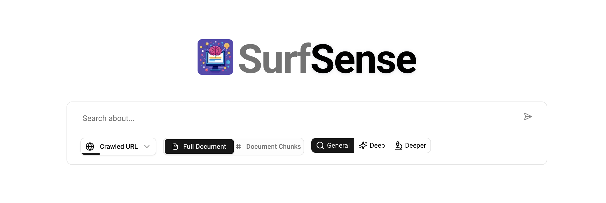
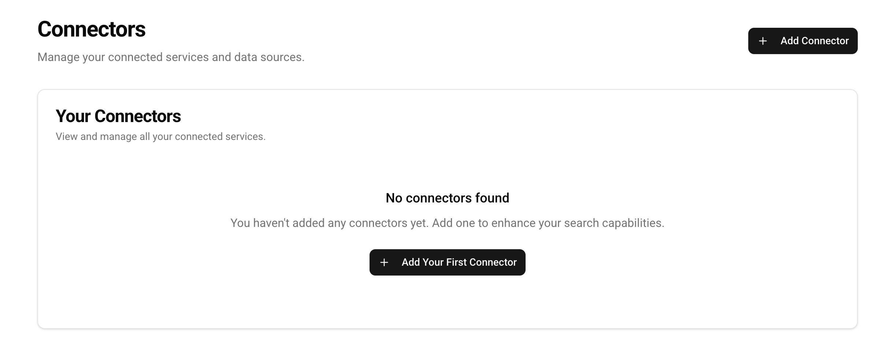
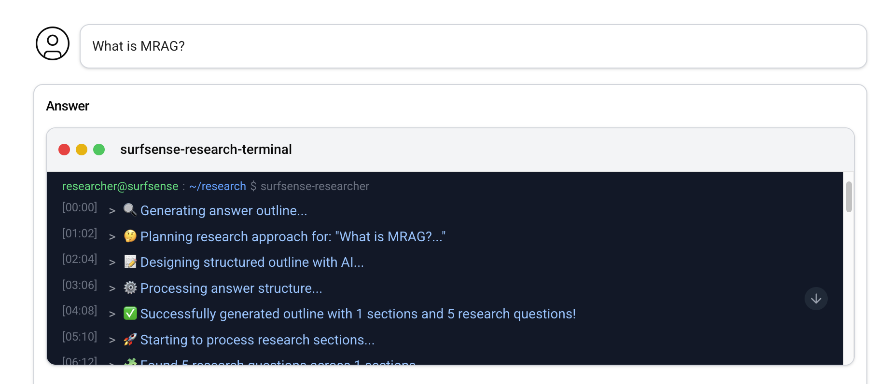
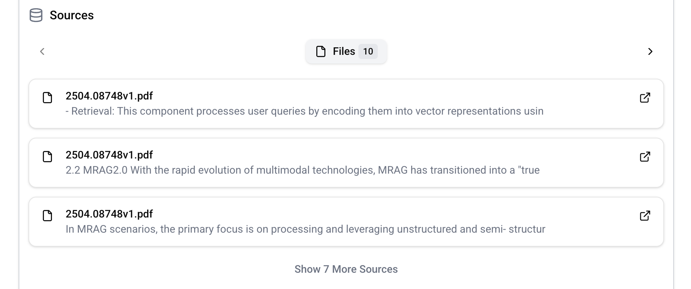
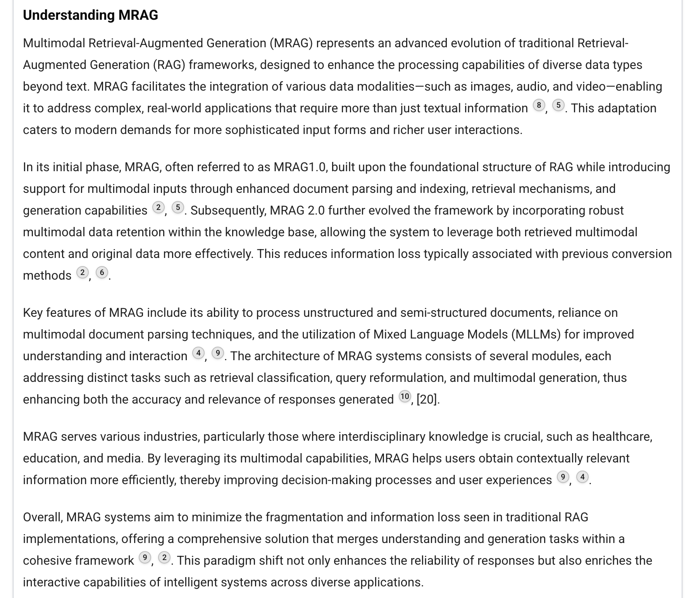
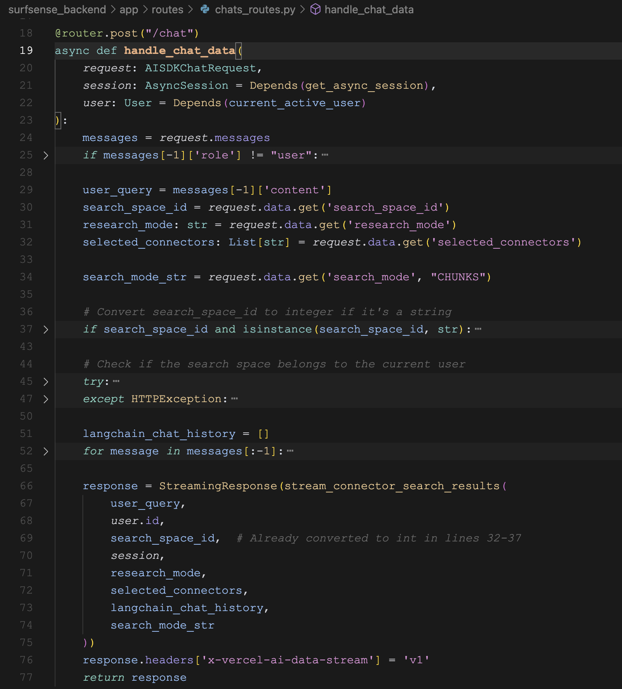
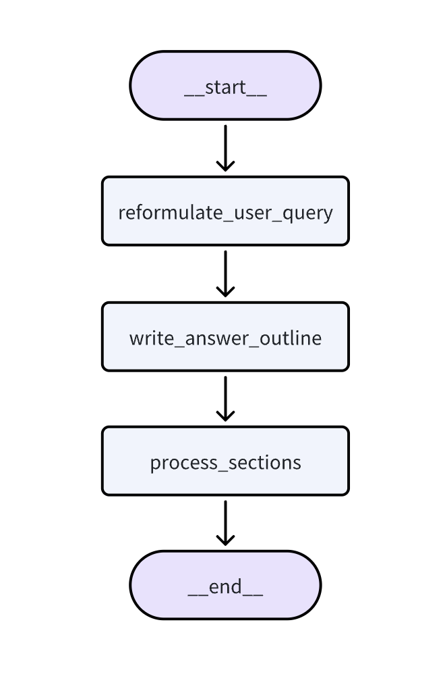
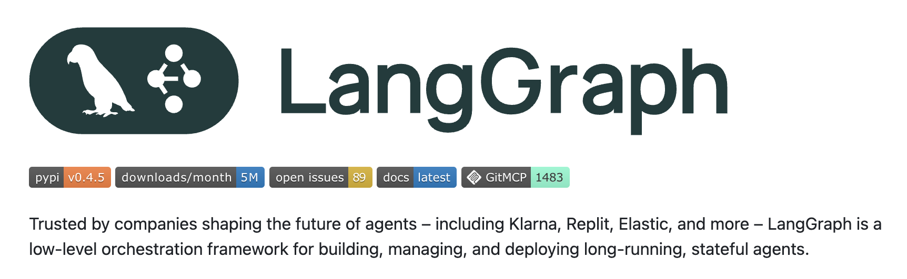

# 学习 SurfSense 的文档问答流程

昨天，我们学习了在 SurfSense 中添加文档之后的入库流程，包括总结、分块、向量化等，现在一切准备就绪，到了对文档进行问答的时候了。

## 文档问答页面

点击左侧菜单中的 "Researcher" 进入问答页面：



输入框的最左边是选择数据源，在 SurfSense 中被称为 **连接器（Connectors）**，可以是我们上传的文件、添加的网页、添加的 Youtube 视频、或者通过浏览器插件抓取的内容：


SurfSense 还支持添加其他的连接器，比如搜索引擎 Tavily、聊天工具 Slack、项目管理工具 Linear、知识库 Notion 等等：



关于其他的连接器我们后面再看，暂时先不管。

输入框的中间用于选择 **搜索模式（Search Mode）**，分 `Full Document` 和 `Document Chunks` 两种：

* `Full Document` - 根据用户问题检索文档表，找出最相关的文档，返回文档全文，这种模式适用于文档多且单个文档比较小的场景；
* `Document Chunks` - 根据用户问题检索分块表，找出最相关的分块，返回一个个的文档片段，这种模式适用于文档较大的场景；

输入框的最右边是选择 **研究模式（Research Mode）**，分 `General`、`Deep` 和 `Deeper` 三种，这三种模式会影响检索的数据量和答案的丰富度：

* `General` - 检索 10 条数据，答案包括 1 个章节；
* `Deep` - 检索 20 条数据，答案包括 3 个章节；
* `Deeper` - 检索 30 条数据，答案包括 6 个章节；

## 体验文档问答

我们以之前的 MRAG 文档作为示例，体验下 SurfSense 的问答功能。首先，连接器选 `File`，搜索模式选 `Document Chunks`，研究模式选 `General`，然后输入一个简单的问题 `What is MRAG?`：



下面首先会出现一个终端，实时输出 SurfSense 的处理过程，从图中可以看出 SurfSense 接到用户查询后，开始生成答案大纲，生成了 1 个章节和 5 个研究问题，然后针对这些问题分别进行搜索，搜索的结果紧接着终端显示在下面：



最后根据搜索结果回答用户：



从结果来看，回答的结构比较清晰，符合预期，且带有引用来源，看上去也很靠谱。不过仔细看还是能发现不少问题，比如：引用的文档片段看不到完整内容，也无法跳转到原文对应的位置，导致溯源功能形同虚设；另外答案也不全面，比如第二节只提到了 MRAG 1.0 和 MRAG 2.0 却丢掉了 MRAG 3.0 的内容；第三节甚至出现了 `Mixed Language Models (MLLMs)` 这样的幻觉错误，连 MLLM 的全称都搞错了。

## 文档问答的实现原理

尽管存在很多问题，但并不妨碍我们去看它的实现原理。考虑到这是一个很新的项目，在社区也很活跃，还在不断地演进，相信后面会越来越完善。

好了，我们继续看代码。问答接口为 `POST /chat`，位于 `surfsense_backend/app/routes/chats_routes.py` 文件中：



核心逻辑是下面的 `stream_connector_search_results()` 函数，这是一个流式处理搜索结果的函数，用于将搜索结果和回答内容实时传输给客户端，点进去看它的实现：

```python
async for chunk in researcher_graph.astream(
    initial_state, 
    config=config, 
    stream_mode="custom",
):
    if isinstance(chunk, dict) and 'yeild_value' in chunk:
        yield chunk['yeild_value']

yield streaming_service.format_completion()
```

很显然，这是一个 **生成器函数**，通过 `researcher_graph.astream()` 不断产生内容，并通过 `yield` 关键字返回，最终通过 FastAPI 的 `StreamingResponse` 实现流式输出。

## Python 中的生成器函数

Python 中的 **生成器函数（Generators）** 是一种特殊的函数，它使用 `yield` 关键字来返回值，而不是普通的 `return` 返回。当函数中包含 `yield` 语句时，这个函数就变成了生成器函数，调用生成器函数不会立即执行函数体，而是返回一个生成器对象，可以通过 `next()` 或 `for` 循环从生成器函数取值。

```python
def simple_generator():
    yield 1
    yield 2
    yield 3

for value in simple_generator():
    print(value)
```

生成器函数的核心特点是惰性求值和状态保持。当我们从生成器函数取值时，它不会一次性返回所有结果，而是每次返回一个值，函数会记住当前执行的位置，下次调用时从该位置继续执行。

在上面这段代码中，通过生成器函数，可以将消息实时流式传输给客户端，而不是等待所有结果都准备好才一次性返回，这样可以提供更好的用户体验。

## Researcher Graph

接着再来看 `researcher_graph` 的实现：

```python
def build_graph():
    workflow = StateGraph(State, config_schema=Configuration)
    
    workflow.add_node("reformulate_user_query", reformulate_user_query)
    workflow.add_node("write_answer_outline", write_answer_outline)
    workflow.add_node("process_sections", process_sections)

    workflow.add_edge("__start__", "reformulate_user_query")
    workflow.add_edge("reformulate_user_query", "write_answer_outline")
    workflow.add_edge("write_answer_outline", "process_sections")
    workflow.add_edge("process_sections", "__end__")

    graph = workflow.compile()
    graph.name = "Surfsense Researcher"
    
    return graph

graph = build_graph()
```

这里通过 LangGraph 构建了一个名为 `Surfsense Researcher` 的智能体流程，这个智能体比较简单，是一个线性工作流程，如下：



整个工作流包含三个主要节点：

* `reformulate_user_query`：重新表述用户查询，也就是对用户的问题进行改写；
* `write_answer_outline`：根据不同的研究模式生成大纲，并为每个大纲生成多个搜索问题；
* `process_sections`：针对大纲中的每个章节，调用连接器去搜索，并生成对应章节的内容；

## LangGraph 框架

[LangGraph](https://github.com/langchain-ai/langgraph) 是 LangChain 开源的一个多智能体框架：



LangGraph 允许用户自定义包含循环的流程，并使用 **状态图（State Graph）** 来表示智能体的调用过程，提供了对应用程序的流程和状态更精细的控制。它的关键特性如下：

* **循环和分支（Cycles and Branching）**：支持在应用程序中实现循环和条件语句；
* **持久性（Persistence）**：自动保存每一步的执行状态，支持在任意点暂停和恢复，以实现错误恢复、人机协同、时间旅行等功能；
* **人机协同（Human-in-the-Loop）**：支持在行动执行前中断执行，允许人工介入批准或编辑；
* **流支持（Streaming Support）**：图中的每个节点都支持实时地流式输出；
* **与 LangChain 的集成（Integration with LangChain）**：LangGraph 与 LangChain 和 LangSmith 无缝集成，但并不强依赖于它们。

关于 LangGraph 的使用，我在去年的时候写过一篇博客，感兴趣的朋友可以看看：

* https://www.aneasystone.com/archives/2024/10/create-agents-with-langgraph.html

## 小结

从 LangGraph 的工作流可以看出，这是一个典型的研究报告生成智能体，之前在调研 Deep Search 和 Deep Research 的时候，有大量的开源项目使用了类似的处理流程，尽管如此，SurfSense 的处理流程中还有一些细节值得学习，我们明天继续。
