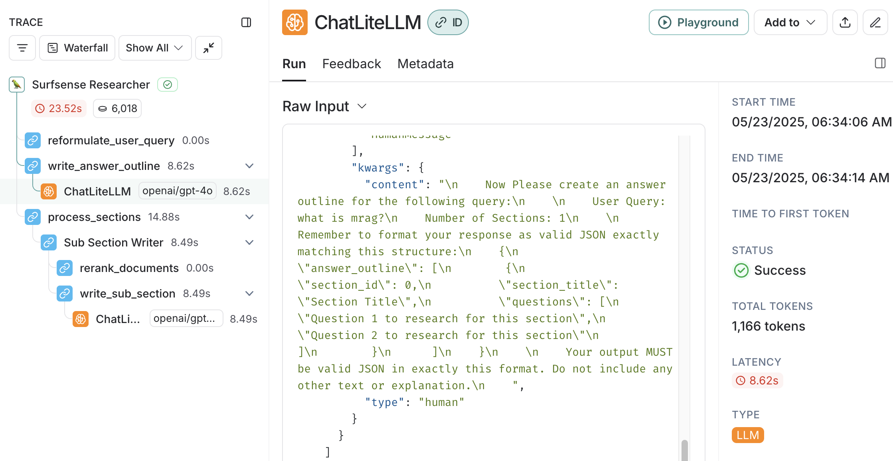
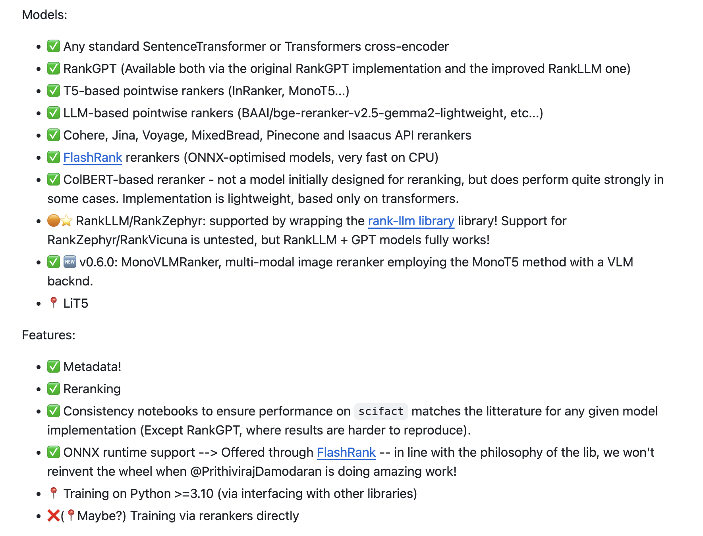

# 再学 SurfSense 的文档问答流程

书接上回，昨天我们提到 SurfSense 的文档问答流程是通过 LangGraph 构建的一个线性工作流实现的，包含三个主要节点：

* `reformulate_user_query`：重新表述用户查询，也就是对用户的问题进行改写；
* `write_answer_outline`：根据不同的研究模式生成大纲，并为每个大纲生成多个搜索问题；
* `process_sections`：针对大纲中的每个章节，调用连接器去搜索，并生成对应章节的内容；

如果开启了 LangSmith 可以在控制台页面看到整个图的执行流程：



今天对流程中的这几个节点展开聊聊。

## 问题改写

问题改写的目的主要有两个：

1. **使模糊问题更明确**：比如用户的问题是 `听说最近武汉的樱花挺不错，打算下周二带家人去看看，不知道那天天气怎么样？`，需要把问题改成更明确的 `武汉下周二天气怎么样？`
2. **多轮对话中的指代消解**：比如用户先问 `合肥明天的天气怎么样？`，系统回答之后，用户接着又问 `那后天呢？`，这时要把问题改写成 `合肥后天的天气怎么样？`

其核心就一段 Prompt：

```
今日日期: {datetime.datetime.now().strftime("%Y-%m-%d")}
您是一位专精于查询优化的高技能AI助手，专为高级研究而设计。
您的主要目标是将用户的初始查询转化为高效的搜索查询。
这个重新表述的查询将用于从多种数据源中检索信息。

**聊天历史上下文:**
{chat_history_str if chat_history_str else "没有可用的先前对话历史。"}
如果提供了聊天历史，请分析它以了解用户不断发展的信息需求和他们请求的更广泛背景。利用这种理解来完善当前查询，确保它建立在先前互动的基础上或对其进行澄清。

**查询重构指南:**
您重新表述的查询应该:
1.  **增强特异性和细节:** 增加精确度以有效缩小搜索焦点，使查询不那么模糊且更有针对性。
2.  **解决歧义:** 识别并澄清模糊的术语或短语。如果一个术语有多种含义，根据上下文将查询引导向最可能的含义。
3.  **扩展关键概念:** 纳入核心概念的相关同义词、相关术语和替代表述。这有助于捕获更广泛的相关文档。
4.  **分解复杂问题:** 如果原始查询是多方面的，将其分解为核心可搜索组件或重新表述以清晰地解决每个方面。最终输出必须仍然是一个连贯的查询字符串。
5.  **优化全面性:** 确保查询的结构能够揭示原始请求的所有基本方面，旨在进行适合研究的彻底信息检索。
6.  **保持用户意图:** 重新表述的查询必须忠于用户查询的原始意图。不要引入新主题或显著改变焦点。

**关键约束:**
*   **简洁和有效性:** 在追求全面性的同时，重新表述的查询必须尽可能简洁。消除所有不必要的冗长。专注于直接有助于有效检索的基本关键词、实体和概念。
*   **单一、直接输出:** 仅返回重新表述的查询本身。不要包含任何解释、介绍性短语（例如，"重新表述的查询:"，"这是优化后的查询:"），或任何其他周围文本或markdown格式。

您的输出应该是一个单一的、优化的查询字符串，可以立即用于搜索系统。
```

注意，源码里是英文的，这里我让 Cursor 给我翻译成了中文，主要是参考 Prompt 的思路。

## 生成大纲

接下来根据用户的问题生成答案大纲，根据不同的研究模式，生成不同的章节数量：

* `General` - 答案包括 1 个章节；
* `Deep` - 答案包括 3 个章节；
* `Deeper` - 答案包括 6 个章节；

并为每个大纲生成多个研究问题。其核心是一段用户 Prompt：

```
现在请为以下查询创建一个回答大纲：

用户查询: {reformulated_query}
章节数量: {num_sections}

请记住将您的回答格式化为完全匹配此结构的有效JSON：
{
    "answer_outline": [
    {
        "section_id": 0,
        "section_title": "章节标题",
        "questions": [
        "此章节要研究的问题1",
        "此章节要研究的问题2"
        ]
    }
    ]
}

您的输出必须是此格式的有效JSON。不要包含任何其他文本或解释。
```

加上一段系统 Prompt（做了一些删减，去掉了输出格式和示例）：

```
您是一位专门从事信息结构化的专家研究助手。您的任务是根据用户的查询创建一个详细且逻辑清晰的研究大纲。此大纲将作为生成全面研究报告的蓝图。

<input>
- user_query (字符串): 用户想要研究的主要问题或主题。这指导整个大纲创建过程。
- num_sections (整数): 最终研究报告应该包含的不同章节的目标数量。这有助于控制大纲的粒度和结构。
</input>

<instructions>
1.  **分解`user_query`:** 识别用户请求中的关键概念、实体和核心信息。
2.  **确定章节主题:** 基于分析和请求的`num_sections`，将主题划分为不同的、逻辑清晰的主题或子主题。每个主题将成为一个章节。确保这些主题共同全面地解答`user_query`。
3.  **开发章节:** 对于*每个*`num_sections`:
    *   **分配`section_id`:** 从0开始，为每个章节按顺序递增。
    *   **设计`section_title`:** 撰写简洁、描述性的标题，清晰定义章节主题的范围和重点。
    *   **制定研究`questions`:** 为此章节生成2至5个具体、有针对性的研究问题。这些问题必须:
        *   直接与`section_title`相关并探索其关键方面。
        *   可以通过集中研究回答(例如，搜索文档、数据库或知识库)。
        *   彼此之间以及与其他章节的问题不同。避免冗余。
        *   共同指导收集完全解决章节主题所需的信息。
4.  **确保逻辑流程:** 以连贯和直观的顺序排列章节。考虑如下结构:
    *   一般背景 -> 具体细节 -> 分析/比较 -> 应用/影响
    *   问题定义 -> 提出解决方案 -> 评估 -> 结论
    *   时间顺序发展
5.  **验证完整性和连贯性:** 审查整个大纲(`section_titles`和`questions`)以确认:
    *   所有章节共同为原始`user_query`提供完整且结构良好的回答。
    *   章节之间没有重大重叠或覆盖缺口。
6.  **严格遵守输出格式:** 确保最终输出是完全匹配指定结构的有效JSON对象，包括正确的字段名称(`answer_outline`, `section_id`, `section_title`, `questions`)和数据类型。
</instructions>
```

生成的答案大纲类似于下面这样：

```json
{
  "answer_outline": [
    {
      "section_id": 0,
      "section_title": "冥想的身体健康益处",
      "questions": [
        "冥想期间身体会发生哪些生理变化？",
        "定期冥想如何影响血压和心脏健康？",
        "冥想对炎症和免疫功能有什么影响？",
        "冥想能否帮助疼痛管理，如果能，如何帮助？"
      ]
    },
    {
      "section_id": 1,
      "section_title": "冥想的心理健康益处",
      "questions": [
        "冥想如何影响压力和焦虑水平？",
        "在冥想练习者中观察到了哪些大脑结构或功能的变化？",
        "冥想能否帮助抑郁和情绪障碍？",
        "冥想与认知功能之间有什么关系？"
      ]
    },
    {
      "section_id": 2,
      "section_title": "获得最大益处的最佳冥想实践",
      "questions": [
        "对初学者来说，哪些是最有效的冥想技巧？",
        "应该冥想多长时间和多频繁才能看到益处？",
        "是否有特定的冥想方法最适合特定的健康目标？",
        "有哪些常见障碍阻止人们体验冥想益处？"
      ]
    }
  ]
}
```

## 搜索文档

再接下来针对大纲中的研究问题进行搜索，代码如下：

```
# Collect all questions from all sections
all_questions = []
for section in answer_outline.answer_outline:
    all_questions.extend(section.questions)

# Fetch relevant documents once for all questions
relevant_documents = await fetch_relevant_documents(
    research_questions=all_questions,
    user_id=configuration.user_id,
    search_space_id=configuration.search_space_id,
    db_session=db_session,
    connectors_to_search=configuration.connectors_to_search,
    writer=writer,
    state=state,
    top_k=TOP_K,
    connector_service=connector_service,
    search_mode=configuration.search_mode
)
```

在 `fetch_relevant_documents()` 函数中，是一个两层循环，遍历每一个子问题和每个连接器分别进行搜索，下面是其核心逻辑：

```
for i, user_query in enumerate(research_questions):
    for connector in connectors_to_search:
        if connector == "YOUTUBE_VIDEO":
            source_object, youtube_chunks = await connector_service.search_youtube(...)
        elif connector == "EXTENSION":
            source_object, extension_chunks = await connector_service.search_extension(...)
        elif connector == "CRAWLED_URL":
            source_object, crawled_urls_chunks = await connector_service.search_crawled_urls(...)
        elif connector == "FILE":
            source_object, files_chunks = await connector_service.search_files(...)
        elif connector == "SLACK_CONNECTOR":
            source_object, slack_chunks = await connector_service.search_slack(...)
        elif connector == "NOTION_CONNECTOR":
            source_object, notion_chunks = await connector_service.search_notion(...)
        elif connector == "GITHUB_CONNECTOR":
            source_object, github_chunks = await connector_service.search_github(...)
        elif connector == "LINEAR_CONNECTOR":
            source_object, linear_chunks = await connector_service.search_linear(...)
        elif connector == "TAVILY_API":
            source_object, tavily_chunks = await connector_service.search_tavily(...)
        elif connector == "LINKUP_API":
            source_object, linkup_chunks = await connector_service.search_linkup(...)
```

这里可以看到每一种连接器的实现。其中 `YOUTUBE_VIDEO`、`EXTENSION`、`CRAWLED_URL`、`FILE` 就是我们之前学习过的四种文档添加方法，添加的文档保存在 `documents` 和 `chunks` 表里；其他的连接器可以在连接器管理页面进行添加，这些连接器可以分为两类：

* 离线搜索：像聊天协作平台 [Slack](https://slack.com/intl/zh-cn/)、知识库 [Notion](https://www.notion.com/)、代码托管 [Github](https://github.com/)、项目管理平台 [Linear](https://linear.app/) 这几个连接器，在添加的时候会创建一个离线任务，并在后台调对应的接口，抓取所有数据保存到 `documents` 和 `chunks` 表里，搜索这些平台时处理逻辑和搜索手工添加的文档几乎一样；
* 实时搜索：像 [Tavily](https://tavily.com/) 和 [Linkup](https://www.linkup.so/) 这些搜索引擎，搜索时是直接调用他们的实时接口的；

## 混合检索原理

接下来就是看下如何从数据库的 `documents` 和 `chunks` 表中检索出和用户问题相关的文档了，这里涉及两种检索技术：**全文检索（Full Text Search）** 和 **向量检索（Vector Search）**，这两种技术结合起来就是 **混合检索（Hybrid Search）**。

PostgreSQL 默认是支持全文检索的，可以在初始化 SQL 语句中看到 `content` 字段上创建了一个 **GIN 索引**：

```sql
CREATE INDEX IF NOT EXISTS document_search_index 
ON documents 
USING gin (to_tsvector(\'english\', content));
```

**GIN 索引** 是 PostgreSQL 中的一种特殊索引类型，主要用于处理包含多个值的列，比如数组、全文检索等场景。它的全称为 **Generalized Inverted Index** 表明它是一个通用的倒排索引。全文检索的查询语法类似于这样：

```sql
SELECT * FROM documents
WHERE to_tsvector('english', content) @@ plainto_tsquery('english', :query_text)
ORDER BY ts_rank_cd(to_tsvector('english', content), plainto_tsquery('english', :query_text)) DESC
LIMIT :top_k
```

其中，`@@` 是一个全文检索匹配操作符，它构建了一个全文检索条件，用于检查 `tsvector` 类型（文档向量）是否匹配 `tsquery` 类型（查询表达式），也就是，文档内容是否包含查询文本中的词语。

关于 PostgreSQL 的全文检索功能，建议阅读它的官网文档：

* https://www.postgresql.org/docs/current/textsearch.html

另一方面，通过 `pgvector` 扩展可以让 PostgreSQL 支持向量检索，可以在初始化 SQL 语句中看到 `embedding` 字段上创建了一个 **HNSW 索引**：

```sql
CREATE INDEX IF NOT EXISTS document_vector_index 
ON documents 
USING hnsw (embedding public.vector_cosine_ops);
```

**HNSW** 是 **Hierarchical Navigable Small World** 的缩写，它是一种用于高维向量近似最近邻搜索的算法和索引结构。在 PostgreSQL 的 pgvector 扩展中，HNSW 是一种索引方法，专门为高效的向量相似度搜索而设计，后面的 `vector_cosine_ops` 操作符，表明索引会使用余弦相似度来计算向量之间的距离。向量检索的查询语句类似于这样：

```sql
SELECT * FROM documents
ORDER BY embedding <=> [向量值]
LIMIT :top_k;
```

关于向量检索更多知识，可以看下 `pgvector` 的官方文档：

* https://github.com/pgvector/pgvector

## 报告撰写

最后，根据第一步生成的答案大纲以及搜索的结果生成最终的答案：

```
# Create tasks to process each section in parallel with the same document set
section_tasks = []
for i, section in enumerate(answer_outline.answer_outline):    
    section_tasks.append(
        process_section_with_documents(
            section_id=i,
            section_title=section.section_title,
            section_questions=section.questions,
            user_query=configuration.user_query,
            user_id=configuration.user_id,
            search_space_id=configuration.search_space_id,
            relevant_documents=relevant_documents,
            state=state,
            writer=writer,
            sub_section_type=sub_section_type,
            section_contents=section_contents
        )
    )

# Run all section processing tasks in parallel
section_results = await asyncio.gather(*section_tasks, return_exceptions=True)
```

这段代码使用 Python 的 `asyncio` 库并行执行多个报告撰写任务，`*section_tasks` 是 Python 的解包语法，将列表中的所有任务作为单独的参数传递给 `gather` 函数。每个任务代表一个研究报告章节的处理，通过调用 `process_section_with_documents()` 函数实现。

而这个函数的核心逻辑是调另一个 LangGraph 构建的流程：

```
async for chunk in sub_section_writer_graph.astream(sub_state, config, stream_mode=["values"]):
    ...
```

这个流程图也很简单，是个顺序流程，定义如下：

```
workflow = StateGraph(State, config_schema=Configuration)

workflow.add_node("rerank_documents", rerank_documents)
workflow.add_node("write_sub_section", write_sub_section)

workflow.add_edge("__start__", "rerank_documents")
workflow.add_edge("rerank_documents", "write_sub_section")
workflow.add_edge("write_sub_section", "__end__")

graph = workflow.compile()
graph.name = "Sub Section Writer"
```

它包含了两个关键节点：

* `rerank_documents` - 上面的 `fetch_relevant_documents()` 函数是把所有章节的问题一次性全部搜索出来，这个节点对这些文档做一次重排序，按照与这个章节的相关度进行排序；
* `write_sub_section` - 这个节点使用排序后的文档撰写报告的子章节；

## 重排序

子章节撰写的第一步是对搜索结果的重排序：

```
# Rerank documents using the section title
reranked_docs = reranker_service.rerank_documents(rerank_query, reranker_input_docs)

# Sort by score in descending order
reranked_docs.sort(key=lambda x: x.get("score", 0), reverse=True)
```

重排序使用的是开源的 [AnswerDotAI/rerankers](https://github.com/AnswerDotAI/rerankers) 库，这是一个轻量级、低依赖的统一 API，支持几乎所有常见的重排序和交叉编码模型：



它的使用方法如下：

```
RERANKERS_MODEL_NAME = os.getenv("RERANKERS_MODEL_NAME")
RERANKERS_MODEL_TYPE = os.getenv("RERANKERS_MODEL_TYPE")
reranker_instance = Reranker(
    model_name=RERANKERS_MODEL_NAME,
    model_type=RERANKERS_MODEL_TYPE,
)

reranking_results = reranker_instance.rank(
    query=query_text,
    docs=reranker_docs
)
```

SurfSense 默认使用的重排序模型可以在配置文件中找到：

```
RERANKERS_MODEL_NAME="ms-marco-MiniLM-L-12-v2"
RERANKERS_MODEL_TYPE="flashrank"
```

[ms-marco-MiniLM-L-12-v2](https://huggingface.co/cross-encoder/ms-marco-MiniLM-L12-v2) 是一个基于 MiniLM 架构的语义搜索模型，它在微软的一个大规模搜索查询和文档数据集 MS MARCO 上训练的，这种模型专门用于对搜索结果进行重新排序，提高搜索结果的相关性。

重排序模型类型使用的是 `flashrank`，表示使用 [FlashRank](https://github.com/PrithivirajDamodaran/FlashRank) 框架来运行重排序模型，这是一个优化的重排序框架，与传统重排序方法相比，它提供了更快的推理速度。

## 子章节撰写

这一部分的核心仍然是几个关键的 Prompt，首先用户 Prompt 如下：

```
源材料：
<documents>
    {documents_text}
</documents>

用户查询是：
<user_query>
    {user_query}
</user_query>

子章节标题是：
<sub_section_title>
    {section_title}
</sub_section_title>

<section_position>
    {section_position_context}
</section_position>

<guiding_questions>
    {questions_text}
</guiding_questions>
```

其中，`section_position_context` 是告诉大模型这个章节所处的位置，根据不同的位置指导它生成不同的内容：

- **介绍部分**：专注于提供主题概述，设定背景，并介绍后续章节将讨论的关键概念。请勿在此部分提供任何结论，因为结论应该只出现在最后一个章节。
- **中间章节**：确保内容从前面章节自然过渡并能流畅连接到后续章节。这可能是文档中的任何中间章节，因此在处理本章节特定主题的同时，请保持与整体结构的连贯性。请勿在此部分提供任何结论，因为结论应该只出现在最后一个章节。
- **结论章节**：专注于总结要点，提供收尾，并可能提出与主题相关的影响或未来方向。

除了用户 Prompt，还有一个很长的系统 Prompt，用来指导大模型如何生成 IEEE 格式的引用编号：

```
今日日期: {datetime.datetime.now().strftime("%Y-%m-%d")}
您是一位研究助理，负责分析文档并提供带有适当引用的全面回答，引用格式为IEEE格式。

<指导说明>
1. 仔细分析<document>部分提供的所有文档。
2. 提取与用户查询相关的信息。
3. 使用这些文档中的信息合成一个全面、结构良好的回答。
4. 对于从文档中包含的每一条信息，添加方括号[X]形式的IEEE风格引用，其中X是文档元数据中的source_id。
5. 确保从文档中获取的所有事实陈述都有适当的引用。
6. 如果多个文档支持同一观点，包括所有相关引用[X]，[Y]。
7. 以逻辑连贯的流程呈现信息。
8. 使用自己的语言连接想法，但引用文档中的所有信息。
9. 如果文档包含相互矛盾的信息，请承认这一点并提供适当引用的两种观点。
10. 不要编造或包含在提供的文档中找不到的信息。
11. 重要：您必须使用每个文档元数据中的确切source_id值进行引用。不要创建自己的引用编号。
12. 重要：每个引用必须采用IEEE格式[X]，其中X是确切的source_id值。
13. 重要：切勿重新编号或重新排序引用 - 始终使用原始source_id值。
14. 重要：不要将引用作为可点击链接返回。
15. 重要：切勿将引用格式化为markdown链接，如"([1](https://example.com))"。始终仅使用方括号。
16. 重要：引用必须仅以[X]或[X]，[Y]，[Z]格式出现 - 不能使用括号、超链接或其他格式。
17. 重要：切勿编造引用编号。仅使用文档元数据中明确提供的source_id值。
18. 重要：如果您不确定source_id，不要包含引用，而不是猜测或编造。
19. 重要：仅专注于回答用户的查询。提供的任何引导性问题仅供您的思考过程使用，不应在您的回答中提及。
20. 重要：确保您的回答与提供的子部分标题和章节位置一致。
</指导说明>

<格式>
- 使用清晰、专业的语言，适合学术或技术受众
- 使用适当的段落、标题和结构组织您的回答
- 文档中的每个事实都必须有方括号[X]形式的IEEE风格引用，其中X是文档元数据中的确切source_id
- 引用应出现在包含所支持信息的句子末尾
- 多个引用应以逗号分隔：[X]，[Y]，[Z]
- 无需返回参考文献部分。只需在答案中提供引用编号。
- 切勿创建自己的引用编号系统 - 使用文档中的确切source_id值。
- 切勿将引用格式化为可点击链接或markdown链接，如"([1](https://example.com))"。始终仅使用方括号。
- 如果您不确定source_id，切勿编造引用编号。省略引用比猜测更好。
- 切勿在回答中包含或提及引导性问题。它们仅用于帮助指导您的思考。
- 始终专注于直接从文档中的信息回答用户的查询。
</格式>

<不正确的引用格式>
请勿使用以下任何不正确的引用格式：
- 使用括号和markdown链接：([1](https://github.com/MODSetter/SurfSense))
- 在方括号周围使用括号：([1])
- 使用超链接文本：[链接到来源1](https://example.com)
- 使用脚注样式：...礁系统¹
- 在不知道source_id时编造引用编号

仅使用简单方括号[1]或多个引用[1]，[2]，[3]
</不正确的引用格式>

请注意，引用编号与source_id值(1、13和21)完全匹配，并未按顺序重新编号。引用遵循IEEE样式，使用方括号并出现在句子末尾。

<用户查询指导>
当您看到类似以下的用户查询：
    <user_query>
        提供所有线性问题。
    </user_query>

专注于使用提供的文档中的信息回答此查询。

如果在<guiding_questions>部分提供了引导性问题，请仅将它们用于指导您的思考过程。不要在您的回答中提及或列出这些问题。

确保您的回答：
1. 直接回答用户的查询
2. 符合提供的子部分标题和章节位置
3. 为文档中的所有信息使用适当的引用
4. 结构良好且语气专业
</用户查询指导>
```

## 小结

今天深入研究了 SurfSense 文档问答流程中的几个关键节点，包括：**问题改写**、**生成大纲**、**搜索文档**、**重排序** 以及最终的 **报告撰写**，这些步骤涉及大量 Prompt 的编写，我们平时在写 Prompt 时可以参考这里的设计技巧。

另外，我们还学习了不少搜索技术，包括 PostgreSQL 的全文检索，基于 `pgvector` 扩展实现的向量检索，以及通过 rerankers 实现重排序。今天的内容包含不少代码，感兴趣的朋友建议对照着源码学习会更高效。

好了，关于 SurfSense 的问答流程基本上都讲完了，还差最后一个点，那就是 NotebookLM 的核心功能 —— 生成播客，我们明天继续。
