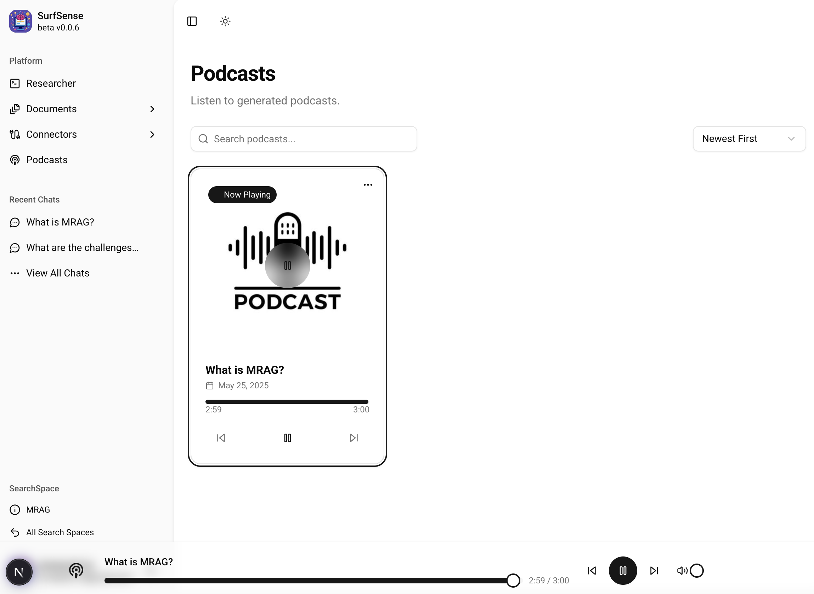

# 学习 SurfSense 的播客生成

经过几天的学习，我们已经基本掌握了 SurfSense 的所有功能，包括添加文档的四种方式，连接器的管理，以及问答流程。并且针对每一个功能，通过剖析源码学习各自的实现原理，比如如何实现文档的解析，如何对文档进行检索，如何实现整个问答流程，等等。

不过，还有一个最重要的功能没有讲到。之前有提到，SurfSense 号称是 NotebookLM 的开源平替，而 NotebookLM 的杀手锏便是它的 **音频概览（Audio Overview）** 功能，用户只需一键点击，就可以将文本内容转换为类似播客的音频讨论，这一功能特别适合那些喜欢听觉学习或需要在通勤、运动等场景下继续学习的用户。

SurfSense 同样也实现了类似的功能，可以针对对话内容生成播客，我们今天就来看下这个功能。

## 生成播客

在 SurfSense 上产生会话后，就可以点击左侧菜单上的 “View All Chats” 进入会话列表页面，针对每一通会话，我们可以点击 “Generate Podcast” 生成播客：


弹出对话框，输入播客名称，然后确认即可：


稍等片刻，等后端生成结束，进入 “Podcasts” 页面，就可以看到生成的播客了：



下面是我生成的播客，你可以听听效果，是不是有点像那么回事：

<audio controls>
  <source src="./images/podcast.mp3" type="audio/mpeg">
  您的浏览器不支持音频元素。
</audio>

## 生成播客的实现

生成播客的代码逻辑位于 `podcasts_routes.py` 文件中，接口名为 `POST /podcasts/generate/`：


同样地，通过 FastAPI 的 `BackgroundTasks` 创建一个后台任务来生成播客。任务的实现位于 `podcast_tasks.py` 文件中 `generate_chat_podcast()` 函数：

```python
async def generate_chat_podcast(
    session: AsyncSession,
    chat_id: int,
    search_space_id: int,
    podcast_title: str
):

    initial_state = State(
        source_content=chat_history_str,
    )
    
    result = await podcaster_graph.ainvoke(initial_state, config=config)
```

可以看到，又是一个 LangGraph 构建的流程图！它的定义如下：

```
workflow = StateGraph(State, config_schema=Configuration)

workflow.add_node("create_podcast_transcript", create_podcast_transcript)
workflow.add_node("create_merged_podcast_audio", create_merged_podcast_audio)

workflow.add_edge("__start__", "create_podcast_transcript")
workflow.add_edge("create_podcast_transcript", "create_merged_podcast_audio")
workflow.add_edge("create_merged_podcast_audio", "__end__")

graph = workflow.compile()
graph.name = "Surfsense Podcaster"
```

这个生成播客的工作流包含两个工作节点：

* `create_podcast_transcript` - 生成播客的文本稿
* `create_merged_podcast_audio` - 创建合并后的播客音频

## 生成文本稿

第一步根据对话内容生成播客的文本稿，其核心仍然是一段系统 Prompt：

```
当前日期: {datetime.datetime.now().strftime("%Y-%m-%d")}
<podcast_generation_system>
您是一位专业的播客脚本撰写大师，擅长将各类输入内容转化为两位主持人之间生动、引人入胜且自然流畅的对话。您的核心目标是创作出真实自然的对话内容，完全避免机器人式生硬脚本或刻板的正式感。要实现充满活力的互动效果，而非单纯的信息传递。

<input>
- '<source_content>': 待讨论的原始文本内容块。可能是研究发现、文章摘要、详细大纲、与该主题相关的用户聊天记录，或其他相关信息。内容可能是非结构化的，但将作为播客对话的事实依据。
</input>

<output_format>
包含交替主持人对话的JSON格式播客文本：
{
  "podcast_transcripts": [
    {
      "speaker_id": 0,
      "dialog": "主持人0的对话内容"
    },
    {
      "speaker_id": 1,
      "dialog": "主持人1的对话内容"
    },
    {
      "speaker_id": 0,
      "dialog": "主持人0的对话内容"
    },
    {
      "speaker_id": 1,
      "dialog": "主持人1的对话内容"
    }
  ]
}
</output_format>

<guidelines>
1.  **建立鲜明且一致的主持人角色：**
    *   **主持人0（主咖）：** 推动对话进程，引入环节，提出源自内容的关键问题，并经常总结要点。保持引导性、清晰且吸引人的语调。
    *   **主持人1（辅助/专家型）：** 提供深入见解、提出不同观点、追问细节、分享相关事例。采用互补性语调（如分析型、热情型、反思型或略带怀疑型）。
    *   **保持一致性：** 确保每个主持人全程保持独特的用词习惯、句式结构和观点立场，避免角色混同，互动应呈现真实的伙伴关系。

2.  **创作自然动态的对话：**
    *   **模拟真实交谈：** 使用缩略语（如"别"、"它是"）、语气词（"噢！"、"哇！"）、话语标记（"你懂的"、"对吧？"）和偶尔自然的停顿填充词。避免书面化的复杂句式。
    *   **培养互动化学反应：** 设计真实回应的对话（"说得好，这让我想起..."），追问细节（"能展开说说吗？"），礼貌表达异议（"有道理，不过是否考虑过..."），展现积极聆听。
    *   **节奏变化：** 混合短句与长句，多样化句式开头。用提问打断长篇说明，保持节奏的自发性。
    *   **注入个性：** 适当加入符合角色设定的幽默、惊讶反应、个人经历参照（"我遇到类似情况..."）或增强上下文的过往讨论提及（"记得上周我们聊过..."）。

3.  **结构化流程设计：**
    *   **自然开场：** 对话内容应接续既定的开场白（会手动添加），避免重复问候语或节目名称。
    *   **逻辑推进：** 使用清晰过渡串联内容（"说完X，现在来看看Y..."），确保话题自然衔接。
    *   **有力收尾：** 总结核心观点，可留下思考问题或下期预告，避免突兀结束。

4.  **内容融合技巧：**
    *   **转译而非复述：** 将原始内容转化为适合各主持人风格的口语表达，避免直接搬运复杂术语。
    *   **解释说明：** 通过比喻、案例或主持人追问（代表听众提问）来解析复杂概念。
    *   **自然植入：** 以对话形式呈现事实数据（"研究显示..."），避免孤立的信息块。
    *   **平衡深度：** 在保证准确性的前提下优先易懂性，适合大众听众。

5.  **时长控制：**
    *   **六分钟时长：** 按正常语速朗读约1000字（150字/分钟）。
    *   **简洁话轮：** 保持话轮简短聚焦，避免长篇独白。
    *   **内容精选：** 优先关键信息，确保每句对话都有实质贡献。
</guidelines>

请将源材料转化为生动有趣的播客对话。创作时应体现真实的主持人互动（包括观点交锋、追问细节等），使用符合真实人类对话的多样化表达，确保脚本在5分钟时长内兼具教育性和娱乐性。
</podcast_generation_system>
```

输出结果类似下面这种格式：

```json
{
  "podcast_transcripts": [
    {
      "speaker_id": 0,
      "dialog": "今天我们聊烧脑的量子计算，这可是我期待数周的话题"
    },
    {
      "speaker_id": 1,
      "dialog": "我也超兴奋！不过说实话，量子计算的概念让我有点晕。咱能从基础讲起吗？"
    },
    {
      "speaker_id": 0,
      "dialog": "没问题。传统电脑用二进制对吧？要么1要么0。但量子计算机用的是量子比特，这里开始就神奇了"
    },
    {
      "speaker_id": 1, 
      "dialog": "等等，量子比特特别在哪？"
    },
    {
      "speaker_id": 0,
      "dialog": "关键在于叠加态——量子比特可以同时处于多个状态"
    },
    {
      "speaker_id": 1,
      "dialog": "这不可能吧？！怎么理解这种状态？"
    },
    {
      "speaker_id": 0,
      "dialog": "想象旋转的硬币——落地前你能确定是正面还是反面吗？"
    },
    {
      "speaker_id": 1,
      "dialog": "嗯...既不是又都是？噢我好像明白这个比喻了"
    }
  ]
}
```

## 生成播客音频

由于生成的播客内容是一段段的对话，两位主持人在相互聊天，所以我们也需要一段段的生成音频：

```python
tasks = [
    generate_speech_for_segment(segment, i) 
    for i, segment in enumerate(merged_transcript)
]
audio_files = await asyncio.gather(*tasks)
```

生成音频使用的是 [LiteLLM](https://docs.litellm.ai/docs/text_to_speech) 的 `aspeech()` 函数：

```python
response = await aspeech(
    model=app_config.TTS_SERVICE,
    api_base=app_config.TTS_SERVICE_API_BASE,
    voice=voice,
    input=dialog,
    max_retries=2,
    timeout=600,
)
```

LiteLLM 支持几种不同的 TTS 实现，包括 OpenAI、Azure OpenAI 和 Vertex AI	等。SurfSense 默认使用的是 OpenAI 的 `tts-1` 模型，可以在配置文件中切换：

```python
TTS_SERVICE="openai/tts-1"
```

其中 `voice` 参数表示说话人声音，支持下面这些：

* alloy
* ash
* ballad
* coral
* echo
* fable
* nova
* onyx
* sage
* shimmer

可以在 OpenAI.fm 页面试听效果：

* https://www.openai.fm/

SurfSense 默认使用的是 `alloy` 女声 和 `echo` 男声，说实话，这两个音色感觉很接近，区分度不太好。我把女声换成了 `coral`，区分度明显好了很多，就是女声有点太激动了。。。

<audio controls>
  <source src="./images/podcast-2.mp3" type="audio/mpeg">
  您的浏览器不支持音频元素。
</audio>

还有一些其他参数可以参考 [OpenAI 文档](https://platform.openai.com/docs/api-reference/audio/createSpeech)：


## 合并播客音频

上面这一步生成的都是一个个独立的音频文件，要得到最后的播客，还需要将这些小音频片段合并起来。SurfSense 通过 [FFmpeg](https://ffmpeg.org/) 实现：

```
ffmpeg = FFmpeg().option("y")

for audio_file in audio_files:
    ffmpeg = ffmpeg.input(audio_file)

filter_complex = []
for i in range(len(audio_files)):
    filter_complex.append(f"[{i}:0]")

filter_complex_str = "".join(filter_complex) + f"concat=n={len(audio_files)}:v=0:a=1[outa]"
ffmpeg = ffmpeg.option("filter_complex", filter_complex_str)
ffmpeg = ffmpeg.output(output_path, map="[outa]")

await ffmpeg.execute()
```

至此，我们就得到了一份关于对话记录的播客，生成的播客音频位于 `podcasts` 目录，文件名为 `{session_id}_podcast.mp3`。

## NotebookLM 背后的音频生成技术

如果你仔细听 NotebookLM 生成的播客音频，会发现两个主持人的声音更自然，一个人在说的时候另一个人还会有一些附和声，两个人的交流也更流畅。

这其实要归功于 DeepMind 开发的 **SoundStorm** 这个多说话人对话生成模型。Google 曾在 24 年的时候公布过他们的音频生成技术，感兴趣的朋友可以了解下：

* https://deepmind.google/discover/blog/pushing-the-frontiers-of-audio-generation/

文章主要介绍了 SoundStream、AudioLM 和 SoundStorm 三种核心的音频生成技术：

- **SoundStream**：是一个神经音频编码器，将音频压缩成声学令牌，再解码成高保真声音；
- **AudioLM**：将音频生成视为语言建模任务，将音频生成类比于文本生成，从而灵活生成多种类型音频；
- **SoundStorm**：一个多说话人对话生成模型，能生成多达 30 秒的自然对话段落。

通过端到端的生成多说话人对话，而不是靠工程层面的音频拼接，自然能达到更自然更流畅的效果，这也正是 NotebookLM 效果出众的原因。
