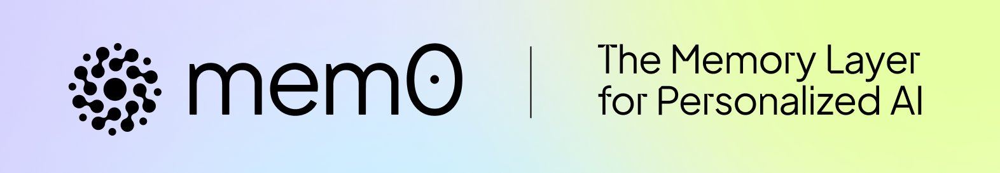
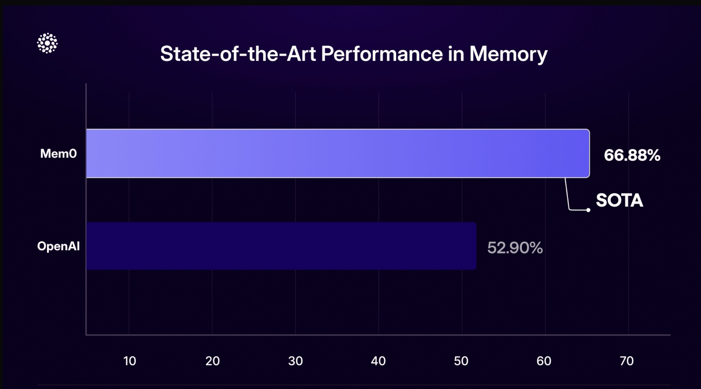
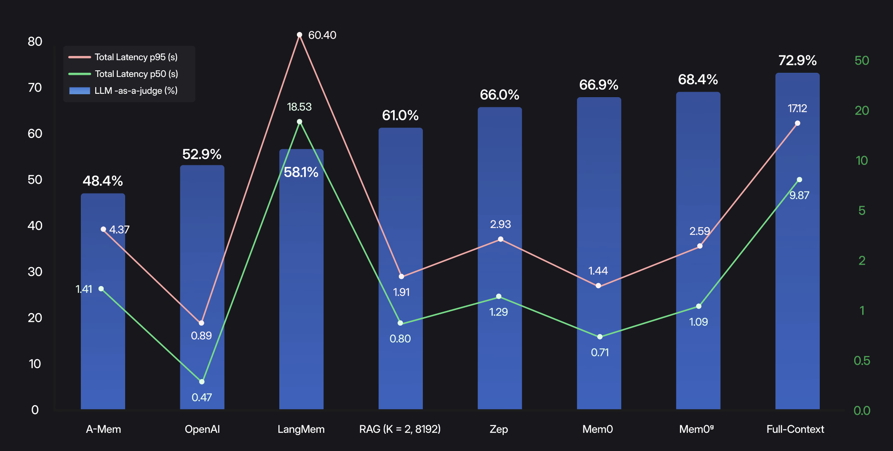
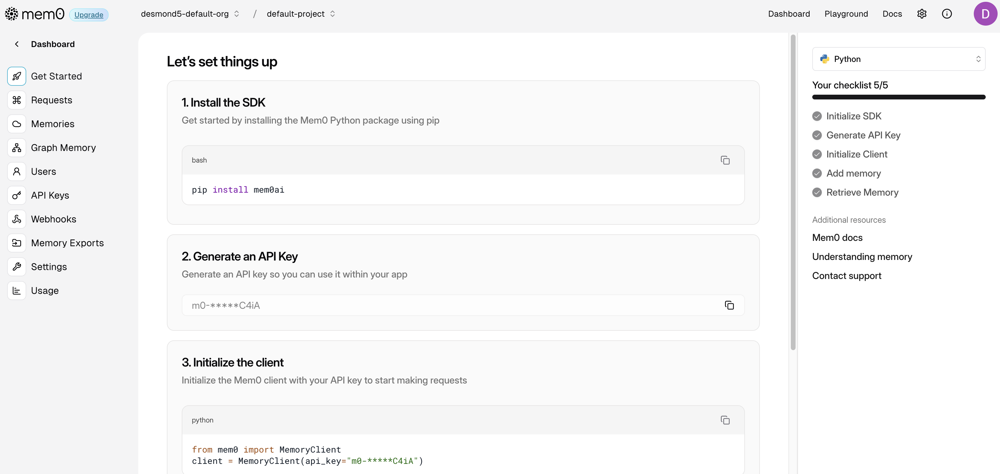
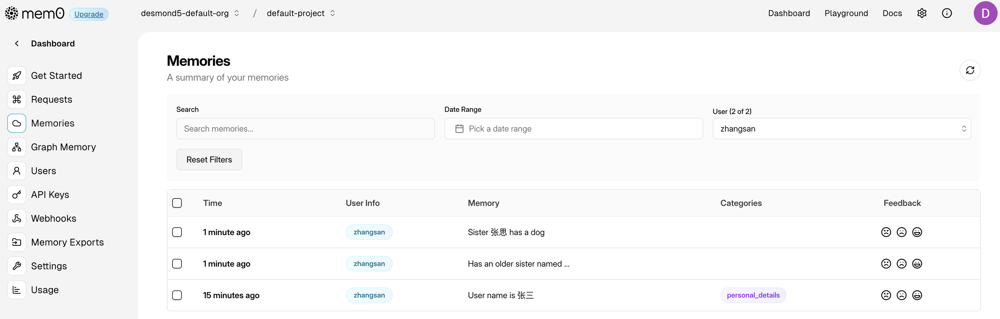

# Mem0 介绍：为 AI 应用提供智能记忆层

今年被称为智能体爆发元年，随着推理模型和多模态模型的不断发展，各家 AI 助手和智能体的能力不断提升，应用场景也在不断扩展。但是大模型存在一个先天缺陷，它们往往缺乏持久记忆能力，无法真正实现个性化交互。如何让 AI 系统能够记住用户偏好、适应个人需求并随时间持续学习，成为一个亟待解决的问题。

今天给大家介绍一个开源项目 [Mem0](https://mem0.ai/)（读作 "mem-zero"），正是为解决这一挑战而生。



Mem0 其实并不算新项目，去年就已经推出了，推出之后社区反响不错，迅速登上了 Github 趋势榜，受到了开发者们的广泛关注，并成为 Y Combinator S24 孵化的项目。当时我简单瞅了一眼，发现它的源码和使用案例非常的简单和粗糙，只有几个和记忆相关的增删改查的接口，实在搞不懂为啥能拿到 10K+ 的星标。这两天这个项目又上了趋势榜，再看的时候星标数已经突破了 32K+，看源码结构和官方文档都比之前丰富了不少，于是准备花点时间仔细研究下它，看看它到底有何过人之处。

## 研究亮点

如今的大模型在长时间的交互中会忘记关键事实，打破上下文，让用户缺乏信任感。仅仅扩大上下文窗口只会延迟问题 —— 模型变得更慢、更昂贵，但仍然会忽视关键细节。Mem0 直接针对这个问题，采用可扩展的记忆架构，动态提取、整合和检索对话中的重要信息。

根据官方发布的一份研究报告，Mem0 在记忆管理方面的效果令人瞩目。

* https://mem0.ai/research

在 [LOCOMO](https://snap-research.github.io/locomo/) 基准测试中，使用 **大模型作为评判者（LLM-as-a-Judge）** 计算准确率得分，Mem0 取得 66.9% 的成绩，相对于 OpenAI 的 52.9% 提升了 26%，突显了其卓越的事实准确性和连贯性。



除了质量，相对于全上下文，Mem0 的 **选择性检索管道（selective retrieval pipeline）** 通过处理简洁的记忆事实而不是重新处理整个聊天记录，将 p95 延迟降低了 91%，Mem0 是 1.44 秒，而全上下文多达 17.12 秒。此外，Mem0 还实现了 90% 的令牌消耗减少，每次对话仅需约 1.8K 个令牌，而全上下文方法则需要 26K 个令牌。

下图展示了每种记忆方法 **端到端（记忆检索 + 答案生成）** 的测试情况：



可以看到全上下文方法虽然有 72.9% 的高准确率，但中位数延迟为 9.87 秒，95 百分位延迟更是高达 17.12 秒。相比之下，Mem0 的准确率是 66.9%，中位数延迟仅 0.71 秒，95 百分位延迟也只有 1.44 秒。

综合来看，这些结果展示了 Mem0 如何平衡最先进的推理效果、实时响应和成本效率 —— 使长期对话记忆在规模上变得可行。

## 核心特性

Mem0 作为一个为 AI 助手和智能体提供智能记忆层的开源项目，旨在实现个性化 AI 交互。它的核心特性如下：

* **多级记忆**：无缝保留用户、会话和智能体状态，实现自适应个性化；
* **开发者友好**：提供直观的 API、跨平台 SDK 和完全托管的服务选项；

Mem0 在多种场景中都有广泛应用：

* **AI 助手**：提供一致、富有上下文的对话体验；
* **客户支持**：记住过去的工单和用户历史，提供量身定制的帮助；
* **医疗保健**：跟踪患者偏好和历史，实现个性化护理；
* **生产力与游戏**：基于用户行为的自适应工作流和环境；

## 快速入门

Mem0 提供了 Python 和 TypeScript 两种 SDK 供开发者选用。下面将通过一个 Python 示例展示了 Mem0 的基本用法。

首先，通过 pip 安装 Mem0 和 OpenAI 的 SDK：

```
$ pip install mem0ai openai
```

然后编写示例代码如下：

```python
from openai import OpenAI
from mem0 import Memory

openai_client = OpenAI()
memory = Memory()

def chat_with_memories(message: str, user_id: str = "default_user") -> str:
    
    # 检索相关记忆
    relevant_memories = memory.search(query=message, user_id=user_id, limit=3)
    memories_str = "\n".join(f"- {entry['memory']}" for entry in relevant_memories["results"])

    # 生成助手回复
    system_prompt = f"你是我的私人助理，请根据我的记忆回答我的问题。\n我的记忆：\n{memories_str}"
    messages = [{"role": "system", "content": system_prompt}, {"role": "user", "content": message}]
    response = openai_client.chat.completions.create(model="gpt-4o-mini", messages=messages)
    assistant_response = response.choices[0].message.content

    # 从对话中创建新记忆
    messages.append({"role": "assistant", "content": assistant_response})
    memory.add(messages, user_id=user_id)

    return assistant_response

def main():
    while True:
        user_input = input("用户：").strip()
        if user_input.lower() == 'exit':
            print("再见！")
            break
        print(f"系统：{chat_with_memories(user_input, "zhangsan")}")

if __name__ == "__main__":
    main()
```

这段代码和传统的大模型调用代码有一个很明显的区别，用户不再关注和拼接历史会话，每次用户请求进来后，先检索记忆，然后将记忆带到系统 Prompt 中回答用户问题，最后再将这次对话保存到记忆，以此循环往复。注意，上面这个记忆保存在内存里，只是临时的，重启程序后记忆就没有了。

Mem0 保存记忆时，需要一个 LLM 来运行，默认使用 OpenAI 的 `gpt-4o-mini`，可以通过配置切换其他模型，可参考：

* https://docs.mem0.ai/components/llms/overview

## 托管平台

除了自托管使用，Mem0 也提供了在线平台，方便用户开箱即用，享受自动更新、分析和企业级安全特性。首先我们进入 Mem0 平台，注册后，根据提示步骤获取 API KEY：



然后稍微修改上面的代码，将 `Memory` 改为 `MemoryClient`，并配置刚刚得到的 API KEY：

```python
from mem0 import MemoryClient
memory = MemoryClient(api_key=os.getenv("MEM0_API_KEY"))
```

另外，由于数据结构不一样，将 `relevant_memories["results"]` 改为 `relevant_memories`：

```python
relevant_memories = memory.search(query=message, user_id=user_id, limit=3)
memories_str = "\n".join(f"- {entry['memory']}" for entry in relevant_memories)
```

这时记忆保存在 Mem0 服务中，就算程序重启，记忆也不会丢失，可以在 Mem0 平台的 “Memories” 页面查看保存的记忆：



## 小结

今天简单介绍了 Mem0 的研究亮点和核心特性，并通过一段示例代码展示了 Mem0 的基本用法。通过 Mem0 我们给 AI 应用添加了一层智能记忆层，实现了真正的个性化交互体验，让 AI 系统能够记住用户偏好、适应个人需求并随时间持续学习。
