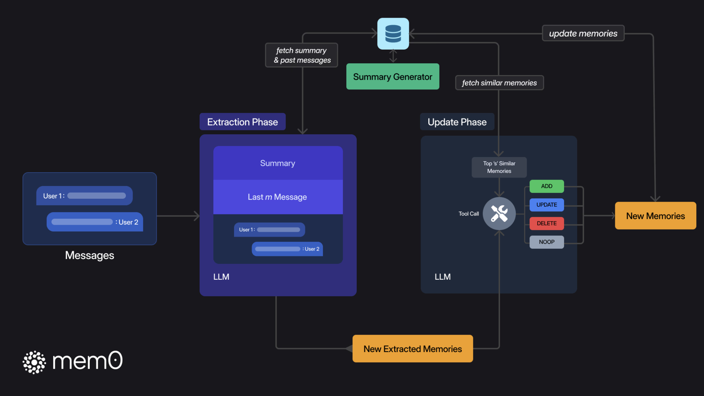
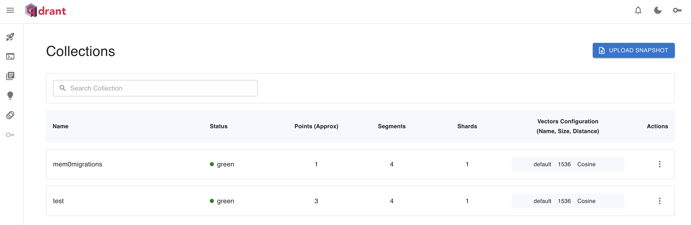
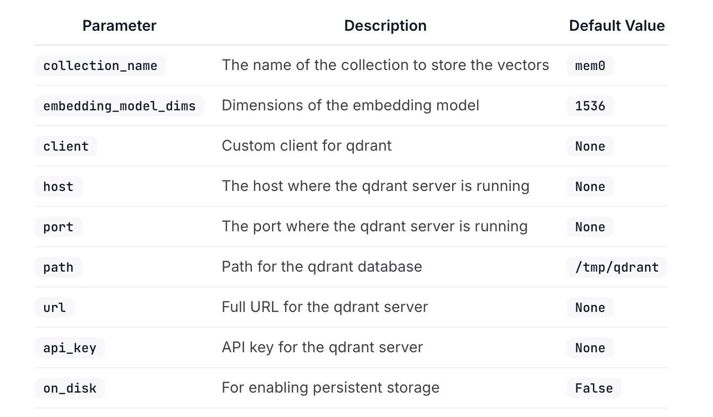

# 学习 Mem0 的记忆存储

昨天我们学习了 Mem0 的基本用法，并给出了一个简单的示例程序。和传统的大模型对话不同的是，我们没有将历史会话拼接起来，而是先检索记忆，然后将记忆拼接到系统 Prompt 中回答用户问题，最后再将这次对话保存到记忆。

这里涉及两个记忆的核心操作：**检索** 和 **存储**，这也是 Mem0 的两个核心方法。

```python
# 检索记忆
relevant_memories = memory.search(query=message, user_id=user_id, limit=3)

# 保存记忆
memory.add(messages, user_id=user_id)
```

今天我们先学习记忆是如何存储的。

## Mem0 的记忆存储原理

Mem0 的记忆存储流程由两个阶段组成：**提取阶段（Extraction）** 和 **更新阶段（Update）**：



在提取阶段，Mem0 主要关注三个信息：

* 最新的一轮对话，通常由用户消息和助手响应组成；
* 滚动摘要，从向量数据库检索得到，代表整个历史对话的语义内容；
* 最近的 m 条消息，提供了细粒度的时间上下文，可能包含摘要中未整合的相关细节；

然后通过 LLM 从这些信息中提取出一组简明扼要的候选记忆，并在后台异步地刷新对话摘要，刷新过程不阻塞主流程，所以不用担心会引入延迟。

在更新阶段，针对新消息从向量数据库中检索出最相似的前 s 个条目进行比较，然后通过 LLM 的工具调用能力，选择四种操作之一：

* `ADD` - 在没有语义等效记忆存在时创建新记忆；
* `UPDATE` - 用补充信息增强现有记忆；
* `DELETE` - 删除和新信息所矛盾的记忆；
* `NOOP` - 当候选事实不需要对知识库进行修改时；

更新阶段使得记忆存储保持一致、无冗余，并能立即准备好应对下一个查询。

综上所述，提取阶段负责处理最新消息和历史上下文以创建新记忆；更新阶段将这些提取的记忆与类似的现有记忆进行评估，通过工具调用机制应用适当的操作。通过 Mem0 的两阶段记忆管道，确保仅存储和检索最相关的事实，最小化令牌和延迟，实现可扩展的长期推理。

## 配置 Qdrant 数据库

昨天我们在运行示例程序的时候发现，每次程序重启后记忆就没有了，当时我还以为记忆是保存在内存里的。后来看源码才发现其实不对，Mem0 的默认存储是 Qdrant 向量数据库，只不过使用了本地文件，可以在临时目录 `/tmp/qdrant` 中找到，每次程序启动时都会删掉重建。

可以通过 `Memory.from_config()` 自定义记忆配置：

```python
config = {
    "vector_store": {
        "provider": "qdrant",
        "config": {
            "path": "/tmp/qdrant_data",
            "on_disk": True
        }
    },
}

memory = Memory.from_config(config)
```

在上面的配置中，我们将 Qdrant 数据库位置修改为 `/tmp/qdrant_data`，并开启了持久化存储。

此外，我们也可以本地部署一个 Qdrant 数据库：

```
$ docker run -d -p 6333:6333 -p 6334:6334 qdrant/qdrant
```

然后通过 `Memory.from_config()` 配上向量数据库地址和集合名称：

```python
config = {
    "vector_store": {
        "provider": "qdrant",
        "config": {
            "collection_name": "test",
            "host": "localhost",
            "port": 6333,
        }
    },
}

memory = Memory.from_config(config)
```

这时我们的记忆就是持久化的了，可以在 Qdrant 的 Dashboard 页面 `http://localhost:6333/dashboard` 对记忆进行可视化查询和管理：



除了上面几个配置参数，Qdrant 的完整配置参数如下：



## 配置其他的向量数据库

Mem0 的向量存储统一使用下面的格式配置：

```python
config = {
    "vector_store": {
        "provider": "your_chosen_provider",
        "config": {
            # Provider-specific settings go here
        }
    }
}
```

其中 `provider` 表示向量存储的名称，比如 `chroma`、`pgvector`、`qdrant` 等，而 `config` 是针对不同存储的特定配置，每种向量存储配置可能都不一样，具体配置项可参考 Mem0 的文档：

* https://docs.mem0.ai/components/vectordbs/config

Mem0 对各种流行的向量数据库提供了内置支持，包括：

* `Qdrant` - https://qdrant.tech/
* `Chroma` - https://www.trychroma.com/
* `Pgvector` - https://github.com/pgvector/pgvector
* `Milvus` - https://milvus.io/
* `Pinecone` - https://www.pinecone.io/
* `Redis` - https://redis.io/
* `Elasticsearch` - https://www.elastic.co/
* `Opensearch` - https://opensearch.org/
* `Supabase` - https://supabase.com/
* `Weaviate` - https://weaviate.io/
* `Faiss` - https://github.com/facebookresearch/faiss

Mem0 也支持一些在线的向量搜索服务，比如微软的 Azure AI Search 和 Google 的 Vertex AI Vector Search 等：

* [Azure AI Search](https://learn.microsoft.com/azure/search/search-what-is-azure-search/)
* [Vertex AI Vector Search](https://cloud.google.com/vertex-ai/docs/vector-search/overview)

此外，Mem0 还支持 LangChain 作为向量存储。LangChain 支持更多类型的向量存储，它提供了一个统一的向量存储接口 `VectorStore`，使得集成不同的向量存储变得简单，参考 LangChain 的文档：

* https://python.langchain.com/docs/integrations/vectorstores/

## 小结

今天主要学习了 Mem0 的记忆存储过程，并通过自定义 Qdrant 配置实现了记忆的持久化存储，可以看到 Mem0 内置了很多向量数据库的支持，可以满足不同用户的不同场景。关于 Mem0 的配置，除了 `vector_store` 之外，还有其他的一些高级配置，这个我们明天再继续研究。