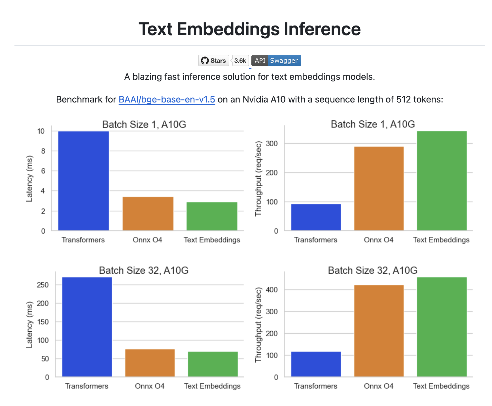

# 学习 Mem0 的高级配置

昨天我们学习了 Mem0 记忆存储的原理，并通过自定义 Qdrant 配置实现了记忆的持久化存储，以及通过 `vector_store` 切换其他的向量数据库。关于 Mem0 的配置，除了 `vector_store` 之外，还有其他的一些高级配置，我们今天就来看看这一部分。

## Mem0 配置概览

Mem0 提供了很多配置选项，可以根据用户的需求进行自定义。这些配置涵盖了不同的组件，包括：**向量存储**、**语言模型**、**嵌入模型**、**图存储** 以及一些通用配置。下面是一份完整配置的示例：

```python
config = {
    "vector_store": {
        "provider": "qdrant",
        "config": {
            "host": "localhost",
            "port": 6333
        }
    },
    "llm": {
        "provider": "openai",
        "config": {
            "api_key": "your-api-key",
            "model": "gpt-4"
        }
    },
    "embedder": {
        "provider": "openai",
        "config": {
            "api_key": "your-api-key",
            "model": "text-embedding-3-small"
        }
    },
    "graph_store": {
        "provider": "neo4j",
        "config": {
            "url": "neo4j+s://your-instance",
            "username": "neo4j",
            "password": "password"
        }
    },
    "history_db_path": "/path/to/history.db",
    "version": "v1.1",
    "custom_fact_extraction_prompt": "Optional custom prompt for fact extraction for memory",
    "custom_update_memory_prompt": "Optional custom prompt for update memory"
}
```

## 语言模型

Mem0 对各种主流的大语言模型提供内置支持，包括：

* OpenAI - 如 `gpt-4o`、`gpt-4o-mini`、`gpt-o3` 等；
* Anthropic - 如 `claude-sonnet-3.7`、`claude-sonnet-4` 等；
* Gemini - 如 `gemini-1.5`、`gemini-1.5-flash` 等；
* DeepSeek - 如 `deepseek-chat`、`deepseek-reasoner` 等；
* xAI - 如 `grok-3-beta` 等；
* Sarvam AI - 如 `sarvam-m` 等；

如果没有配置，默认使用的 OpenAI 的 `gpt-4o-mini`。

Mem0 也支持一些模型聚合服务，包括：

* Azure OpenAI - https://azure.microsoft.com/
* AWS Bedrock - https://aws.amazon.com/bedrock/
* Together - https://www.together.ai/
* Groq - https://groq.com/

还支持接入本地大模型，比如：

* Ollama - https://ollama.com/
* LM Studio - https://lmstudio.ai/

此外，Mem0 也支持一些 LLM 开发框架，比如 [LangChain](https://www.langchain.com/) 和 [Litellm](https://github.com/BerriAI/litellm) 等：

* LangChain - 通过 LangChain 的 [Chat models](https://python.langchain.com/docs/integrations/chat/)，支持绝大多数大模型服务；
* Litellm - 一个小巧精悍的 Python 库，兼容 100+ 不同的大模型，所有模型都使用标准化的输入/输出格式；

最后，针对 OpenAI 的模型，Mem0 还有一项特别的功能，它同时支持 OpenAI 的 **[结构化输出](https://platform.openai.com/docs/guides/structured-outputs/introduction)** 和 **非结构化输出** 两种格式。结构化输出可以返回结构化响应（比如 JSON 对象），好处是方便解析，一般用于数据提取、表单填写、API 调用等场景；非结构化输出返回开放式、自然语言的响应，输出格式更灵活性。

通过下面的配置使用 OpenAI 的结构化输出功能：

```python
config = {
    "llm": {
        "provider": "openai_structured",
        "config": {
            "model": "gpt-4o-mini",
            "temperature": 0.0,
        }
    }
}
```

## 嵌入模型

同样的，Mem0 内置支持很多嵌入模型服务，包括：

* OpenAI - 如 `text-embedding-3-large` 等；
* Azure OpenAI
* Vertex AI - 如 `text-embedding-004` 等；
* Gemini - 如 `models/text-embedding-004` 等； 
* Together
* AWS Bedrock

Mem0 还支持接入本地部署的嵌入模型，比如 Ollama 和 LM Studio，此外还支持通过 Hugging Face 的 `SentenceTransformer` 库加载本地模型，或者使用 Hugging Face 的 [文本嵌入推理服务（Text Embeddings Inference，TEI）](https://huggingface.co/docs/text-embeddings-inference/index) 接入更多的模型。

此外，Mem0 也兼容 LangChain 开发框架，支持几十种不同的嵌入模型，参考文档：

* https://python.langchain.com/docs/integrations/text_embedding/

## 使用 Hugging Face 嵌入模型

其中 Hugging Face 方式感觉在私有化部署使用时很有用，可以展开看看。

使用 `SentenceTransformer` 库，可以方便的下载和使用 Hugging Face 平台上的各种嵌入模型，下面是在 Mem0 中配置使用 `multi-qa-MiniLM-L6-cos-v1` 模型的示例：

```python
config = {
    "embedder": {
        "provider": "huggingface",
        "config": {
            "model": "multi-qa-MiniLM-L6-cos-v1"
        }
    }
}
```

Hugging Face 还提供了 [文本嵌入推理服务（Text Embeddings Inference，TEI）](https://huggingface.co/docs/text-embeddings-inference/index) 用于部署开源的嵌入模型（如 FlagEmbedding、Ember、GTE、E5 等），基于 Docker 容器化技术，TEI 可以将模型快速部署为可访问的服务，并通过 HTTP 接口实现高效推理。



首先启动 TEI 服务：

```
$ docker run -d -p 3000:80 \
    ghcr.io/huggingface/text-embeddings-inference:cpu-1.6 \
    --model-id BAAI/bge-small-en-v1.5
```

然后在 Mem0 的配置文件中指定服务地址即可：

```python
config = {
    "embedder": {
        "provider": "huggingface",
        "config": {
            "huggingface_base_url": "http://localhost:3000/v1"
        }
    }
}
```

## 未完待续

今天主要学习了 Mem0 中关于语言模型和嵌入模型的配置选项，大家可以根据需求选择最适合自己的。除此之外，Mem0 还有一些通用配置以及图存储相关的配置，限于篇幅，我们放到明天再继续研究。