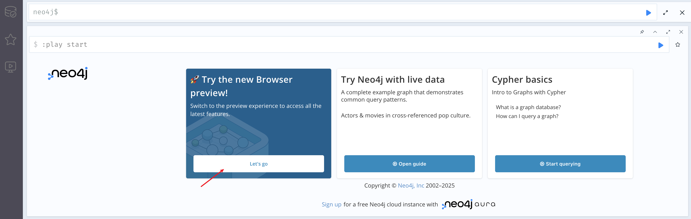
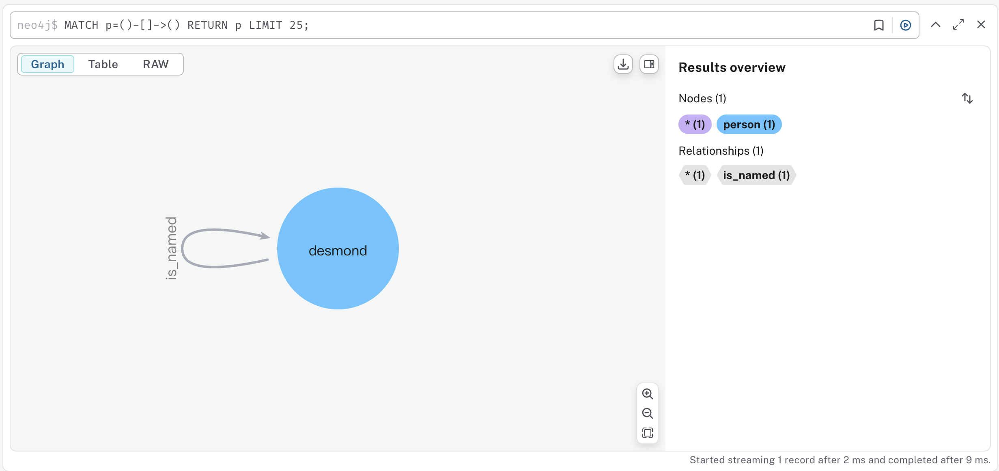
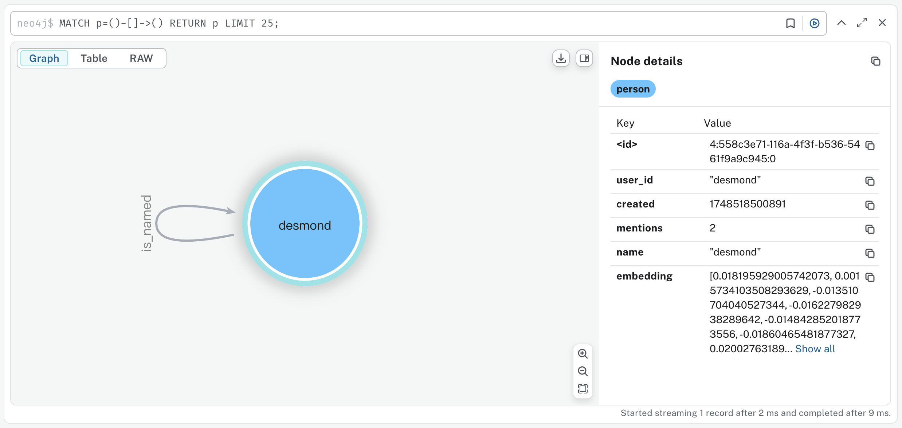
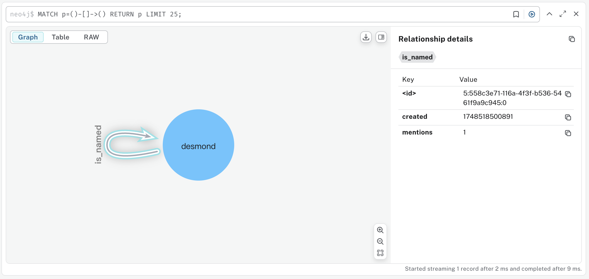
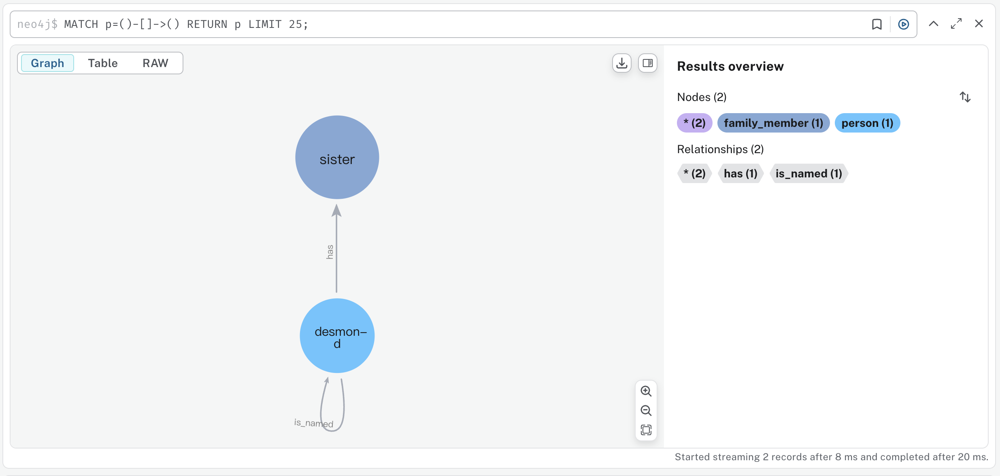
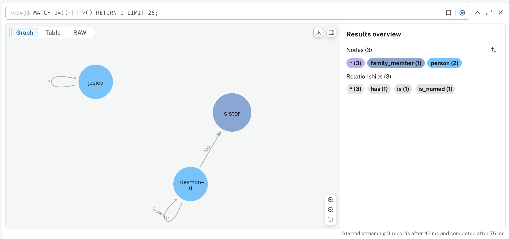
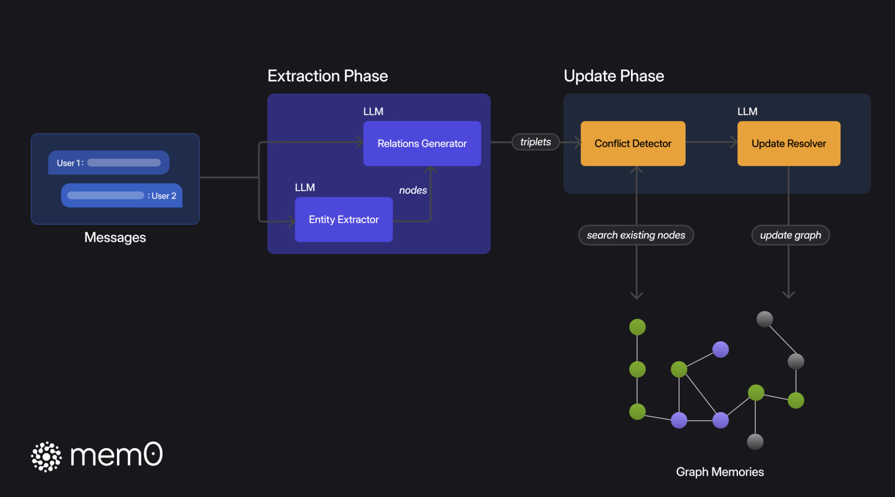

# 学习 Mem0 的图谱记忆

关于 Mem0 的配置选项，还差最后一个 `graph_store` 没有学习，该配置用于指定一个图数据库。Mem0 支持将抽取的记忆保存到图数据库中，生成的记忆图谱可以包含记忆之间的复杂关系，通过对图进行子图检索和语义三元组匹配，在复杂多跳、时间推理和开放领域等问题上表现更好。

Mem0 的图谱记忆功能又被称为 **Mem0ᵍ**，通过将记忆存储为有向标记图来增强 Mem0。今天我们就来看看 Mem0 是如何结合图数据库来做记忆管理的。

## 图谱记忆实战

要使用 Mem0 图谱记忆功能，我们先得有图数据库。目前，Mem0 支持 [Neo4j](https://neo4j.com/) 和 [Memgraph](https://memgraph.com/) 两种图数据库。

Neo4j 是图数据库领域的老牌选手，处于行业领先地位，拥有成熟的生态和广泛的商业落地案例，以及庞大的社区和丰富的文档，但是社区版本功能受限，而且开源协议是 GPLv3，商业使用注意合规问题，建议购买企业版授权。


Memgraph 是近几年崛起的新锐选手，采用内存优先架构，主打高性能和实时分析，而且采用 Apache 2.0 开源协议，允许闭源商用，只是资料不多，成熟度有所欠缺。


这两种图数据库都提供了在线服务，也支持本地部署。下面我们以 Neo4j 作为示例。

### 安装 Neo4j

首先，使用 Docker 在本地运行 Neo4j 图数据库：

```
$ docker run -d --name neo4j \
    -p 7474:7474 -p 7687:7687 \
    -e NEO4J_AUTH=neo4j/password \
    -e 'NEO4J_PLUGINS=["apoc"]'  \
    neo4j:2025.04
```

环境变量 `NEO4J_AUTH` 用于指定数据库的用户名和密码，`NEO4J_PLUGINS` 用于开启 [APOC 插件](https://neo4j.com/labs/apoc/4.1/installation/)，Neo4j 的 **APOC（Awesome Procedures On Cypher）** 插件是一个功能强大的扩展库，为 Neo4j 提供了大量额外的存储过程和函数。

> 注意这里使用了 Neo4j 的最新版本 `neo4j:2025.04`，有些老版本可能会由于不支持 `CALL (n)` 这样的子查询语法而报错。

启动成功后，在浏览器输入 `http://localhost:7474/` 进入 Neo4j 的 Web 控制台：



可以点击下面的 "Let's go" 按钮，切换到新版界面。

### 配置图数据库

接着使用 pip 安装所需的依赖：

```
$ pip install "mem0ai[graph]"
```

然后在我们的 `config` 中加上图数据库相关的配置：

```python
from mem0 import Memory

config = {
    "graph_store": {
        "provider": "neo4j",
        "config": {
            "url": "neo4j://localhost:7687",
            "username": "neo4j",
            "password": "password"
        }
    }
}

memory = Memory.from_config(config)
```

### 验证图谱记忆

Mem0 的文档中有个不错的例子，展示了图谱记忆是如何一步步构建出来的：

* https://docs.mem0.ai/open-source/graph_memory/overview

接下来，我们也亲自实践验证一下，使用 `memory.add()` 往图谱中添加记忆：

```python
memory.add("Hi, my name is Desmond.", user_id="desmond")
```

添加之后，图谱记忆如下：



可以看到 Mem0 自动创建了一个 `person` 节点和一条 `is_named` 边，并为每个节点创建了 `user_id`、`created`、`mentions`、`name`、`embedding` 五个属性：



每条边上也有 `created` 和 `mentions` 两个属性：



我们接着往图谱中添加记忆：

```python
memory.add("I have a sister.", user_id="desmond")
```

图谱更新如下：



新增了一个 `famili_member` 节点和一条 `has` 边。 

继续添加记忆：

```python
memory.add("Her name is Jesica.", user_id="desmond")
```

图谱更新如下：



这次的更新有点差强人意，它再次添加了一个 `jesica` 节点，但是创建了一条 `is` 边，而不是复用之前的 `is_named` 边，而且 `sister` 和 `jesica` 之间也没有关系。这个时候如果我问 “我的姐姐叫什么”，通过图谱显然是回答不上来的。

所以，图谱的好坏直接影响图谱记忆的效果，要提升图谱记忆的效果，关键在于图谱构建的过程。

## 图谱构建原理

和向量记忆的存储一样，图谱记忆的存储也是由两个阶段组成：**提取阶段（Extraction）** 和 **更新阶段（Update）**：



### 提取阶段

在提取阶段，Mem0ᵍ 通过 LLM 从输入的对话消息中提取出实体和关系三元组，从而将非结构化文本转化为结构化图表示，具体又分为 **实体提取（Entity Extractor）** 和 **关系提取（Relationship Generator）** 两个步骤。

首先，实体提取模块从对话中识别并提取出一组实体，以及每个实体对应的类型。**实体（Entity）** 代表对话中的关键信息元素 —— 包括人、地点、物体、概念、事件和值得在记忆图中表示的属性。实体提取模块通过分析对话中元素的语义重要性、独特性和持久性来识别这些多样的信息单元。例如，在关于旅行计划的对话中，实体可能包括目的地（城市、国家）、交通方式、日期、活动和参与者偏好，基本上是任何可能与未来参考或推理相关的离散信息。

接下来，关系提取模块对上一步提取出来的实体及其在对话中的上下文进行分析，在这些实体之间推导出有意义的连接，建立一组关系三元组，以捕捉信息的语义结构。对于每对潜在的实体，通过 LLM 理解对话中的显性陈述和隐性信息，评估是否存在有意义的关系，如果存在，则用适当的标签对该关系进行分类，例如，“lives_in”、“prefers”、“owns”、“happened_on” 等。

### 更新阶段

在更新阶段，Mem0ᵍ 将新提取出的实体和关系以及图数据库中已有的实体和关系进行整合，这个整合的过程又分为 **冲突检测（Conflict Detection）** 和 **更新解析（Update Resolver）** 两个步骤。

首先，针对每个新的关系三元组，我们计算源实体和目标实体的 Embedding 向量，然后搜索出相似度高于阈值的现有节点。根据节点的存在情况，可能会出现几种不同的场景：

* 创建两个节点：源实体和目标实体都不存在对应的节点；
* 仅创建一个节点：源实体存在对应的节点但目标实体不存在，或者目标实体存在对应的节点但源实体不存在；
* 使用现有节点：源实体和目标实体都存在对应的节点；

为了维护一致的记忆图谱，Mem0ᵍ 采用了一个冲突检测机制，识别出新实体关系和现有关系之间的潜在冲突，比如重复或矛盾的节点和边；再通过基于 LLM 的更新解析模块将新实体关系添加或合并到图谱中，对于某些被视为过时的关系，将其标记为无效，而不是物理删除它们，以便进行时间推理。

对图谱构建过程感兴趣的朋友，可以阅读 Mem0 的这篇论文《Building Production-Ready AI Agents with Scalable Long-Term Memory》：

* https://arxiv.org/abs/2504.19413

## 小结

今天我们主要学习了 Mem0 的图谱记忆功能，通过一个简单的示例展示了 Mem0 是如何逐步构建出完整的记忆图谱的。我们了解了图数据库的基础配置及操作，以及如何通过添加记忆来形成节点和边，进而形成记忆图谱。

在讨论图谱构建的原理时，我们了解到 Mem0ᵍ 是如何通过提取阶段的实体和关系识别，以及更新阶段的冲突检测和更新解析，将非结构化文本转化为结构化图表示。通过这些机制，Mem0 能够有效维护一致性并优化记忆图谱，使其适应复杂的推理任务。

相信通过今天的学习，大家对 Mem0 的图谱记忆功能有了更加清晰的认知，不过 **纸上得来终觉浅，绝知此事要躬行**，这些原理性的内容主要是摘抄自 Mem0 的论文，要想理解地更深入，还是得自己动手，我们明天就来扒一扒 Mem0 的代码。