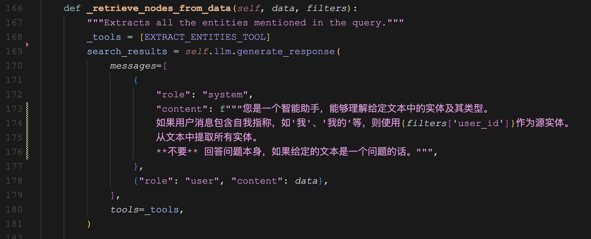

# 深入剖析 Mem0 的图谱记忆源码

昨天我们学习了 Mem0 的图谱记忆功能，了解了 **Mem0ᵍ** 是如何通过提取和更新两个阶段，将用户消息从非结构化文本转化为结构化图表示的。为了更加深入地理解这块的逻辑，我决定今天来扒一扒 Mem0 的源码，看看具体的实现。

## 从 `add()` 方法开始

我们知道，Mem0 支持 Neo4j 和 Memgraph 两种图数据库，针对不同的图数据库，图谱构建的实现也略有差异，分别位于 `graph_memory.py` 和 `memgraph_memory.py` 文件里。

虽然流程有一些差异，但是整体框架是一样的。我们以 Neo4j 的实现为例，图谱构建的入口在 `MemoryGraph` 的 `add()` 方法：


从代码中可以看到一共调用了六个方法，这六个方法大致就可以对应提取阶段和更新阶段的四大步骤。

## `_retrieve_nodes_from_data()` 方法

从方法名字就可以看出这一步做的是 **实体提取（Entity Extractor）**，Mem0 在这里巧妙地使用了大模型的工具调用能力，它首先定义了一个工具：


它把这个工具的名字叫做 `extract_entities`，它只有一个数组类型的参数 `entities`，数组里是实体的定义，包括实体名称 `entity` 和 实体类型 `entity_type` 两个字段。然后将这个工具提供给大模型进行调用：



如果大模型支持工具调用的话，将返回 `tool_calls` 字段，其中必然有一个 `tool_call` 的名称叫 `extract_entities`，参数是提取出来的实体数组，类似于下面这样：

```python
extract_entities([
    {
        "entity": "desmond", 
        "entity_type": "person"
    },
    {
        "entity": "sister", 
        "entity_type": "family_member"
    }
])
```

通过这个方法，我们从对话中识别并提取出一组实体，以及每个实体对应的类型。

## `_establish_nodes_relations_from_data()` 方法

这一步是对上面提取的实体进行分析，确认实体之间的关系，Mem0 在这里仍然是使用工具调用的技巧，定义的工具如下：


工具名称叫 `establish_relationships`，工具的参数为数组类型，数组里是关系三元组，包括源实体 `source`、目标实体 `destination` 以及两个实体之间的关系 `relationship` 三个字段。然后将这个工具提供给大模型进行调用：


这里的系统 Prompt 如下：

```python
EXTRACT_RELATIONS_PROMPT = """

您是一个设计用于从文本中提取结构化信息以构建知识图谱的高级算法。
您的目标是捕获全面且准确的信息。请遵循以下关键原则：

1. 仅从文本中提取明确陈述的信息。
2. 在提供的实体之间建立关系。
3. 在用户消息中使用"USER_ID"作为任何自我引用（例如"我"、"我的"等）的源实体。

关系：
    - 使用一致、通用和永恒的关系类型。
    - 示例：优先使用"教授"而非"成为_教授"。
    - 关系只应在用户消息中明确提及的实体之间建立。

实体一致性：
    - 确保关系是连贯的，并在逻辑上与消息的上下文相符。
    - 在提取的数据中保持实体命名的一致性。

努力通过在实体之间建立所有关系并遵循用户的上下文，构建一个连贯且易于理解的知识图谱。

严格遵守这些指导方针，以确保高质量的知识图谱提取。"""
```

如果一切正常，大模型将返回工具调用的结果，包括工具名称和工具参数，这个参数就是实体之间的关系三元组，类似于下面这样：

```python
establish_relationships([
    {
        "source": "desmond",
        "destination": "sister",
        "relationship": "has"
    }
])
```

通过这个方法，我们在这些实体之间推导出了有意义的连接，建立了一批关系三元组，这批关系后面将会添加到我们的记忆图谱中。

## `_search_graph_db()` 方法

经过上面两步其实已经完成了 Mem0ᵍ 的提取阶段，我们成功从输入的对话消息中提取出了实体和关系三元组。接下来这个方法是为后面的更新阶段做准备，我们遍历所有新提取出来的实体，计算它们的 Embedding 向量，然后搜索出相似度高于阈值的现有节点。


这里使用了一个看起来相当复杂的 Cypher 查询，但是实际上非常简单，可以将其拆成三个部分来看。

第一部分根据 `user_id` 和 `embedding` 筛选出属于当前用户且相似度高于 `$threshold` 的节点 `n`：

```
MATCH (n {self.node_label})
WHERE n.embedding IS NOT NULL AND n.user_id = $user_id
WITH n, round(2 * vector.similarity.cosine(n.embedding, $n_embedding) - 1, 4) AS similarity
WHERE similarity >= $threshold
```

这里的 `vector.similarity.cosine()` 是 Neo4j 内置的 [**向量函数（Vector functions）**](https://neo4j.com/docs/cypher-manual/current/functions/vector/)，函数用于计算两个向量的余弦相似度，其返回值的范围是 `[0,1]`，这里为了向后兼容性，通过 `2 * similarity - 1` 将返回值范围归一化成 `[-1,1]`，最后用 `round(..., 4)` 保留 4 位小数。

第二部分是一个 [**子查询调用（CALL subqueries）**](https://neo4j.com/docs/cypher-manual/current/subqueries/call-subquery/)，根据前面筛选出来的节点，依次查询每个节点的关系：

```
CALL (n) {{
    MATCH (n)-[r]->(m) 
    RETURN 
        n.name AS source, elementId(n) AS source_id, 
        type(r) AS relationship, elementId(r) AS relation_id, 
        m.name AS destination, elementId(m) AS destination_id
    UNION
    MATCH (m)-[r]->(n) 
    RETURN 
        m.name AS source, elementId(m) AS source_id, 
        type(r) AS relationship, elementId(r) AS relation_id, 
        n.name AS destination, elementId(n) AS destination_id
}}
```

这里对每个匹配的节点执行子查询，查找从节点 `n` 出发的关系 `MATCH (n)-[r]->(m)` 以及 指向节点 `n` 的关系 `MATCH (m)-[r]->(n)`，并使用 `UNION` 进行合并。

第三部分对查询结果进行去重、按相似度降序排列、并限制返回结果数量，最终返回节点名称、ID、关系类型及相似度：

```
WITH distinct source, source_id, relationship, relation_id, destination, destination_id, similarity
RETURN source, source_id, relationship, relation_id, destination, destination_id, similarity
ORDER BY similarity DESC
LIMIT $limit
```

通过上面三步的拆解，这个查询的目的就很明显了，其结果是找到与输入向量最相似的节点，并返回这些节点参与的所有关系。

## `_get_delete_entities_from_search_output()` 方法

接下来又是一次工具调用，这次的工具名为 `delete_graph_memory`，用于删除过时或矛盾的节点关系，它的定义如下：


然后将工具丢给大模型：


这里使用的系统 Prompt 如下：

```python
DELETE_RELATIONS_SYSTEM_PROMPT = """
您是一名图谱记忆管理专家，专门负责识别、管理和优化基于图谱的记忆中的关系。
您的主要任务是分析现有关系列表，并根据提供的新信息确定应该删除哪些关系。

输入：
1. 现有图谱记忆：当前图谱记忆的列表，每个记忆包含源节点、关系和目标节点信息。
2. 新文本：要整合到现有图谱结构中的新信息。
3. 使用"USER_ID"作为节点来表示用户消息中的任何自我引用（例如"我"、"我的"等）。

指导方针：
1. 识别：使用新信息来评估记忆图谱中的现有关系。
2. 删除标准：仅当关系满足以下至少一个条件时才删除：
   - 过时或不准确：新信息更近期或更准确。
   - 矛盾：新信息与现有信息冲突或否定现有信息。
3. 如果存在同类型关系但目标节点不同的可能性，请勿删除。
4. 全面分析：
   - 根据新信息彻底检查每个现有关系，并按需删除。
   - 根据新信息可能需要进行多次删除。
5. 语义完整性：
   - 确保删除操作维持或改善图谱的整体语义结构。
   - 避免删除与新信息不矛盾/不过时的关系。
6. 时间意识：当有时间戳可用时，优先考虑最近的信息。
7. 必要性原则：仅删除必须删除且与新信息矛盾/过时的关系，以维持准确且连贯的记忆图谱。

注意：如果存在同类型关系但目标节点不同的可能性，请勿删除。

例如：
现有记忆：alice -- loves_to_eat -- pizza
新信息：Alice也喜欢吃汉堡。

在上述例子中不要删除，因为Alice可能既喜欢吃披萨又喜欢吃汉堡。

记忆格式：
source -- relationship -- destination

提供一个删除指令列表，每个指令指定要删除的关系。
"""
```

注意这个工具的参数只有一对关系三元组，如果涉及到多个关系删除，返回的 `tool_calls` 数组应返回多个，这无疑对大模型的能力有更高的要求：

```python
delete_graph_memory({
    "source": "desmond",
    "destination": "sister",
    "relationship": "has"
})
```

通过这个方法，我们得到了一批待删除的关系三元组。

## `_delete_entities()` 方法

第五步，将待删除的关系三元组删掉，其实就是把节点之间的关系删掉。这一步有点没明白，感觉和论文有些出入，论文中提到：

> 对于某些被视为过时的关系，将其标记为无效，而不是物理删除它们，以便进行时间推理。

但是看源码显然不是这样的，而是直接删掉了：


## `_add_entities()` 方法

第六步，将待添加的关系三元组合并到现有图谱中。合并的流程和论文中所述几乎一致，首先，针对每个待添加的关系三元组，我们计算源实体和目标实体的 Embedding 向量，然后搜索出相似度高于阈值的现有节点。根据节点的存在情况，可能会出现几种不同的场景。

如果源实体和目标实体都不存在，则创建两个节点，为节点设置 `用户ID（user_id）`、`创建时间（created）`、`提及次数（mentions）` 等属性，并通过 [向量索引过程](https://neo4j.com/docs/cypher-manual/current/indexes/semantic-indexes/vector-indexes/#procedures) `db.create.setNodeVectorProperty()` 设置节点的 `embedding` 属性，同时创建这两个节点之间的关系，并设置创建时间和提及次数：


如果源实体和目标实体都存在，则直接使用现有节点，将新关系合并进去：


如果源实体存在、目标实体不存在，或者目标实体存在、源实体不存在，则创建缺少的节点，合并已有的节点，Cypher 和上面两种情况类似。

## 小结

通过对 `MemoryGraph` 的 `add()` 方法的深入剖析，我们清晰地看到 Mem0ᵍ 的核心逻辑是如何实现的，可以看到，整个过程结合了 LLM 的工具调用，向量计算，向量查询，图查询等多个技巧，经过提取和更新两大阶段，完成了记忆图谱的构建。

这一套流程会在每次对话时反复迭代，Mem0ᵍ 能够有效地维护记忆图谱的一致性，并对其不断优化，使其适应复杂的推理任务。
