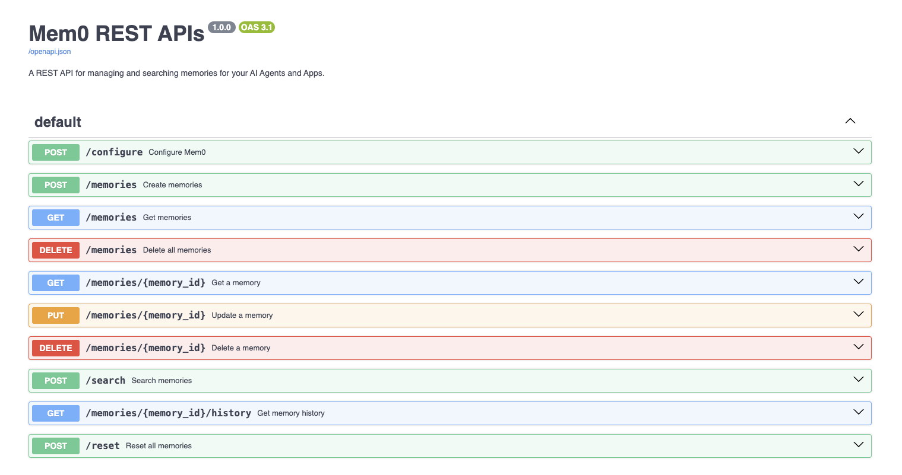

# 学习 Mem0 的 API 接口

Mem0 提供了 Python 和 TypeScript 两种 SDK 供开发者选用，并且支持将其接口暴露成 REST API 以方便其他语言和工具集成。我们今天系统地学习下 Mem0 提供的这些接口。

## 记忆管理

我们以 Python SDK 为例，介绍下 Mem0 记忆管理相关的接口。首先初始化 `Memory` 实例：

```python
from mem0 import Memory

m = Memory()
```

如果要对 `Memory` 进行自定义配置，则通过 `Memory.from_config()` 初始化：

```python
from mem0 import Memory

config = {
    // ...
}

m = Memory.from_config(config)
```

关于自定义配置选项，前几天已经详细地学习过，可以参考前几天的内容。

### 添加记忆

`add()` 方法用于添加新的记忆，其中 `messages` 参数可以是一个字符串：

```
messages = "你好，我叫张三"
result = m.add(messages, user_id="zhangsan")
```

也可以是一个对象：

```
messages = {
    "role": "user",
    "content": "你好，我叫张三"
}
result = m.add(messages, user_id="zhangsan")
```

还可以是一个数组：

```
messages = [{
    "role": "user",
    "content": "你好，我叫张三"
}, {
    "role": "assistant",
    "content": "您好，张三，请问有什么需要我帮助？"
}]
result = m.add(messages, user_id="zhangsan")
```

### 多模态支持

[Mem0 支持多模态](https://docs.mem0.ai/open-source/features/multimodal-support)，可以在对话中添加图片：

```
messages = [{
    "role": "user",
    "content": "你好，我叫张三"
}, {
    "role": "assistant",
    "content": "您好，张三，请问有什么需要我帮助？"
}, {
    "role": "user",
    "content": "帮我翻译下这张图上的文字"
}, {
    "role": "user",
    "content": {
        "type": "image_url",
        "image_url": {
            "url": "<image-url>"
        }
    }
}]
result = m.add(messages, user_id="zhangsan")
```

如果使用 Mem0 平台，除了支持图片内容，还支持 [在对话中添加文档](https://docs.mem0.ai/platform/features/multimodal-support)，比如 TXT、MDX、PDF 等。

### 助手记忆

我们除了为用户添加记忆之外，也可以为助手添加记忆，比如你正在开发一个文本写作智能体，使用助手记忆维持长上下文的一致性：

```
result = m.add(messages, agent_id="writer-agent")
```

### 关闭推导

默认情况下，我们在添加记忆时，会经过提取和更新两个阶段，Mem0 提供了一个参数可以 [关闭这个推导过程](https://docs.mem0.ai/platform/features/direct-import)，直接存储原始消息：

```
result = m.add(messages, user_id="zhangsan", infer=False)
```

## 查询记忆

在数据库中搜索与用户问题最相关的记忆：

```
related_memories = m.search("我是谁？", user_id="zhangsan")
```

Mem0 平台的搜索接口还有几个 [高级参数](https://docs.mem0.ai/platform/features/advanced-retrieval)，比如 `keyword_search=True` 开启关键词搜索，增强搜索召回率，`rerank=True` 开启重排序，确保最相关的记忆优先出现，`filter_memories=True` 开启过滤，去除无关的记忆，提高搜索精度。

另外，我们还可以根据 `user_id` 获取指定用户的所有记忆：

```
all_memories = m.get_all(user_id="zhangsan")
```

根据 `memory_id` 获取指定记忆：

```
specific_memory = m.get("<id>")
```

获取指定记忆的变更历史：

```
history = m.history(memory_id="<id>")
```

### 更新记忆

如果发现大模型自动维护的记忆不对，我们可以手动对记忆进行修改：

```
result = m.update(memory_id="<id>", data="我叫张三丰")
```

### 删除记忆

删除指定记忆：

```
m.delete(memory_id="<id>")
```

删除用户的所有记忆：

```
m.delete_all(user_id="zhangsan")
```

清空所有记忆：

```
m.reset()
```

## 异步记忆

Mem0 提供了一个异步操作记忆的 `AsyncMemory` 类，它的所有操作都是非阻塞的，这在开发高并发应用程序时非常有用：

```
from mem0 import AsyncMemory

m = AsyncMemory()
```

`AsyncMemory` 中的方法和 `Memory` 类完全相同，且具有一样的参数，但需要和 `async/await` 一起使用：

```
result = await m.add(messages, user_id="zhangsan")
```

## Mem0 REST API

Mem0 提供一个 [REST API 服务器](https://docs.mem0.ai/open-source/features/rest-api)，它使用 FastAPI 编写，用户可以通过 HTTP 端点执行所有操作。

首先克隆代码并进入 `server` 目录：

```
$ git clone https://github.com/mem0ai/mem0.git
$ cd server
```

然后在当前目录中创建一个 `.env` 文件并设置环境变量，运行所需的唯一环境变量是 `OPENAI_API_KEY`：

```
OPENAI_API_KEY=your-openai-api-key
```

它默认使用 PGVector 作为向量数据库，Neo4j 作为图数据库，这些按需配置：

```
POSTGRES_HOST=localhost
POSTGRES_PORT=6333
POSTGRES_DB=test
POSTGRES_USER=
POSTGRES_PASSWORD=
POSTGRES_COLLECTION_NAME=test

NEO4J_URI=neo4j://localhost:7687
NEO4J_USERNAME=neo4j
NEO4J_PASSWORD=password
```

接着安装所需依赖：

```
$ pip install -r requirements.txt
```

最后，启动 REST API 服务器：

```
$ uvicorn main:app --reload
```

启动成功后，可以通过 `http://localhost:8888` 访问，默认会进入 `/docs` 页面，这是 Mem0 REST API 的 OpenAPI 文档：



这时就可以使用 HTTP 接口访问 Mem0 API 了，也可以使用 `MemoryClient` 在代码中调用它：

```
from mem0 import MemoryClient

client = MemoryClient(
    host="http://localhost:8888",
    api_key="xxx",
)

result = client.add("你好，我叫张三", user_id="zhangsan")
print(result)

related_memories = client.search("我是谁？", user_id="zhangsan")
print(related_memories)
```

如果不设置 `host` 参数，默认使用的 `https://api.mem0.ai`，也就是 Mem0 平台的 API 接口。

## OpenAI 兼容接口

除了 HTTP 接口，Mem0 还有一个特色功能，它提供了一个 [OpenAI 兼容的对话接口](https://docs.mem0.ai/open-source/features/openai_compatibility)，可以轻松地将 Mem0 的长期记忆功能集成到我们的聊天应用程序中。

```
import os
from mem0.proxy.main import Mem0

client = Mem0(api_key=os.environ.get("MEM0_API_KEY"))

messages = [{
    "role": "user",
    "content": "我喜欢四川美食，但是我不能吃辣"
}]
chat_completion = client.chat.completions.create(
    messages=messages, model="gpt-4o-mini", user_id="zhangsan"
)
print(chat_completion.choices[0].message.content)

messages = [{
    "role": "user",
    "content": "给我推荐一些四川美食",
}]
chat_completion = client.chat.completions.create(
    messages=messages, model="gpt-4o-mini", user_id="zhangsan"
)
print(chat_completion.choices[0].message.content)
```

Mem0 为此做了一个在线演示页面，实现了类似 ChatGPT 的聊天功能，但是带长期记忆，感兴趣的朋友可以尝试下：

* https://mem0.dev/demo
