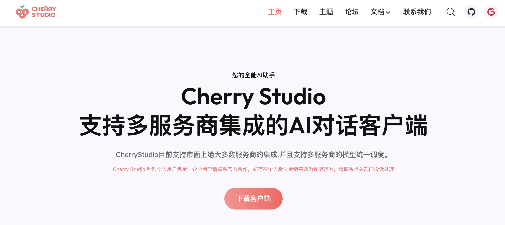

# 使用 OpenMemory MCP 跨客户端共享记忆

在人工智能飞速发展的今天，大型语言模型已经深刻改变了我们与技术交互的方式。然而，这些强大的 AI 助手却有一个显著的局限性 —— 它们无法在不同对话之间保持记忆，每次交互都如同初次见面。不仅如此，随着现在的 AI 助手越来越多，比如 Cursor、Claude Desktop、Windsurf、Cline 等等，记忆的碎片化只会越来越严重，我们要不断的告诉这些 AI 助手关于你的偏好、工作习惯和历史对话。

今天，给大家介绍一个由 Mem0 提出的解决方案 —— [OpenMemory MCP](https://mem0.ai/openmemory-mcp)，基于 Mem0 技术构建的私有化、本地优先的 AI 记忆层，以及 MCP 标准协议，在自己的设备上打造一个专属 AI 的记忆系统，能够让所有支持 MCP 协议的 AI 助手获得持久的、上下文感知的记忆能力。


## 核心特性

OpenMemory 的核心特性如下：

* **个性化互动（Personalise Interaction）** - 让你的 AI 助手记住你的风格、你的偏好、过去的问题以及首选解决方案；
* **跨客户端支持（Supported Clients）** - 兼容所有支持 MCP 协议的客户端，如 Cursor、Claude Desktop、Windsurf、Cline 等，在不同的客户端之间切换时不会丢失你的记忆；
* **私有的持久存储（Private, Persistent Storage）** - 隐私优先设计，所有的记忆内容都安全地存储在你的本地设备；
* **完全控制（Full Memory Control）** - 你对你的记忆拥有完全的控制权，你可以决定保存什么，何时过期，以及哪些 MCP 客户端可以访问它。

## 环境搭建

接下来，我们在本地安装 OpenMemory MCP Server。首先，克隆代码并进入 `openmemory` 目录：

```
$ git clone https://github.com/mem0ai/mem0.git
$ cd mem0/openmemory
```

创建环境变量文件：

```
$ make env
```

这个命令会在 `api` 目录和 `ui` 目录下各创建一个 `.env` 文件。我们需要在 `api/.env` 文件中配上 `OPEN_API_KEY` 参数，如果使用的是兼容 OpenAI 的三方接口，还需要配上 `OPENAI_BASE_URL` 参数：

```
OPENAI_API_KEY=sk-xxx
OPENAI_BASE_URL=https://api.bianxie.ai/v1
```

接下来，构建镜像：

```
$ make build
```

这个命令会基于当前目录下的 `docker-compose.yml` 文件创建两个镜像：

* `mem0/openmemory-mcp` - 包含后端 API 和 MCP 服务器；
* `mem0/openmemory-ui` - 前端 React 应用程序，OpenMemory 控制台页面；

如果镜像构建没问题，就可以启动服务了：

```
$ make up
```

在 Docker Desktop 中查看运行的三个容器（除了前后端，还有一个 Qdrant 向量存储）：


OpenMemory MCP Server 地址为 `http://localhost:8765`，可以通过 `http://localhost:8765/docs` 查看 OpenMemory API 文档：


另外，访问 `http://localhost:3000/` 进入 OpenMemory 控制台：


## 在 Cherry Studio 中使用 OpenMemory MCP

接下来，让我们体验下 OpenMemory MCP 是如何工作的。这里我使用了 [Cherry Studio](https://github.com/CherryHQ/cherry-studio) 客户端，这是一款国产开源的 AI 客户端，支持绝大多数大模型服务商，也支持知识库、绘图、搜索、翻译、MCP 等特色功能：



下载并安装客户端后，进入 “设置” -> “MCP 服务器” 页面，直接配置 SSE 地址：

```
http://localhost:8765/mcp/openmemory/sse/aneasystone
```

Cherry Studio 和 MCP Server 建立连接后，会列出所有可用工具：


可以看到 OpenMemory MCP 提供了四个工具：

* `add_memories` : 存储新的记忆对象
* `search_memory` : 检索相关记忆
* `list_memories` : 查看所有存储的记忆
* `delete_all_memories` : 完全清除记忆

然后打开新会话，将 MCP Server 启用：


将自己的信息告诉它，让他记住：


可以看到它成功调用 `add_memories` 工具，将我的信息保存到记忆中。接下来，再开一个新会话，测试下它是否真的记住了我：


## 在 Claude Desktop 中使用 OpenMemory MCP

此时我们可以在 OpenMemory 控制台的 Apps 页面查看由 Cherry Studio 创建的记忆：


这些记忆可以共享给其他客户端使用，接下来，我们就在 Claude Desktop 中验证。下载并安装 [Claude Desktop](https://claude.ai/download) 后，注册并登录账号，确保能正常对话。

然后，从 OpenMemory 控制台上找到 Claude 的安装命令：

```
$ npx install-mcp i http://localhost:8765/mcp/claude/sse/aneasystone --client claude
```

运行该命令，输入 MCP Server 名称：


这个命令会自动修改 Claude 的配置文件 `claude_desktop_config.json`：

```json
{
  "mcpServers": {
    "openmemory": {
      "command": "npx",
      "args": [
        "-y",
        "supergateway",
        "--sse",
        "http://localhost:8765/mcp/claude/sse/aneasystone"
      ]
    }
  }
}
```

由于 Claude 只支持 STDIO 传输协议的 MCP Server，这里使用 [supergateway](https://github.com/supercorp-ai/supergateway) 将 SSE 转换为 STDIO 协议。不过最新的 supergateway [貌似有问题](https://github.com/supercorp-ai/supergateway/issues/67)，每次 Claude 连接 MCP Server 时就会自动断掉，我这里将其换成了 [mcp-remote](https://github.com/geelen/mcp-remote) 才可以：

```json
{
  "mcpServers": {
    "openmemory": {
      "command": "npx",
      "args": [
        "mcp-remote",
        "http://localhost:8765/mcp/claude/sse/aneasystone"
      ]
    }
  }
}
```

配置之后，重启 Claude Desktop 应用，Claude Desktop 在启动时会自动加载所有的 MCP Server（其实就是为每个 Server 启动一个独立的进程，运行配置文件中的命令）。加载成功后，在对话框下方会看到一个工具图标，点开后可以看到加载成功的 OpenMemory MCP Server 和工具列表：


这时我们就可以在 Claude 里验证下它知不知道我是谁：


