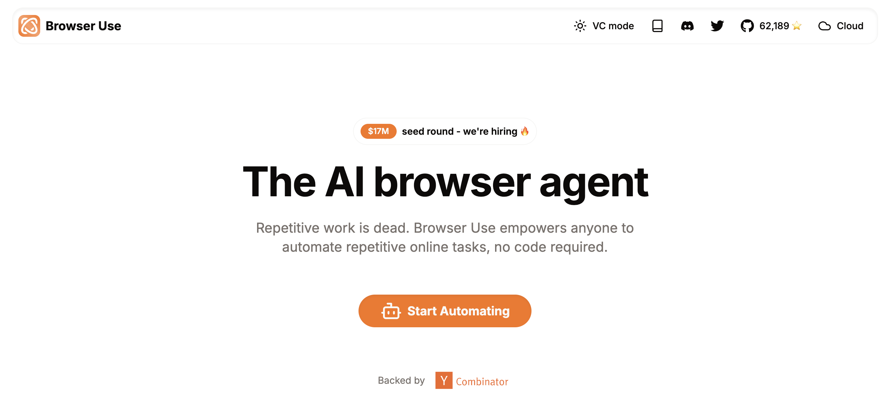
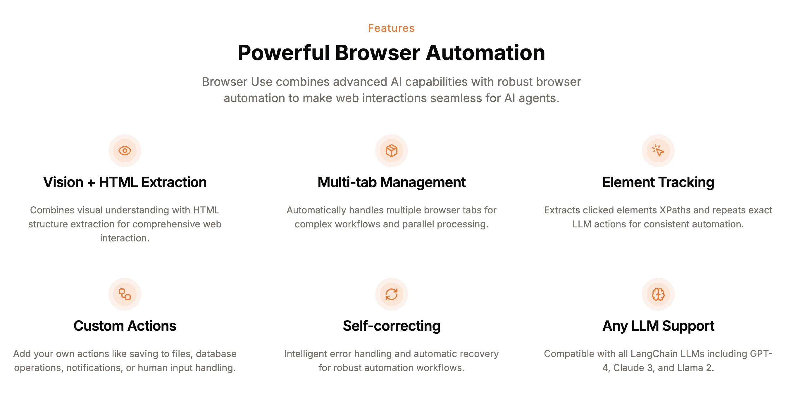
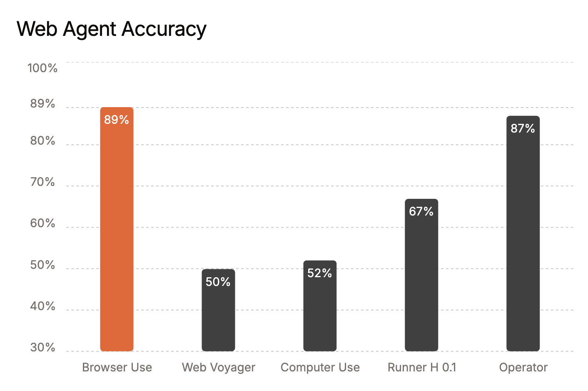
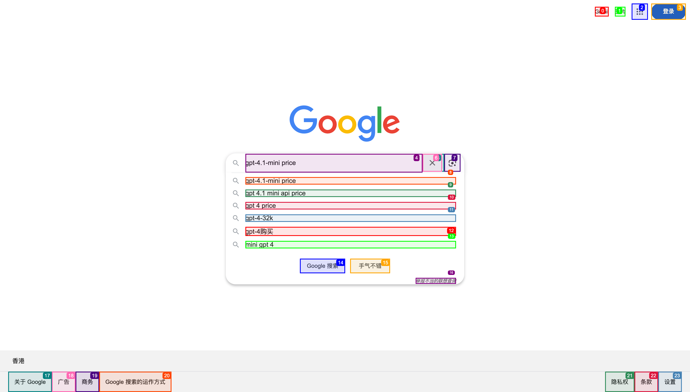
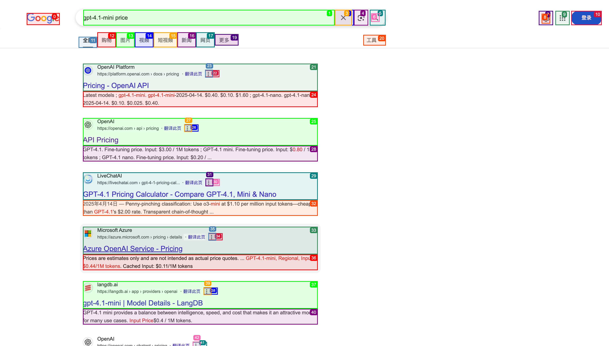
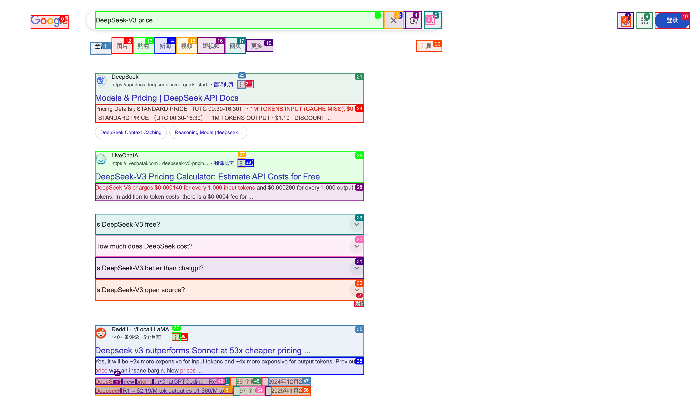

# Browser Use 快速入门

2025 年 3 月 6 号，中国 AI 创业公司 Monica 发布 [Manus](https://manus.im/)，号称 “全球首款通用 AI 代理”，其应用场景覆盖旅行规划、股票分析、教育内容生成等 40 余个领域；据称，Manus 在 GAIA 基准测试中刷新了 SOTA 记录，性能远超同类产品，凭借 KOL 助力，一时间刷屏全网，内测邀请码一码难求，甚至被炒到 5 万块钱。

在 Manus 的演示中，有一项功能让人印象深刻：在处理用户问题时，它能够像人类一样操作浏览器，自主浏览网页，滚动页面，检索信息。根据后来网友的爆料，其核心功能使用的是开源的 Browser Use 项目。

Manus 的本质仍然是 Agent 调用工具那一套，它的亮点主要是产品体验，但本身并没有多大的技术门槛；在 Monica 发布 Manus 之后，MetaGPT 团队仅花费 3 小时就开发了 [OpenManus](https://github.com/FoundationAgents/OpenManus) 项目，也能够自主浏览网页，查询和总结信息，实现了和 Manus 类似的功能，得到社区的广泛关注；而它同样也使用了 Browser Use 项目。

## Browser Use 介绍

[Browser Use](https://github.com/browser-use/browser-use) 是一款基于 Python 的开源 AI 自动化工具，旨在通过集成大模型与浏览器操作，实现网页任务自动化和智能化。它可以作为 Agent 操作浏览器的工具进行使用，它提供了一个简单的接口，使得 Agent 能够执行各种浏览器操作，如导航、点击、输入文本等。



它的核心特性如下：

* **视觉 + HTML 提取**：结合视觉理解与 HTML 结构提取，实现全面的网页交互；
* **多标签管理**：自动处理多个浏览器标签，以应对复杂的工作流程和并行处理；
* **元素跟踪**：提取点击元素的 XPath 并重复执行精确的 LLM 操作以实现一致的自动化；
* **自定义操作**：添加用户自定义操作，例如保存文件、访问数据库、通知或人类输入处理；
* **自我纠正**：智能错误处理和自动恢复以实现强大的自动化工作流程；
* **任意 LLM 支持**：与所有 LangChain LLM 兼容，包括 GPT-4、Claude 3 和 Llama 2 等；



Browser Use 在 [WebVoyager](https://github.com/MinorJerry/WebVoyager) 基准测试中达到了 SOTA 性能，使用 GPT-4o 在 586 个多样化的 Web 任务中取得了令人印象深刻的 89.1% 成功率：



感兴趣的话，可以看下他们的技术报告：

* https://browser-use.com/posts/sota-technical-report

下面我们通过一个简单的示例来体验下 Browser Use 的基本功能。

## 环境准备

Browser Use 需要 Python 3.11 或更高版本，官方建议使用 `uv` 来创建 Python 虚拟环境：

```
$ uv venv --python 3.11
```

激活该虚拟环境：

```
$ source .venv/bin/activate
```

安装 Browser Use 及其相关的依赖项：

```
$ uv pip install browser-use
```

Browser Use 依赖于 Playwright 来操作浏览器，所以还需要下载并安装 Playwright 所需的浏览器（如 Chromium、Firefox 和 WebKit）及其相关的依赖项：

```
$ uv run playwright install
```

## 简单示例

下面是 Browser Use 的简单示例：

```python
from dotenv import load_dotenv
load_dotenv()

from langchain_openai import ChatOpenAI
llm = ChatOpenAI(model="gpt-4.1-mini")

from browser_use import Agent
async def main():
    agent = Agent(
        task="Compare the price of gpt-4.1-mini and DeepSeek-V3",
        llm=llm,
    )
    result = await agent.run()
    print(result)

import asyncio
asyncio.run(main())
```

首先，我们需要设置大模型的 API KEY，可以将其保存在 `.env` 文件中，在程序入口处，通过 `load_dotenv()` 从中读取环境变量，然后初始化一个 LLM 实例。Browser Use 统一使用 LangChain 的 [Chat models 接口](https://python.langchain.com/docs/integrations/chat/) 来调用大模型，不同的模型对应的环境变量也不同，比如 OpenAI 的环境变量如下：

```
OPENAI_API_KEY=sk-xxx
OPENAI_API_BASE=https://api.bianxie.ai/v1
```

要注意的是，并不是所有的模型都可以用，只有支持工具调用的模型才可以，比如 OpenAI、Anthropic、Gemini、DeepSeek-V3 等。对于这些比较热门的模型，官方也给出了相应的示例供参考：

* https://docs.browser-use.com/customize/supported-models

紧接着，初始化一个 `Agent` 智能体，传入 LLM 实例和我们的任务，最后调用 `agent.run()` 启动智能体。

## 运行结果

在上面的示例中，我们的任务是 “对比 GPT-4.1 mini 和 DeepSeek-V3 的价格”，可以看到 Browser Use 首先打开浏览器：

```
INFO     [telemetry] Anonymized telemetry enabled. See https://docs.browser-use.com/development/telemetry for more information.
INFO     [agent] 🧠 Starting a browser-use agent v0.2.5 with base_model=gpt-4.1-mini +tools +vision +memory extraction_model=gpt-4.1-mini 
INFO     [agent] 🚀 Starting task: Compare the price of gpt-4.1-mini and DeepSeek-V3
INFO     [browser] 🌎 Launching local browser driver=playwright channel=chromium user_data_dir=~/.config/browseruse/profiles/default
INFO     [agent] 📍 Step 1: Evaluating page with 0 interactive elements on: about:blank
```

然后直接导航到 `https://www.google.com`：

```
INFO     [agent] 🧠 LLM call => ChatOpenAI [✉️ 7 msg, ~3153 tk, 31265 char, 📷 img] => JSON out + 🔨 20 tools (function_calling)
INFO     [agent] 👍 Eval: Success - The browser is initialized at a blank page with no errors.
INFO     [agent] 🧠 Memory: Started the task to compare prices of gpt-4.1-mini and DeepSeek-V3. At step 1 of 100.
INFO     [agent] 🎯 Next goal: Navigate to a search engine to find pricing information for gpt-4.1-mini and DeepSeek-V3.
INFO     [controller] 🔗  Navigated to https://www.google.com
INFO     [agent] ☑️ Executed action 1/1: go_to_url
INFO     [agent] 📍 Step 2: Ran 1 actions in 8.03s: ✅ 1
INFO     [agent] 📍 Step 2: Evaluating page with 18 interactive elements on: https://www.google.com/
```

在页面上找到输入框，并输入 `gpt-4.1-mini price`：

```
INFO     [agent] 🧠 LLM call => ChatOpenAI [✉️ 10 msg, ~3558 tk, 138362 char, 📷 img] => JSON out + 🔨 20 tools (function_calling)
INFO     [agent] 👍 Eval: Success - The Google search homepage loaded correctly with the search input textarea and search button available.
INFO     [agent] 🧠 Memory: Navigated to Google homepage to search for pricing information on gpt-4.1-mini and DeepSeek-V3. At step 2 of 100.
INFO     [agent] 🎯 Next goal: Input the search query 'gpt-4.1-mini price' into the search box and submit the search.
INFO     [controller] ⌨️  Input gpt-4.1-mini price into index 4
INFO     [agent] ☑️ Executed action 1/2: input_text
INFO     [agent] Element index changed after action 1 / 2, because page changed.
INFO     [agent] 📍 Step 3: Ran 2 actions in 7.46s: ✅ 2
INFO     [agent] 📍 Step 3: Evaluating page with 24 interactive elements on: https://www.google.com/
```



然后找到 “搜索” 按钮，并点击提交：

```
INFO     [agent] 🧠 LLM call => ChatOpenAI [✉️ 14 msg, ~3891 tk, 189291 char, 📷 img] => JSON out + 🔨 20 tools (function_calling)
INFO     [agent] 👍 Eval: Success - The search query 'gpt-4.1-mini price' is entered and Google search options are presented with the 'Google 搜索' button available.
INFO     [agent] 🧠 Memory: Entered search query 'gpt-4.1-mini price' on Google. At step 3 of 100.
INFO     [agent] 🎯 Next goal: Click the 'Google 搜索' button to perform the search for 'gpt-4.1-mini price'.
INFO     [controller] 🖱️  Clicked button with index 14: 
INFO     [agent] ☑️ Executed action 1/1: click_element_by_index
INFO     [agent] 📍 Step 4: Ran 1 actions in 7.17s: ✅ 1
INFO     [agent] 📍 Step 4: Evaluating page with 43 interactive elements on: https://www.google.com/search?q=gpt-4.1-mini+price...
```

进入 Google 搜索页面：



接着打开一个新的 Tab 页，搜索 “DeepSeek-V3 price”：

```
INFO     [agent] 🧠 LLM call => ChatOpenAI [✉️ 17 msg, ~4927 tk, 550034 char, 📷 img] => JSON out + 🔨 20 tools (function_calling)
INFO     [agent] 👍 Eval: Success - Search results loaded with multiple sources indicating pricing for gpt-4.1-mini.
INFO     [agent] 🧠 Memory: Searched for 'gpt-4.1-mini price' on Google and fetched the top search results page with prices visible from multiple sources like OpenAI, Microsoft Azure, LiveChatAI, and LangDB. Step 4 of 100.
INFO     [agent] 🎯 Next goal: Scroll down to find any information or search for 'DeepSeek-V3 price' in a new tab to compare prices of the two models.
INFO     [controller] 🔍 Scrolled down the page by one page
INFO     [agent] ☑️ Executed action 1/2: scroll_down
INFO     [browser] 👁️ Foregound tab changed by human from [0]google.com/search?q=gp… ➡️ [1]google.com/search?q=De… (agent will stay on [1]google.com/search?q=De…)
INFO     [controller] 🔗  Opened new tab with https://www.google.com/search?q=DeepSeek-V3+price
INFO     [agent] ☑️ Executed action 2/2: open_tab
INFO     [agent] 📍 Step 5: Ran 2 actions in 11.81s: ✅ 2
INFO     [agent] 📍 Step 5: Evaluating page with 57 interactive elements on: https://www.google.com/search?q=DeepSeek-V3+price
```



从搜索页面中提取 DeepSeek-V3 的价格：

```
INFO     [agent] 🧠 LLM call => ChatOpenAI [✉️ 21 msg, ~5107 tk, 539567 char, 📷 img] => JSON out + 🔨 20 tools (function_calling)
INFO     [agent] 👍 Eval: Success - DeepSeek-V3 pricing information is visible on the page from several sources, including DeepSeek API Docs and LiveChatAI, showing token input/output costs and fees.
INFO     [agent] 🧠 Memory: Navigated to DeepSeek-V3 price search results on Google. Observed available price data for DeepSeek-V3 including standard prices and fees. At step 5 of 100.
INFO     [agent] 🎯 Next goal: Extract detailed pricing information for DeepSeek-V3 from visible snippets and then switch back to the GPT-4.1-mini tab to extract its pricing for comparison.
INFO     [controller] 📄  Extracted from page
: 
{
  "DeepSeek-V3 Pricing Details": {
    "Token Pricing": {
      "Input Tokens": {
        "Cache Hit": "$0.07 per 1 million tokens",
        "Cache Miss": "$0.27 per 1 million tokens",
        "Alternative Source": "$0.000140 per 1,000 input tokens (equivalent to $0.14 per 1 million tokens)"
      },
      "Output Tokens": {
        "Standard": "$1.10 per 1 million tokens",
        "Alternative Source": "$0.000280 per 1,000 output tokens (equivalent to $0.28 per 1 million tokens)",
        "Microsoft Source": "$0.00456 per 1,000 output tokens (equivalent to $4.56 per 1 million tokens)"
      }
    },
    "Additional Fees": {
      "Fee": "$0.0004 (currency/unit not specifically defined, possibly per 1,000 tokens or per request)"
    },
    "Pricing Notes": [
      "Price varies depending on whether input tokens are cache hits or misses, with cache hits being significantly cheaper.",
      "There was a 45-day promotional trial period ending with price adjustments (e.g., RMB0.5 for cache hit and RMB2 for cache miss per million tokens).",
      "Different pricing may appear across platforms—some mention prices in RMB or USD with slight variations.",
      "Microsoft Azure AI Foundry lists DeepSeek-V3 input at $0.00114 per 1,000 tokens and output at $0.00456 per 1,000 tokens, which is higher than other reported prices.",
      "Use via OpenRouter is indicated as free, but presumably with limits or different terms."
    ]
  }
}

INFO     [agent] ☑️ Executed action 1/1: extract_content
INFO     [agent] 📍 Step 6: Ran 1 actions in 15.61s: ✅ 1
INFO     [agent] 📍 Step 6: Evaluating page with 57 interactive elements on: https://www.google.com/search?q=DeepSeek-V3+price
```

然后又切回到第一个 Tab 页面，从页面结果中提取出 GPT-4.1-mini 的价格：

```
INFO     [agent] 🧠 LLM call => ChatOpenAI [✉️ 24 msg, ~5877 tk, 541068 char, 📷 img] => JSON out + 🔨 20 tools (function_calling)
INFO     [agent] 👍 Eval: Success - Extracted detailed pricing information for DeepSeek-V3 from the search snippets. Pricing includes token costs for input and output, additional fees, and varied pricing notes.
INFO     [agent] 🧠 Memory: Extracted DeepSeek-V3 pricing details: Input tokens cost between $0.07 and $0.27 per million tokens depending on cache hit/miss, output tokens cost $1.10 per million tokens standard, with some alternative prices noted. Additional fees of $0.0004 apply. Now need to extract pricing information for gpt-4.1-mini for comparison. Step 6 of 100.
INFO     [agent] 🎯 Next goal: Switch to the GPT-4.1-mini tab and extract the pricing information from the page content.
INFO     [controller] 🔄  Switched to tab 0
INFO     [agent] ☑️ Executed action 1/2: switch_tab
INFO     [controller] 📄  Extracted from page
: 
{
  "gpt-4.1-mini_pricing": {
    "source_dates": ["2025-04-14"],
    "usage_pricing_per_1M_tokens": {
      "input_tokens": "$0.40",
      "output_tokens": "$1.60"
    },
    "fine_tuning_pricing_per_1M_tokens": {
      "input": "$0.80"
    },
    "alternative_pricing_reports": [
      {
        "source": "Microsoft Azure",
        "regional_input_price_per_1M_tokens": "$0.44",
        "cached_input_price_per_1M_tokens": "$0.11"
      },
      {
        "source": "Artificial Analysis",
        "blended_price_per_1M_tokens": "$0.26",
        "input_token_price": "$0.15",
        "output_token_price": "$0.60"
      },
      {
        "source": "LiveChatAI",
        "input_token_price_per_1M": "$1.10 (o3-mini model compared to GPT-4.1's $2.00)"
      }
    ],
    "summary": "The main consistent pricing for GPT-4.1-mini from multiple sources lists $0.40 per 1M input tokens and $1.60 per 1M output tokens. Fine-tuning input price is $0.80 per 1M tokens. Some regional or blended prices vary slightly."
  }
}

INFO     [agent] ☑️ Executed action 2/2: extract_content
INFO     [agent] 📍 Step 7: Ran 2 actions in 15.10s: ✅ 2
INFO     [agent] 📍 Step 7: Evaluating page with 100 interactive elements on: https://www.google.com/search?q=gpt-4.1-mini+price...
```

最后，综合两次搜索结果，得到最终结论：

```
INFO     [agent] 🧠 LLM call => ChatOpenAI [✉️ 28 msg, ~6941 tk, 555953 char, 📷 img] => JSON out + 🔨 20 tools (function_calling)
INFO     [agent] 👍 Eval: Success - Extracted pricing information for gpt-4.1-mini from current search results. Pricing shows $0.40 per 1 million input tokens and $1.60 per 1 million output tokens as main consistent pricing from multiple sources. Various alternative prices also noted.
INFO     [agent] 🧠 Memory: Extracted pricing details for DeepSeek-V3 and gpt-4.1-mini. DeepSeek-V3 input token prices range from $0.07 to $0.27 per million tokens, and output token price around $1.10 per million tokens. gpt-4.1-mini input tokens cost $0.40 per million tokens and output tokens cost $1.60 per million tokens. Step 7 of 100.
INFO     [agent] 🎯 Next goal: Complete the task by summarizing and comparing the prices of gpt-4.1-mini and DeepSeek-V3.
INFO     [agent] ☑️ Executed action 1/1: done
INFO     [agent] 📄 Result: Comparison of prices for gpt-4.1-mini and DeepSeek-V3: 

- gpt-4.1-mini pricing: Approximately $0.40 per 1 million input tokens and $1.60 per 1 million output tokens. Some alternative regional prices and blended prices vary but are generally close.

- DeepSeek-V3 pricing: Input token costs vary from around $0.07 (cache hit) to $0.27 (cache miss) per 1 million tokens, with output tokens costing about $1.10 per 1 million tokens standard. There are also alternative prices reported with some discrepancies across platforms.

Summary: DeepSeek-V3 generally offers cheaper input token pricing especially when cache hits apply, but output token pricing is somewhat lower for DeepSeek-V3 compared to gpt-4.1-mini. Overall, gpt-4.1-mini is priced higher on both input and output tokens relative to the cache-hit price of DeepSeek-V3 but can be comparable or slightly lower than cache-miss prices or some alternative sources for DeepSeek-V3.
INFO     [agent] 📍 Step 8: Ran 1 actions in 16.25s: ✅ 1
INFO     [agent] ✅ Task completed successfully
INFO     [browser] 🛑 Stopped the chromium browser keep_alive=False user_data_dir=~/.config/browseruse/profiles/default cdp_url=None pid=27541
```

## 官方案例

官方文档中还列出了一些使用 Browser Use 的案例，比如：

* 文档编写：在 Google 文档中写一封信给我的爸爸，感谢他所做的一切，并将文档保存为 PDF。
* 简历投递：阅读我的简历并寻找机器学习职位，将其保存到文件中，然后在新标签页中开始申请。
* 航班查询：在 kayak.com 上查找从苏黎世到北京的航班。
* 数据收集：在 Hugging Face 上查找具有 cc-by-sa-4.0 许可证的模型，并按点赞数排序，保存前 5 个到文件中。

感兴趣的同学可以直接查看官方文档中的视频：

* https://docs.browser-use.com/introduction
