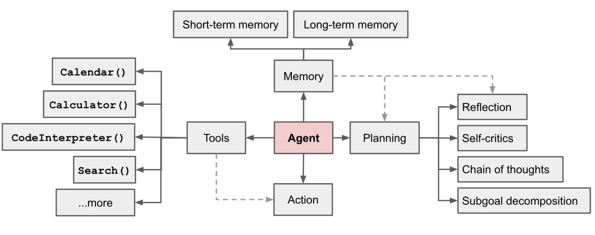

# 学习 Browser Use 的任务规划

昨天我们学习了 Browser Use 的核心特性和基础用法，通过一个简单的示例带大家体验了 Browser Use 解决问题的大致流程，今天我们继续学习 Browser Use 相关的知识。

Browser Use 本质上是一个智能体，Lilian Weng 在 [LLM Powered Autonomous Agents](https://lilianweng.github.io/posts/2023-06-23-agent/) 这篇博客中总结到，智能体至少要包含三个核心组件：**规划（Planning）**、**记忆（Memory）** 和 **工具使用（Tool use）**：



其中，规划和记忆好比人的大脑，规划是对问题进行分析思考，记忆可以储存历史知识，工具使用好比人的五官和手脚，可以感知世界，与外部源（例如知识库或环境）进行交互，以获取额外信息，并执行动作。

Browser Use 通过大模型来实现任务规划，根据网页操作的结果决定下一步该做什么；使用内置的消息管理器和 Mem0 来存储操作历史，方便后续步骤回溯所需的关键信息；Browser Use 的工具就是浏览器，它可以对浏览器进行各种操作，如浏览、滚动、输入、点击、等等，除此之外，Browser Use 也支持用户自定义其他的工具。

今天，我们就来看看 Browser Use 是如何实现任务规划的。

## **思考-行动-观察** 循环

智能体的核心是 **思考-行动-观察** 循环，这三个组件在一个持续的循环中协同工作，从而实现智能体的自主性、交互性和决策能力。这个循环如下图所示：


我们看 Browser Use 代码，同样使用了这样的逻辑：

```python
@time_execution_async('--run (agent)')
async def run(
  self, max_steps: int = 100
) -> AgentHistoryList:
  """Execute the task with maximum number of steps"""

  for step in range(max_steps):

    step_info = AgentStepInfo(step_number=step, max_steps=max_steps)
    await self.step(step_info)

    if self.state.history.is_done():
      break
  else:
    agent_run_error = 'Failed to complete task in maximum steps'
    logger.info(f'❌ {agent_run_error}')

  return self.state.history
```

上面是 `agent.run()` 方法的实现，这个方法看上去很复杂，但是把日志、跟踪、异常处理等细节代码去掉，剩下的骨架就是这样一个 `for` 循环。在这个循环中，Browser Use 不断的调用 `step()` 方法，直到 `is_done()` 任务完成为止。很明显，这是 [ReAct](https://arxiv.org/abs/2210.03629) 的思路，为了防止陷入死循环，Browser Use 通过 `max_steps` 控制最大循环次数，默认是 100 次。

循环中不断调用的 `step()` 方法实现如下：

```python
@time_execution_async('--step (agent)')
async def step(self, step_info: AgentStepInfo | None = None) -> None:
  """Execute one step of the task"""

  input_messages = self._message_manager.get_messages()
  model_output = await self.get_next_action(input_messages)

  self.state.n_steps += 1

  result: list[ActionResult] = await self.multi_act(model_output.action)

  if len(result) > 0 and result[-1].is_done:
    logger.info(f'📄 Result: {result[-1].extracted_content}')

  self.state.last_result = result
```

这里我同样将一些细节代码去掉了，只保留核心骨架。可以看到 Browser Use 首先通过 `_message_manager` 组装消息，然后调用 `get_next_action()` 获取下一步的动作，接着调用 `multi_act()` 执行动作，也就是操作浏览器或调用其他工具，这里暂时跳过，后面学习 “工具使用” 时再来看它。

## 规划下一步动作

从上面的代码中我们了解到，`get_next_action()` 方法用于获取下一步的动作，很显然，这一步就是调用大模型，也是 Browser Use 任务规划的核心，代码如下：

```python
@time_execution_async('--get_next_action (agent)')
async def get_next_action(self, input_messages: list[BaseMessage]) -> AgentOutput:
  """Get next action from LLM based on current state"""

  input_messages = self._convert_input_messages(input_messages)
    
  output = self.llm.invoke(input_messages)

  parsed_json = extract_json_from_model_output(output.content)
  parsed = self.AgentOutput(**parsed_json)
  
  return parsed
```

这块的原始代码也比较多，这里省略了。Browser Use 的处理非常精细，对不同的 LLM 采用不同的调用方式，返回的结果也有不同的解析方式，常用的方式有下面这些：

```python
ToolCallingMethod = Literal['function_calling', 'json_mode', 'raw', 'auto', 'tools']
```

可以看两张图感受下，下面这张图是调用大模型部分：


如果是 `raw` 调用方式，则通过 LangChain 的 `llm.invoke()` 方法直接调用大模型；如果是其他调用方式，则通过 **结构化输出（Structured outputs）** 的方式来调用，首先通过 `llm.with_structured_output()` 指定模型输出结构得到 `structured_llm`，实际上就是在入参里加上 `function_calling` 或 `tools` 参数，然后再通过 `structured_llm.ainvoke()` 调用大模型。参考下面的 LangChain 文档学习结构化输出的具体用法：

* https://python.langchain.com/docs/concepts/structured_outputs/

下面这张图是解析模型结果部分：


如果结构化输出正常直接返回解析后的结果，否则先尝试解析 `tool_calls` 参数，最后再尝试直接 JSON 解析。

无论是用哪种调用方式，最终都需要将其解析成固定的 `AgentOutput` 格式，得到下一步要执行的动作，便于后续的 `multi_act()` 方法执行。

## 规划提示词

在 `step()` 方法中我们看到，Browser Use 通过 `MessageManager` 来组装大模型的提示词，关于消息管理器的内容，我们放到后面的 “记忆管理” 再深入学习，今天只关注从消息管理器得到的提示词是什么样的。

消息管理器组装的消息包括：*系统提示词（System Prompt）*，*用户消息（HumanMessage）*、*助手消息（AIMessage）* 和 *工具消息（ToolMessage）* 等。如果将他们平铺开来，大概的布局如下所示：

```
<系统提示词>

<用户追加提示词>

Your ultimate task is: <这里是任务目标>

[Your task history memory starts here]
这里是每一步产生的历史记忆
[Task history memory ends]

[Current state starts here]
<这里是浏览器的当前状态，包括当前网页地址，标签页，页面内容等>

Current step: 9/100
Current date and time: 2025-06-04 06:36
```

其中系统提示词和任务目标是固定的，而历史记忆和当前状态每一步会动态更新，历史记忆是持久的，会不断追加，当前状态是临时的，会随着浏览器的变化而变化。

Browser Use 默认的系统提示词位于 `browser_use/agent/system_prompt.md` 文件中，翻译成中文如下：

```
我是一个专为自动化浏览器任务而设计的AI代理。我的目标是按照规则完成最终任务。

# 输入格式

任务
之前的步骤
当前URL
打开的标签页
交互元素
[索引]<类型>文本</类型>

- 索引：用于交互的数字标识符
- 类型：HTML元素类型（按钮、输入框等）
- 文本：元素描述
  示例：
  [33]<div>用户表单</div>
  \t*[35]*<button aria-label='提交表单'>提交</button>

- 只有在[]中带有数字索引的元素才可交互
- （堆叠的）缩进（用\t表示）很重要，意味着该元素是上方元素（索引较低）的（html）子元素
- 带有\*的元素是在上一步之后添加的新元素（如果url没有改变）

# 响应规则

1. 响应格式：您必须始终使用此确切格式的有效JSON进行响应：
   {"current_state": {"evaluation_previous_goal": "Success|Failed|Unknown - 分析当前元素和图像，检查之前的目标/操作是否按任务意图成功完成。提及是否发生了意外情况。简要说明原因",
   "memory": "已完成工作的描述和需要记住的内容。要非常具体。在这里始终计算您做了某事的次数和剩余次数。例如：已分析0个网站，共10个。继续执行abc和xyz",
   "next_goal": "下次立即行动需要完成的任务"},
   "action":[{"一个动作名称": {// 动作特定参数}}, // ... 序列中的更多动作]}

2. 动作：您可以在列表中指定多个动作以按顺序执行。但每个项目始终只指定一个动作名称。每个序列最多使用{max_actions}个动作。
常见动作序列：

- 表单填充：[{"input_text": {"index": 1, "text": "用户名"}}, {"input_text": {"index": 2, "text": "密码"}}, {"click_element": {"index": 3}}]
- 导航和提取：[{"go_to_url": {"url": "https://example.com"}}, {"extract_content": {"goal": "提取姓名"}}]
- 动作按给定顺序执行
- 如果动作后页面发生变化，序列会被中断，您将获得新状态
- 只提供动作序列直到会显著改变页面状态的动作
- 尽量高效，例如一次性填写表单，或在页面无变化时链接动作
- 只有在有意义时才使用多个动作

3. 元素交互：

- 只使用交互元素的索引

4. 导航和错误处理：

- 如果不存在合适的元素，使用其他功能完成任务
- 如果卡住了，尝试替代方法 - 如返回上一页、新搜索、新标签页等
- 通过接受或关闭来处理弹窗/cookies
- 使用滚动来寻找您要找的元素
- 如果您想研究某些内容，打开新标签页而不是使用当前标签页
- 如果出现验证码，尝试解决 - 否则尝试不同方法
- 如果页面未完全加载，使用等待动作

5. 任务完成：

- 一旦最终任务完成，立即使用done动作作为最后动作
- 除非达到max_steps的最后一步，否则不要在完成用户要求的所有内容之前使用"done"
- 如果达到最后一步，即使任务未完全完成也要使用done动作。提供到目前为止收集的所有信息。如果最终任务完全完成，将success设为true。如果用户要求的内容未全部完成，将done中的success设为false！
- 如果您需要重复执行某事，例如任务说"每个"、"对于所有"或"x次"，在"memory"中始终计算您执行的次数和剩余次数。不要停止，直到按任务要求完成。只有在最后一步后才调用done。
- 不要臆造动作
- 确保在done文本参数中包含为最终任务发现的所有内容。不要只说您完成了，而要包含任务要求的信息。

6. 视觉上下文：

- 当提供图像时，使用它来理解页面布局
- 右上角带有标签的边界框对应元素索引

7. 表单填充：

- 如果您填写输入字段且动作序列被中断，通常是因为某些内容发生了变化，例如字段下方出现了建议。

8. 长任务：

- 在memory中跟踪状态和子结果。
- 您将获得浓缩先前任务历史的程序性记忆摘要（每N步）。使用这些摘要来维护关于已完成动作、当前进度和下一步的上下文。摘要按时间顺序出现，包含关于导航历史、发现、遇到的错误和当前状态的关键信息。参考这些摘要以避免重复动作并确保朝着任务目标持续进展。

9. 提取：

- 如果您的任务是查找信息 - 在特定页面上调用extract_content来获取和存储信息。
  您的响应必须始终是指定格式的JSON。
```

下面是用户消息的一个示例：

```
 HumanMessage --- 这里是用户消息，描述任务目标
Your ultimate task is: """Compare the price of gpt-4.1-mini and DeepSeek-V3""". 
If you achieved your ultimate task, stop everything and use the done action in the next step to complete the task. 
If not, continue as usual.

 ToolMessage 
Browser started

[Your task history memory starts here] --- 这里是每一步的历史记录

 HumanMessage 
Action result: 🔗  Navigated to https://www.google.com

 HumanMessage 
Action result: ⌨️  Input gpt-4.1-mini price into index 4

 HumanMessage 
[Task history memory ends]

[Current state starts here] --- 这里是当前状态，主要对当前浏览器的内容进行描述
The following is one-time information - if you need to remember it write it to memory:
Current url: https://www.google.com/search?q=gpt-4.1-mini+price
Available tabs:
[
    TabInfo(page_id=0, url='https://www.google.com/search?q=gpt-4.1-mini+price', title='gpt-4.1-mini price - Google 搜索', parent_page_id=None), 
    TabInfo(page_id=1, url='https://www.google.com/search?q=deepseek-v3+price', title='deepseek-v3 price - Google 搜索', parent_page_id=None)
]
Interactive elements from top layer of the current page inside the viewport:
[Start of page]
[0]<a title='Google 首页' />
[1]<textarea value='gpt-4.1-mini price' aria-label='搜索' placeholder='' aria-expanded='false' name='q' role='combobox'>gpt-4.1-mini price />
[2]<div  />
  [3]<div aria-label='清除' role='button' />
[4]<div aria-label='按图搜索' role='button' />
[5]<button aria-label='搜索' type='submit' />

... 1217 pixels below - scroll or extract content to see more ...
Current step: 9/100
Current date and time: 2025-06-04 06:36
```

调用大模型后，得到下一步要执行的动作 `AgentOutput`，它大概长这个样子：

```json
{
    "current_state": {
        "evaluation_previous_goal": "we did ok, team",
        "memory": "filled in xyz into page, still need to do xyz...",
        "next_goal": "click on the link at index 127, then open that new tab"
    },
    "action": [
        { "click_element_by_index": { "index": 127 } },
        { "switch_to_tab": { "page_id": 3 } }
    ]
}
```

如果对这个中间过程感兴趣，可以在初始化 `Agent` 时加一个 `save_conversation_path` 参数：

```
agent = Agent(
    task="Compare the price of gpt-4.1-mini and DeepSeek-V3",
    llm=llm,
    save_conversation_path="logs/conversation"
)
```

运行结束后会在 `logs/conversation` 目录下生成每一步使用的 Prompt 以及对应的模型输出结果，方便调试和研究。

## 小结

今天我们学习了 Browser Use 的任务规划，从智能体的 **思考-行动-观察** 循环入手，对 Browser Use 的代码进行了简单剖析，主要关注的是规划相关的代码和提示词部分，对于记忆管理和工具使用部分，我们明天继续学习。
