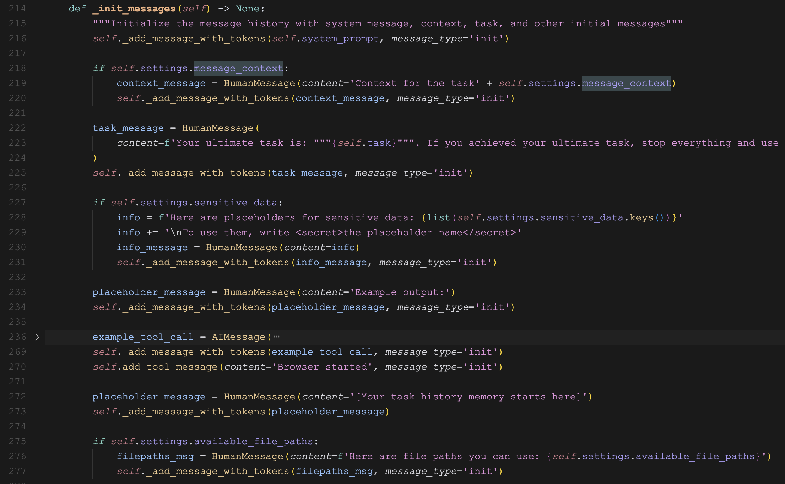
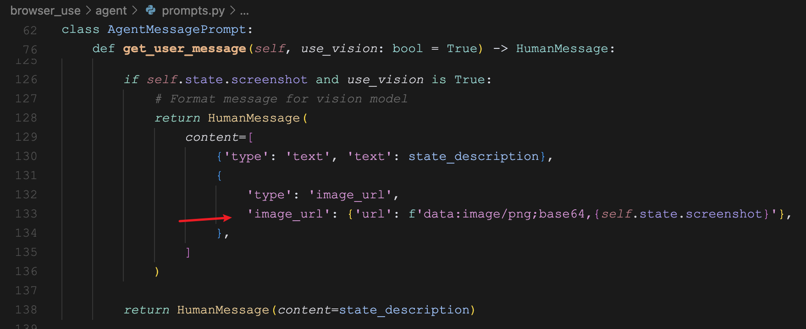
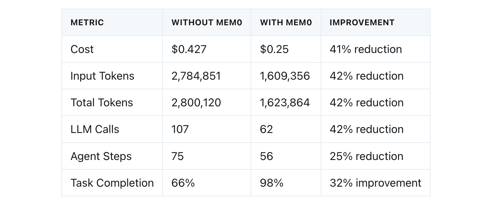
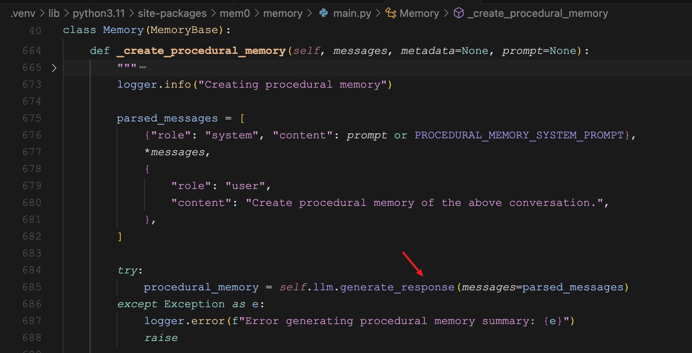

# 学习 Browser Use 的记忆管理

昨天我们学习了 Browser Use 的任务规划，对相关的代码和提示词进行了简单的剖析，正如前面所提到的，**智能体 = 规划（Planning） + 记忆（Memory） + 工具使用（Tool use）**，所以按顺序，我们今天继续来看下 Browser Use 是如何管理记忆的。

## 消息管理器

回顾下 Browser Use 智能体循环中的 `step()` 方法，我们通过 `_message_manager` 的 `get_messages()` 方法来组装大模型的输入：

```python
@time_execution_async('--step (agent)')
async def step(self, step_info: AgentStepInfo | None = None) -> None:
  """Execute one step of the task"""

  input_messages = self._message_manager.get_messages()
  model_output = await self.get_next_action(input_messages)

  self.state.n_steps += 1

  result: list[ActionResult] = await self.multi_act(model_output.action)

  if len(result) > 0 and result[-1].is_done:
    logger.info(f'📄 Result: {result[-1].extracted_content}')

  self.state.last_result = result
```

`_message_manager` 被称为 **消息管理器**，其实也就是记忆管理器，里面存储了系统提示词、用户任务、运行过程中产生的历史消息，以及当前浏览器状态等等一系列的内容。Browser Use 就是通过它来存储和操作记忆的，是 Browser Use 记忆系统的核心。

那么这些内容是如何添加到记忆中的呢？我们可以在 `Agent` 的 `__init__` 方法中找到消息管理器的初始化代码：

```python
# Initialize message manager with state
# Initial system prompt with all actions - will be updated during each step
self._message_manager = MessageManager(
  task=task,
  system_message=SystemPrompt(
    action_description=self.unfiltered_actions,
    max_actions_per_step=self.settings.max_actions_per_step,
    override_system_message=override_system_message,
    extend_system_message=extend_system_message,
  ).get_system_message(),
  settings=MessageManagerSettings(
    max_input_tokens=self.settings.max_input_tokens,
    include_attributes=self.settings.include_attributes,
    message_context=self.settings.message_context,
    sensitive_data=sensitive_data,
    available_file_paths=self.settings.available_file_paths,
  ),
  state=self.state.message_manager_state,
)
```

这里是消息管理器的四个参数：

* `task` - 用户的任务；
* `system_message` - 系统提示词，用户可以通过 `override_system_message` 参数重写，或者通过 `extend_system_message` 往默认的提示词后面追加内容；默认的提示词中有一个参数 `{max_actions}` 用于控制大模型一次最多生成多少动作，可以通过 `max_actions_per_step` 参数配置；
* `settings` - 一些额外的配置参数，比如大模型的最大输入 token 数，消息上下文，敏感数据等；
* `state` - 主要用于存储和操作运行过程中产生的历史记录，维护当前的 token 数等；

Browser Use 根据这四个参数构造初始记忆。看下 `MessageManager` 的 `_init_messages()` 方法：



这个方法展示了初始记忆是如何构造的，可以看到初始记忆包括：

* 系统提示词
* 任务的上下文信息，用户通过 `message_context` 参数传入，对任务加一些额外说明，帮助大模型更好的理解任务
* 任务目标
* 敏感数据说明，用户如果不希望将敏感信息暴露给大模型，可以使用 `sensitive_data` 字典，然后通过占位符来替代
* 一条 AI 消息，包含一个简单的输出示例，也就是 `AgentOutput`
* 一条工具消息 `Browser started`
* 一条用户消息 `[Your task history memory starts here]`
* 文件路径说明，用户可以通过 `available_file_paths` 参数告诉大模型可以访问哪些文件

## 记忆更新

初始记忆基本上是固定不变的，而运行日志和浏览器状态是动态的，在循环过程中，消息管理器会对记忆不断更新。我们把 `step()` 方法稍微充实下，加上 `_message_manager` 更新消息的逻辑，主要是加注释的三个地方：

```python
@time_execution_async('--step (agent)')
async def step(self, step_info: AgentStepInfo | None = None) -> None:
  """Execute one step of the task"""
  
  ## 添加状态消息
  self._message_manager.add_state_message(...)

  input_messages = self._message_manager.get_messages()
  model_output = await self.get_next_action(input_messages)

  ## 添加模型输出消息
  self._message_manager.add_model_output(model_output)

  self.state.n_steps += 1

  ## 移除状态消息
  self._message_manager._remove_last_state_message()

  result: list[ActionResult] = await self.multi_act(model_output.action)

  if len(result) > 0 and result[-1].is_done:
    logger.info(f'📄 Result: {result[-1].extracted_content}')

  self.state.last_result = result
```

其实记忆更新的地方有很多，但是主流程里主要是这三个地方。首先是每一步的开头，通过 `add_state_message()` 将当前浏览器的状态和上一步工具调用的结果加到消息里：

```python
browser_state_summary = await self.browser_session.get_state_summary(
  cache_clickable_elements_hashes=True
)
self._message_manager.add_state_message(
  browser_state_summary=browser_state_summary,
  result=self.state.last_result,
  step_info=step_info,
  use_vision=self.settings.use_vision,
)
```

浏览器的状态信息包括：当前网页地址、标题、标签页、页面内容等。如果开启视觉模型，还会将网页截图一起加到消息中：



根据这些信息调用大模型之后，得到 `AgentOutput` 结果，接着再通过 `add_model_output()` 将大模型输出添加到消息里：

```python
model_output = await self.get_next_action(input_messages)
self._message_manager.add_model_output(model_output)
```

另外要注意的是，浏览器状态和工具调用结果大概率只针对当前循环是有用的，所以最后，通过 `_remove_last_state_message()` 将开头添加的状态信息移除：

```python
self._message_manager._remove_last_state_message()
```

这样做的好处是聚焦每一步，防止上下文过多导致超出 token 限制或性能问题。

## 规划记忆

Browser Use 支持配置单独的 **规划模型（Planner model）** 对任务进行高层规划，如下：

```python
agent = Agent(
  task="your task",
  llm=llm,

  # 规划模型，可以是一个比主模型更小或更便宜的模型
  planner_llm=planner_llm,
  # 规划时禁用视觉，默认是开启的
  use_vision_for_planner=False,
  # 每 4 步规划一次，默认是每步都规划
  planner_interval=4
)
```

使用规划模型可以改善任务分解和思考策略，从而更好地处理复杂的多步骤任务。当使用规划模型时，Browser Use 在调用大模型之前，首先会通过 `_run_planner()` 对任务进行规划，然后通过 `add_plan()` 将规划结果添加到记忆中：

```python
# Run planner at specified intervals if planner is configured
if self.settings.planner_llm and self.state.n_steps % self.settings.planner_interval == 0:
  plan = await self._run_planner()
  self._message_manager.add_plan(plan, position=-1)
```

其中 `_run_planner()` 和 `get_next_action()` 都是调用大模型，本质上都是基于当前状态评估下一步动作，他们两的逻辑很相似，只是系统提示词不一样，任务规划使用的提示词如下：

```
您是一个规划智能体，帮助将任务分解为更小的步骤并基于当前状态进行推理。
您的角色是：
1. 分析当前状态和历史
2. 评估朝着最终目标的进展
3. 识别潜在的挑战或障碍
4. 建议下一步的高层步骤

在您的消息中，将会有来自不同智能体的 AI 消息，格式各异。

您的输出格式应始终是一个 JSON 对象，包含以下字段：
{
  "state_analysis": "对当前状态和迄今为止所做工作的简要分析",
  "progress_evaluation": "对朝着最终目标的进展评估（以百分比和描述）",
  "challenges": "列出任何潜在的挑战或障碍",
  "next_steps": "列出2-3个具体的下一步",
  "reasoning": "解释您建议的下一步的理由"
}

忽略其他 AI 消息的输出结构。

保持您的回应简洁，专注于可操作的见解。
```

得到规划结果后，调用 `add_plan()` 将规划结果添加到记忆中，注意这里的 `position=-1` 参数，表示将其插入到上一步状态消息的前面，保证状态消息是最后一条，方便之后移除。

## 程序性记忆

在心理学领域，记忆被分为 **外显记忆（explicit memory）** 和 **内隐记忆（implicit memory）**。外显记忆又被称为 **陈述性记忆（declarative memory）**，是指关于事实或事件的记忆，可以被明确地表述出来；内隐记忆又被称为 **程序性记忆（procedural memory）**，是指关于技能、过程或 “如何做” 的记忆，这种记忆不需要意识或有意回忆，而是自动地、无意识地参与行为，例如骑自行车、打字等。

Browser Use 内置了一个基于 [Mem0](https://mem0.ai/) 的程序性记忆系统，该系统会定期自动总结 Agent 的消息历史，对于较长的任务，随着消息历史的增长，可能导致上下文窗口溢出，开启程序性记忆可以显著改善长任务的性能。

Mem0 在其 [官方博客](https://mem0.ai/blog/how-browseruse-achieved-98-task-completion-and-41-cost-reduction-with-mem0/) 上宣称 Browser Use 集成 Mem0 之后，克服了内存和上下文的核心限制，实现了 98% 的任务完成率和 41% 的成本降低：



可以通过 `enable_memory` 参数开启该功能：

```python
agent = Agent(
  task="your task",
  llm=llm,

  # 开启程序性记忆
  enable_memory=True,
  # 记忆相关配置
  memory_config=MemoryConfig(
    llm_instance=llm,
    agent_id="my_custom_agent",
    memory_interval=15
  )
)
```

当开启程序性记忆后，循环的时候，每隔 `memory_interval` 步，调用一次 `create_procedural_memory()` 方法：

```python
# generate procedural memory if needed
if self.enable_memory and self.memory and self.state.n_steps % self.memory.config.memory_interval == 0:
  self.memory.create_procedural_memory(self.state.n_steps)
```

该方法会回顾 Browser Use 最近的所有活动，然后使用 Mem0 创建一个程序性记忆摘要，最后用这个摘要替换掉原始消息，从而减少了令牌使用。这个过程有助于保持重要的上下文，同时为新信息释放上下文窗口。

深入源码的话，可以发现，程序性记忆摘要是调用 Mem0 的 `add()` 方法得到的：

```python
results = self.mem0.add(
  messages=parsed_messages,
  agent_id=self.config.agent_id,
  memory_type='procedural_memory',
  metadata={'step': current_step},
)
return results.get('results', [])[0].get('memory')
```

注意将 `memory_type` 参数为 `procedural_memory`，这是 Mem0 的一种新的记忆类型，之前在学习 Mem0 的时候并没有特别关注它。其实它的实现也很简单，还是调用大模型，这里可以看看 Mem0 的源码：



不过这里有一点疑惑，Mem0 在生成程序性记忆时，还会将记忆保存到向量数据库中，但是 Browser Use 是直接取 `add()` 方法返回的结果，并没有去查询记忆，这个保存到数据库里的长期记忆形同虚设，Browser Use 直接一个提示词就解决了，为啥还要绕道 Mem0 来实现，搞一堆嵌入模型和向量数据库相关的配置呢？

考虑到 Browser Use 项目目前非常活跃，更新比较频繁，估计后面会对记忆这块做一些优化和改造，后面我会持续关注这个项目。

## 小结

今天我们深入学习了 Browser Use 的记忆管理，通过剖析消息管理器相关的源码，我们了解了记忆是如何初始化、如何更新、以及如何获取的。另外，还学习了规划记忆和程序性记忆相关的知识，规划记忆通过任务分解和策略优化，更好地处理复杂的多步骤任务，程序性记忆通过不断总结和压缩历史消息，显著改善长任务的性能。

智能体的三大核心组件我们已经啃掉了两个，明天继续学习 Browser Use 是如何使用工具的。
