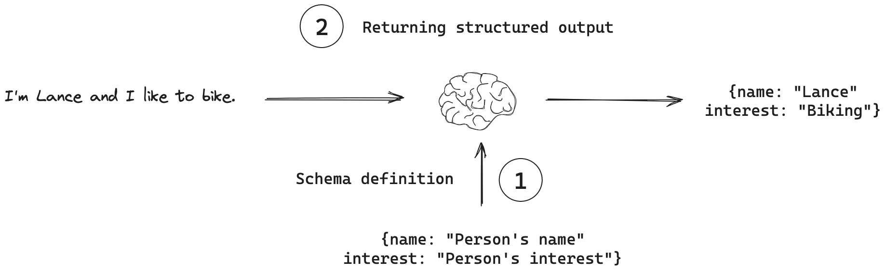

# 学习 Browser Use 的工具使用

我们已经学习了 Browser Use 的 “任务规划” 和 “记忆管理”，通过剖析相关代码，相信大家对 Browser Use 的实现原理已经有了基本认识。今天我们将关注智能体三大核心组件中的 “工具使用”，学习 Browser Use 是如何使用工具的。

正如 Browser Use 的名字所示，它最重要的工具就是浏览器，通过各种浏览器操作，例如导航、滚动、点击、输入文本等，实现网页任务自动化和智能化；除此之外，Browser Use 也支持用户自定义工具，例如保存文件、访问数据库、发送通知、接收人类输入等，实现更丰富的智能体功能。

## `AgentOutput` 模式

通过前面的学习，我们知道 Browser Use 通过 **消息管理器** 将系统提示词、用户任务、历史操作记录、当前浏览器状态以及上一步动作的执行结果等信息，组装成大模型的输入参数。调用大模型后，得到结构化的结果，类似于下面这个样子：

```json
{
  "current_state": {
    "evaluation_previous_goal": "we did ok, team",
    "memory": "filled in xyz into page, still need to do xyz...",
    "next_goal": "click on the link at index 127, then open that new tab"
  },
  "action": [
    { "click_element_by_index": { "index": 127 } },
    { "switch_to_tab": { "page_id": 3 } }
  ]
}
```

这个结构化的结果就是 `AgentOutput` 模式，定义如下：

```python
class AgentOutput(BaseModel):

  model_config = ConfigDict(arbitrary_types_allowed=True)

  current_state: AgentBrain
  action: list[ActionModel] = Field(
    ...,
    description='List of actions to execute',
    json_schema_extra={'min_items': 1},  # Ensure at least one action is provided
  )
```

很明显，这是一个 Pydantic 模式。

> 很多地方把 Pydantic 的 Model 翻译成 “模型”，但是为避免和大模型混淆，我统一翻译成 “模式”。

其中第一行的 `model_config` 是模式配置，`arbitrary_types_allowed=True` 表示模式中可以包含任意类型的字段，比如自定义类、第三方库的对象等。如果不设置为 True，Pydantic 默认只允许标准类型和已注册的类型。

下面的 `current_state` 和 `action` 是 `AgentOutput` 模式的两个字段，`current_state` 对应 `AgentBrain` 模式：

```python
class AgentBrain(BaseModel):

  evaluation_previous_goal: str
  memory: str
  next_goal: str
```

表示当前的状态信息，以及前一个目标的回顾和下一个目标的展望。`action` 对应 `ActionModel` 模式：

```python
class ActionModel(BaseModel):

  model_config = ConfigDict(arbitrary_types_allowed=True)
```

表示下一步要执行的动作，这是一个动态模式，因为每个动作的名称和参数都是不一样的。

值得一提的是，参数 `action` 后面的 `Field(...)` 是 [Pydantic 的特殊语法](https://docs.pydantic.dev/latest/concepts/fields/)，这个不是省略的意思，而是表示该参数是必填的。不仅必填，后面的 `{'min_items': 1}` 还规定该列表至少包含一项。

## Pydantic 模式和结构化输出

在大多数场景下，大模型都是直接用自然语言回应用户的，但是有一些特殊场景，我们需要模型以结构化格式输出，比如我们希望将模型输出存储在数据库中，并确保输出符合数据库模式。这就是 **结构化输出（Structured outputs）** 功能：



结构化输出有两个要点：

1. 模式定义：指示模型输出格式
2. 结构化输出：模型返回符合该模式的输出

关于第一点，我们可以直接以 JSON 方式定义，或者使用 [JSON Schema](https://json-schema.org/) 方式定义，但是更常见的做法是使用 [Pydantic](https://github.com/pydantic/pydantic) 库，Pydantic 是一个现代的 Python 数据验证库，使用 Python 类型提示来定义数据模式并自动进行数据验证、序列化和文档生成。

Pydantic 特别适合定义结构化输出模式，下面是一个示例，通过继承 `BaseModel` 类定义了两个数据模式：

```python
from pydantic import BaseModel, Field

class Student(BaseModel):
  name: str = Field(description="学生姓名")
  age: int = Field(description="学生年龄")
  gender: str = Field(description="学生性别")
  grade: int = Field(description="学生年级")
  school: str = Field(description="学生学校")

class StudentList(BaseModel):
  students: list[Student] = Field(description="学生列表")
```

关于第二点，目前有很多大模型都支持结构化输出的功能，不同的模型实现方式可能也不同，比如 Function calling、Tool calling、JSON 模式 等等。LangChain 提供了一个 `with_structured_output()` 方法，可以自动将模式绑定到模型并解析输出，用来起非常方便：

```python
from langchain_openai import ChatOpenAI

llm = ChatOpenAI(model="gpt-4o-mini", temperature=0)
llm_with_structure = llm.with_structured_output(StudentList)
structured_output = llm_with_structure.invoke("随机生成5条学生信息")

print(structured_output)
```

输出结果如下：

```python
students=[
  Student(name='张伟', age=15, gender='男', grade=10, school='北京中学'), 
  Student(name='李娜', age=14, gender='女', grade=9, school='上海外国语学校'), 
  Student(name='王磊', age=16, gender='男', grade=11, school='广州实验中学'), 
  Student(name='刘婷', age=13, gender='女', grade=8, school='深圳科技中学'), 
  Student(name='陈强', age=17, gender='男', grade=12, school='杭州高级中学')
]
```

## 浏览器动作

通过上面的学习，我们明白了 Browser Use 是通过结合 `AgentOutput` 模式定义和大模型的结构化输出功能，从而得到下一步的动作。

但是，仔细想想就会发现一个问题，这里我们在调用大模型的时候，工具列表中始终只有一个 `AgentOutput` 工具，这和传统的工具调用很不一样，之前的做法是将所有的工具列出来，让大模型来判断下一步应该使用哪个。感兴趣的朋友可以将调用大模型的入参打印出来确认一下：

```json
[
  {
    "type": "function",
    "function": {
      "name": "AgentOutput",
      "description": "AgentOutput model with custom actions",
      "parameters": {
        "properties": {
          "current_state": {
            "description": "Current internal working memory of the agent, we ask the LLM to decide new values for these on each output",
            "properties": {
              "evaluation_previous_goal": {
                "type": "string"
              },
              "memory": {
                "type": "string"
              },
              "next_goal": {
                "type": "string"
              }
            },
            "required": [
              "evaluation_previous_goal",
              "memory",
              "next_goal"
            ],
            "type": "object"
          },
          "action": {
            "description": "List of actions to execute",
            "items": {},
            "min_items": 1,
            "type": "array"
          }
        },
        "required": [
          "current_state",
          "action"
        ],
        "type": "object"
      }
    }
  }
]
```

可以看到，这里就一个 function。那么，大模型是如何选择下一步动作的呢？其实，这里的关键就在于前面 Browser Use 定义的 `ActionModel` 这个模式，这是一个动态模式，在 `Agent` 初始函数中有一个 `_setup_action_models()` 方法，它的作用是将所有可用的工具注入到这个模式中：

```python
def _setup_action_models(self) -> None:
  """Setup dynamic action models from controller's registry"""
  
  # Initially only include actions with no filters
  self.ActionModel = self.controller.registry.create_action_model()
  # Create output model with the dynamic actions
  self.AgentOutput = AgentOutput.type_with_custom_actions(self.ActionModel)
```

这里的 `controller.registry` 是 Browser Use 工具调用的核心，所有内置的浏览器工具都注册在它的 `registry.actions` 数组里。这里通过它的 `create_action_model()` 方法动态地创建一个 `ActionModel` 模式，将所有可用的工具绑定到 `ActionModel` 模式中：

```python
def create_action_model(self) -> type[ActionModel]:

  available_actions = {}
  for name, action in self.registry.actions.items():
    available_actions[name] = action

  fields = {
    name: (
      Optional[action.param_model],
      Field(default=None, description=action.description),
    )
    for name, action in available_actions.items()
  }

  return create_model('ActionModel', __base__=ActionModel, **fields)
```

这里我省略了一些代码：

* 域名过滤：通过 `domains` 参数限定工具仅在某些域名下可用；
* 页面过滤：通过 `page_filter` 函数判断工具是否在当前页面可用；

注入所有工具后，调用大模型的入参类似于下面这样：

```json
[
  {
    "type": "function",
    "function": {
      "name": "AgentOutput",
      "description": "AgentOutput model with custom actions",
      "parameters": {
        "properties": {
          "current_state": {...},
          "action": {
            "description": "List of actions to execute",
            "items": {
              "properties": {
                "search_google": {
                  "anyOf": [
                    {
                      "properties": {
                        "query": {
                          "title": "Query",
                          "type": "string"
                        }
                      },
                      "required": [
                        "query"
                      ],
                      "title": "SearchGoogleAction",
                      "type": "object"
                    },
                    {
                      "type": "null"
                    }
                  ],
                  "default": null,
                  "description": "Search the query in Google, the query should be a search query like humans search in Google, concrete and not vague or super long."
                },
                "go_to_url": {
                  "anyOf": [
                    {
                      "properties": {
                        "url": {
                          "title": "Url",
                          "type": "string"
                        }
                      },
                      "required": [
                        "url"
                      ],
                      "title": "GoToUrlAction",
                      "type": "object"
                    },
                    {
                      "type": "null"
                    }
                  ],
                  "default": null,
                  "description": "Navigate to URL in the current tab"
                },
                ...
              },
              "type": "object"
            },
            "min_items": 1,
            "type": "array"
          }
        },
        "required": [
          "current_state",
          "action"
        ],
        "type": "object"
      }
    }
  }
]
```

这里的 `action` 参数的类型为 `array` 数组，数组中的每一项类型为 `object` 对象，对应不同的工具，每个工具的参数都是动态的。Browser Use 的工具调用虽然只有一个 `AgentOutput`，但是通过动态的 `ActionModel` 实现了不同工具的选择，让大模型输出下一步要执行的动作。

## 小结

今天我们探讨了 Browser Use 如何利用大模型的结构化输出能力简化了工具调用的过程，结合 `AgentOutput` 模式定义与动态的 `ActionModel`，实现智能体在执行网页任务时灵活选择和使用不同工具。

接下来的学习中，我们将深入探讨浏览器操作的具体实现以及如何自定义工具，以扩展 Browser Use 的功能。敬请期待下一篇的内容！